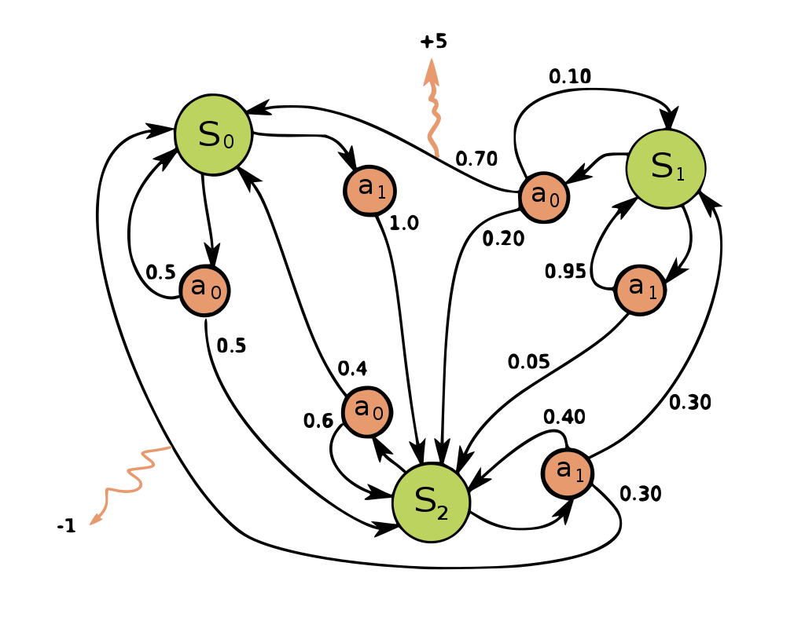

# Informatik
Angelegt Freitag 09 September 2022

# Backpropagation
Angelegt Freitag 09 September 2022

Allgemeines zu Ableitungen
--------------------------
@ableitung @differenzieren @ableiten @differenzierbar

* f: R^n^ → R^m^, x → f(x)
* Df: R^n^ → R^m×n^, x → Df|~x~ = Df(x)
	* In Df stehen die jeweiligen partiellen Ableitungen (mit Variablen)
	* In Df(x) stehen die jeweiligen partiellen Ableitungen **ausgewertet am Punkt x**, dh. Df(x) ist eine „normale Matrix“
	* Df(x) ist die **Linearisierung** von f an der Stelle x, dh. die lineare Abbildung, die f am Punkt x bestmöglich beschreibt
* Df(x) = Df|~x~: R^n^ → R^m^, x' → Df(x) * x'
	* Df(x) * x' ist ein **Matrix-Vektor-Produkt**, da in Df(x) „ganz normal“ Zahlen stehen
* ∇f(x): R^n^ → R, x' → ∇f(x) * x' = <∇f(x), x'> für m = 1
	* ∇f(x) ist (je nach Definition und Anwendung) ein Spalten- oder Zeilenvektor

Definitionen
------------

* [Backpropagation – Wikipedia](https://en.wikipedia.org/wiki/Backpropagation)
	* Evtl. sind die weiterführenden Links auch interessant
	* [Learning_and_Neural_Networks – Wikiversity](https://en.wikiversity.org/wiki/Learning_and_Neural_Networks)

j := Schicht j
a^j^ := Aktivierungsfunktion
z^j^ := meist Wx + b
C, E := Kosten- oder Verlustfunktion

Letzte bzw. nur eine Schicht
----------------------------
Netzwerk: E( y, a¹( z¹(W¹, x) ) )

* ∂E/∂W¹ = ∂E/∂a¹ * ∂a¹/∂z¹ * ∂z¹/∂W¹
* Man wertet den Ausdruck an den ursprünglich für W¹ eingesetzt Gewichten W¹* aus:

∂E/∂W¹|~W¹*~
= ∂E/∂a¹|~W¹*~ * ∂a¹/∂z¹|~W¹*~ * ∂z¹/∂W¹|~W¹*~
= E'(a¹(W¹*)) * a¹'(z¹(W¹*)) * z¹'(W¹*)

Mehrere Schichten
-----------------

* Möchte man nach den Gewichten tieferer/innere Schichten ableiten, muss man bachten, dass sich eine Solche auf viele weitere Schichten auswirkt. Man kann also nicht einfach a¹ durch a^k^ ersetzten.
* Auch hier wertet man die jeweiligen Ableitungen mit den Gewichten aus, die zuvor eingesetzt wurden, dh. wenn nach W² differenziert wurde, setzt man W²* aus der Vorwärtspropagation ein.
* Netzwerk:
	1. E( y, a³( z³(W³, a²( z²(W², a¹( z¹(W¹, x) ) ) ) )
	2. E( y, [a^k^( z^k^(W^k^) )]~L~ )
		* Der Teil in eckigen Klammern wird de facto L-mal wiederholt und entspricht einer Schicht
* ad a.:
	* ∂E/∂W^3^ wie oben
	* ∂E/∂W¹ nun anders, da W¹ die nachfolgenden Schichten beeinflusst
	* ∂E/∂W¹ = ∂E/∂a¹ * ∂a¹/∂z¹ * ∂z¹/∂W¹
		* ∂a¹/∂z¹, ∂z¹/∂W¹ sind trivial/wie oben
		* ∂E/∂a**¹** =

∂E/∂a³ * ∂a³/∂z³ * ∂z³/∂a**¹** +
∂E/∂a² * ∂a²/∂z² * ∂z²/∂a**¹**

* So muss es sein, weil man nicht Schicht 1 nach seiner eigenen Ausgabe ableitet, das wäre "davor". Man möchte das Netzwerk einschließlich Verlustfunktion nach der Ausgabe von Schicht 1 ableiten und die beeinflusst die **nachfolgenden** Schichten aber nicht die eigene. (Ich hatte bis zu dieser Stelle Probleme mit den Indizes und welche Schichten nach a¹ differenziert werden, bspw. rechnete ich ∂E/∂a¹ mit der Kettenregel aus aber ich bin immer wieder auf Zirkelschlüsse gestoßen.) 

* ad b.:
	* ∂E/∂W^L ^ wie (ganz) oben ∂E/∂W¹
	* ∂E/∂W^k ^, da innere Schicht ähnlich zum obigen Beispiel
	* ∂E/∂W^k^ = ∂E/∂a^k^ * ∂a^k^/∂z^k^ * ∂z^k^/∂W^k^
		* ∂E/∂a^k^ = ∑~m = k+1, …, L~ ∂E/∂a^m^ * ∂a^m^/∂z^m^ * ∂z^m^/∂a^k^
		* **Es wird ab der folgenden Schicht aufsummiert.** Den Ausdruck ∂E/∂a^m^ kann man einfach per Kettenregel bestimmen (so wie man das bei einer Schicht gemacht hat, nämlich indem man einfach den Ausdruck „auseinanderzieht“)
* Der „Trick“ bei der Ableitung nach W^k^ ist allgemein: ∂E/∂W^k^ dahingehend auseinanderziehen, dass man
	* Ableitung bzgl Aktivierungsfunktion **von Schicht k**
	* Ableitung der Aktivierungsfunktion bzgl z^k^ **von Schicht k**
	* Ableitung von z^k^ bzgl W^k^ **von Schicht k**

⇒ ∂E/∂W^k^ = ∂E/∂a^k^ * ∂a^k^/∂z^k^ * ∂z^k^/∂W^k^
hat, egal, wie viele Schichten danach noch folgen.

### Dimension der Ableitung

* ∂E/∂W^k^: R^dim(W^k)^ → R^?^, Matrix mit partiellen Ableitungen
	* ∂E/∂W^k^ **ist kein Gradient sondern eine Matrix**, bzw. die beste Linearisierung von E in der Variablen W^k^ (nicht in einem Punkt, da in diesem Ausdruck noch Nichts eingesetzt wird)
* ∂E/∂W^k^|~W^{k*~}: R^?^ → R^dim(W^k)^, Matrix mit konkreten Werten
	* Dieser Ausdruck wird für **Gradientenabstieg** verwendet

# Deep Learning with Python
Angelegt Sonntag 27 Februar 2022
@python @keras @tensorflow @deeplearning

Teilweise Zusammenfassung des Buches
*Deep Learning with Python* (Second Edition)
von Francois Chollet, ISBN: 9781617296864.
Eine digitale Version findet sich in der Kali Linux-VM.

19. auch:
	* [Lexikon – MeinWiki](#Informatik:Lexikon)
	* [Keras – MeinWiki](#Python:Module:keras)

Das Ziel ist nicht ein Modell zu konzipieren, dass auf den  Trainingsdaten gut funktioniert – was relativ leicht ist, da man nur dem Gradienten folgen muss –, sondern auf den Testdaten/neuen Daten, die es noch gar nicht kennt.

Diverses
--------

* Strukturierte Daten: Gradient Boosted Trees
* visuelle Daten: Deep Learning
* für Gradient Boosted Trees & Deep Learning wichtigste Bibliotheken: Scikit-learn, XGBoost & Keras
* Man benötigt Aktivierungsfunktionen, da ein mehrschichtiges vollverbundenes Neuronales Netz ansonsten lediglich eine Verkettung von linearen Operationen, dh. Matrikmultiplikationen und damit nur eine Schicht hätte.
* Man kann sich ein Neuronales Netz so vorstellen, dass es eine hochdimensionale „gefaltete“ Mannigfaltig entfaltet (wie ein geknülltest Stück Papier entfaltet wird) und das durch die Schichten schrittweise, sodass am Ende die Klassen klar erkennbar sind.

Kapitel 1
---------

### 1.2 History of machine learning
Nicht alle Probleme lassen sich (gut) mit **Deep Learning** (Lernen mit vielen Schichten) lösen. Andere Ansätze/Algorithmen mögen besser passen.
Deswegen dient dieses Kapitel dazu die Entstehung und den Kontext verschiedener Möglichkeiten zu erörtern, um einen kleinen Überblick zu erhalten

#### 1.2.1 Probabilistic Modelling

* Anwendung statistischer Verfahren
* bekanntester Alg: **Naive Bayes algorithm**
* eng verwandt: **logreg** (logistic regression); ist ein Klassifikations- und **kein** Regressionsalg.

#### 1.2.3 Kernel methods

* bekanntester Alg: **Support Vector Machines **(SVM)
* Klassifikationsalg., der **decision boundaries**, findet, um (zwei) Klassen zu separieren
* gut für einfache Klassifizierung–schlecht für umfangreichere Daten
	* MNIST-Verarbeitung klappt nicht
* Benutzen eine Funktion (**Kernel**), um Distanzen zwischen Punkten abzubilden

#### 1.2.4 Decision Trees, Random Forests and Gradient Boosting Machines
**Decision Tree**

* Ist halt ein Entscheidungsbaum

**Random Forest**

* Kombination mehrere Entscheidungsbäume

**Gradient Boosting Machines**

* Gradient Boosting ist eine Technik, die mit Decision Trees kombiniert werden kann

# Lexikon
Angelegt Freitag 04 Februar 2022

@python @deeplearning @datascience @keras

Modell immer auf die Schwächen testen, um zu vermeiden, dass es ausschließlich triviale Lösungen findet (was „Schwäche“ und „trivial“ bedeutet, entscheidet der Kontext)

Literatur
---------

* G. Marcus. “Deep Learning: A Critical Appraisal”. In: (Jan. 2018).

19. auch
	* [Deep Learning with python – MeinWiki](#Informatik:Deep Learning with Python)
	* [Keras – MeinWiki](#Python:Module:keras)

* [Epoche – deepai.org](https://deepai.org/machine-learning-glossary-and-terms/epoch): Gibt an, wie oft über die gesamten Trainingsdaten iteriert werden soll; NIcht zu verwechseln mit **Iteration**
* Trainings- und Testgenauigkeit sind oft unterschiedlich. Ist Trainingsg. > Testg., dann liegt **Overfitting** vor.
* **Linearer Klassifizierer**/**Linear Classifier  **``prediction = W • input + b``, als Loss wird einfach der durchschnittliche quadratische Fehler verwendet.

Ein linearer Klassifizierer sucht im Prinzip nur die Parameter einer Gerade
y = -w~1~/w~2~ * x + (0.5 - b) / w~2~.

* **Hypothesis space**  Alle Möglichkeiten, die die Gewichte annehmen können. Hängt stark von der **Topologie** des Netzwerks ab. @topologie
* **Validation data  **Teilmenge der Trainingsdaten, um Loss sowie Metrics-Wert zu berechnen. Auf dieser Menge wird **nicht** trainiert, s. auch [Das Model – Python > Keras > Das Modell](#Python:Module:keras:Das Modell).
* **Batch**: Kleine Menge von Eingaben. Meist in Größe einer 2er-Potenz, um Speicher auf GPU bestmöglich auszunutzen.
* **Transfer Learning**: Ein bereits trainiertes Modell (teilweise) umtrainieren. Vor allem dann sinnvoll, wenn man nicht genug Daten für ein vollständiges Training hat (s. auch „Data Augmentation“). So kann man ein bereits trainiertes Modell verwenden und „umpolen“.
* **Data Augmentation**: Technik, um eine kleine Datenmenge aus sich selbst heraus zu erweitern, um eine Größere bzw. mehr Daten für ein besseres Training zu schaffen. Kann hilfreich sein, wenn man wenig Trainingsdaten vorhanden hat (s. auch „Transfer Learning“). Die Erweiterungsmethoden können wie folgt aussehen: drehen, skalieren (strecken, stauchen), spiegeln, Rauschen hinzufügen, ...

Kapitel 2 – The mathematical building blocks of neural networks
---------------------------------------------------------------

* **Class**/**Klasse**: Kategorie in die Daten eingeteilt werden können, bspw alle Ziffern von 0-9 oder Obstsorten
* **Sample**: Einzelner Datenpunkt/Vektor (bspw. ein Bild)
* **Label**: Zum Sample gehörender Datenpunkt
* **Layer**/**Schicht**: Eine Schicht kann man sich als Datenfilter vorstellen
* **Optimizer**: Art und Weise, wie sich das Netzwerk selbst aktualisiert, um Performance zu verbessern, Bsp: Gradientenabstieg (s. u.) (mit Momentum (s. u.)), RMSprop, ADAM, ... @optimizer
* **Loss function**: Art und Weise wie Modell sein Abschneiden misst, dh. den Abstand zwischen Vorhersage und wahrem Wert, und die korrekte Richtung zur Verbesserung einschlägt. Wahl ist sehr wichtig, da das Netzwerk „(konzeptuelle) Lücken“ findet, um Loss zu minimieren. Bei schlechter Wahl ist es schwierig nachzuvollziehen, was es macht. @loss
* **Metric**: Monitoring during training; Es wird nur „accuracy“ (= Anteil der korrekt klassifizierten Vektoren) betrachtet
* **Tensor**  Mehrdimensionales Array @tensor
	* **Axis  **„Dimension“ für Tensoren; Ein 5D-Vektor ≠ 5D-Tensor (drüber nachdenken!), s. auch [numpy – MeinWiki](#Python:Module:numpy)
	* **Rang 0-Tensor**  Zahl
	* **Rang 1-Tensor  **Vektor
	* **Rang 2-Tensor**  Matrix
	* **Rang 3-Tensor**  Array von Matrizen; „Würfel aus Zahlen“
	* **Shape**  Anz. der Dimensionen auf jeder Achse
	* **Datatype**/**dtype**  ``float16``, ``float32``, ``float64``, ``uint8``
	* **Slicing  **Auswählen bestimmter Elemente eines Tensor/Datenpakets; auch ein Einzelnes möglich
* **Samples axis**/**dimension**  Die erste Achse des Tensor (auf dieser sind bspw. alle Bilder gelistet)
	* **batch axis**/**dimension**  Analog zu oben nur bzgl. **Batches**

### Kapitel 2.4

* **Gradient**  Gradient/Ableitung gibt an, wie sich die Ausgabe ändert, wenn ich ein Argument ein bisschen ändere; vgl: z = x + y, ändere ich y ein kleinwenig nach oben/unten, verändert sich z ebenso. In einem Neuronalen Netz mit tausenden von Variablen gibt der Gradient genau das für alle Variablen an.
* **Gradientenabstieg**/**Gradient Descent**  Liegt eine Funktion f(x) vor und man möchte sie (wenigstens lokal) minimieren, kann man das Verfahren des Gradientenabstiegs verwenden. Das funktioniert wie folgt: Die Ableitung f'(x) von f(x) beschreibt an jeder Stelle die Steigung von f(x) bzw. die beste lineare Approximation.

Liegt nun bspw. an der Stelle x~0~ eine negative Steigung vor, dh f'(x~0~) < 0, bedeutet das graphisch, dass die Funktion dort fällt
.
Folgt man nun dieser Richtung (einen Schritt) verbessert man das aktuelle Minimum (da man der fallenden Steigung folgt). Dieses Folgen ist mathematisch so definiert:
x~neu~ = x~0~ - λ * f'(x~0~),	λ klein.
❗️**Von x~0~ wird das Bild des Gradienten subtrahiert**
Da f'(x~0~) < 0 bedeutet das, dass sich x~neu~ im Vergleich zu x~0~ vergrößert, man also ein Stück nach rechts geht. Nun wiederholt man dieses Prinzip (für f'(x~0~) > 0 analog) bis man ein Minimum gefunden hat.

Notation im Buch: ``grad(f(x), x``~``0``~``)`` == Gradient/Ableitung von f(x) bzgl. x an Stelle x~0.~

Der Gradient bzw. die Ableitung einer Funktion kann wie folgt interpretiert werden:

* Steigung in einem Punkt
* Beste lineare Approximation
* Richtung des steilsten An-/Abstiegs (am anschaulichsten im Mehrdimensionalen)

	
Appendix 1: Wenn
f: R^n^ → R^m^,
dann
**f': R^n^ → R^m×n^** (Eingabe wird auf Matrix abgebildet
aber für das Bild von f' gilt bzw. kann diese als lineare Abbildung aufgefasst werden (die lineare Abbildung, die f am Punkt x~0~ bestmöglich approximiert):
f'(x~0~): R^n^ → R^m		^(auch als f'|~x0~ notiert)
⇒ x~0~ und f'(x~0~) aus obiger Formel haben dieselbe Dimension und die Rechnung ist damit wohldefiniert.
	
Appendix 2: Ich habe ich mich lange gefragt, warum das Verfahren des Gradientabstiegs für Abbildungen der Form f: R^n^ → R^m^ nicht funktioniere, weil die Ableitung an einem Punkt keinen Vektor, sondern eine Matrix ergibt und deswegen sie Subtraktion nicht definiert ist. Genau das ist auch der Grund, warum es nicht funktioniert. Das Gradientenabstiegsverfahren ist eben nur für Funktionen f: R^n^ → R definiert, weil die Ableitung an einem Punkt f'(x~o~) eben wieder ein Vektor aus R^n^ ist. Mit diesem Verfahren können Netzwerke optimiert werden, weil im Training noch eine Verlustfunktion L: R^n^ → R dahinter geschaltet wurde und damit die Bedingung erfüllt ist.
	

* **Mini-Batch stochastic gradient descent**  (mini-batch SGD) Gradientenabstieg für eine kleine Teilmenge „mini-batch“, die zufällig „stochastic“ bestimmt wurde.
	* „**Echtes**“** SGD**  Man führt den Prozess nur mit einem einzelnen Datenpunkt durch. Wäre relativ aufwendig.
	* **Batch SGD  **In jedem Schritt werden die alle Daten verwendet; sehr genau und sehr aufwendig

Mini-Batch ist ein Kompromiss aus beidem.

* **Learning Rate**  Das λ aus der Gleichung beim Gradientenabstieg
	* LR zu klein: dauert evtl. zu lang und/oder man bleibt vllt. in einem lokalen Minimum stecken
	* LR zu groß: Man geht zu weit und endet an einer „zufälligen“ Stelle
* **Momentum**  Variante für den Gradientenabstieg; Von der Physik inspiriert. Man berechnet x~neu~ nicht ausschließlich anhand der Ableitung sondern beachtet auch die vergangenen Werte, sozusagen die Richtung in die man bisher abgestiegen ist.

#### Kapitel 2.4.4

* **Kettenregel**  f o g(x) =: f(x~1~) =: y, dann ist Ableitung wie folgt definiert:

∇(y, x) = ∇(f(g(x)), x) := ∇(y, x~1~) * ∇(x~1~, x) = ∇( f(x~1~), x~1~) * ∇( g(x), x) 

* **Backward propagation**/**Backward pass**/**Rückwärtsschritt**  Angenommen es liegt folgendes Netzwerk vor:

Loss( f~1~( f~0~(x~0~, W~0~), W~1~), y~true~) =: y~loss~
dann berechnet sich der Rückwärtsschritt mir folgenden Ableitungen:

* ∇( Loss(y~Netzwerk~, y~loss~), y~Netzwerk~)	mit y~Netzwerk~ = f~1~(x~1~, W~1~) = f~1~( f~0~(x~0~, W~0~), W~1~)
* ∇( f~1~( x~1~, W~1~), x~1~)				mit x~1~ = f~0~(x~0~, W~0~)
* ∇( f~1~( x~1~, W~1~), W~1~)				mit x~1~ = f~0~(x~0~, W~0~)
* ∇( f~0~( x~0~, W~0~), x~0~)
* ∇( f~0~( x~0~, W~0~), W~0~)				

Jede Schicht wird bzgl ihrer Eingabe und ihrer Gewichte differenziert, anschließend multipliziert man die jeweiligen Ableitungen bis man an der Stelle angekommen ist, zu der man möchte:

(Die Bezeichnung weichen etwas ab, ``xi`` = f~i~)
	
❗️Gibt es mehrere Wege zwischen zwei Knoten ``a`` und ``b`` erhält man ∇(a, b), indem man die Beiträge aller Pfade summiert (das ist bspw. bei @LSTM so).
	
Eventuell interessant: <https://thinc.ai/docs/backprop101>

Kapitel 4
---------

* **Ground truth**/**annotations**: Zieldaten/Labels der Eingabevektoren, meist von Menschen bereitgestellt.

# Reinforcement Learning
Angelegt Donnerstag 03 Februar 2022
Hängt stark mit [Markov-Ketten](#Mathematik:Markov-Ketten) zusammen.

Lesen
-----

* <https://ai.stackexchange.com/questions/21684/why-does-the-state-action-value-function-defined-as-an-expected-value-of-the-re>
* <https://en.wikipedia.org/wiki/Reinforcement_learning>

Zusammenfassung
---------------

* Policy π wird gelernt; Sie gibt an, welche Aktion a in Abhängikeit vom Zustand s gewählt wird: π(a | s) 

 (aus [Markov Decision Process](https://en.wikipedia.org/wiki/Markov_decision_process))
zB: Man befindet sich bei Zustand s~0~. WS für π(a~0~ | s~0~) = 0,3, π(a~1~ | s~0~) = 0,7. ∑~i=1, ..., n~ π(a~i~ | s~k~) = 1 für einen Zustand s~k~. Wurde sich für a~o~ entschieden, erhält man weitere WS um zu s~0~ oder s~2~ zu wechseln, in Zahlen: P(s~2~ | s~0~, a~0~) = 0,5 und P(s~2~ | s~2~, a~0~) = 0,5. Auch hier gilt analog zu oben: ∑~i=1, ..., n~ P(s~k~ | s~i~, a~j~) = 1.
Berechnung der [Übergangswahrscheinlichkeit](https://de.wikipedia.org/wiki/Übergangskern) zwischen zwei Zuständen (eigentlich logisch):
T(s, s') = ∑~i=1, ..., n~ π(a~i~ | s) * P(s' | s, a~i~)
und
∑~s' \in S~ T(s, s') = 1 (Die Summe von Übergangswahrscheinlichkeiten muss 1 ergeben)
⇒ T, wobei s den Zeilen- und s' den Spaltenindex widerspiegelt, beschreibt eine [Übergangsmatrix](https://de.wikipedia.org/wiki/Übergangsmatrix).

* Es gibt eine Belohnungsfunktion R(s), die die Belohnung angibt, die man bei Zustand s erhält. Diese soll (mehr oder weniger) unter der Verwendung einer Policy maximiert werden.

Interessant
-----------

* [Markov decision process](https://en.wikipedia.org/wiki/Markov_decision_process) (Graph mit Policy π und Zuständen s)

@Übergangsmatrix @Übergangswahrscheinlichkeit @Markovkette @Wahrscheinlichkeit @Wahrscheinlichkeitstheorie @StationäreVerteilung @SuccessorRepresentation

