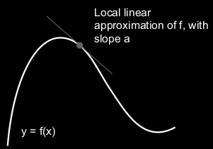

# Deep Learning with Python
Angelegt Sonntag 27 Februar 2022
@python @keras @tensorflow @deeplearning

Teilweise Zusammenfassung des Buches
Deep Learning with Python (Second Edition)
von Francois Chollet, ISBN: 9781617296864

19. auch:
	* [Lexikon – MeinWiki](./Lexikon.md)
	* [Keras – MeinWiki]()

Das Ziel ist nicht ein Modell zu konzipieren, dass auf den  Trainingsdaten gut funktioniert – was relativ leicht ist, da man nur dem Gradienten folgen muss –, sondern auf den Testdaten/neuen Daten, die es noch gar nicht kennt.

Diverses
--------

* Strukturierte Daten: Gradient Boosted Trees
* visuelle Daten: Deep Learning
* für Gradient Boosted Trees & Deep Learning wichtigste Bibliotheken: Scikit-learn, XGBoost & Keras
* Man benötigt Aktivierungsfunktionen, da ein mehrschichtiges vollverbundenes Neuronales Netz ansonsten lediglich eine Verkettung von linearen Operationen, dh. Matrikmultiplikationen und damit nur eine Schicht hätte.
* Man kann sich ein Neuronales Netz so vorstellen, dass es eine hochdimensionale „gefaltete“ Mannigfaltig entfaltet (wie ein geknülltest Stück Papier entfaltet wird) und das durch die Schichten schrittweise, sodass am Ende die Klassen klar erkennbar sind.

Kapitel 1
---------

### 1.2 History of machine learning
Nicht alle Probleme lassen sich (gut) mit **Deep Learning** (Lernen mit vielen Schichten) lösen. Andere Ansätze/Algorithmen mögen besser passen.
Deswegen dient dieses Kapitel dazu die Entstehung und den Kontext verschiedener Möglichkeiten zu erörtern, um einen kleinen Überblick zu erhalten

#### 1.2.1 Probabilistic Modelling

* Anwendung statistischer Verfahren
* bekanntester Alg: **Naive Bayes algorithm**
* eng verwandt: **logreg** (logistic regression); ist ein Klassifikations- und **kein** Regressionsalg.

#### 1.2.3 Kernel methods

* bekanntester Alg: **Support Vector Machines **(SVM)
* Klassifikationsalg., der **decision boundaries**, findet, um (zwei) Klassen zu separieren
* gut für einfache Klassifizierung–schlecht für umfangreichere Daten
	* MNIST-Verarbeitung klappt nicht
* Benutzen eine Funktion (**Kernel**), um Distanzen zwischen Punkten abzubilden

#### 1.2.4 Decision Trees, Random Forests and Gradient Boosting Machines
**Decision Tree**

* Ist halt ein Entscheidungsbaum

**Random Forest**

* Kombination mehrere Entscheidungsbäume

**Gradient Boosting Machines**

* Gradient Boosting ist eine Technik, die mit Decision Trees kombiniert werden kann

Kapitel 2 – The mathematical building blocks of neural networks
---------------------------------------------------------------

* **Class**/**Klasse**: Kategorie in die Daten eingeteilt werden können, bspw alle Ziffern von 0-9 oder Obstsorten
* **Sample**: Einzelner Datenpunkt/Vektor (bspw. ein Bild)
* **Label**: Zum Sample gehörender Datenpunkt
* **Layer**/**Schicht**: Eine Schicht kann man sich als Datenfilter vorstellen
* **Optimizer**: Art und Weise, wie sich das Netzwerk selbst aktualisiert, um Performance zu verbessern, Bsp: Gradientenabstieg (s. u.) (mit Momentum (s. u.)), RMSprop, ADAM, ... @optimizer
* **Loss function**: Art und Weise wie Modell sein Abschneiden misst, dh. den Abstand zwischen Vorhersage und wahrem Wert, und die korrekte Richtung zur Verbesserung einschlägt. Wahl ist sehr wichtig, da das Netzwerk „(konzeptuelle) Lücken“ findet, um Loss zu minimieren. Bei schlechter Wahl ist es schwierig nachzuvollziehen, was es macht. @loss
* **Metric**: Monitoring during training; Es wird nur „accuracy“ (= Anteil der korrekt klassifizierten Vektoren) betrachtet
* **Tensor**  Mehrdimensionales Array @tensor
	* **Axis  **„Dimension“ für Tensoren; Ein 5D-Vektor ≠ 5D-Tensor (drüber nachdenken!), s. auch [numpy – MeinWiki]()
	* **Rang 0-Tensor**  Zahl
	* **Rang 1-Tensor  **Vektor
	* **Rang 2-Tensor**  Matrix
	* **Rang 3-Tensor**  Array von Matrizen; „Würfel aus Zahlen“
	* **Shape**  Anz. der Dimensionen auf jeder Achse
	* **Datatype**/**dtype**  ``float16``, ``float32``, ``float64``, ``uint8``
	* **Slicing  **Auswählen bestimmter Elemente eines Tensor/Datenpakets; auch ein Einzelnes möglich
* **Samples axis**/**dimension**  Die erste Achse des Tensor (auf dieser sind bspw. alle Bilder gelistet)
	* **batch axis**/**dimension**  Analog zu oben nur bzgl. **Batches**

### Kapitel 2.4

* **Gradient**  Gradient/Ableitung gibt an, wie sich die Ausgabe ändert, wenn ich ein Argument ein bisschen ändere; vgl: z = x + y, ändere ich y ein kleinwenig nach oben/unten, verändert sich z ebenso. In einem Neuronalen Netz mit tausenden von Variablen gibt der Gradient genau das für alle Variablen an.
* **Gradientenabstieg**/**Gradient Descent**  Liegt eine Funktion f(x) vor und man möchte sie (wenigstens lokal) minimieren, kann man das Verfahren des Gradientenabstiegs verwenden. Das funktioniert wie folgt: Die Ableitung f'(x) von f(x) beschreibt an jeder Stelle die Steigung von f(x) bzw. die beste lineare Approximation.

Liegt nun bspw. an der Stelle x~0~ eine negative Steigung vor, dh f'(x~0~) < 0, bedeutet das graphisch, dass die Funktion dort fällt
.
Folgt man nun dieser Richtung (einen Schritt) verbessert man das aktuelle Minimum (da man der fallenden Steigung folgt). Dieses Folgen ist mathematisch so definiert:
x~neu~ = x~0~ − λ * f'(x~0~),	λ klein.
❗️**Von x~0~ wird das Bild des Gradienten subtrahiert**
Da f'(x~0~) < 0 bedeutet das, dass sich x~neu~ im Vergleich zu x~0~ vergrößert, man also ein Stück nach rechts geht. Nun wiederholt man dieses Prinzip (für f'(x~0~) > 0 analog) bis man ein Minimum gefunden hat.

Notation im Buch: ``grad(f(x), x``~``0``~``)`` == Gradient/Ableitung von f(x) bzgl. x an Stelle x~0.~

Der Gradient bzw. die Ableitung einer Funktion kann wie folgt interpretiert werden:

* Steigung in einem Punkt
* Beste lineare Approximation
* Richtung des steilsten An-/Abstiegs (am anschaulichsten im Mehrdimensionalen)

	
Appendix 1: Wenn
f: R^n^ → R^m^,
dann
**f': R^n^ → R^m×n^** (Eingabe wird auf Matrix abgebildet
aber für das Bild von f' gilt bzw. kann diese als lineare Abbildung aufgefasst werden (die lineare Abbildung, die f am Punkt x~0~ bestmöglich approximiert):
f'(x~0~): R^n^ → R^m		^(auch als f'|~x0~ notiert)
⇒ x~0~ und f'(x~0~) aus obiger Formel haben dieselbe Dimension und die Rechnung ist damit wohldefiniert.
	
Appendix 2: Ich habe ich mich lange gefragt, warum das Verfahren des Gradientabstiegs für Abbildungen der Form f: R^n^ → R^m^ nicht funktioniere, weil die Ableitung an einem Punkt keinen Vektor, sondern eine Matrix ergibt und deswegen sie Subtraktion nicht definiert ist. Genau das ist auch der Grund, warum es nicht funktioniert. Das Gradientenabstiegsverfahren ist eben nur für Funktionen f: R^n^ → R definiert, weil die Ableitung an einem Punkt f'(x~o~) eben wieder ein Vektor aus R^n^ ist. Mit diesem Verfahren können Netzwerke optimiert werden, weil im Training noch eine Verlustfunktion L: R^n^ → R dahinter geschaltet wurde und damit die Bedingung erfüllt ist.
	

* **Mini-Batch stochastic gradient descent**  (mini-batch SGD) Gradientenabstieg für eine kleine Teilmenge „mini-batch“, die zufällig „stochastic“ bestimmt wurde.
	* „**Echtes**“** SGD**  Man führt den Prozess nur mit einem einzelnen Datenpunkt durch. Wäre relativ aufwendig.
	* **Batch SGD  **In jedem Schritt werden die alle Daten verwendet; sehr genau und sehr aufwendig

Mini-Batch ist ein Kompromiss aus beidem.

* **Learning Rate**  Das λ aus der Gleichung beim Gradientenabstieg
	* LR zu klein: dauert evtl. zu lang und/oder man bleibt vllt. in einem lokalen Minimum stecken
	* LR zu groß: Man geht zu weit und endet an einer „zufälligen“ Stelle
* **Momentum**  Variante für den Gradientenabstieg; Von der Physik inspiriert. Man berechnet x~neu~ nicht ausschließlich anhand der Ableitung sondern beachtet auch die vergangenen Werte, sozusagen die Richtung in die man bisher abgestiegen ist.

#### Kapitel 2.4.4

* **Kettenregel**  f o g(x) =: f(x~1~) =: y, dann ist Ableitung wie folgt definiert:

∇(y, x) = ∇(f(g(x)), x) := ∇(y, x~1~) * ∇(x~1~, x) = ∇( f(x~1~), x~1~) * ∇( g(x), x) 

* **Backward propagation**/**Backward pass**/**Rückwärtsschritt**  Angenommen es liegt folgendes Netzwerk vor:

Loss( f~1~( f~0~(x~0~, W~0~), W~1~), y~true~) =: y~loss~
dann berechnet sich der Rückwärtsschritt mir folgenden Ableitungen:

* ∇( Loss(y~Netzwerk~, y~loss~), y~Netzwerk~)	mit y~Netzwerk~ = f~1~(x~1~, W~1~) = f~1~( f~0~(x~0~, W~0~), W~1~)
* ∇( f~1~( x~1~, W~1~), x~1~)				mit x~1~ = f~0~(x~0~, W~0~)
* ∇( f~1~( x~1~, W~1~), W~1~)				mit x~1~ = f~0~(x~0~, W~0~)
* ∇( f~0~( x~0~, W~0~), x~0~)
* ∇( f~0~( x~0~, W~0~), W~0~)				

Jede Schicht wird bzgl ihrer Eingabe und ihrer Gewichte differenziert, anschließend multipliziert man die jeweiligen Ableitungen bis man an der Stelle angekommen ist, zu der man möchte:

(Die Bezeichnung weichen etwas ab, ``xi`` = f~i~)
	
❗️Gibt es mehrere Wege zwischen zwei Knoten ``a`` und ``b`` erhält man ∇(a, b), indem man die Beiträge aller Pfade summiert (das ist bspw. bei @LSTM so).
	
Eventuell interessant: <https://thinc.ai/docs/backprop101>

Kapitel 4
---------

* **Ground truth**/**annotations**: Zieldaten/Labels der Eingabevektoren, meist von Menschen bereitgestellt.

