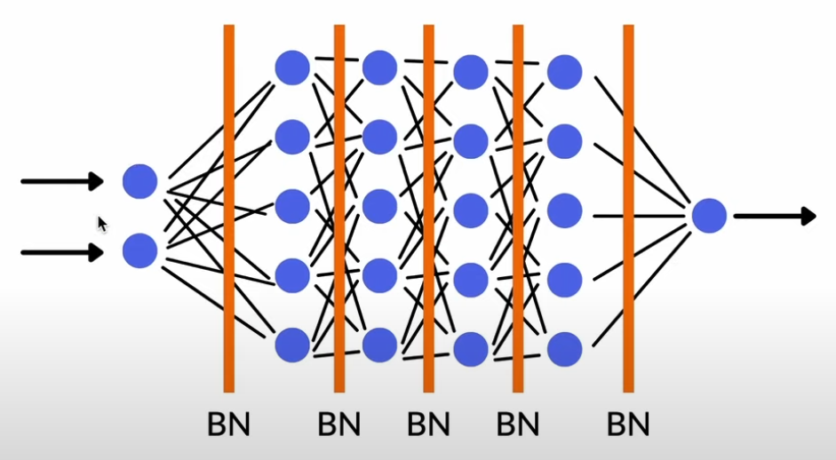
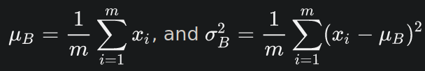
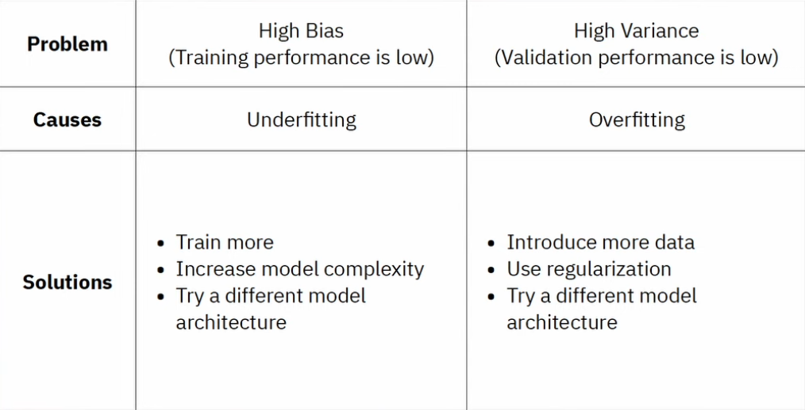

# Lexikon
Angelegt Freitag 04 Februar 2022

@python @deeplearning @datascience @keras

Modell immer auf die Schwächen testen, um zu vermeiden, dass es ausschließlich triviale Lösungen findet (was „Schwäche“ und „trivial“ bedeutet, entscheidet der Kontext)

Literatur
---------

* G. Marcus. “Deep Learning: A Critical Appraisal”. In: (Jan. 2018).

19. auch
	* [Deep Learning with python – MeinWiki](./Deep_Learning_with_Python.md)
	* [Keras – MeinWiki]()
	* [id: buch-dl-architectures][Deep Learning Architectures - A Mathematical Approach - Ovidiu Calin (Kommentare).pdf, S59](../Mathematik/Deep_Learning/Deep Learning Architectures - A Mathematical Approach - Ovidiu Calin (Kommentare).pdf)

* [Epoche – deepai.org](https://deepai.org/machine-learning-glossary-and-terms/epoch): Gibt an, wie oft über die gesamten Trainingsdaten iteriert werden soll; NIcht zu verwechseln mit **Iteration**
* Trainings- und Testgenauigkeit sind oft unterschiedlich. Ist Trainingsg. > Testg., dann liegt **Overfitting** vor.
* **Linearer Klassifizierer**/**Linear Classifier  **``prediction = W • input + b``, als Loss wird einfach der durchschnittliche quadratische Fehler verwendet.

Ein linearer Klassifizierer sucht im Prinzip nur die Parameter einer Gerade
y = −w~1~/w~2~ * x + (0.5 − b) / w~2~.

* **Hypothesis space**  Alle Möglichkeiten, die die Gewichte annehmen können. Hängt stark von der **Topologie** des Netzwerks ab. @topologie
* **Validation data  **Teilmenge der Trainingsdaten, um Loss sowie Metrics-Wert zu berechnen. Auf dieser Menge wird **nicht** trainiert, s. auch [Das Model – Python > Keras > Das Modell]().
* **Batch**: Kleine Menge von Eingaben. Meist in Größe einer 2er-Potenz, um Speicher auf GPU bestmöglich auszunutzen.
* **Transfer Learning**: Ein bereits trainiertes Modell (teilweise) umtrainieren. Vor allem dann sinnvoll, wenn man nicht genug Daten für ein vollständiges Training hat (s. auch „Data Augmentation“). So kann man ein bereits trainiertes Modell verwenden und „umpolen“.
* **Data Augmentation**: Technik, um eine kleine Datenmenge aus sich selbst heraus zu erweitern, um eine Größere bzw. mehr Daten für ein besseres Training zu schaffen. Kann hilfreich sein, wenn man wenig Trainingsdaten vorhanden hat (s. auch „Transfer Learning“). Die Erweiterungsmethoden können wie folgt aussehen: drehen, skalieren (strecken, stauchen), spiegeln, Rauschen hinzufügen, ...
* Sobald *Validation Loss* wieder größer wird, beginnt *Overfitting*, obwohl *Training Loss* währenddessen weiter abnimmt. Ab diesem Zeitpunkt lernt das Modell, was in den Trainingsdaten enthalten ist und abstrahiert nicht. Es konzentriert sich sozusagen zu starkt auf die Trainingsdaten. @overfitting
* E~Training~(w^*^, b^*^) ≤ E~Test~(w^*^, b^*^), E~Training~ und E~Test~ sind unterschiedlich definiert, da Datenmenge unterschiedlich groß (s. [#buch-dl-architectures](#Informatik:Lexikon))

Overfitting & Regularization
----------------------------
@overfitting @regularization

* [Regularization in a Neural Network | Dealing with overfitting − AssemblyAI > YouTube](https://www.youtube.com/watch?v=EehRcPo1M-Q)
* Wenn Modell zu flexibel ist, kann *Overfitting*, s. [#variance](#Informatik:Lexikon), auftreten, bspw. wenn es zu viele Parameter/Gewichte gibt. Hohe Gewichte begünstigen das, weil sie bestimmte Merkmale überproportional betonen. Lösung: Gewicht verkleinern (auf welche Art auch immer)
* Techniken gegen Overfitting:
	1. Flexibilität verringern, indem Gewichte klein gehalten werden
		* *Early Stopping*: Training beenden, sobald *Validation Loss* wieder zunimmt (obwohl *Training Loss* weiterhin fällt)
		* *Drop Out*: Beim Training wird jedes Neuron mit WS p „ausgeschaltet“/weggelassen, dass pro Schicht 1−p Neuronen **im Durchschnitt **aktiv sind. Beim Testen sind alle N aktiv und man muss die Ausgabe jeder Schicht mit 1−p multiplizieren, da beim Training im Durchschnitt nur 1−p Neuronen zu der jeweiligen Ausgabe der Schicht beigetragen haben.

Bsp.: p=0.25, innere Schicht hat 4 Neuronen, Ausgabeschicht 2, dh. beim Training werden im Durchschnitt für jedes Ausgabeneuron nur die Werte von drei (p*#Neuronen, 0,25*4=1) Inneren verwendet. Beim Testen fließen dann aber auf einmal 4 N mit ein, das kann bspw. zu „zu großen“ Werten führen, wenn alle Faktoren & Gewichte positiv sind, da dieses Mal ein (bzw. p * #Neuronen, hier 0,25*4=1) Summand mehr dabei ist. Um das zu korrigieren, „wird so getan“ als wären nur drei, bzw. (1−p)*#Neuronen, dabei, indem man das Resultat mit 1−p multipliziert wird.

* *Regularization*: Gewichte fließen in Kostenfunktion mit ein, damit diese nicht zu groß werden. Zwei Möglichkeiten: L¹- und L²-Regularisierung.

L¹: Drängt Gewichte dazu 0 zu werden
L²: Bestraft große Gewichte stärker als kleiner

* Beide Techniken kommen mit Faktor λ∈[0, 1] (0=keine Strafe, 1=maximale Strafe) , dh. C(w) + λ * ||w||~1 oder 2~^2 (wenn L²-Norm)^, wenn

λ zu klein: zu unflexibel ⇒ underfitting
λ zu groß: weiterhin zu flexibel ⇒ overfitting

* kann verallgemeinert werden „Potential-Funktion“, s. [#buch-dl-architectures](#Informatik:Lexikon)

2. Mehr Informationen anbieten
	* *Data Augmentation*

Batch Normalization
-------------------
@overfitting @regularization

* [Batch normalization | What it is and how to implement it − AssemblyAI > YouTube](https://www.youtube.com/watch?v=yXOMHOpbon8)
* Kurz: Spannweite der Eingabe (für jede, dh. auch innere Schicht) auf [0, 1], EW auf 0 und Standardabweichung auf 1 „ändern“

* Prozedere (in der Theorie, macht man nicht selbst auch nicht ganz am Anfang, sondern verwendet einfach einen BN-Schicht-Baustein dafür):
	1. Normalisierung

Dann x^BN^~i~ := ( x~i~ − μ~B~ ) / √( σ~B~² + ε )
μ~B~, σ~B~² über ein *Minibatch* B mit m Elementen berechnet werden
ε beliebig kleine Konstante aus numerischen Gründen

2. Transformation

Berechnen von y = γ · x^BN^ + β
γ, β Gewichte, die gelernt werden

* Eingabedaten können in Spannweite stark variieren (bspw. Anzahl Geschwister (0-5) und Geld auf dem Konto (0-10⁶)) ⇒ Schwer zu lernen, *Vanishing*/*Exploding Gradient* möglich

⇒ Batch Normalization kann Lösung darstellen

* Lernen dauert länger (gibt ja auch mehr Schichten), dafürt wird dieselbe Genauigkeit im Vergleich zu „ohne BN“ schneller erreicht
* Kann zu besserer Performance führen
* Kann Notwendigkeit für @regularization verringern, muss man aber individuell prüfen
* Man kann BN auch **vor** die *Aktivierungsfunktion* setzen, bspw. in [:Python:Module:**keras**]() können *Aktivierungsfunktionen* auch als eigenständige Schicht verwendet werden:

	keras.layers.Dense(300, use_bias=False) # s. Anmerkung unten
	keras.BatchNormalization()
	keras.Activation('relu')
	
❗️Die ``Dense``-Schicht liefert eine Ausgabe der Form w*x+b und in der BN-Schicht wird wieder ein Ausdruck (β) addiert, den man auch als [#bias](#Informatik:Lexikon) interpretieren kann. In diesem Fall kann man auf einen verzichten und das ist meistens b der ``Dense``-Schicht.

Bias & Variance
---------------
@overfitting @underfitting

* [Bias and Variance for Machine Learning | Deep Learning − AssemblyAI > YouTube](https://www.youtube.com/watch?v=nbY2KqXSsaE)
* Bias und Varianz müssen stets gegeneinander abgewogen werden (Bias/Varainz niedrig ⇒ Varianz/Bias hoch)

* Lösungsansätze kombinieren, bspw. Modelkomplexität erhöhen bei simultaner @regularization

### Bias

* Anzahl der Annahmen (des Modells): Mehr Annahmen = höherer Bias ⇒ *Underfitting*
	* Das Modell ist nur so gut, wie seine Annahmen, bzw. kann nur das, was seine Annahmen implizieren
	* Lineare Regression hat einen hohen Bias, weil es annimmt, dass Daten linear verteilt sind

### Variance

* Empfindlichkeit des Modells gegenüber Änderungen der Eingabedaten: Höhere Empfindlichkeit ⇒ höhere Varianz ⇒ [#overfitting-&-regularization](#Informatik:Lexikon)
	* Entscheidungsbäume (Decision Trees) haben hohe Varianz

Evaluation von Modellen
-----------------------
❗️Welche Methode am besten geeignet ist im Vorfeld überlegen

* [How to evaluate ML models | Evaluation metrics for machine learning − AssemblyAI > YouTube](https://www.youtube.com/watch?v=LbX4X71-TFI)
* Evaluation wichtig, um zu wissen, wie Modell abschneidet, bspw. ob es zu viel/wenig Bias/Variance hat und deswegen @underfitting/@overfitting vorliegt, s. auch [#bias-&-variance](#Informatik:Lexikon), [#overfitting-&-regularization](#Informatik:Lexikon), [#batch-normalization](#Informatik:Lexikon).

Dazu werden verschiedene *Metriken* verwendet

* Die Bibliotheken, wie [Python:Module:**keras**](), ``tensorflow``, ``scikit``, ``pytorch``, bieten noch viel mehr Möglichkeiten. Dazu am besten Dokumentation konsultieren

### Accuracy

* #[Korrekt klassifizierte Eingaben] / #[alle Eingaben]
* einfache Metrik

### Precision & Recall

* benötigt binäres Klassifizierungsproblem
* Verwendet *Richtig*/*Falsch Positiv* und *Richtig*/*Falsch Negativ*
* *Precision* = TP / ( TP + FP ): Anteil der richtig klassifizierten Daten von **allen positiv Klassifizierten**
* *Recall* = TP / ( TP + FN ): Anteil der richtig klassifizierten Daten von **allen Positiven** (also die, die es von vornherein sind). 
	* Oder: Wie gut werden Positive Daten auch als diese erkannt? Dazu benötigt man alle Positiven, TP + FN, und die Richtig Positiven, TP.
	* Ein FN-klassifiziertes Datum ist eigentlich positiv, da es (rückwärtsschließend) fälschlicherweise als Negativ eingestuft wurde
* *F1-Score* = 2 / ( Precision⁻¹ + Recall⁻¹); Am besten in Kombination mit anderen verwenden

### Crossentropy

* Gut für Klassifikationsprobleme
* Berechnet „einen Abstand“ zwischen zwei [Mathematik:Wahrscheinlichkeitstheorie#**wahrscheinlichkeitsverteilungen**](), wobei eine die Labels, bspw. ein 1-Hot-Encoded-Vektor wie (0 1 0), und eine andere die Ausgabe, bspw. (0.04 0.96 0), beschreibt.

### Weitere

* Mean Absolute Error = 1/n ∑~i=1~^n^ |y~i~ − ŷ~i~| (MAE)
* Mean Squared Error = 1/n ∑~i=1~^n^ (y~i~ − ŷ~i~)² (MSE), ist differenzierbar
* Root Mean Squared Error = √( 1/n ∑~i=1~^n^ (y~i~ − ŷ~i~)² ) (RMSE)
* R² (Coefficient of Determination), Wert zw. 0 & 1, je näher an der 1, desto besser
* Cosine similarity: Ähnlich zu [#crossentropy](#Informatik:Lexikon) aber für Regression

Weight Initialization
---------------------

* [Weight Initialization for Deep Feedforward Neural Networks − AssemblyAI > YouTube](https://www.youtube.com/watch?v=tYFO434Lpm0)
* Gewichte und Bias-Parameter müssen initialisiert werden, dafür verwendet man meist [Mathematik:Wahrscheinlichkeitstheorie#**wahrscheinlichkeitsverteilungen**](), bspw. Normalverteilung N(μ, σ²)
	* Bias-Parameter meist mit 0
	* ...ist für Gewichte aber ungeeignet
* Nach Möglichkeit in Kombination mit bestimmten *Aktivierungsfunktionen* verwenden

### Beispiele

* Fan~in~ = Anzahl der Eingabeneuronen der Schicht
* Fan~out~ = Anzahl der Ausgabeneuronen der Schicht
* Glorot/Xavier: μ = 0, σ² = 1 / Fan~avg~

Fan~avg~ = ( Fan~in~ + Fan~out~ ) / 2

* Standard in [Python:Module:**keras**]()
* Aktivierungsfunktionen: linear, tanh, softmax, logistic

* He: μ = 0, σ² = 2 / Fan~in~
	* Aktivierungsfunktionen: ReLU, Varianten von ReLU
* LeCun: μ = 0, σ² = 1 / Fan~in~
	* Aktivierungsfunktionen: SELU

