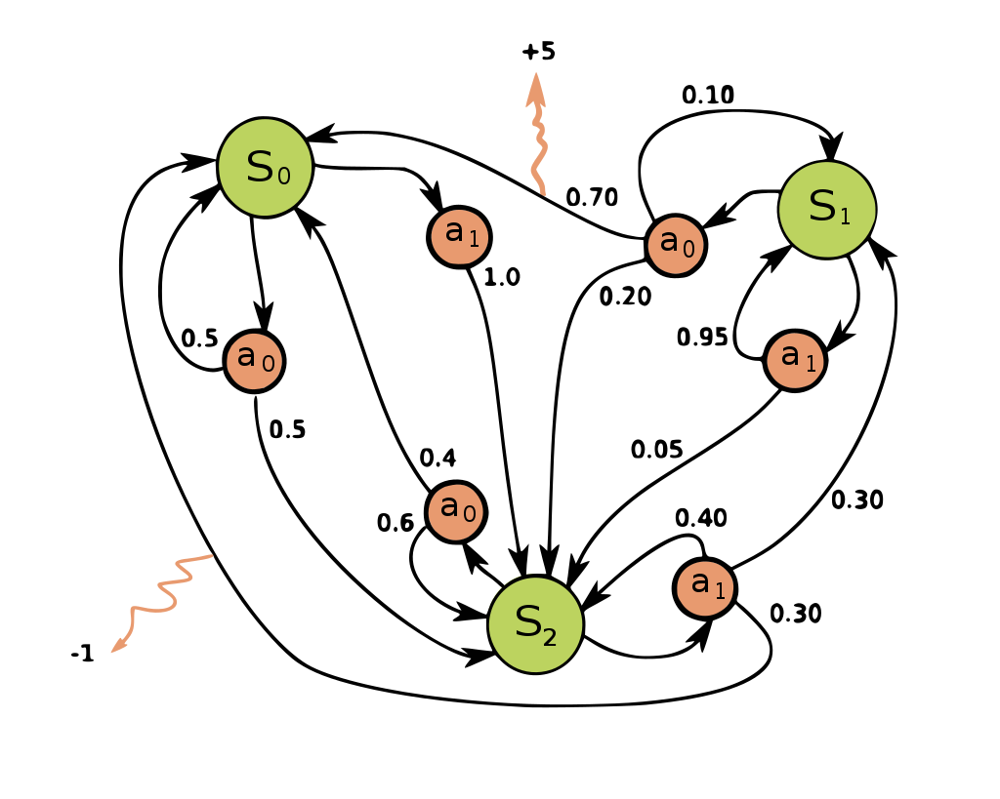

# Reinforcement Learning
Angelegt Donnerstag 03 Februar 2022
Hängt stark mit [Markov-Ketten]() zusammen.

Lesen
-----

* <https://ai.stackexchange.com/questions/21684/why-does-the-state-action-value-function-defined-as-an-expected-value-of-the-re>
* <https://en.wikipedia.org/wiki/Reinforcement_learning>

Zusammenfassung
---------------

* Policy π wird gelernt; Sie gibt an, welche Aktion a in Abhängikeit vom Zustand s gewählt wird: π(a | s) 

 (aus [Markov Decision Process](https://en.wikipedia.org/wiki/Markov_decision_process))
zB: Man befindet sich bei Zustand s~0~. WS für π(a~0~ | s~0~) = 0,3, π(a~1~ | s~0~) = 0,7. ∑~i=1, ..., n~ π(a~i~ | s~k~) = 1 für einen Zustand s~k~. Wurde sich für a~o~ entschieden, erhält man weitere WS um zu s~0~ oder s~2~ zu wechseln, in Zahlen: P(s~2~ | s~0~, a~0~) = 0,5 und P(s~2~ | s~2~, a~0~) = 0,5. Auch hier gilt analog zu oben: ∑~i=1, ..., n~ P(s~k~ | s~i~, a~j~) = 1.
Berechnung der [Übergangswahrscheinlichkeit](https://de.wikipedia.org/wiki/Übergangskern) zwischen zwei Zuständen (eigentlich logisch):
T(s, s') = ∑~i=1, ..., n~ π(a~i~ | s) * P(s' | s, a~i~)
und
∑~s' \in S~ T(s, s') = 1 (Die Summe von Übergangswahrscheinlichkeiten muss 1 ergeben)
⇒ T, wobei s den Zeilen- und s' den Spaltenindex widerspiegelt, beschreibt eine [Übergangsmatrix](https://de.wikipedia.org/wiki/Übergangsmatrix).

* Es gibt eine Belohnungsfunktion R(s), die die Belohnung angibt, die man bei Zustand s erhält. Diese soll (mehr oder weniger) unter der Verwendung einer Policy maximiert werden.

Interessant
-----------

* [Markov decision process](https://en.wikipedia.org/wiki/Markov_decision_process) (Graph mit Policy π und Zuständen s)

@Übergangsmatrix @Übergangswahrscheinlichkeit @Markovkette @Wahrscheinlichkeit @Wahrscheinlichkeitstheorie @StationäreVerteilung @SuccessorRepresentation

