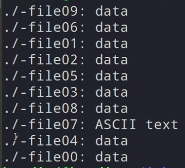
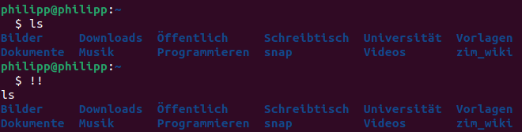

# Linux
Angelegt Dienstag 11 Januar 2022

TODO [./Linux.txt](./Linux_files/Linux.txt), [./LinuxBefehle.txt,](./Linux_files/LinuxBefehle.txt,) [~/Universität/Informatik/Linux-Kurs](file:///home/philipp/Universit%C3%A4t/Informatik/Linux-Kurs)

* [Tipps und Tricks – UbuntuUsers](https://wiki.ubuntuusers.de/Shell/Tipps_und_Tricks/)
* [Bash-Skripting – UbuntuUsers](https://wiki.ubuntuusers.de/Shell/Bash-Skripting-Guide_für_Anfänger/#Programmfuehrung)
* [Home umziehen – UbuntuUsers](https://wiki.ubuntuusers.de/Home_umziehen/)

Logs
----
Logs finden sich unter [/var/log/](file:///var/log).
Bspw. die von [cron – MeinWIki](./Linux_files/cron.md) unter [/var/log/syslog](file:///var/log/syslog) (filtern mit ``grep CRON``) und die von [pm-utils – MeinWiki]() unter [/var/log/pm-powersave.log](file:///var/log/pm-powersave.log).

Diverses
--------

* **Inhalt von Dateien leeren** (am Beispiel ``test.sh``):

	cat /dev/null > test.sh

* mit [shred – UbuntuUsers](https://wiki.ubuntuusers.de/shred/) Dateien in Verzeichnissen löschen:

	find <Verzeichnis> -type f -print0 | xargs -0 shred -fuz 

* ``whoami  ``Zeigt an als welcher Nutzer man eingeloggt ist
* ``hostname  ``Name des Rechners bzw. Ausgabe der Datei [/etc/hostname](file:///etc/hostname)
* ``id  ``Zeigt alle möglichen Ids an
* ``file <file>  ``Zeigt Informationen an, wie der Dateiinhalte aufgebaut ist, also ob es bspw. Daten, Text oder PDF ist

* ``<Befehl_1> | xargs <Befehl_2>  ``Nur im Zusammenspiel mit Pipes sinnvoll zu verwenden. Verwendet die Ausgabe von ``Befehl_1`` als Argumente für ``Befehl_2``

``find . -type f | xargs file``
Schaut, welche Daten sich in den Dateien im aktuellen Verzeichnis befinden

* In [/etc/shells](file:///etc/shells) stehen alle Shells, die man verwenden kann. Mit Eingabe deren Namen kann man sie einfach aufrufen.

Die Standard-Shell steht in der [/etc/passwd](file:///etc/passwd)
Diese können mit ``chsh`` geändert werden

* Per ``!!`` kann man auf den letzten Shell-Befehl zugreifen:

Textverarbeitung
----------------

* Textdatei **spaltenweise** extrahieren <https://wiki.ubuntuusers.de/cut/>

Verzeichnisstruktur
-------------------
[Verzeichnisstruktur – UbuntuUsers](https://wiki.ubuntuusers.de/Verzeichnisstruktur/)
``$ man hier``

* Alle Veränderungen unter ``/`` sind nur mit ``root``-Rechten möglich
* ``/``
	* Erste Verzeichnisebene
* ``/bin  ``von ``bin``aries (Programme)
	* Link auf ``/usr/bin``
	* unverzichtbare Programme
	* dürfen im vergleich zu ``/sbin`` von allen Nutzern ausgeführt werden
* ``/boot``
	* zum booten benötigte Dateien, bspw. den Kernel
* ``/dev  ``(von ``dev``ices)
	* Gerätedateien, über die Hardware im Betrieb angesprochen wird
* ``/etc  ``(von ``et`` ``c``etera)
	* Konfigurations- und Informationsdateien wie [fstab](https://wiki.ubuntuusers.de/fstab/), [hosts](https://wiki.ubuntuusers.de/hosts/) & [blkid.tab](https://wiki.ubuntuusers.de/blkid/)
	* Hier liegende Konfigurationsdateien können auch durch solche im Home-Verzeichnis überlagert werden, zB [bash.bashrc – UbuntuUsers](https://wiki.ubuntuusers.de/Bash/bashrc/)
	* ``/etc/default  ``u.a. Konfigurationsdatei für [grub – UbuntuUsers](https://wiki.ubuntuusers.de/GRUB_2/Konfiguration/)
	* ``/etc/opt  ``Verzeichnisse und Konfigurationsdateien für Programme in ``/opt``
	* ``/etc/init.d  ``Start- und Stopskripte
		* ``/etc/rc[0-6].d`` directories. [Runlevel – Wikipedia](http://en.wikipedia.org/wiki/Runlevel) ``0`` corresponds to shutdown, and ``6`` to reboot.
* ``/home  ``(von ``home``-directory; [Home-Verzeichnis – UbuntuUsers](https://wiki.ubuntuusers.de/Homeverzeichnis/))
	* pro Nutzer ein Unterverzeichnis
* ``/lib  ``(von ``lib``aries)
	* unverzichtbare Bibliotheken für Boot-Prozess
	* ``/lib/modules  ``[Kernelmodule – UbuntuUsers](https://wiki.ubuntuusers.de/Kernelmodule/)
	* ``/lib/udev  ``für [udev – UbuntuUsers](https://wiki.ubuntuusers.de/udev/)
* ``/media  ``
	* Unterverzeichnisse, welche als [mount – UbuntuUsers](https://wiki.ubuntuusers.de/mount/)- oder Einhängepunkte transportabler Medien (bspw. USB-Speichermedien und anderer Datenträger) dienen.
	* Unterverzeichnisse von Partitionen erscheinen auch hier
	* Link auf Schreibtisch wird erstellt
* ``/mnt  ``(von ``m``ou``nt``)
	* normalerweise leer, kann für temporär eingehängte Partitionen verwendet werden
	* kein Link auf Schreibtisch wird erstellt (vgl. ``/media``)
* ``/opt  ``(von ``opt``ional, [/opt – UbuntuUsers](https://wiki.ubuntuusers.de/opt/))
	* für manuelle Installation von Programmen gedacht, die eigene Bibliotheken mitbringen
* ``/proc  ``(von ``proc``esses)
	* Schnittstellen zum geladenen Kernel und seinen Prozeduren
	* ``/proc/<Nummer>  ``Jedes Programm mit Prozessnummer als Verzeichnisnamen, darin Datei ``status``, die Auskunft über Prozess liefert (Programmname, Nummer, Speichernutzung, ...)
* ``/root``
	* [Home-Verzeichnis – UbuntuUsers](https://wiki.ubuntuusers.de/Homeverzeichnis/) des [Superusers – UbuntuUsers](https://wiki.ubuntuusers.de/sudo/) (root). Muss immer erreichbar sein, deswegen nicht unter ``/home``
* ``/run``
* ``/sbin  ``(von ``s``ytem ``bin``aries; Systemprogramme)
	* Link auf ``/usr/sbin``
	* Programme für essentielle Aufgaben des Systems
	* Nur mit ``root``-Rechten ausführbar
* ``/srv  ``(von ``s``e``rv``ices; [Dienste – UbuntuUsers](https://wiki.ubuntuusers.de/Dienste/)
	* in der Regel unter Ubuntu leer
* ``/sys  ``(von ``sys``tem)
	* Besteht ebenso wie ``/proc`` hauptsächlich aus Kernel-Schnittstellen
* ``/tmp  ``(von ``t``e``mp``orary)
	* enthält temporäre Dateien von Programmen; wird beim Booten geleert
* ``/usr  ``(von ``us``e``r``; Name historisch bedingt)
	* Systemtools, Bibliotheken und installierte Programme
	* ``/usr/bin  ``Anwenderprogramme, Desktopumgebungen und dazugehörige Programme aber auch über Paketverwaltung installierte Programme aber **nicht** die manuell Installierten (s. ``/opt``)
	* ``/usr/include  ``Header-Dateien für C-Programme
	* ``/usr/lib  ``Bibliotheken
	* ``/usr/local``
		* selbe Struktur wie ``/usr``
		* gedacht für Programme, die man an Paketverwaltung vorbei installiert, bspw. [selbst kompilierte Programme – UbuntuUsers](https://wiki.ubuntuusers.de/Programme_kompilieren/)
	* ``/usr/sbin  ``für Linux nicht unbedingt notwendige Programme
	* ``/usr/share  ``im Gegensatz zu ``/var`` für statische, sich nicht ändernde Dateien
		* ``/usr/share/applications  ``[Programmstarter – UbuntuUsers](https://wiki.ubuntuusers.de/Programmstarter/), die für Anwendungsmenüs genutzt werden
		* ``/usr/share/man  ``[Manpages – UbuntuUsers](https://wiki.ubuntuusers.de/man/)
* ``/var  ``(von ``var``iable)
	* nur Verzeichnisse; Dateien in diesen werden von Programmen je nach Bedarf geändert, Bsp: Log-Dateien & Spielstände
	* ``/var/log  ``Log-Dateien der Systemprogramme wie ``Xorg.0.log`` (Xserver-Log), ``kern.log`` (Kernel-Log), ``dmesg`` (letzte Kernelmeldungen), ``messages`` (Systemmeldungen); s. [Logdateien – UbuntuUsers](https://wiki.ubuntuusers.de/Logdateien/)
	* ``/var/run  ``Speichern Zustand des Gesamtsystems; wird bei jedem Booten gelöscht und neu geschrieben
	* ``/var/tmp  ``Dateien, die bei einem Reboot nicht verloren gehen sollten

