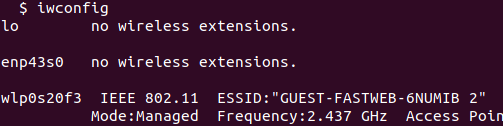
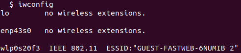

# Netzwerk
Angelegt Samstag 09 April 2022

WLAN-Passwort hacken
--------------------
[Youtube-Video](https://www.youtube.com/watch?v=WfYxrLaqlN8) @airmon_ng @aircrack_ng
[Ein WPA/WPA2 WLAN mit Kali Linux hacken – wikiHow](https://de.wikihow.com/Ein-WPA/WPA2-WLAN-mit-Kali-Linux-hacken) @airmon_ng @aircrack_ng
[Wi-Fi-Deauthentication-Angriff – Wikipedia](https://de.wikipedia.org/wiki/Wi-Fi-Deauthentication-Angriff)

monitor-Modus der WLAN-Schnittstelle
------------------------------------
❗️Befindet man sich im **monitor-Modus** ist man **nicht** mit dem Internet verbunden. Dazu muss der Modus **managed** aktiviert sein.
@airmon_ng @aircrack_ng
Quelle: <https://techwiser.com/check-if-wireless-adapter-supports-monitor-mode/>

A priori befindet sich die WLAN-Schnittstelle im **managed-Modus** (letzte Zeile):

Anleitung, um **monitor-Modus** zu aktivieren:

1. per ``iwconfig`` Name der WLAN-Schnittstelle heraussuchen. Hier: ``wlp0s20f3``

2. WLAN ausschalten

	sudo ip link set dev wlp0s20f3 down
	

3. **monitor-Modus** aktivieren

	sudo iwconfig wlp0s20f3 mode monitor

1. Zustand prüfen: ``iwconfig`` (letzte Zeile zeigt nun „Mode:Monitor“).

⇒ Fertig

4. Wechsel in den **managed-Modus**:

	sudo iwconfig wlp3s0 mode managed
	sudo ip link set dev wlp3s0 up
	
„``up``“ wird nur beim **managed-Modus** benötigt!

