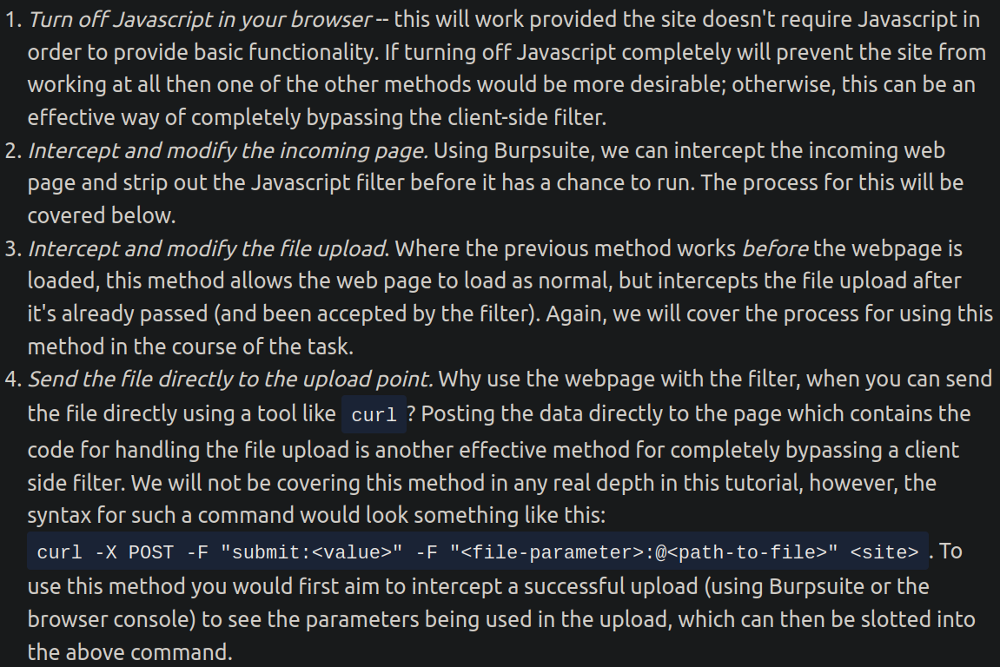

# TryHackMe
Angelegt Sonntag 16 Oktober 2022

Name: tryhackme
Passwort: tryhackme

* Möchte man ein Ziel angreifen, sollte man erst „die Landschaft erkunden“, um zu wissen, welche IP-Adresse für was zuständig ist ⇒ [nmap (Port Scanning) − MeinWiki > Linux > TryHackMe](./TryHackMe/nmap.md). Einer fungiert als Webserver, der andere als Windows Active Directory Domain Controller.
	* In einem @ctf-Szenario können Standardports geändert sein.
	* Nur offene Ports können angegriffen werden, dazu muss man diese kennen
* Bei Passwortabfragen ruhig einfach mal ``ENTER`` drücken, bzw. kein Passwort eingeben
* Standard-Anmeldedaten eines Dienstes im Internet suchen, bspw ``Pensive Notes default credential`` wie bei [OWASP Top 10: [Severity 6] Security Misconfiguration − TryHackMe](https://tryhackme.com/room/owasptop10)
* ``ssh``-Ordner sind immer interessant, da sie Schlüssel enthalten. Gerne **alle** Schlüssel, also sowohl Öffentliche wie auch Private kopieren
* Während der @enumeration alles aufschreiben, was man an Infos bekommt: Nutzernamen, Passwörter, Schlüssel, alle offene Ports jeglicher Dienste, Betriebssystem(informationen), Version der genutzten Software, Passwort-Hashes, ...
* ``strings DATEI`` einfach mal benutzen, wenn man nicht weiter weiß, um herauszufinden, ob sich druckbare Zeichen in ``DATEI`` verstecken
* ``nc`` ([:Linux:netcat & socat](./netcat_&_socat.md)) kann für alles, was mit TCP und UDP zu tun hat, verwendet werden, bspw. TCP-Verbindungen öffnen, UDP-Packete senden, an TCP- & UDP-Ports hören, etc.
* Ruhig alle Verzeichnisse anschauen, auf die man Zugreifen kann − vllt. findet man etwas Interessantes, bspw. eine Datenbank, die man dann herunterladen und auf eigenem Rechner abfragen kann.
* Wenn Eingaben nicht bereinigt werden, bspw. geht ```` oder Sonderzeichen wie ``<``, ``>`` gehen durch, könnte [:Linux:TryHackMe:**XSS − Cross Site Scripting**](./TryHackMe/XSS_−_Cross_Site_Scripting.md) möglich sein
* [+Werkzeuge:**Burp Suite**](./TryHackMe/Werkzeuge/Burp_Suite.md) und OWASP Zap helfen dabei Schwachtstellen zu finden, wenn man Dateien hochladen kann, indem sie Dateien zur Verfügung stellen, die Fehlermeldungen provozieren.
* Client-side-Filterung kann leicht umgangen werden, da es auf dem Rechner, den ich kontrolliere geschieht (s. [#client-side-filtering-umgehen](#Linux:TryHackMe))
	* Bspw. kann man per Burp den Filter aus der HTML-Datei löschen oder, falls er sich in einer eigenen Datei befindet, diese gar nicht erst herunterladen (s. [:Linux:TryHackMe:Werkzeuge:**Burp Suite#diverses**](./TryHackMe/Werkzeuge/Burp_Suite.md))

Enumeration bei @CommandInjection
---------------------------------

* ``uname -a`` kann für @enumeration benutzt werden, wenn man Befehle abgeben kann (zeigt alle Systeminformationen an, also Betriebssystem, Zeit, ...)
	* ``cat /etc/os-release`` genaue Informationen zum Betriebssystem
* ``cat /etc/passwd`` gut, um herauszufinden, wie viele Nutzer es gibt. UID ≥ 1000 deutet auf „menschlichen“ Nutzer hin

Werkzeuge
---------

19. [:Linux:TryHackMe:**Werkzeuge**](./TryHackMe/Werkzeuge.md) 

Fachbegriffe (die ich nicht intuitiv zu ordnen kann)
----------------------------------------------------

* @enumeration Sammeln von Informationen über ein Ziel, um Angriffsszenario bestimmen zu können, bspw. Nutzernamen, Passwörter, Netzwerkinformationen, Hostnamen, Anwendungsinformationen, Dienste, etc. Erster Schritt häufig Port Scanning.

Weiterführende Links
--------------------

* [What is enumeration − Infosec Institute](https://resources.infosecinstitute.com/what-is-enumeration/)
* [Erste Schritte in CTFs für Binaries − gegrit.medium.com](https://gregit.medium.com/exploiting-simple-network-services-in-ctfs-ec8735be5eef)
* [OWASP Cheat Sheet Series − owasp.org](https://cheatsheetseries.owasp.org/index.html) (Ich glaube, hier gibt's alles)
	* [OWASP Cheat Sheet Series: XSS Filter Evasion − owasp.org](https://cheatsheetseries.owasp.org/cheatsheets/XSS_Filter_Evasion_Cheat_Sheet.html)
* [HTML 5 Security Cheat Sheet − https://html5sec.org/](https://html5sec.org/)
* <http://www.xss-payloads.com/> (s. auch **[XSS − Cross Site Scripting](./TryHackMe/XSS_−_Cross_Site_Scripting.md)** für weitere Links)

### Reverse Shell Cheat Sheet

* <https://web.archive.org/web/20200901140719/http://pentestmonkey.net/cheat-sheet/shells/reverse-shell-cheat-sheet>

Bilder
------

