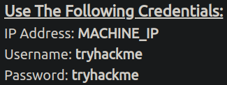
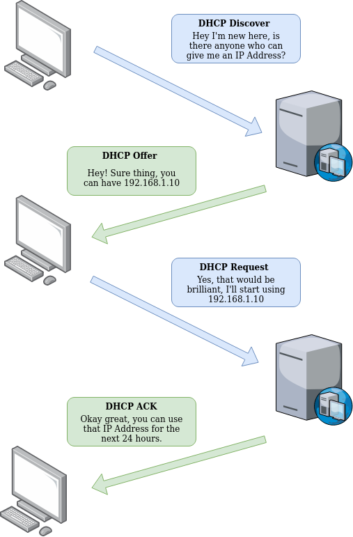

# Allgemeines
Angelegt Freitag 21 Oktober 2022

Weitere Quellen
---------------

* Blog eines Sicherheitsexperten über CTFs und nützliche Werkzeuge: <https://0xrick.github.io/lists/stego/>
	* Viele Sicherheitsexperten führen einen Blog und sind deswegen eine gute Quelle an Informationen
* Unter [ExploitDB – ecploit-db.com](https://www.exploit-db.com/) findet man Exploits für Programme. Kann hilfreich sein, wenn eine bestimmte Software in einem CTF auftaucht.
	* Kann man unter Kali Linux per ``searchsploit`` offline durchsuchen
* [NVD – nvd.nist.guv](https://nvd.nist.gov/vuln/search): Datenbank zu Sicherheitslücken bzw. CVEs (Common Vulnerabilities and Exposures; Nummerierungsschema: CVE-JAHR-NUMMER)
* <https://www.opencve.io/> ist auch eine Datenbank mit bekannten Sicherheitslücken

IP-Adresse
----------

* ist als logische/abstrakte Adresse zu verstehen
* Um eine IP-Adresse zu erhalten wird ein DHCP-Server eingesetzt, der IP-Adresse an neue Geräte im Netzwerk vergibt

### Subnetting

* Netzwerk-Adresse: Identifiziert ein Netzwerk, bspw. ``192.168.1.0``
* **Host-Adresse**: ``192.168.1.100`` (bspw.); Über diese wird ein Gerät im Netzwerk identifiziert

Konvention: Gateway-Geräte haben die Host-Adresse ``192.168.1.1`` oder ``192.168.1.254`` (die erste oder letzte im Netzwerk

* **Gateway-Adresse** (**Default Gateway**): Das Gerät hinter der Gateway-Adresse ist dafür zuständig Daten in ein anderes (Sub)Netz zu schicken, wenn sich der Empfänger nicht in ``192.168.1.0`` befindet.

Diverses
--------

* ``nc`` kann für alles, was mit TCP und UDP zu tun hat, verwendet werden, bspw. TCP-Verbindungen öffnen, UDP-Packete senden, an TCP- & UDP-Ports hören, etc.
* JavaScript in HTML-Code kann „remote“ per ``src='…``'-Attribut eingebunden werden.

TODO Heißt das, man könnte hier URLs angeben?
Meiner ersten Recherche nach: Ja.

* nGinx, Apache speichern alle Daten/Resourcen unter ``/var/www/html``, dh. fordert man ``http://www.example.com/picture.jpg`` an, erhält man ``/var/www/html/picture.jpg``
	* Man kann das aber auch ändern, bspw. indem man ``one.com`` mit ``/var/www/website-1`` verknüpft

### Netzwerke

* ``ip-scanner.thm`` (?) prüft den Ruf einer IP-Adresse
	* ähnlich: ``AbuseIPDB``, ``Cisco Talos Intelligence`` (Datenbanken mit Informationen zu IP-Adressen)
* MAC-Adresse: ``a4:c3:f0:85:ac:2d``, die ersten 6 Tupel beschreiben den Hersteller, die letzten 6 eine vom Hersteller vergebene, interne Nummer
	* Können gefälscht werden: „Spoofing“ und Sicherheitsrisiko darstellen: Wenn Sicherheitskonfiguration sich nur MAC-Adresse verlässt, kann man so vorgeben jemand anderes zu sein, bspw. indem man die MAC-Adresse des Admin herausfindet und dann selbst verwendet
* Per ARP(-Protokoll) findet ein Gerät heraus, welche MAC-Adresse sich hinter einer IP-Adresse verbirgt. Dadurch werden MAC- und IP-Adresse verknüpft.

