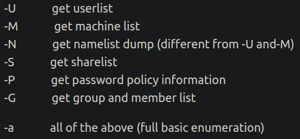
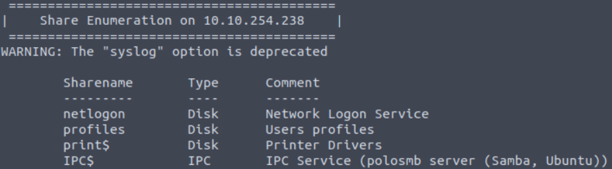
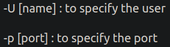
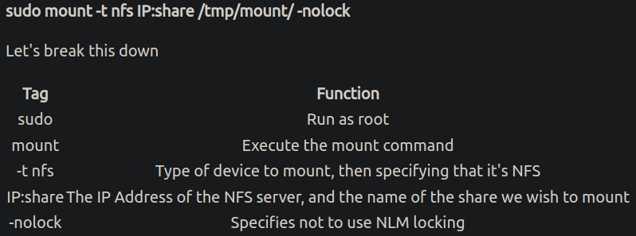

# Netzwerk-Dienste
Angelegt Donnerstag 20 Oktober 2022

* [Network Services − TryHackMe](https://tryhackme.com/room/networkservices)
* [Network Services 2 − TryHackMe](https://tryhackme.com/room/networkservices2)
* Hier geht's darum Schwachstellen und falsche Konfigurationen von bekannten Netzwerkdiensten auszunutzen

SMB − Server Message Block Protocol
-----------------------------------

* Client-Server-Protokoll, um Zugang zu Dateien/Dateisystemen, Druckern und anderen Resourcen in Netzwerk zu regeln
* Clients verbinden sich mit „NetBIOS over TCP/IP“
* Clients senden Befehele („SMBs“)
* SMB-Laufwerke, **shares**, können oft Startpunkt für @enumeration/das Sammeln von Informationen sein
	* Diese kann man unter Linux (irgendwie) einhängen
* [enum4linux − github](https://github.com/portcullislabs/enum4linux) kann für @enumeration von SMB-Laufwerke verwendet werden
	* Syntax: ``enum4linux [options] <IP>``

* Mit [enum4linux − github](https://github.com/portcullislabs/enum4linux) kann bspw. herausgefunden werden, welche Laufwerke/Shares für einen SMB-Zugriff interessant sein könnten, bspw. solche, die nicht zur Standardkonfiguration gehören

Beispielhaftes Resultat (``enum4linux -a <IP>``):

⇒ ``profiles`` ist bspw. kein Standard-Share

### smbclient

* Mit dem ``smbclient`` kann man auf SMB-Laufwerke/Shares zugreifen.
	* Syntax: ``smbclient //<IP>/<SHARE>``

* Falls man nach dem Anmelden Zugriff auf ein paar Befehle hat:

``mget DATEI``, mit ``yes`` (tippen!) bestätigen; um ``DATEI`` herunterzuladen

telnet
------

* Mit ``telnet`` kann man Befehle auf einem anderen ``telnet``-Server ausführen
* Schickt alles im Klartext; hat keine Sicherheitsmechanismen (deswegen ersetzt durch [:Linux:**ssh**](../ssh.md))
* Syntax: ``telnet <IP> <PORT>``

NFS − Network File System
-------------------------

* Teil von [Network Services 2 − TryHackMe](https://tryhackme.com/room/networkservices2)
* Per ``NFS`` kann man ein entferntes Dateisystem lokal bei sich einbinden
* Man kann ``NFS`` nutzen, um eine Privilege Escalation auszunutzen (falls meine Shell mit niedrigen Rechten hat)
* Programm: ``nfs-common``, [nfs-common − Doku](https://packages.ubuntu.com/jammy/nfs-common)
	* Kommt u.a. mit folgenden Programmen

: ``lockd``, ``statd``, ``showmount``, ``nfsstat``, ``gssd``, ``idmapd`` & ``mount.nfs``

* ``showmount IP`` Zeigt an, welche Dateisysteme man einbinden kann (gglf. mit ``-e``)

* Beispiel für's Einbinden:

SMTP − Simple Mail Transfer Protocol
------------------------------------

* Teil von [Network Services 2 − TryHackMe](https://tryhackme.com/room/networkservices2)
* In Kombination mit ``POP/IMAP`` für Senden und Empfangen von E-Mail notwendig
	* Muss konfiguriert werden, wenn man bspw. Thunderbird nutzt
* ``POP/IMAP`` ``POP`` lädt E-Mail „nur“ herunter, während ``IMAP`` Postfach synchronisiert
* ``SMTP``-Server fungiert als „Sortierbüro“; Dort gehen alle E-Mails eines E-Mail-Dienstleisters ein
* Weg einer E-Mail: User → SMTP-Server → Internet → POP/IMAP Server → Recipient
	* In dem Raum findet sich eine genauere Beschreibung des Ablaufs oder unter <https://computer.howstuffworks.com/e-mail-messaging/email3.htm>

