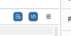
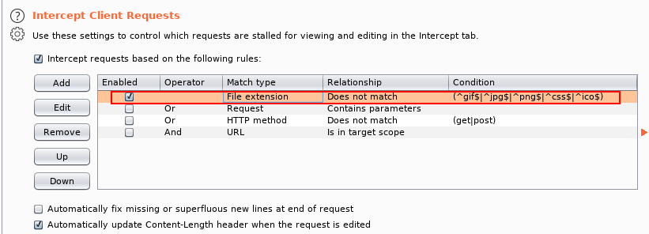
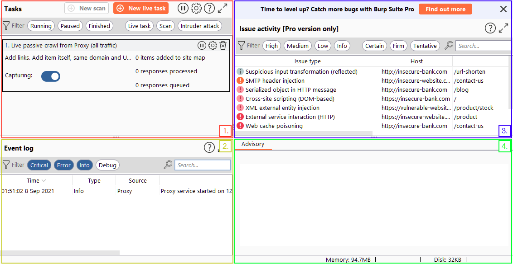

# Burp Suite
Angelegt Sonntag 23 Oktober 2022

[Burp Suite − TryHackMe](https://tryhackme.com/room/burpsuitebasics#)

* ``Burp Proxy`` wichtiger Bestandteil
* Kann Verkehr (zwischen Angreifer und Ziel) abfangen, also inspizieren bevor sie abgeschickt/empfangen werden, und manipulieren
* Man kann Anfragen per Rechtsklick > „Send to...“ an andere Burp Suite-Funktionen schicken/übergeben
* Man kann Burp Suite auch mit dem eigenen Browser verwenden. Dazu muss den Verkehr „zu Burp Suite leiten“. Das geht per Proxy, dabei läuft Burp Suite unter ``127.0.0.1:8080``. Man kann auch [FoxyProxy − getfoxyproxy.org](https://getfoxyproxy.org/) nutzen (wie in [Burp Suite − TryHackMe](https://tryhackme.com/room/burpsuitebasics#))
	* Der **interne Browser** sollte nur mit niedrigen Rechten, dh. niemals als ``root``-Nutzer ausgeführt werden (bei TryHackMe ist man immer ``root``-Nutzer, deswegen funktioniert es in der AttackBox nicht), da ein Angreifer, der über den Burp Suite-Browser Zugang bekommt, dann den ganzen Rechner kontrolliert.

Lösung:
a) Als Nutzer mit niedrigen Rechten starten (wie schon beschrieben)
b) in den Einstellungen deaktivieren: Project options > Misc > Embedded Browser & „Allow the embedded browser to run without a sandbox“ wählen

Funktionen
----------

* *Proxy*: The most well-known aspect of Burp Suite, the Burp Proxy allows us to intercept and modify requests/responses when interacting with web applications.
	* **Scoping** sollte verwendet werden, um zu vermeiden, dass bspw. der Log mit Anfragen überschwemmt wird und unübersichtlich wird.
		* Aktivierung: *Target*-Reiter > Rechtsklick auf die Ziele in linker Spalte > „Add to Scope“ > Auf die Frage mit „yes“ antworten
		* Der *Scope* findet sich nun im *Scope*-Unterreiter (mächtige Funktion)
		* Damit nun die Anfragen von mir nicht manuell behandelt werden müssen, muss man noch eine **Intercept-Regel** festlegen: Proxy > Options > Intercept Client Requests > ☑️ And − URL − Is in target scope, dh. **nur** die Anfragen, die sich **im** *Scope* finden, werden abgefangen
* [Repeater](#Linux:TryHackMe:Werkzeuge:Burp Suite): The second most well-known Burp feature [Repeater − TryHackMe](https://tryhackme.com/room/burpsuiterepeater) allows us to capture, modify, then resend the same request numerous times. This feature can be absolutely invaluable, especially when we need to craft a payload through trial and error (e.g. in an SQLi) or when testing the functionality of an endpoint for flaws.
* *Intruder*: Although harshly rate-limited in Burp Community, [Intruder − TryHackMe](https://tryhackme.com/room/burpsuiteintruder) allows us to spray an endpoint with requests. This is often used for bruteforce attacks or to fuzz endpoints.
	* Mit dem *Intruder* kann man Brute Force-Attacken durchführen. Dazu an einer Stelle per „Clear §“ ``§§`` (bspw. beim Passwort) einfügen und unter „Payload > Payload Options [Simple List]“ eine Wortliste laden.
* *Decoder*: Though less-used than the previously mentioned features, [Decoder − TryHackMe](https://tryhackme.com/room/burpsuiteom) still provides a valuable service when transforming data − either in terms of decoding captured information, or encoding a payload prior to sending it to the target. Whilst there are other services available to do the same job, doing this directly within Burp Suite can be very efficient.
* *Comparer*: As the name suggests, [Comparer − TryHackMe](https://tryhackme.com/room/burpsuiteom) allows us to compare two pieces of data at either word or byte level. Again, this is not something that is unique to Burp Suite, but being able to send (potentially very large) pieces of data directly into a comparison tool with a single keyboard shortcut can speed things up considerably.
* *Sequencer*: We usually use [Sequencer − TryHackMe](https://tryhackme.com/room/burpsuiteom) when assessing the randomness of tokens such as session cookie values or other supposedly random generated data. If the algorithm is not generating secure random values, then this could open up some devastating avenues for attack.

Einstellungen
-------------

* Globale Einstellungen unter *User options*-Reiter
* Projekt-Einstellungen unter *Project options*-Reiter (nur in Burp Suite Pro)
* The options in the *Connections* sub-tab allow us to control how Burp makes connections to targets. For example, we can set a proxy for Burp Suite to connect through; this is very useful if we want to use Burp Suite through a network pivot.
* The *TLS* sub-tab allows us to enable and disable various TLS (Transport Layer Security) options, as well as giving us a place to upload client certificates should a web app require us to use one for connections.
* An essential set of options: *Display* allows us to change how Burp Suite looks. The options here include things like changing the font and scale, as well as setting the theme for the framework (e.g. dark mode) and configuring various options to do with the rendering engine in Repeater (more on this later!).
* The *Misc* sub-tab contains a wide variety of settings, including the keybinding table (HotKeys), which allowing us to view and alter the keyboard shortcuts used by Burp Suite. Familiarising yourself with these settings would be advisable, as using the keybinds can speed up your workflow massively.

Repeater
--------

* Modifizierung, Vervielfältigung & Verzögerung von Anfragen, bspw. dann sinnvoll, wenn man nur bedingt Zugriff auf diese hat (wie bei jedem x-beliebigen Programm), da diese über den Burp-Proxy geschickt werden, den wir kontrollieren
* Im *Proxy*-Tab kann man per Rechtsklick Anfragen „zum Repeater senden“, um sie dort zu bearbeiten
	* Nachdem die Anfrage zum Repeater gesendet wurde „Intercept is on“ abwählen (dh. das Abfangen abschalten)
* Man kann sich auch nicht nicht-druckbare Zeichen auf ``\n`` anzeigen lassen: 

Diverses
--------

* Löscht man ``^js$|`` werden auch ``.js``-Dateien (JavaScript) abgefangen und man kann bspw per *Drop* Client-seitige Filter gar nicht erst herunterladen

Oberfläche
----------

1. The Tasks menu allows us to define background tasks that Burp Suite will run whilst we use the application. The Pro version would also allow us to create on-demand scans. The default "Live Passive Crawl" (which automatically logs the pages we visit) will be more than suitable for our uses in this module.
2. The Event log tells us what Burp Suite is doing (e.g. starting the Proxy), as well as information about any connections that we are making through Burp.
3. The Issue Activity section is exclusive to Burp Pro. It won't give us anything using Burp Community, but in Burp Professional it would list all of the vulnerabilities found by the automated scanner. These would be ranked by severity and filterable by how sure Burp is that the component is vulnerable.
4. The Advisory section gives more information about the vulnerabilities found, as well as references and suggested remediations. These could then be exported into a report.

### Navigation

* Hauptsächlich über die Reiter
	* Tastenkombinationen:

``Ctrl + Shift + D`` Switch to the Dashboard
``Ctrl + Shift + T`` Switch to the Target tab
``Ctrl + Shift + P`` Switch to the Proxy tab
``Ctrl + Shift + I`` Switch to the Intruder tab
``Ctrl + Shift + R`` Switch to the Repeater tab

