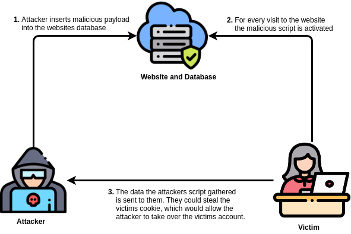
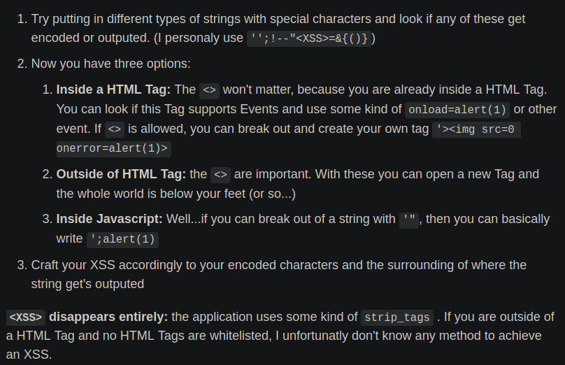

# XSS − Cross Site Scripting
Angelegt Freitag 28 Oktober 2022

[XSS − TryHackMe](https://tryhackme.com/room/xss)

 Wenn Eingaben nicht bereinigt werden, bspw. geht ``<script>alert("Hello World")</script>`` oder Sonderzeichen wie ``<``, ``>`` gehen durch, könnte XSS möglich sein


* Erlaubt Skripte auf Ziel auszuführen, va. dann, wenn Nutzereingabe nicht bereinigt („sanatized“ wird), bspw. ``JavaScript``, ``VBScript``, ``Flash``, ``CSS``.
* 3 Arten:
	* *Stored XSS*: Das Skript wird der eigenen Datenbank entnommen, dh. es gibt Möglichkeit unbereinigten Code in einer Datenbank abzulegen.
	* *Reflected XSS*: Payload ist Teil der Internetseitenanfrage des Ziels, bspw. enthält die Antwort ein Schadskript. Um das realisieren, muss man es schaffen, dass das Ziel auf einen manipulierten Link klickt bzw. eine Anfrage an die URL schickt. Eingabe taucht meistens 1:1 in der URL als Parameter auf.
	* *DOM-Based XSS*: *Document Object Model* ist eine Schnittstelle für die Erstellung von HTML und XML.

Unterschied zu *Reflected XSS*: Werden nicht direkt ausgeführt sondern später, wenn auf sie durch eine Datenbankabfrage zugegriffen wird

* Internetseite ist bei allen Arten nur Mittel zum Zweck, um Code beim Ziel ausführen zu lassen (s. mehr unter „Reflected XSS“). 

Informationen, die interessant sind
-----------------------------------

* Cookies, bspw. Session-Cookies. Die kann man verwenden, um sich als ein anderer Nutzer auszugeben, man umgeht damit Anmeldeverfahren, heißt, man braucht nicht Nutzername und Passwort, sondern nur den Cookie
* Keylogging
* Webcam-Snapshot
* Phishing
* Port Scanning
* …


### Reflected XSS


* Es sind 3 Parteien involviert: Angreifer, Ziel, Server/Internetseite. Letztere ist nur Mittel zum Zweck.
* Ziel: Code auf Rechner des Opfers ausführen (lassen)
* Server/Internetseite dient dabei nur als Tarnung, damit das Opfer kein Verdacht schöpft.
* Ist eine Internetseite anfällig für XSS kann sie verwendet werden, um jemand anderes **nicht** die Seite selbst anzugreifen. Dazu darf die Seite die Eingabe nicht bereinigen. Ein guter Indikator ist die URL, die nach Möglichkeit das Skript in einen Parameter schreibt.
* Vorgehen: Seite identifizieren, bösartiges Skript in URL parken, Ziel dazu bringen auf Link zu klicken, damit der Code letztendlich beim Opfer ausgeführt wird (bestenfalls merkt das Opfer es nicht, weil sich der Online-Shop normal verhält)
	* (Ich glaube, es gibt extra Seiten, die man für einen XSS-Angriff nutzen kann)

⇒ Ist eine Seite XSS anfällig, geht es nicht um die Seite, sondern dass sie dazu missbraucht werden kann jemand anderes anzugreifen.

### Stored XSS


### DOM-Based XSS
Hier kann es sein, dass man eine Interaktion einbauen muss, da der Code eben nur genau dann ausgeführt wird. Ein solche Interaktion stellt bspw. ``onmouseover="alert(<INFO>)"`` dar. Irgendwie kann man sicher eine Methode einbauen, wenn man auf ein Element klickt.

Beispiel-XSS-Payloads
---------------------

* ``<script>alert("Hello World")</script>``
* Writing HTML (``document.write``)
* XSS Keylogger (<http://www.xss-payloads.com/payloads/scripts/simplekeylogger.js.html>)
* Port scanning (<http://www.xss-payloads.com/payloads/scripts/portscanapi.js.html>)
* Allgemein unter <http://www.xss-payloads.com/>


### Strategien zum umgehen / Filter Evasion

* In HTML kann man den Zwischenraum zwischen dem Tag und dem **ersten** Attribut mit beliebigen Zeichen füllen, wenn auf „alleinstehende“ Wörter geprüft wird, kann man das ggfl. so umgehen.

	 <!-- / wird ignoriert -->
	 <!-- /junkdata/ wird ignoriert -->


* falls ``script``-Tags bereinigt/blockiert können verwendet werden:
	* ``<a href="" onclick="alert('Hello');">Klick mich!</a>``
	* ````
	* ``<div onmouseover="alert(1)">Lege den Zeiger auf mich</div>``
	* ``<a href="javascript:alert(1)">Klick mich!</a>``



* [OWASP Cheat Sheet Series: XSS Filter Evasion − owasp.org](https://cheatsheetseries.owasp.org/cheatsheets/XSS_Filter_Evasion_Cheat_Sheet.html)
* [HTML 5 Security Cheat Sheet − https://html5sec.org/](https://html5sec.org/)


* falls ``alert(…)``-gefiltert wird
	* ``<script>document.getElementById('<ID>').textContent="<NEUER TEXT>";</script>``


