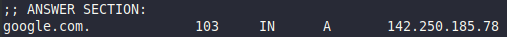

# dig
Angelegt Sonntag 09 Oktober 2022

* Mit ``dig`` kann man bei einem „recursive DNS Server“ der eigenen Wahl Informationen zu einer URL erfragen

	dig <domain> @<dns-server-ip>
		# dig google.com @1.1.1.1

Auszug aus der Antwort:

* IP-Adresse von ``google.com``: ``142.250.185.78``
* TTL [s] (Time to live): 103 (nach 103s wird die IP-Adresse erneut nachgefragt)

* Wenn man IP-Adresse nicht schon hat, fragt man einen DNS-Server nach dieser, anfangs einen „recursive DNS Server“, den bspw. der Internetanbieter unterhält. Dh. man schickt an ihn die URL und bittet um die zugehörige IP-Adresse. Hat auch dieser diese nicht, fragt wiederum der „recursive DNS Server“ den „root name server“, die wiederum die Anfrage zu den „Top-Level Domain Servern“ weiterleiten. Die „Top-Level Domain Server“ sind ein Verzeichnis für die ``.com``- oder ``.co.uk``-Domänen. Auch die „Top-Level Domain Server“ leiten die Anfrage weiter und zwar zu den „Authoritative name servern“, die sich dann um den Rest kümmern bzw. haben die IP-Adresse zur URL.
* ``dig`` zeigt einem dieses Vorgehen an

