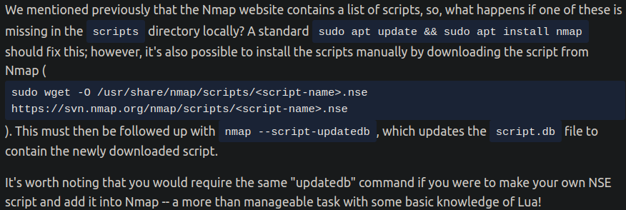

# nmap
Angelegt Sonntag 16 Oktober 2022

* [nmap − TryHackMe](https://tryhackme.com/room/furthernmap)
* Dokumentatio(en?)
	* <https://nmap.org/nsedoc/>
	* <https://nmap.org/book/>
* ``nmap`` scannt Ports oder IP-Adressen, dh. danach weiß man, welche offen, geschlossen oder gefiltert/geschützt (durch Firewall) sind.
	* Danach kann man schauen, welche Dienste unter welchem Port zu finden sind − entweder manuell oder automatisch (per ``nmap``)
	* Auch aktive IP-Adressen können und sollten mit ``nmap`` gesucht werden, um das (grobe) Lagebild zu vervollständigen („ping sweep“)

Syntax
------
``nmap [Scan Type(s)] [Options] {target specification}``

* ``{target specification}`` Bspw. IP-Adresse

Optionen
--------

### Standardoptionen, die immer verwendet werden sollten
``-vv`` Erhöhe „Verbosity“ um 1 (Standard: ``-v``); Je mehr ``v``s, desto höher
``-oA <DATEI>`` Ausgabe in „three major formats“ gleichzeitig speichern, um Netzwerkverkehr gering zu halten und um Wahrscheinlichkeit der Entdeckung zu minimieren
``-oN <DATEI>`` Ausgabe in „normal format“ speichern
``-oG <DATEI>`` Ausgabe in „[grepable − MeinWiki > Linux](../grep.md) format“ speichern

### Weitere Optionen
``-O`` Betriebssystem-Scan
``-sV`` Scanne der Version der laufenden Dienste
``-A`` „Aggressiveres“ Scanning, wenn irrelevant ist, wie „laut“ man ist

* Enable OS detection, version detection, script scanning, and traceroute

``-T<0-5>`` „Timing level“ angeben, je höher desto schneller, desto „lauter“
``-p <PORT>`` Scanne nur Port ``<PORT>``
``-p <PORT 1>-<PORT 2>`` Scanne Port-Intervall
``-p-`` Scanne alle Ports
``--top-ports <NUMBER>`` Scannt nur die ersten ``<NUMBER>`` Ports; Spart ggfl Zeit
``-sn <INTERVALL IP-ADRESSEN>`` Prüft, ob die IP-Adresse aktiv sind; ``<INTERVALL IP-ADRESSEN>`` kann auf zwei Arten angegeben werden:

* ``192.168.0.1-254``
* ``192.168.0.0/24`` (CIDR-Notation)

Schickt zudem TCP-ACK an Port ``80`` und, wenn als ``sudo`` ausgeführt, TCP-SYN-Packete zu Port ``443``, bzw. statt TCP-ACK an Port ``80`` (s. ``-sS``, bzw. „SYN-Scan“).

#### TCP- und UDP-Scans
``-sT`` TCP-Scan; Standardscan **ohne** ``sudo``; 3 Möglichkeiten:

1. Offen; Führt TCP-Handschlag (SYN - SYN/ACK - ACK) auf jedem Port aus
2. Geschlossen; Ist Port (bzgl. TCP?) geschlossen, wird RST (Reset) zurückgeschickt (SYN - RST)
3. „Filtered“ (Port durch Firewall geschützt); Entweder **keine** Antwort oder eine fingiertes RST-Packet. Das macht es für Angreifer schwierig bis unmöglich das Ziel korrekt auszulesen

``-sS`` „Syn Scan“, „Half-open“- oder „Stealth“-Scan; Standardscan wenn ``sudo nmap`` ausgeführt wird

* Im Gegensatz zu ``-sT`` wird hier **nicht** der volle TCP-Handschlag SYN - SYN/ACK - ACK durchgeführt, sondern SYN - SYN/ACK - RST. Das verhindert, dass das Ziel kontinuierlich Verbindungen aufbaut
* Vorteile
	* Ältere Sicherheitssysteme prüfen nur 3-Wege-Handschlag. Wird umgangen
	* Verbindungen werden nur geloggt, wenn sie vollständig aufgebaut werden. SYN-Scans zählen nicht dazu.
	* Schneller, da man sich nicht von jedem Port „trennen“ muss
* Nachteile
	* Benötigen ``sudo``-Rechte (für das RST-Packet)
	* ...irgendwie nicht so Richtige oder ich verstehe sie nicht

``-sU`` UDP-Scan; UDP ist im Gegensatz zu TCP statusfrei („stateless“), man erhält also keine Rückmeldung wie beim TCP-Handschlag. Man sendet einfach die Packete und hofft, dass sie durchkommen. Genau das macht UDP-Scans schwierig und langwierig (20min für die ersten 1000 Ports). Deswegen am besten ``--top-ports <NUMBER>`` (bspw. ``20``) verwenden.
3 Möglichkeiten für Antwort:

1. Erhält ``nmap`` keine Antwort, wird Port als ``open`` oder ``filtered``/``gefiltert`` markiert. Eventuell wird in diesem Fall ein zweites Packet gesendet.
2. Erhalt einer UDP-Antwort ⇒ Port offen
3. Erhalt eines ``ICMP`` (``ping``) Packets, dh Port ist eindeutig geschlossen

``nmap`` schickt leere UDP-Packete außer bei Ports für Anwendungen, die bekannt sind, dort Protokoll-Spezifische.

##### Weitere TCP-Scans

* Sind geheimer als SYN-Scans (``-sS``)
* Antwort auf offene Ports entspricht denen bei UDP-Scans
* Ports können nur als ``open|filtered``, ``filtered`` oder ``closed`` markiert werden

``-sN`` TCP Null-Scan
Schickt TCP-Scan mit keiner gesetzten Flag. Gemäß RFC wird dann mit RST geantwortet, wenn Port geschlossen
``-sF`` TCP FIN-Scan
Packet, das um Schließung des Verbindung bittet. Wieder wird gemäß RFC mit RST geantwortet
``-sX`` TCP Xmas-Scan
Schlecht konfiguriertes TCP-Packet. Wieder wird gemäß RFC ein RST erwartet

Firewall evasion
----------------

* „Der Firewall ausweichen“
* Es kann oft vorkommen, dass Ziele ICMP-Packete standardmäßig blockieren. ``nmap`` nutzt jedoch [ping − Mein Wiki > Linux > TryHackMe](./ping.md) standardmäßig, um festzustellen, ob Ziel aktiv ist oder nicht. Wird ICMP blockiert, wird Ziel als inaktiv deklariert und nicht weiter inspiziert, obwohl das nicht der Fall sein muss. Lösung: 

``-Pn`` kein Ping wird abgesetzt bevor gescannt wird, Ziel wird oBdA als aktiv deklariert. Kann lange dauern, falls Ziel tatsächlich inaktiv ist, da dann jeder Port normal (und deswegen mehrfach) gescannt wird. In lokalem Netzwerk kann ARP benutzt werden.

* [man-bypass-firewalls-ids − nmap.org](https://nmap.org/book/man-bypass-firewalls-ids.html)

nmap-Skripte
------------

* werden in ``Lua`` geschrieben
* Bibliothek ist sehr umfangreich
* In Kategorien aufgeteilt:

Vollständige Liste unter [Kategorien der Skripte − nmap.org](https://nmap.org/book/nse-usage.html)
``--script=<SKRIPT-NAME|KATEGORIE>`` Führe bestimmtes Skript aus. Mehrere auf einmal möglich, indem man sie per Komma (ohne Leerzeichen) trennt
``--script-args`` ``<ARGS>`` Übergeben von Argumenten. Manche Skripte benötigen diese. Syntax für die Argumente: ``SKRIPT-NAME.ARGUMENT`` (``SKRIPT-NAME`` notwendig, da man mehrere auf einmal angeben kann). <https://nmap.org/nsedoc/> kann hilfreich sein für konkrete Informationen zu bestimmten Skripten.
``--script-help <SKRIPT-NAME>`` Öffnet Hilfe für bestimmtes Skript

### Skripte finden

* [nmap-Dokumentation − nmap.org](https://nmap.org/nsedoc/)
* Unter ``/usr/share/nmap/scripts/scripts.db`` (ist keine Datenbank, sondern eine formatierte Text-Datei) ⇒ man kann [grep − MeinWiki > Linux](../grep.md)

### Neue Skripte installieren & eigene hinzufügen

