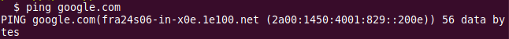

# ping
Angelegt Samstag 01 Oktober 2022

* ICMP-Protokoll
* In der Netzwerk-Schicht des OSI-Modells angesiedelt, bzw. Internet-Schicht des TCP/IP-Modells
* Gibt IP-Adresse eines Ziels zurück. Kann also zum herausfinden von IP-Adressen verwendet werden (im Bsp. IPv6)

Schalter
--------

* ``-4`` Nutze IPv4
* ``-6`` Nutze IPv6
* ``-i <INTERVALL>`` Spezifiziere Intervall für die Packete 

