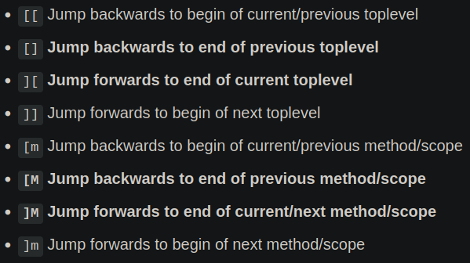

# vim
Angelegt Montag 18 Juli 2022

* ``vim`` verfügt über verschiedene Modi, ua. „Normalmodus (Befehlsmodus)“ und „Eingabemodus“

Anleitungen
-----------

* <https://riptutorial.com/vim>
	* <https://riptutorial.com/vim/example/15901/navigating-to-the-beginning-of-a-specific-word>
* [Vim Cheat Sheet.html](file:///home/philipp/zim_wiki/Internetseiten/Vim%20Cheat%20Sheet.html) (online: [Cheatcheet – vim.rtorr.com](https://vim.rtorr.com/))
* [./vim-Anleitung.pdf](./vim/vim-Anleitung.pdf)

Normalmodus (Befehlsmodus)
--------------------------

### Operatoren und Bewegungen

* Viele Kommandos setzen sich aus „Operator“ (bspw. ``d``) und „Bewegung“ (bspw. ``w``), das worauf der Operator angewandt werden soll, zusammen, wie ``dw``
* Eingabe **ohne** Operator bzw. **nur** der Bewegung: Cursor führt Bewegung aus
* Operator-Eingabe mit ``<Anzahl>`` vor Bewegung möglich
	* ``d2w`` Löscht zwei Wörter
	* ``ce`` Bis Wortende (Bewegung ``e``) löschen und in Eingabemodus wechseln
* ``no<OPTION>`` Deaktiviert die Option, bspw. schaltet ``:set noic`` das Ignorieren der Groß-/Kleinschreibung aus

### Operatoren
Setzen sich allgemein zusammen aus
``<Operator> [Anzahl] <Bewegung>``

* ``d <Bewegung>`` Löscht gemäß der Bewegung (``d``elete)
* ``c <Bewegung>`` Ändern (``c``hange)
* ``y <Bewegung>`` Kopieren (``y``ank), bspw. ``y3e``
* ``v <Bewegung>`` Markieren (``v``isual selection), bspw. ``ve``, ``v3j``, dann **mit** ``y`` kopieren
	* ``V <Bewegung>`` Zeilenweises markieren
	* ``STRG + v`` Visueller Block-Modus, dh. man kann mit ``hjkl`` „Blöcke/Rechtecke“ markieren
	* ``vd`` Auswahl löschen

### Bewegungen

* Immer wieder sinnvoll zu konsolutieren
	* <https://riptutorial.com/vim/example/5512/basic-motion>
	* <https://vimdoc.sourceforge.net/htmldoc/motion.html>

Kombination mit ``<Anzahl>`` nicht vergessen, bspw ``2w`` oder ``4e``

* ``w`` Cursor springt zum Beginn des nächsten [word − vim-Doku](https://vimdoc.sourceforge.net/htmldoc/motion.html#word)
	* ``W`` springt zum Beginn des nächsten [WORD − vim-Doku](https://vimdoc.sourceforge.net/htmldoc/motion.html#WORD)
	* ``word`` Satzzeichen wie ``,``,``.``,``/`` und Leerzeichen trenne Wörter
	* ``WORD`` Alles, was zwischen Leerzeichen steht
	* ``word``/``WORD`` Unterschied: [what-is-difference-between-w-and-W-in-escape-mode-of-vim − unix.stackexchange](https://unix.stackexchange.com/questions/106425/what-is-difference-between-w-and-w-in-escape-mode-of-vim)
	* ``ge`` wie ``w`` nur nach links, dh. Springe zum Ende des vorherigen Wortes
* ``e`` Cursor springt zum Ende des aktuellen „``word``“
	* ``E`` springt zum Ende des aktuellen „``WORD``“
	* ``b`` wie ``e`` nur nach links, dh. Springe zum Beginn des aktuellen Wortes
* ``0`` Cursor springt zum Zeilenanfang
	* ``^`` Cursor springt zum ersten „Wortzeichen“ (sinnvoll bei Einrückungen)
* ``$`` Cursor springt zum Ende der Zeile mit letztem Zeichen
* ``f``/``F CHAR`` Springe **auf nächsten/vorherigen** ``CHAR``
	* Sinnvoll in Kombination mit ``[Anzahl]``, dh. ``3fa``
	* ``;`` Wiederhole letztes ``f``/``F CHAR``
	* Um zu einem bestimmten Wort zu navigieren, kann man ``f ANFANGSBUCHSTABE ; ... ;`` nutzen, dh. man wiederholt ``f ANFANGSBUCHSTABE`` solange, bis man bei dem Wort ist
* ``t``\``T CHAR`` wie ``f``/``F CHAR`` nur **vor**, bzw. **nach** (wenn nach links mit ``T``) ``CHAR``
	* Sinnvoll in Kombination mit ``[Anzahl]``, dh. ``3Ta``
	* ``,`` Wiederhole letztes ``t``/``T CHAR``

**TODO** ändert, glaube ich ``f`` → ``t`` und ``F`` → ``T``

* ``{``, ``}`` Beginn/Ende des Paragraphen
* ``[{``, ``]}`` Beginn/Ende des Blocks
* ``:ZEILENNUMMER`` Springe zu Zeile ``ZEILENNUMMER``
* ``*``/``#`` Gehe zum nächsten/vorherigen Auftreten des Wortes auf dem der Cursor gerade steht

### Bewegungen für python

Diverses
--------

* ``ESC``, ``STRG + [``, ``STRG + C`` Eingabemodus verlassen (und Normalmodus betreten)
	* ``STRG + O`` Eingabemodus für einen Befehl verlassen
* ``<ANZAHL><BEFEHL>`` Führe ``<BEFEHL>`` ``<ANZAHL>``-mal aus, bspw. ``3dd`` (lösche drei aufeinanderfolgende Zeilen)
* ``d…`` Löschen/Ausschneiden (starten) (``d``elete)
	* ``D`` = ``d$``
	* ``dw`` Bis zum Beginn des nächsten Wortes löschen (wenn man auf erstem Buchstaben dessen ist (``d``elete ``w``ord))
	* ``de`` Bis zum Ende des aktuellen Wortes löschen
	* ``d$`` Bis zum Zeilenende löschen
	* ``dd`` Zeile löschen
* ``y`` kopiere Auswahl
	* ``yy`` Zeile kopieren
* ``p`` Einfügen (``p``ut) **nach** dem Cursor, bspw. per ``dd`` gelöschte Zeile
	* ``P`` Einfügen **vor** dem Cursor
* ``u`` Letztes Kommando rückgängig machen (``u``ndo)
	* ``U`` Zeile in Ursprungszustand zurücksetzen, hilfreich, wenn mehrere Kommandos auf einer Zeile operierten
* ``STRG + R`` ``u``ndo rückgängig machen
* ``i`` **Ein**fügemodus (``i``nsert), Zeichen werden links vom Kursor eingefügt
	* ``I`` Einfügen am Zeilen**anfang**
* ``a`` **An**fügemodus (``a``ppend), Zeichen werden rechts vom Kursor angehängt
	* ``A`` Anfügen am Zeilen**ende**
* ``x`` Zeichen auf dem Kursor steht löschen
* ``gg`` Gehe zum Dateianfang
	* ``G`` Gehe zum Dateiende

``<Zeilennummer>G`` Gehe zu Zeile ``<Zeilennummer>``
``:<Zeilennummer>`` Gehe zu Zeile ``<Zeilennummer>``
``v`` Markierungsoperator (``v``isual selection), mit ``y`` kopieren

* Markierter Text kann mit Operatoren, bspw. ``d``, gelöscht oder ``:w <Dateiname>`` gespeichert werden

``V`` markiert die ganze Zeile
``o`` Fügt Leerzeile unterhalb ein und begibt sich ein Eingabemodus
``O`` Analog zu ``o`` nur oberhalb
``r <Ein Zeichen>`` Ersetzt Zeichen auf dem Cursor steht mit ``<Zeichen>`` (``r``eplace)
``R <Mehrere Zeichen>`` Ersetzt mehrere Zeichen direkt nach dem Cursor

``STRG-G`` Zeige Dateiposition & -status an
``STRG-O`` Gehe zurück; nicht genau klar, wann man das machen kann, einfach mal ausprobieren
``STRG-ALT GR-]`` Öffnen einer Seite, wenn man mit Cursor auf ihr ist, in der Hilfe (``:help``), die als ``|<TAG>|`` angedeutet ist

* ❗️Funktioniert nicht mit dem [NEO-Tastaturlayout − MeinWiki > Notizen]()
* Lösung: ``:<TAG>`` eingeben

``STRG-W, STRG-W`` Wechselt Fenster, bspw öffnet sich die Hilfe in einem extra Fenster

``% auf Klammer`` Tippt man ``%`` während man sich auf einer Klammer befindet, springt der Cursor zum öffnenden/schließenden Pendant

* Kann man auch per Einstellung in [~/.vimrc](file:///home/philipp/.vimrc) realisieren

``h,j,k,l`` Zeile nach links/unten/oben/rechts gehen (Wie Pfeiltasten)
``H`` Gehe zur ersten Zeile auf Bildschirm
``L`` Gehe zur letzten Zeile auf Bildschirm
``j$`` Gehe zum Ende der nächsten Zeile (``j`` für „nach unten“, ``$`` für's Ende der Zeile)
``STRG-D, TAB`` Syntaxvervollständigung; ``STRG-D`` zeigt Liste an, mit ``TAB`` kann man diese durchgehen, bspw. ``:e → STRG-D → TAG → edit``

### Suchen

* ``/<Regex>`` Suche (vorwärts) nach ``<Regex>``

``<Regex>`` muss dabei ``(``, ``)``, ``|``, etc. ausweichen, dh. ``\`` voranstellen

* ``STRG-0`` „Gehe zurück“
* ``n`` Zum nächsten Suchergebnis gehen
* ``N`` Zum vorherigen Suchergebnis gehen
* ``?<Regex>`` Suche rückwärts nach ``<Regex>``

Befehle
-------

* ``:!<Shell-Befehl>`` Eingabe und Ausführung eines Shell-Befehls, bspw ``:!ls -la``
* ``:w <Dateiname>`` Speichern des Textes in Datei ``<Dateiname>``
* ``:wq`` = ``:x`` Speicher/Schreiben (``w``rite) und verlassen (``q``uit)
	* ``:q!`` Verlassen und nicht speichern (``!`` steht allg. für „force“)
* ``:s/<Regex>/<ersetzen>[/gc]`` Suchen & Ersetzen
	* ``g`` Alles ersetzen, nicht nur ersten Treffen (``g``reedy)
	* ``c`` Jede Ersetzung manuell bestätigen (``c``onfirmation)
	* *vim* nutzt die Syntax/Mechanik von [:Linux:**sed**](./sed.md), dh. man kann statt den ``/`` jedes beliebige Sonderzeichen verwenden, solange es in ``<Regex>`` und ``<ersetzen>`` nicht vorkommt, bspw. ``&``, dh. ``:s/<Regex>/<Ersatztext>/g == :s&<Regex>&<Ersatztext>&g`` sind gleichbedeutend. Das ist vorallem dann sinnvoll, wenn in einem der beiden ``/`` vorkommt, bspw. bei Dateipfaden, da man diese sonst per ``\`` escapen müsste, was schnell zu einem unleserlichem ``<Regex>`` führt.
	* ``:%s…`` Alle Vorkommen in Datei
	* ``:#,#s…`` Alle Vorkommen innerhalb zweier Zeilen, ``#,#`` gibt die Zeilennummern an
* ``:r <Dateiname>`` Fügt Inhalte von ``<Dateiname>`` ein
	* auch mit Shell-Befehlen möglich, bspw. ``:r :!ls``
* ``:new <Dateiname>`` Öffnet ``<Dateiname>`` in einem neuen Fenster (Wechsel per ``STRG-W, STRG-W``)
* ``:set numbers`` Zeilennummerierung aktivieren

``:tabnew DATEI`` öffnet ``DATEI`` in neuem Reiter/Tab
``g(t|T)`` geht zum nächsten oder vorherigen Reiter
``:tab(n|p)`` geht zum nächsten (``n``) oder vorherigen (``p``) Reiter
``:new DATEI`` öffnet Datei in oberer Hälfte

.vimrc-Datei
------------

* In [~/.vimrc](file:///home/philipp/.vimrc) kann man Standardeinstellungen für ``vim`` vornehmen
* <http://vim.wikia.com/wiki/Open_vimrc_file> (Stand in einem Stackoverflow-Kommentar)
* Backups deaktiviert, da mich die ``~``-Dateien nerven ([why-does-vim-save-files-with-a-extension – Stackoverflow](https://stackoverflow.com/questions/607435/why-does-vim-save-files-with-a-extension))
	* Selbiges habe ich mit den ``Undo``-Dateien (``.un~``-Dateien gemacht), s. dazu [~/.vimrc](file:///home/philipp/.vimrc) (auch wegen des Links zur Quelle)

TODO
----
Probiere folgendes (<ENTER> nicht vergessen):

* ``:help w``
* ``:help c_CTRL-D``
* ``:help insert-index``
* ``:help user-manual``
* ``:help vimrc-intro``

