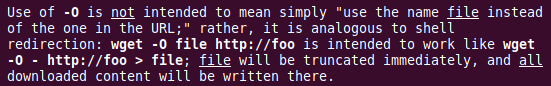

# wget
Angelegt Dienstag 27 September 2022

Mit ``wget`` kann man Dateien herunterladen. Dazu einfach
	wget <URL>

verwenden.

* ``-O <file>`` Schreibt Inhalte in Datei ``<file>``

* ``-O -`` bedeutet, dass Datei auf ``stdout`` geprintet wird
* Falls etwas nicht wie gewollt funktioniert, unbedingt in die ``man``-Page schauen, da diese Option umfangreicher ist

