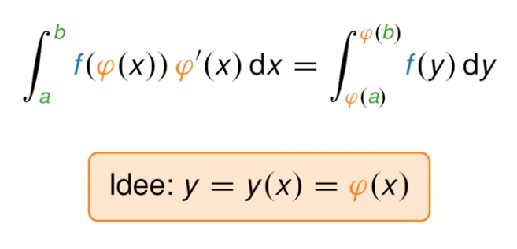
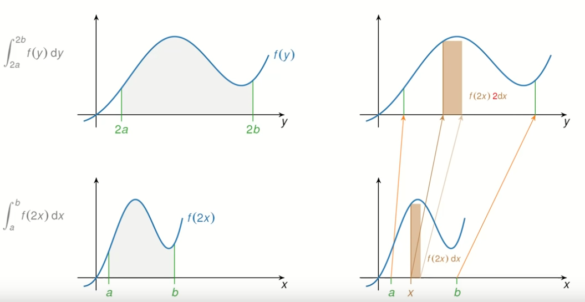
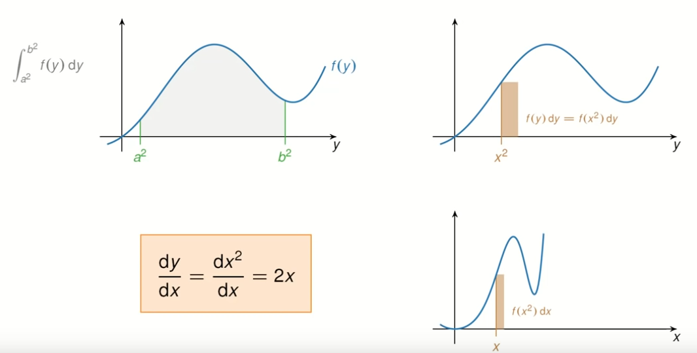
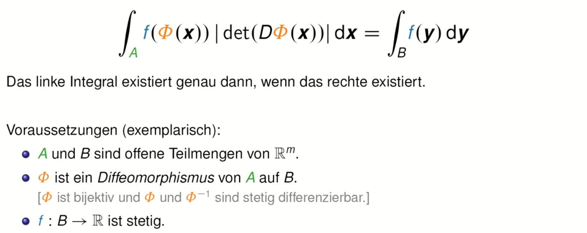
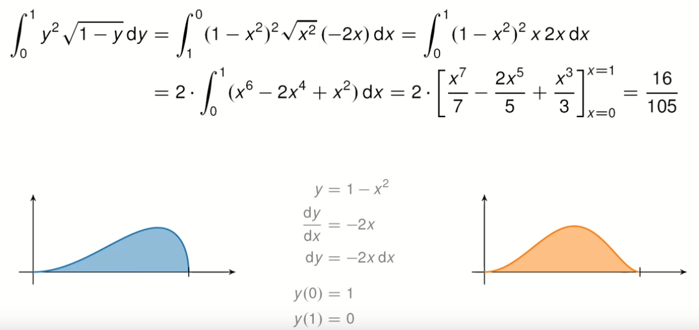
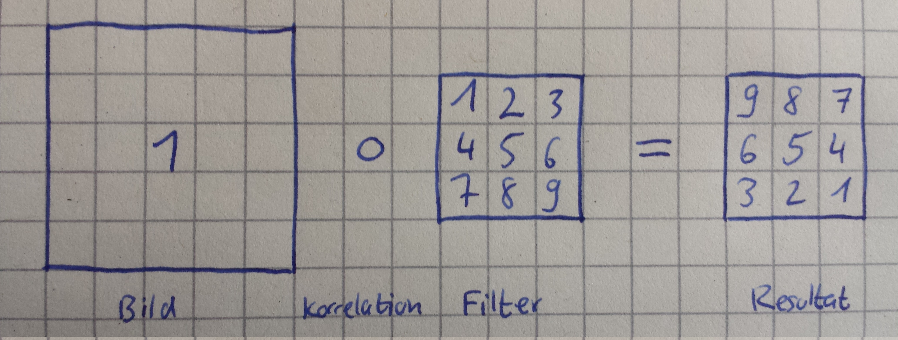
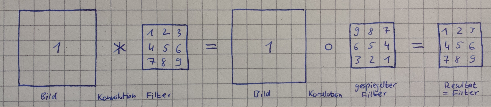
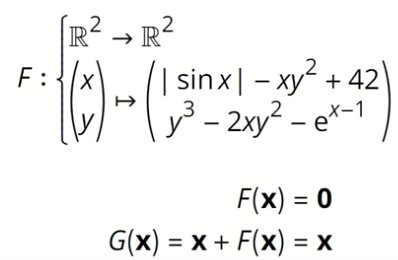

# Mathematik
Angelegt Donnerstag 31 März 2022

[./Differential und Linienintegral.pdf](./Mathematik_files/Mathematik/Differential und Linienintegral.pdf) 
[./Linienintegral und Skalarfeld.pdf](./Mathematik_files/Mathematik/Linienintegral und Skalarfeld.pdf)

* [Kurvenintegral 1. & 2. Art – YouTube > Weitz](https://www.youtube.com/watch?v=7mrsZzXmibg)
* [Gebietsintegral – YouTube > Weitz](https://www.youtube.com/watch?v=u3qYaKv0Ffo)
* [Playlist Differentialgeometrie – YouTube > Weitz](https://www.youtube.com/watch?v=dFrSAXwDtlk&list=PLb0zKSynM2PD3i3xMuWrUF9_txMrJMGEZ)

[./Flächenelement.pdf](./Mathematik_files/Mathematik/Flächenelement.pdf) 
[./Integralrechnung Papula.pdf](./Mathematik_files/Mathematik/Integralrechnung Papula.pdf) 

* [Playlist Maßtheorie – YouTube > The Bright Side of Mathematics](https://www.youtube.com/watch?v=4DHP8cBcg_o&list=PLBh2i93oe2qskb2hCIR2HfO4ZFF1LXO1d)

Diverses
--------

* f:D → R, x → f(x), dann
	* f(x **+** 1): Verschieben des **Ursprungs nach rechts **um 1, bzw. des **Graphen nach links** um 1
	* f(x **-** 1): Analog nur nach links (Ursprung) und rechts (Graph)
	* f(x) **+** a: Verschieben des **Ursprungs nach unten** um 1, bzw. des **Graphen nach oben** um a
	* f(x) **-** a: Analog nur nach oben (Ursprung) und unten (Graph)

In der Praxis, bspw. Differentialquotient (Variable ist h **nicht** x!):

* f(x~0~ + h) - f(x~0~):
	* f wird um x~0~ nach links und um f(x~0~) nach unten verschoben. Das bedeutet im Prinzip, dass der Punkt (x~0~, f(x~0~)) nun der neue Ursprung ist
	* Das Koordinatensystem wird um x~0~ nach rechts und f(x~0~) nach oben verschoben.

* **Potenzreihen** sind diff'bar, wenn sie ∀ x∈(-r, r) konvergiert, dh. ∑~n∈N~ a~n~x^n^ ist endlich. Sie wird dann gliedweise (per Summenregel) differenziert, bspw. kann man so die e-Funktion ableiten

Integration
-----------

### Substitutionsregel und Koordinatentransformation

#### Koordinatentransformation
[Integration durch Substitution (Substitutionsregel) und Transformationssatz – Weitz (YouTube)](https://www.youtube.com/watch?v=geJ-36mnZ1I)

* Der Ausdruck φ'(x) dient als „Korrekturfaktor“ (s. Bild unten)
* Auf der rechten Seite muss man sich y als etwas vorstellen, dass von einer Variablen, hier x, abhängt.
* Man kann die Gleichung auch anderweitig formulieren:

∫~a~^b^ f(y) dy = ∫~φ⁻¹(a)~^φ⁻¹(b) ^f(φ(x)) · φ'(x) dx
(In diesem Fall muss φ^-1^ existieren. Das ist bei der Formulierung auf der Aufnahme nicht notwendig.)

* Die Umformulierung entspricht dann einer „Koordinatentransformation“ und wird bspw. bei Wegintegralen, dh. φ ist ein Weg γ, verwendet.

* Würde man die Integrale ohne den Korrekturfaktor φ'(x) notieren, wäre das entsprechende Integral zu klein. Das kann man an dem Beispiel der Bildschirmaufnahme gut erkennen.

Hier wäre φ(x) = 2x (und φ^-1^(y) = 1/2y).
Um von „oben“ nach „unten“ zu gelangen, werden die Rechtecke der Riemann-Summen um den Faktor 1/2 gestaucht (bzw. um von „unten“ nach „oben“ zu gelangen mit 2 gestreckt). Das bedeutet, dass das ursprüngliche Rechteck mit der Fläche f(2x) * **2** * dx nun die Fläche f(2x) * dx hat, also kleiner ist. Um dieses Missstand zu beheben, ist ein Korrekturfaktor nötig und der lautet in diesem Fall 2, bzw. φ'(x). Durch die Multiplikation mit 2 bzw. φ'(x) wird die Funktion einfach doppelt so hoch.
Wäre φ(x) anders, wäre der Flächenzuwachs nicht so schön linear

* Eine andere Herangehensweise: Ausgangspunkt ist ∫~a²~^b²^ f(y) dy, wobei nun y durch x² ersetzt wird, dh. man hat nun ∫~a~^b ^f(x²) dx. Allerdings fehlt noch der Korrekturfaktor bei den Rechtecken (s. Bild unten).

Unten haben wir die Höhe f(x²) und die Breite dx, ergo f(x²) dx. Oben haben wir die Höhe f(y) = f(x²) aber **nicht** die Breite dy. Wegen φ(x) = x² verändert sich diese in Abhängigkeit von x. (Im Video wurde an dieser Stelle eine Animation abgespielt, in der man sah, dass die unteren Rechtecke immer gleichbreit waren, während sich die oben in ihrer Breite kontinuierlich veränderten.)
Wir wüssten nun gerne in welchem Verhältnis die Breite oben zu der unten steht, dh. wie stehen dy/dx zu einander?
Durch die suggestive Leibnizschreibweise ist das nun leicht herauszufinden:
dy/dx = dx²/dx = 2x ⇔ dy = dx² = 2x dx 
Damit haben wir nun dy und für die obere Rechtecksfläche ergibt sich: f(y) dy = f(x²) 2x dx.

#### Transformationssatz
Dieser ist mit der obigen Ausführung hoffentlich leicht zu verstehen:
∫~A~ f(Φ(v)) · |det(DΦ(x))| dx = ∫~B~ f(w) dw
wobei v, w Vektoren und D der mehrdimensionale Ableitungsoperator ist, dh. DΦ ist die Jacobi-Matrix des Diffeomorphismus' Φ. Als Bild:

Eine typische Anwendung für den Transformationsatz ist eine Integration über Kreis-förmigen Gebieten, indem man zu Polarkoordinaten übergeht. Wird auch in obigem Video (<https://www.youtube.com/watch?v=geJ-36mnZ1I>) erläutert.

* Man kann den Transformationssatz auch maßtheoretisch formulieren. s. dazu [Maßtheorie#**Maßtheoretischer Transformationssatz**](#Mathematik:Maßtheorie).
* [Transformationssatz − Wikipedia](https://de.wikipedia.org/wiki/Transformationssatz)

### Wegintegrale und Transformationssatz
Das Wegintegral ist für f: ℝ^n^ → ℝ und γ: [a, b] → ℝ^n^ wie folgt definiert:
∫~γ([a,b])~ f ds := ∫~a~^b^ f(γ(t)) · ||γ'(t)||~2~ dt
Das ist im Prinzip **fast** der *Transformationssatz* für Dimension 1 bzw. *Integration durch Substitution* − nur passt || · ||~2~ nicht so recht zu beidem. **Das liegt daran**, dass γ kein [Diffeomorphismus − Wikipedia](https://de.wikipedia.org/wiki/Diffeomorphismus) ist (γ bildet bspw. nicht in sich selbst ab).
Letztenendes passt aber doch alles unter einen Hut, da man beim *Transformationssatz* allgemeiner von der [(verallgemeinerte) Funktionaldeterminante − Wikipedia](https://de.wikipedia.org/wiki/Funktionaldeterminante) spricht. Man kann dann auch die Selbstabbildungseigenschaft von Φ, dh A,B ⊆R^m^, fallen lassen. Diese ist wie folgt für f: R^n^ → R^m^ (n,m nicht unbedingt gleich) definiert:
Ff(x) := √(det(Df(x)^T^ · Df(x)))
(A^T^A ist eine quadratische symmetrische Matrix für alle A)
(In Df(x) stehen die partiellen Ableitungen als Funktion, keine Zahlen, wie bei f'(x))
Die [(verallgemeinerte) Funktionaldeterminante − Wikipedia](https://de.wikipedia.org/wiki/Funktionaldeterminante) wird auch [Gramsche Determinante − Wikipedia](https://de.wikipedia.org/wiki/Gramsche_Determinante) genannt.
Mit diesem Hintergrund ergibt sich für das obige Wegintegral, wenn man den *Transformationssatz* mit γ anwendet:
∫~γ([a,b])~ f ds = ∫~a~^b^ f(γ(t)) · Fγ(t) dt = ∫~a~^b^ f(γ(t)) · ||γ'(t)||~2~ dt,
wobei Fγ(t) = ||γ'(t)||~2~, wie unten stehende Rechnung zeigt:
γ'(t) = Dγ(t) = [ x'(t) y'(t) ]^T^
⇒ Dγ(t)^T^ · Dγ(t) = x'^2^ + y'^2^
⇒ det(Dγ(t)^T^ · Dγ(t)) = x'^2^ + y'^2^
⇒ √(det(Dγ(t)^T^ · Dγ(t))) = √(x'^2^ + y'^2^) = ||γ'(t)||~2~

* [Wegintegral − Wikipedia](https://de.wikipedia.org/wiki/Kurvenintegral)

#### Beispiel, bzw. Substitutionsregel

* ∫~a~^b^ f(x) dx = ∫~u⁻¹(a)~^u⁻¹(b) ^f(x(u)) * x'(u) du

Die Variable x wird als Funktion von u ausgedrückt.
**Ziel** ist es durch eine geschickte Wahl von x(u) den Integranden zu vereinfachen

* Beispiel: ∫~a~^b^ √(1-x²) dx

x(u) := sin(u)
u(y) := arcsin(y)
x'(u) = dx/du ⇔ cos(u) = dx/du ⇔ dx = cos(u) du
⇒ ∫~a~^b^ √(1-x²) dx
= ∫~arcsin(a)~^arcsin(b)^ √(1-x(u)²) * x'(u) du
= ∫~arcsin(a)~^arcsin(b)^ √(1-sin²(u)) * cos(u) du
= ∫~arcsin(a)~^arcsin(b)^ √cos²(u) * cos(u) du
= ∫~arcsin(a)~^arcsin(b)^ cos²(u) du

Faltung
-------
Gegeben seien zwei Funktionen f,g: ℤ/ℝ → ℤ/ℝ/ℂ. Die (diskrete) Faltung ist definiert als

* f*g(k) := ∑~n∈ℤ~ f(n)g(−n+k) = ∑~n∈ℤ~ f(n)g(k−n)
* f*g(x) := ∫~ℝ~ f(t)g(−t+x) dt = ∫~ℝ~ f(t)g(x−t) dt (Die Summen werden im Kontinuierlichen einfach Integralek)

Dabei wird g als *Faltungskern* oder *Filter* bezeichnet. Der Ausdruck −n+k=k−n, bzw. −t+x=x−t, im Argument von g bedeutet dabei:

* −n: Spiegelung [[Begründung für Spiegelung](#Mathematik)] an der y-Achse
	* Damit die Spiegelung nicht ins Gewicht fällt, verwendet man als Filter meist symmetrische Filter.
* +k: intuitives „Durchschieben” des Filters von links nach rechts.

[id: begründung-spiegelung][Begründung für Spiegelung]:

* Die Spiegelung hat ihren Ursprung in der Signalverarbeitung, da sie dort automatisch auftritt.
* Im diskreten 2d-Fall mit einer *Filtermatrix* kann man es auch erläutern (s. unten)
* „Spiegelung und + (dh. das eigentliche Verschieben des Graphen nach links)“ wird zu einem Verschieben nach rechts, vor allem bei symmetrischen Faltungskernen

* Mit einer Faltung möchte man verschiedenes erreichen:
	* Übertragen der Eigenschaften des *Faltungskerns* auf die Funktion, bspw. um eine nicht Stetige glatt zu machen
	* Extraktion von Merkmalen (Feature extraction), dh. man möchte bestimmte Elemente, bspw. ein Smiley, eines Bildes finden. Dazu nimmt man eine Matrix und beschreibt dieses Element in dieser, bspw. indem man es mit 1en und 0en Pixel-Art-mäßig nachbaut und diese Matrix dann über das Bild schiebt. Hohe Werte (in Relation zu den anderen Einträgen der Ergebnismatrix; in Relation deswegen, weil ein Bild/eine Matrix, die überall große Werte aufweist, dann diese auch im Ergebnis hat und dann bringen objektive hohe Zahlen nichts) sprechen dann dafür, dass dort das Element gut getroffen wurde.
		* Wenn man die *Filtermatrix* baut, muss man noch darauf achten, dass sie im Zuge der Faltung gespiegelt wird, s. [#2d-faltung-mit-filtermatrix](#Mathematik) oder man führt **bewusst** eine [Korrelation](#Mathematik) durch.
		* Dieses Prinzip funktioniert auch im Kontinuierlichen 1d-Szenario aber hier fällt mir kein anschauliches Beispiel ein.

### Gleitender Durchschnitt

* Mittels g = 1/μ(A) * 1~A~ (Indikator auf Menge A, durch x−t kann man A um x verschieben, s. unten) kann man per Faltung den gleitenden Durchschnitt einer Funktion f bzgl. A berechnen, dh. f*g(x) hat an jeder Stelle x den durchschnittlichen Wert, den f hat, wenn man f nur auf der Menge A um x herum betrachtet und dort den Durchschnitt (Fläche/Integral durch Maß der Menge) berechnet. Den Indikator kann man per x−t verschieben. Man kann A um x herum legen, indem man 1~A~(x-t) rechnet.

Algorithmisch ausgedrückt:

* Nimm f und x
* Nimm A, das für die Anschauung am besten symmetrisch ist, bspw. A = [x−1/3, x+1/3] oder eine Kugel B~x~(r), weil dann μ(A+x) = μ(A) gilt
* [id: indikator-umformung]Multipliziere f und g(x−t) = 1/μ(A) * 1~A~(x−t) = 1/μ(A+x) * 1~A+x~(−t) = 1/μ(A+x) * 1~A+x~(t) (Die Menge verschiebt man mit + nicht wie Graphen mit −; aus −t wird t wegen der Achsensymmetrie)

⇒ f ist also nur „um“ die Stelle x ungleich 0 (Die Anführungszeichen, weil „um“ nur dann Sinn macht, wenn die Menge in Abhängigkeit von x definiert wurde). Bspw. wird f mit A+x = [x−1/3, x+1/3] „links und rechts“ abgeschnitten.

* Berechne den Durchschnitt von f auf dieser Menge, dh Fläche/Integral durch Maß der Menge

* Als Integral, wobei 
	* 1~[−a, a]~(x−t) ≡ 1~[x−a, x+a]~(t) für eine Variable t und ein festes x (s. [#indikator-umformung](#Mathematik))
	* μ(A+x) = μ(A) (Translationsinvarianz von Maßen)

f*g(x) = ∫~ℝ~ f(t) * g(x−t) dt
  = ∫~ℝ~ f(t) * 1/μ(A+x) * 1~A+x~(t) dt, [#indikator-umformung](#Mathematik) & wenn A von einem Punkt abhängt
[id: formel]= 1/μ(A) * ∫~A+x~ f(t) dt
⇒ Gleitende Durchschnitte sind Faltungen mit dem entsprechenden Indikator

#### Verallgemeinerung

* nimmt man ein allgemeines g aber mit endlichem Träger supp(g) (dh. Menge der Nicht-Nullstellen hat Maß > 1), berechnet man auch einen gleitenden Durchschnitt aber gewichtet f gemäß g in diesem Fenster.
	* Man kann g wie folgt darstellen, um obiger [#formel](#Mathematik) näher zu kommen: g = 1/μ(supp(g)) * 1~supp(g)~ * g

f * g(x) = ∫~ℝ~ f(t) * 1/μ(supp(g)) * 1~supp(g)~(x−t) * g(x−t) dt
  = 1/μ(supp(g)) * ∫~supp(g)+x~ f(t) * g(x−t) dt

* Man kann sich ein allgemeines g wie eine Multiplikation mit dem Indikator vorstellen, um beliebige Kurven zu erhalten
* Um die Rechnung „schöner“ zu gestalten, nimmt man meist ein symmetrisches g mit Träger 1, dh. μ(supp(g)) = 1.

### 2d-Faltung mit Filtermatrix

* im 2d-Fall wird eine *(gespiegelte)* *Filtermatrix* von links nach rechts und oben nach unten über das Bild geschoben, überlappende Punkte multipliziert und die Produkte addiert (vgl. @cnn-Schicht in einem Neuralen Netz)
* Die Matrix wird aus folgendem Grund horizontal und vertikal gespiegelt: Angenommen, man würde das nicht machen, ergäbe sich folgende Rechnung, [id: korrelation]*Korrelation* genannt:

Hierbei wird die *Filtermatrix*, wie oben beschrieben, über das Bild geschoben aber **ohne** Spiegelung. Das Resultat entspricht der horizontal und vertikal gespiegelten *Filtermatrix*. Das ist jedoch unpraktisch (und auch unintuitiv), da man an sich möchte, dass sich der Filter „direkt“ im Resultat wiederfindet, vor allem wenn die *Filtermatrix* eine bestimmte Form, bspw. ein ✘ oder ein Smiley, beschreibt. Das kann man dadurch beheben, indem man die *Filtermatrix* erst horizontal und vertikal spiegelt und dann über das Bild schiebt. Diese Operation wird *Konvolution* oder *Faltung* genannt und entspricht dann einer Spiegelung mit anschließender *Korrelation*:

⇒ Die h. & v. Spiegelung nimmt man eher aus „Bequemlichkeit“ vor, damit das Resultat am Ende „schöner aussieht“.

* In einem Neuralen Netz mit @cnn-Schicht muss man während der Implementierung nicht auf die Spiegelung achten, weil das Netz die Gewichte, dh. die *Filtermatrix-Einträge* lernt. Erst, wann man eine Konfiguration lädt, muss die Spiegelung vornehmen, bevor man das Netz laufen lässt.

Stencil-Methoden
----------------

* Mit Hilfe von Taylor-Reihen kann man Ableitungen von Funktionen in Abhängigkeit von dieser selbst darstellen (vgl. [Two_Point_Stencil_Example − Wikipedia [en]](https://en.wikipedia.org/wiki/Compact_stencil#Two_Point_Stencil_Example)).
* f(x~0~∓h) bedeutet, dass man f auf einem Gitter mit Schrittweite h auswertet

# 3Blue1Brown
Angelegt Sonntag 02 Oktober 2022

Videos, die 3Blue1Brown empfiehlt:

* [Summer of Math Exposition 2-Playlist – YouTube](https://www.youtube.com/playlist?list=PLnQX-jgAF5pTZXPiD8ciEARRylD9brJXU)
* Weitere, besonders empfehlenswerte, unter [Have you seen more math videos in your feed recently? (SoME2 results) – 3Blue1Brown (YouTube)](https://www.youtube.com/watch?v=cDofhN-RJqg)
	* ☑ [How to Take the Factorial of Any Number – Lines That Connec (YouTube)](https://www.youtube.com/watch?v=v_HeaeUUOnc&t=0s)
* [How are memories stored in neural networks? | The Hopfield Network #SoME2  – YouTube](https://www.youtube.com/watch?v=piF6D6CQxUw)
* ☑ [What A General Diagonal Argument Looks Like (Category Theory) – YouTube](https://www.youtube.com/watch?v=dwNxVpbEVcc)
* ☑ [Proofs & Goofs Ep1: Linear Programming #SoME2 – YouTube](https://www.youtube.com/watch?v=pLNZbykPDOA&list=PLnQX-jgAF5pTZXPiD8ciEARRylD9brJXU&index=215)
* ☑ [Introduction to Projective Geometry via Tic-Tac-Toe Grids #SoME2 – YouTube](https://www.youtube.com/watch?v=mTw3o8-xMIo&list=PLnQX-jgAF5pTZXPiD8ciEARRylD9brJXU&index=18)
* [The Shadowy World of Umbral Calculus – YouTube](https://www.youtube.com/watch?v=D0EUFP7-P1M&list=PLnQX-jgAF5pTZXPiD8ciEARRylD9brJXU&index=21)
* ☑ [Duality: magic in simple geometry #SoME2 – YouTube](https://www.youtube.com/watch?v=SWrWlgGJe3k&list=PLnQX-jgAF5pTZXPiD8ciEARRylD9brJXU&index=36)
* [How prime numbers protect your privacy #SoME2 – YouTube](https://www.youtube.com/watch?v=BScMvVH6U4E&list=PLnQX-jgAF5pTZXPiD8ciEARRylD9brJXU&index=93)

[./Mathe YouTube.png](./Mathematik_files/Mathematik/3Blue1Brown/Mathe YouTube.png)

# Deep Learning
Angelegt Sonntag 13 November 2022

* Teilweise Zusammenfassung [./Deep Learning Architectures: A Mathematical Approach-Springer − Ovidiu Calin (Kommentare).pdf](./Mathematik_files/Mathematik/Deep_Learning/Deep Learning Architectures: A Mathematical Approach-Springer − Ovidiu Calin (Kommentare).pdf)
* Weitere Informationen:
	* [Informatik:**Backpropagation**](#Informatik:Backpropagation)
	* [Informatik:**Deep Learning with Python**](#Informatik:Deep Learning with Python)
	* [Informatik:**Lexikon**](#Informatik:Lexikon)
	* [Informatik:**Reinforcement Learning**](#Informatik:Reinforcement Learning)

Allgemeines
-----------

* *Negative Likelihood function* für Dichte q: -l~q~(x) := -ln q(x) (negativer Logarithmus von q). Allgemeine Eigenschaften auf S46.

### Netztwerke als Funktionsapproximierer

* kapitelS. 16: Netzwerke mit wenigstens einer *versteckten Schicht* können praktisch alle Funktionen lernen/approximieren, wenn Daten aus Kompaktum stammen.
* x = Eingabe, y = Berechnete Ausgabe des Netzwerks, dh. f~w,b~(x), z = Wert der Zielfunktion an Stelle x, Φ(x) (im Allgemeinen unbekannt und nur durch Punkte, dh. Eingabedaten und Labels gegeben)
	* y=f~w,b~(x) abhängig von x, w (Gewichten) und b ([#bias](#Mathematik:Deep Learning))
* So gesehen entsprechen die Trainingsdaten, dh. Eingabe x und Labels z, Punkten der unbekannten und deswegen zu lernenden Funktion Φ, so wie (x, f(x)) = (x, y) Punkte eines 1d-Funktionsgraphen beschreiben. Die Gewichte sind dabei die Stellschrauben/Parameter (wie a,b,c in ax²+bx+c), um den vorgegebenen Punkten möglichst nahe zu kommen. Hat man gute Gewichte gefunden (und fixiert), hat man die Zielfunktion gefunden und kann nun das Netzwerk als Funktion verwenden, indem man Eingabedaten, bspw. Bilder abbildet.
* Für w*, b* := arg min~w,b~ C (die Werte von w, b an denen die [Kostenfunktion](#Mathematik:Deep Learning) C ihr Minimum annimmt)

⇒ Dieser Prozess wird *Learning*, bzw. *Lernen* genannt

#### Zufallsvariablen

* Es können auch Zufallsvariablen Z gelernt werden, dh. Eingabe ist Zufallsvariable und Ausgabe des Netzwerks, dh Y=f~w,b~(X) sind ZVen. Das habe ich aber noch nicht verstanden TODO

2 Activation Funktions
----------------------

* Für nicht lineare Funktionen benötigt man nicht-lineare Aktivierungsfunktionen (AF)

### Kapitel 2.1 Examples of Activation Functions

* Definitionen einiger AF, wie Heaviside-Funktion
* 3 Arten von AF:
	* Hockey-Schläger-Funktionen
		* Netzwerke mit ReLU lernen deutlich schneller (bei Bildern sogar besser) als mit einer „sättigenden“ AF wie sigmoid(x), logistic, hyperbolic tangent
		* ReLU, PReLU(α, x), ELU(α, x) (linear für x>0, negativ & exponential für x≤0, @differenzierbar für α=1), SELU(α, λ, x) := λ · ELU, SLU (Produkt aus linearer Funktion und sigmoid, evtl. besser als ReLU), softplus (glatte Variante von ReLU), ...
	* Sigmoid-Funktionen
		* sigmoid σ (glatt, symmetrisch, kann Sprungfunktionen beliebig genau approximieren, Sprungfunktionen werden gerne „als Schwellenwert“ verwendet, bildet ℝ auf (0, 1) ab, σ~c~'(x) = cσ~c~(1 − σ~c~(x), kann auf 2-Parameter erweitert werden), Inverse von sigmoid σ: logit, tanh = 2σ~2~ − 1 (tanh' = 1 − tanh², deswegen gut für Backpropagation, symmetrisch um den Ursprung ist Vorteil gegenüber sigmoid σ), softsign, ...
	* Glockenkurven-Funktionen („bumped-shaped“)
		* Gauß-Kurve, Doppele Exponentialfunktion (e^-λ|x|^)
* Klassifizierungsfunktionen (31), kommen also nur in der letzten Schicht zum Tragen:
	* softmax(x) = y mit y~i~ = e^x_i^/ ||e^x^|| (||e^x^|| = ∑e^x_i^), um 1-hot-encoded Vektor zu erreichen.
		* Man kann auch Parameter einbauen.
		* Glatte Version der Maximumsfunktion

### 2.4 Summary
The most common nonlinear activation functions used for neural networks are the standard logistic sigmoid and the hyperbolic tangent. Their differentiability and the fact that their derivatives can be represented in terms of the functions themselves make these activation functions useful when applying the backpropagation algorithm.

3 Cost functions
----------------

* Kostenfunktion gibt an, in welchem Sinne (L², euklidischer Abstand, etc.) die Zielfunktion z=Φ(x) approximiert werden soll. s. auch [Netztwerke als Funktionsapproximierer](#Mathematik:Deep Learning).
* Notation: C(w, b), um zu betonen, dass eigentlich die Entwicklung von C in Abhängigkeit von den Gewichten interessant ist, dh. man betrachtet im Allgemeinen y=f~w,b~(x) und z=Φ(x) als konstant und probiert dann w, b so zu wählen, dass C(w, b) für möglichst viele y=f~w,b~(x), z=Φ(x) minimiert wird.
	* Unter'm Strich ist C sehr wohl von y, z abhängig und man müsste eigentlich C(w, b, y, z) schreiben. Lässt man Letztere Weg werden sie als konstant oder „unwichtig“ angenommen (was auch immer das in dem jeweiligen Kontext heißen muss)

### 3.2 - 3.x Beispiele von Kostenfunktionen

* 3.2 Supremumsfunktion
* L²-Norm: glatt in w,b
* Mean Square Error: ist relativ beliebt, Gründe auf S44; gut, möchte man Zufallsvariablen lernen (C(w, b) = E[ (Y − Z)² ])

B: Tensoren
-----------

* *Ordnung*: Anzahl der Dimensionen (in [:Python](#Python): ``len(tensor.shape) == np.ndim(tensor)``)
* *Typ*: Dimensionstupel, bspw. d~1~×d~2~×d~3~, 3×3, ... (in [:Python](#Python): ``tensor.shape``)
* Beispiele:
	* RGB-Bild: Tensor der Ordnung 3 vom Typ n×m×3

C: Measure Theory
-----------------

* s. auch [:Mathematik:**Maßtheorie**](#Mathematik:Maßtheorie)
* *p-System*: Teilmengensystem, das abgeschlossen unter Schnitten ist 

Bias
----

* In der Theorie wird der Bias subtrahiert, WX − b. Durch hinzunahme einer zusätzlichen Komponente mit x~n+1~ = −1 und analog für W, dh. erweitern um eine Spalte, sodass w~i,j+1~ = b~i~, erhält man X^*^ & W^*^ und wird die Subtraktion los: W^*^X^*^.

Fehler
------

* p. 24: "positive and linear for x > 4" ⇒ for x > 0
* p. 38: "for image-related tasks [90] and [45]." ⇒ tasks, see [90] and [45]. ("see" used everywhere else)
* p. 704: "This means that the mistakes that are negligible in the system ν [μ?], i.e., μ(A) = 0, also pass undetected by the system μ [ν?], i.e. ν(A) = 0." ⇒ In Remark C.7.2 may ν and μ be interchanged respectively.

Phänomen A ist x-verteilt, bspw. Poisson- oder Normalverteilt. x hat ein Maß P, bspw. das Poisson-Maß (das „Normalverteilungsmaß“ gibt es nicht). Möchte man jetzt irgendetwas über A wissen, muss man die Menge M entsprechend modellieren und in P einsetzen. Für P(M) kann man dann den Ausdruck verwenden oder das Integral über die entsprechende Dichte.

# Funktionalanalysis
Angelegt Sonntag 13 November 2022

* „Funktion f durch g im L²-Sinne approximieren“ bedeuet: ||f-g||~L²~ = ∫ (f-g)²(x) dx ist minimal

Abschätzungen für Normen
------------------------

* [Cauchy-Schwarzsche Ungleichung − Wikipedia](https://de.wikipedia.org/wiki/Cauchy-Schwarzsche_Ungleichung) für Vektoren x,y bzw. Vektorraum mit Skalarprodukt:

|⟨x, y⟩|² ≤  ⟨x, x⟩ · ⟨y, y⟩
⇔ ⟨x, x⟩ · ⟨y, y⟩ − |⟨x, y⟩|² ≥ 0

* < wenn x,y linear unabhängig sind.
* Nur L² (und ℓ²) haben ein Skalarprodukt, s. [Lp-Raum#Der Hilbertraum L² − Wikipedia](https://de.wikipedia.org/wiki/Lp-Raum#Der_Hilbertraum_L2), dh. man kann ⟨·, ·⟩ durch Summen und Integrale ersetzen, evtl. noch für die Funktionen die Identität nehmen, um wirklich x & y stehen zu haben.

@abschätzung @ungleichung @norm @summe @integral

# Lebesgue-Integral
Angelegt Sonntag 13 November 2022

* Man kann Ableitung und Integration für eine Lebesgue-integrierbare Funktion f vertauschen, dh

∂~x~[ ∫~Ω~ f(x) dx ] = ∫~Ω~ ∂~x~[ f(x) ] dx

* [differentiation-under-the-integral-sign-for-lebesgue-integrable-derivative − math.stackexchange](https://math.stackexchange.com/questions/94628/differentiation-under-the-integral-sign-for-lebesgue-integrable-derivative)

  

# Lineare Algebra
Angelegt Dienstag 31 Mai 2022

**Centering Matrix**/**Zentrierungsmatrix**: <https://en.wikipedia.org/wiki/Centering_matrix>

Matrix-Vektor-Produkt
---------------------
Gegeben:
``v = (1 1), M = (2 0  ==> M * v = (2 2)``
``		0 2)``
Das Produkt ``M * v`` kann auf zwei Arten interpretiert werden (vgl. [Koordinatentransformation − Wikipedia [de]](https://de.wikipedia.org/wiki/Koordinatentransformation)):
Kurz gesagt:

1. normale Abbildung („Alias“)
2. Darstellung desselben Objektes bzgl einer anderen Basis („Alibi“)

ad 1.) ``M`` **bildet die Basisvektoren auf neue Basisvektoren ab**. In Folge dessen wird auch ``v`` auf einen neuen Vektor linear abgebildet (so, wie eine Funktion einen Wert neu abbildet; Eine lineare Abbildung ist dadurch eindeutig bestimmt, was sie mit den Basisvektoren anstellt). In diesem Fall werden die BV ``(1 0)``, ``(0 1)`` skaliert auf ``(2 0)``, ``(0 2)`` und damit ``v`` auf ``(2 2)``.

* Läge man das alte und das neue Koords. übereinander, so würden sich ``v`` und ``Mv`` **nicht überdecken** (hier: „``Mv`` ragt weiter hinaus“).
* Da man Matrix ``M`` in dieser Interpretation als „normale“ Abbildung betrachtet gilt hier für die Basen:

``M``: Vek. in alter Basis → Vek. in alter Basis
⇒ Es findet **kein** Basiswechsel statt
ad 2.) ``M * v = (2 2)`` stellt ``v`` bzgl. der Basis ``(1/2 0)``, ``(0 1/2)`` dar, dh.
``   M = (1/2 0     = (2 0``
``        0   1\2)``^``-1``^``    0 2)``,
⇒ ``M`` wird also als Inverse der Matrix aus den neuen Basisvektoren dargestellt. Da man die Inverse und damit das entsprechende Koords. nur schlecht ablesen kann, kann man es selten so schön wie hier darstellen. In Formeln:
Vektor ``w`` bzgl. neuer Basis ``f``~``1``~, ``f``~``2``~ darstellen: ``(f``~``1``~`` f``~``2``~``)``^``-1``^`` * w`` (die kleine ^``-1``^ beachten!)

* Läge man das alte und das neue Koords. übereinander, so würden sich ``v`` und ``Mv`` **überdecken**.
* Umgekehrt: Möchte man die Koordinaten eines Vektors ``w`` in einem anderen Koords. mit den Basisvektoren ``f``~``1``~, ``f``~``2``~ haben, muss man ihn mit ``(f``~``1``~`` f``~``2``~``)``^``-1``^ multiplizieren
* Allgemein gilt für Basiswechsel (``{e``~``1``~, ``…``, ``e``~``n``~``}`` alte Basis, ``{f``~``1``~, ``…``, ``f``~``n``~``}`` neue Basis):

``Mat(e``~``1``~, ``…``, ``e``~``n``~``)``: Vek. in neuer Basis → Vek. in alter ``e``-Basis
``Mat(f``~``1``~, ``…``, ``f``~``n``~``)``^``-1``^: Vek. in alter Basis → Vek. in neuer Basis (für die neue Basis müssen deren Basisvektoren invertiert werden)

* Möchte man Vektor ``w``, gegeben in (alter) Basis ``B``, bzgl der (neuen) Basis ``C`` darstellen, so muss man

``Mat(c``~``1``~``, …, c``~``n``~``)``^``-1``^`` * w``
rechnen.

Eigenwerte & -vektoren
----------------------

19. [Eigenwerte und -vektoren](#Mathematik:Lineare Algebra:Eigenwerte und -vektoren)

# Eigenwerte und -vektoren
Angelegt Dienstag 31 Mai 2022

* [Wissenswertes zur Eigenwertzerlegung – Wikipedia](https://en.wikipedia.org/wiki/Eigendecomposition_of_a_matrix#Useful_facts_regarding_eigenvalues)
* s. auch [Lineare Algebra](#Mathematik:Lineare Algebra), um mehr über Basiswechsel zu erfahren.

* Da (vollbesetzte) Matrizen umständliche Objekte sind, möchte man sie vereinfachen, um mit ihnen besser arbeiten zu können. Dabei sind (Block-)Diagonalformen das Leichteste, was man erreichen kann. Um eine Matrix ``A``, die in diesem Fall als „normale“ lineare Abbildung interpretiert wird (vgl. oben!), zu transformieren, benötigt man ihre *Eigenwerte* und *Eigenvektoren*.
* [Eigenschaften von Eigenwerte & -vektoren − Wikipedia [de]](https://de.wikipedia.org/wiki/Eigenwertproblem#Eigenschaften)

### Berechnung

* ``Av = λv <=> (A-λE)v = 0 <=> det(A-λE) = 0``. Die Lösungen werden *Eigenwerte* genannt.
	* ``det(A-λE)`` beschreibt ein Polynom in ``λ`` und ist deswegen immer lösbar
* mit den *EW* können per ``(A-λE)v = 0`` die *EV* ``α``~``i``~ berechnet werden

### Basiswechsel

* die *EV* ``α``~``i ``~bilden eine Basis (ich glaube nicht immer, muss ich noch mal recherchieren aber vorerst tun sie das). Um Vektoren ``w`` bzgl. dieser Basis darzustellen berechnet man einfach (wie oben erklärt) ``w``~``neu``~`` = (α``~``1``~`` … α``~``n``~``) * w``.
* Erinnerung: für Matrix ``A`` gilt, da/wenn sie als „normale“ lineare Abblidung interpretiert wird:

``A``: Vek. in alter Basis → Vek. in alter Basis

* Mit den *EV* ``α``~``i``~ von ``A`` bildet man nun zwei Matrizen, die als **Transformationsmatrizen** aufgefasst werden und eine Abbildung bzgl. der Basis bestehend aus *EV* darstellt:

``T := Mat(α``~``1``~, ``…``, ``α``~``n``~``)``: Vek. in *EV*-Basis → Vek. in alter Basis (von ``A``)
``T``^``-1``^`` := Mat``^``-1``^``(α``~``1``~, ``…``, ``α``~``n``~``)``: Vek. in alter Basis (von ``A``) → Vek. in  *EV*-Basis
(Hier war ich verwirrt, warum in beiden Definitionen die *EV* ``α``~``i``~ auftauchen, während ich oben noch ``e``~``i``~ und ``f``~``i``~, bzw. „``2`` und ``1/2``“ verwende, und ich hatte die Vermutung einen Fehler gemacht zu haben aber dem ist nicht so. Sowohl oben als auch hier ist alles richtig. Leider ist es mir gerade zu kompliziert zu erläutern, wie ich meine Verwirrung legen konnte. Wenn man es in Ruhe durchdenkt und die Basen richtig einsetzt, man hat nur ``e``~``i``~ und ``f``~``i``~, bzw. „``2`` und ``1/2``“ zu Auswahl, kommt darauf.)
⇒ ``A`` kann man nun mit diesen Verknüpfen (Urbilder und Basen passen überall):
``D := T``^``-1``^`` * A * T``: Vek. in *EV*-Basis → Vek. in *EV*-Basis

* ``D`` ist dabei eine **Diagonalmatrix**, wobei die *EW* auf der Diagonale (entsprechend der Reihenfolge der *EV*) stehen.
* Um mit ``D`` zu arbeiten, muss man das „Umfeld“ in dem ``A`` gegeben und „bearbeitet“ werden soll in die *EV*-Basis transformieren. Das macht man indem man jeden Vek. ``w`` mit ``T``^``-1``^ multipliziert: ``w``~``neu``~`` := T``^``-1``^`` * w``. Dann kann man die neuen Vek. ``w``~``neu``~ „ganz normal“ mit ``D`` multiplizieren − da ``D`` eine **Diagonalmatrix** ist, klappt das auch besonders einfach und schnell 😊️.

# Singulärwertzerlegung
Angelegt Dienstag 31 Mai 2022

* [Singulärwertzerlegung – Wikipedia](https://de.wikipedia.org/wiki/Singul%C3%A4rwertzerlegung)

# Markov-Ketten
Angelegt Donnerstag 03 Februar 2022

* Können gut per Übergangsmatrix beschrieben werden ⇒ Durch Potenzierung kann zukünftige Entwicklung vorausberechnet werden.
	* [Übergangsmatrix](https://de.wikipedia.org/wiki/Übergangsmatrix):
		* Zeilen- oder Spaltensumme = 1, oBdA: Zeilsumme = 1, dh **(zeilen-)stochastisch**
		* alle Einträge zw. 0 & 1
		* Hat EW 1 (und damit eine *stationäre Verteilung*)
		* T^*^ := lim~k → ∞~ (T^k^)~i,j~ = π~j~, dh. alle Elemente einer Zeile i von T^*^ sind gleich π~j~, wobei π eine *stationäre Verteilung* ist.
* (Links-)EV zum EW 1 heißen [stationäre Verteilung](https://de.wikipedia.org/wiki/Stationäre_Verteilung) und sind [Wahrscheinlichkeitsvektoren](https://de.wikipedia.org/wiki/Wahrscheinlichkeitsvektor), dh. (Zeilen-)Vektoren, Summe der Komponenten = 1, alle Komponenten zw. 0 & 1
	* [stationäre Verteilung](https://de.wikipedia.org/wiki/Stationäre_Verteilung): Es gibt eine Startverteilung π (Zeilenvektor), der sich im Zeitverlauf nicht ändert, dh. π * T^t^ = π für alle t \in N

⇒ π ist (Links-)EV zum EW 1 (denk kurz darüber nach, warum das so ist!).

* Eindeutig, wenn Markov-Kette **irreduzibel** (gibt ggfl. mehrere Bedingungen, lieber Wikipedia-Artikel durchlesen, um sicher zu gehen)

* Zeilenvektoren sind typisch in der Wahrscheinlichkeitstheorie

* Im Kontext von Markov-Ketten geben WS-Vektoren π~0~ an, mit welcher WS man sich in dem jeweilgen Zustand befindet, dh. i-ter Eintrag von π~0~ entspricht WS sich (am Anfang zum Zeitpunkt t=0) in Zustand i zu befinden.
	* Aufenthalts-WS zum Zeitpunkt t=1: Linksmultiplikation π~0~ * T = π~1~
	* Aufenthalts-WS zum Zeitpunkt t=k: Linksmultiplikation π~0~ * T^k^ = π~k~
* (Rechts-)EV zum EW 1: Absorptionswahrscheinlichkeiten im [absorbierenden Zustand](https://de.wikipedia.org/wiki/Absorbierender_Zustand) (= wird nach dem Betreten nie wieder verlassen)

Unterschiede zwischen Successor Representation und Markov-Ketten
----------------------------------------------------------------

* Beide bedienen sich des Konzepts der Übergangsmatrix.
* Bei Markov-Ketten wird durch Potenzierung die Vorhersage getroffen
* Bei SR durch M = ∑~t=1, ..., ∞~ γ^t^ * T^t^ = (E~n~ − γ * T )^-1^ (geometrische Reihe), also durch eine gewichtete Summe der Übergangsmatrizen

### Wichtige Wikipedia-Artikel

* <https://de.wikipedia.org/wiki/Übergangskern>
* <https://de.wikipedia.org/wiki/Übergangsmatrix>
* <https://de.wikipedia.org/wiki/Stationäre_Verteilung>

@Übergangsmatrix @Übergangswahrscheinlichkeit @Markovkette @Wahrscheinlichkeit @Wahrscheinlichkeitstheorie @StationäreVerteilung @SuccessorRepresentation

# Maßtheorie
Angelegt Donnerstag 17 November 2022

σ-Algebra
---------

* [id: deep-learnin-buch]Weitere Eigenschaften auf S698 in [Deep Learning Architectures: A Mathematical Approach-Springer − Ovidiu Calin (Kommentare).pdf (Link)](./Mathematik_files/Mathematik/Deep_Learning/Deep Learning Architectures: A Mathematical Approach-Springer − Ovidiu Calin (Kommentare).pdf)
* σ(C), C⊆A, beschreibt die kleinste σ-Algebra auf einer Grundemenge A, die C enthält und ist gegeben durch σ(C) := ⋂~α ~σ~α~.
	* Borel-σ-Algebra: Die σ-Algebra, die von von einer Topologie erzeugt wird, dh. σ(<Alle offenen Mengen>) (Konstruktion wie oben durch Schnitte)

Messbare Funktion
-----------------

* f: (A, σ) → ℝ messbar, wenn f^-1^[ (a,b) ]∈σ, dh. wenn Urbilder messbar sind.
* *einfache Funktion*: Linearkombination aus Indikatorfunktionen:

f: (A, σ) → B
f(x) := ∑~i=1~^n^ a~i ~· 1~A_i~ (x) mit A~i~∈σ

* Jede Funktion ist Grenzwert von Folge messbarer Funktionen

Maße und Maßräume
-----------------

* μ: (A, σ) → [0, ∞) mit 
	* μ(∅) = 0 (oder μ(A) = 1)
	* *σ-Additivität*: μ(⋃~n≥1~ A~n~) = ∑~n≥1~ μ(A~n~)
* (A, σ, μ) wird *Maßraum* genannt

### Eigenschaften von Maßen

* A ⋂ B = ∅ ⇒ μ(A ⋃ B) = μ(A) + μ(B) (*endlich additiv*)
* A⊆B ⇒ μ(A) ≤ μ(B) (*Monotonie*)
* A~n~ → A ⇒ μ(A~n~) → μ(A) für n→∞ (A~n~ → A „von innen“)
* μ(⋃~n~ A~n~) ≤ ∑~n~ μ(A~n~)
* weitere auf S701in [#deep-learnin-buch](#Mathematik:Maßtheorie)

### Verteilungsfunktion

* F(x) := μ((-∞, x)) wird [Verteilungsfunktion − Wikipedia](https://de.wikipedia.org/wiki/Verteilungsfunktion) genannt.
	* Jeder *Verteilungsfunktion* (s. [#verteilungsfunktion-definition](#Mathematik:Maßtheorie)) kann eine [Wahrscheinlichkeitsmaß/Wahrscheinlichkeitsverteilung − Wikipedia](https://de.wikipedia.org/wiki/Wahrscheinlichkeitsma%C3%9F) zugeordnet werden und umgekehrt auch.

⇒ [Korrespondenzsatz (Stochastik) − Wikipedia](https://de.wikipedia.org/wiki/Korrespondenzsatz_(Stochastik)).

* Mit ihm kann man praktisch folgern, dass eine *Wahrscheinlichkeitsverteilung*/*Wahrscheinlichkeitsmaß* ein reellwertiges Analogon hat und mit diesem weiterarbeiten (ohne dass man ggf. weiß, wie es genau aussieht).
* Mit Hilfe des *Korrespondenzsatzes* kann man *Wahrscheinlichkeitsverteilungen*/*Wahrscheinlichkeitsmaße* leichter untersuchen, da man diese in die Welt der reellwertigen Funktionen übersetzen kann. Man kann also auf Methoden der Maßtheorie verzichten und die der reellen Analysis anwenden.
* Man kann mit ihm durch Vorgabe einer komplexen *Verteilungsfunktion* wiederum komplexe *Wahrscheinlichkeitsverteilungen*/*Wahrscheinlichkeitsmaße* konstruieren.

* [id: verteilungsfunktion-definition]*Verteilungsfunktionen* erfüllen im Allgemeinen folgende Eigenschaft:
	* monoton wachsend
	* rechtsstetig
	* 

dh. Funktionen, die diese Eigenschaften haben, sind im allgemeinen *Verteilungsfunktionen*. Per F(x) := μ((−∞, x)) wird erstmal einfach eine Funktion definiert, die, wenn man es nachrechnet, die obigen Eigenschaften hat und dann die *Verteilungsfunktion von μ* darstellt.

Integration
-----------

* (A, σ, μ) Maßraum, f: (A, σ, μ) → ℝ messbar
* *Integral von f bzgl. μ*:

μ(f) := ∫~A~ f dμ := ∫~A~ f(x) μ(dx),
bzw. für ein B∈σ:
∫~B~ f dμ := ∫~A~ f · 1~A~ dμ = μ(f · 1~A~)
und im Allgemeinen gilt:
∫~B~ dμ = ∫~A~ 1~B~ dμ = μ(1~A~) = μ(A).

* μ(dx) hat im Vergleich zum Riemann-Integral keine so schöne Bedeutung mehr aber ist dennoch daran angelehnt. Man möchte damit suggieren, dass die infinitimalen Breiten/Grundflächen der Rechtecke/Quader nun mit μ gemessen und dann mit ihrer Höhe f(x) multipliziert werden.

### Wichtige Sätze zur Vertauschung von Integral und Limes

### Maßtheoretischer Transformationssatz

* Mithilfe von Bild-Maßen kann man den [:Mathematik#**Transformationssatz**](#Mathematik) auch maßtheoretisch formulieren:

∫~F~ f(h(x)) dν(x) = ∫~F~ f(h(x)) dμ∘h(x) = ∫~F~ f(h(x)) · |det( h'(x) )| dμ(x),
indem man dμ∘h(x) „differenziert“, also „innere Ableitung mal äußere Ableitung“, was h'(x) · dμ(x) ergibt.
h'(x) packt man aus Konsistenzgründen in |det(·)|, s. dazu [:Mathematik#**Transformationssatz**](#Mathematik).

# Numerik
Angelegt Sonntag 13 November 2022

* [YouTube-Kanal mit Videos zu Finite Differenzen und Finite Elemente](https://www.youtube.com/channel/UCHZyhrpXXmbuyF8kzrsvgPg/videos)

# Optimierung
Angelegt Sonntag 13 November 2022

* Minimierung einer Vektor-wertigen Funktion ist äquivalent dazu die Komponentenfunktionen zu minimieren

# Wahrscheinlichkeitstheorie
Angelegt Dienstag 17 Mai 2022

Dichte
------
Eine Dichte ist eine Funktion, die ein Maß μ im Kontext eines anderen Maßes ν beschreibt. Sie übersetzt sozusagen das eine Maß in das andere. Über Dichten können auch Maße definiert werden. Eine Dichte wird also immer im Kontext eines Maßes μ bzgl des zweiten Maßes ν angegeben (wobei μ aber noch öfter ν unterdrückt werden).
Bsp: Die Körpergröße folgt der Normalverteilung. Ein Maß, bzw. Maßraum, der das beschreibt wäre relativ abstrakt. Um dies zu beheben gibt es die Glockkurve, die die Dichte der Normalverteilung bzgl. des Lebesgue-Maßes darstellt. Mit dieser Funktion kann man besser arbeiten, da sie auf ℝ definiert ist

# Weitz
Angelegt Samstag 26 März 2022

[Was sind Distributionen?](https://www.youtube.com/watch?v=J8Gfq11eBlY) ← Dieses Video ist sehr interessant!

* Integralnotation bei Testfunktionen ist nur Notationsmissbrauch! Wird in Video genauer erklärt! Die Dirac-Distribution liefert einfach den Funktionswert an der Stelle 0, Integral hin- oder her.
* Wenn man Funktionen verallgemeinert, möchte man so viele Eigenschaften wie möglich retten. Im Zuge dessen die Eigenschaft Zahlen auf Zahlen abzubilden, scheitert man aber.
	* Beispiel: Raum der quadratintegrierbaren Funktionen L². Dessen Elemente sind Äquivalenzklassen von Funktionen, und eine Äquivalenzklasse kann keine Zahlen abbilden. Hier ist diese Eigenschaft also schon verlorengegangen (Beim Integrieren behandelt man sie aber weiterhin wie Funktionen).

[Integrale sind kontinuierliche Summen](https://www.youtube.com/watch?v=_GTbrbv4-qk)
[Lebesgue-Integral versus Riemann-Integral](https://www.youtube.com/watch?v=uUkDdz48myo)
[Integration durch Substitution](https://www.youtube.com/watch?v=geJ-36mnZ1I)

Warum Fixpunkte interessant sind
--------------------------------
Gleichungssysteme (vor allem mit {gewöhnlichen, partiellen} Differentialgleichungen sind oft mit dem Finden von Nullstellen zu lösen.

Wie man oben sieht, kann man durch Addition von x eine neue Funktion G(x) definieren und kann, wenn man über die Existenz von Fixpunkten bescheid weiß, auch Aussagen über die Nullstellen treffen.
Das Finden einer NST von F ist damit äquivalent zum Finden eines Fixpunktes von G.

