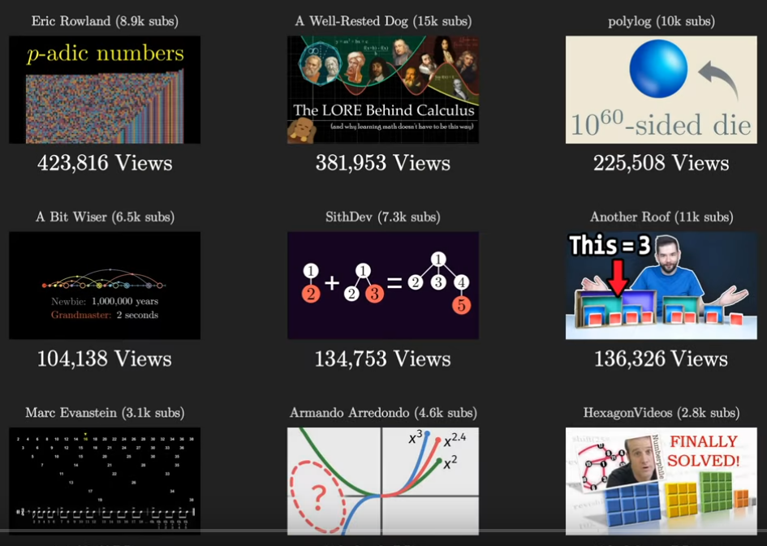

# 3Blue1Brown
Angelegt Sonntag 02 Oktober 2022

Videos, die 3Blue1Brown empfiehlt:

* [Summer of Math Exposition 2-Playlist – YouTube](https://www.youtube.com/playlist?list=PLnQX-jgAF5pTZXPiD8ciEARRylD9brJXU)
* Weitere, besonders empfehlenswerte, unter [Have you seen more math videos in your feed recently? (SoME2 results) – 3Blue1Brown (YouTube)](https://www.youtube.com/watch?v=cDofhN-RJqg)
	* ☑ [How to Take the Factorial of Any Number – Lines That Connec (YouTube)](https://www.youtube.com/watch?v=v_HeaeUUOnc&t=0s)
* [How are memories stored in neural networks? | The Hopfield Network #SoME2  – YouTube](https://www.youtube.com/watch?v=piF6D6CQxUw)
* ☑ [What A General Diagonal Argument Looks Like (Category Theory) – YouTube](https://www.youtube.com/watch?v=dwNxVpbEVcc)
* ☑ [Proofs & Goofs Ep1: Linear Programming #SoME2 – YouTube](https://www.youtube.com/watch?v=pLNZbykPDOA&list=PLnQX-jgAF5pTZXPiD8ciEARRylD9brJXU&index=215)
* ☑ [Introduction to Projective Geometry via Tic-Tac-Toe Grids #SoME2 – YouTube](https://www.youtube.com/watch?v=mTw3o8-xMIo&list=PLnQX-jgAF5pTZXPiD8ciEARRylD9brJXU&index=18)
* [The Shadowy World of Umbral Calculus – YouTube](https://www.youtube.com/watch?v=D0EUFP7-P1M&list=PLnQX-jgAF5pTZXPiD8ciEARRylD9brJXU&index=21)
* ☑ [Duality: magic in simple geometry #SoME2 – YouTube](https://www.youtube.com/watch?v=SWrWlgGJe3k&list=PLnQX-jgAF5pTZXPiD8ciEARRylD9brJXU&index=36)
* [How prime numbers protect your privacy #SoME2 – YouTube](https://www.youtube.com/watch?v=BScMvVH6U4E&list=PLnQX-jgAF5pTZXPiD8ciEARRylD9brJXU&index=93)

[./Mathe YouTube.png](./3Blue1Brown/Mathe YouTube.png)

