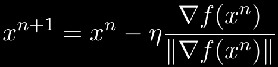
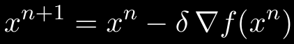

# Deep Learning
Angelegt Sonntag 13 November 2022

* Teilweise Zusammenfassung [./Deep Learning Architectures: A Mathematical Approach - Ovidiu Calin (Kommentare).pdf](./Deep_Learning/Deep Learning Architectures: A Mathematical Approach - Ovidiu Calin (Kommentare).pdf)
* Weitere Informationen:
	* [Informatik:**Backpropagation**]()
	* [Informatik:**Deep Learning with Python**]()
	* [Informatik:**Lexikon**]()
	* [Informatik:**Reinforcement Learning**]()

Allgemeines
-----------

* *Negative Likelihood function* für Dichte q: -l~q~(x) := -ln q(x) (negativer Logarithmus von q). Allgemeine Eigenschaften auf S46.
* Die Kostenfunktion ist glatt in W, b, dh. hält man Eingabe x und z = Φ(x) fest, kann man Kostenfunktion in den Argumenten w,b mit Gradientenabstieg minimieren

### Netztwerke als Funktionsapproximierer

* kapitelS. 16: Netzwerke mit wenigstens einer *versteckten Schicht* können praktisch alle Funktionen lernen/approximieren, wenn Daten aus Kompaktum stammen.
* x = Eingabe, y = Berechnete Ausgabe des Netzwerks, dh. f~w,b~(x), z = Wert der Zielfunktion an Stelle x, Φ(x) (im Allgemeinen unbekannt und nur durch Punkte, dh. Eingabedaten und Labels gegeben)
	* y=f~w,b~(x) abhängig von x, w (Gewichten) und b ([#bias](#Mathematik:Deep Learning))
* So gesehen entsprechen die Trainingsdaten, dh. Eingabe x und Labels z, Punkten der unbekannten und deswegen zu lernenden Funktion Φ, so wie (x, f(x)) = (x, y) Punkte eines 1d-Funktionsgraphen beschreiben. Die Gewichte sind dabei die Stellschrauben/Parameter (wie a,b,c in ax²+bx+c), um den vorgegebenen Punkten möglichst nahe zu kommen. Hat man gute Gewichte gefunden (und fixiert), hat man die Zielfunktion gefunden und kann nun das Netzwerk als Funktion verwenden, indem man Eingabedaten, bspw. Bilder abbildet.
* Für w*, b* := arg min~w,b~ C (die Werte von w, b an denen die [Kostenfunktion](#Mathematik:Deep Learning) C ihr Minimum annimmt)

⇒ Dieser Prozess wird *Learning*, bzw. *Lernen* genannt

#### Zufallsvariablen

* Es können auch Zufallsvariablen Z gelernt werden, dh. Eingabe ist Zufallsvariable und Ausgabe des Netzwerks, dh Y=f~w,b~(X) sind ZVen. Das habe ich aber noch nicht verstanden TODO

2 Activation Funktions
----------------------

* Für nicht lineare Funktionen benötigt man nicht-lineare Aktivierungsfunktionen (AF)

### Kapitel 2.1 Examples of Activation Functions

* Definitionen einiger AF, wie Heaviside-Funktion
* 3 Arten von AF:
	* Hockey-Schläger-Funktionen
		* Netzwerke mit ReLU lernen deutlich schneller (bei Bildern sogar besser) als mit einer „sättigenden“ AF wie sigmoid(x), logistic, hyperbolic tangent
		* ReLU, PReLU(α, x), ELU(α, x) (linear für x>0, negativ & exponential für x≤0, @differenzierbar für α=1), SELU(α, λ, x) := λ · ELU, SLU (Produkt aus linearer Funktion und sigmoid, evtl. besser als ReLU), softplus (glatte Variante von ReLU), ...
	* Sigmoid-Funktionen
		* sigmoid σ (glatt, symmetrisch, kann Sprungfunktionen beliebig genau approximieren, Sprungfunktionen werden gerne „als Schwellenwert“ verwendet, bildet ℝ auf (0, 1) ab, σ~c~'(x) = cσ~c~(1 − σ~c~(x), kann auf 2-Parameter erweitert werden), Inverse von sigmoid σ: logit, tanh = 2σ~2~ − 1 (tanh' = 1 − tanh², deswegen gut für Backpropagation, symmetrisch um den Ursprung ist Vorteil gegenüber sigmoid σ), softsign, ...
	* Glockenkurven-Funktionen („bumped-shaped“)
		* Gauß-Kurve, Doppele Exponentialfunktion (e^-λ|x|^)
* Klassifizierungsfunktionen (31), kommen also nur in der letzten Schicht zum Tragen:
	* softmax(x) = y mit y~i~ = e^x_i^/ ||e^x^|| (||e^x^|| = ∑e^x_i^), um 1-hot-encoded Vektor zu erreichen.
		* Man kann auch Parameter einbauen.
		* Glatte Version der Maximumsfunktion

### 2.4 Summary
The most common nonlinear activation functions used for neural networks are the standard logistic sigmoid and the hyperbolic tangent. Their differentiability and the fact that their derivatives can be represented in terms of the functions themselves make these activation functions useful when applying the backpropagation algorithm.

3 Cost functions
----------------

* Kostenfunktion gibt an, in welchem Sinne (L², euklidischer Abstand, etc.) die Zielfunktion z=Φ(x) approximiert werden soll. s. auch [Netztwerke als Funktionsapproximierer](#Mathematik:Deep Learning).
* Notation: C(w, b), um zu betonen, dass eigentlich die Entwicklung von C in Abhängigkeit von den Gewichten interessant ist, dh. man betrachtet im Allgemeinen y=f~w,b~(x) und z=Φ(x) als konstant und probiert dann w, b so zu wählen, dass C(w, b) für möglichst viele y=f~w,b~(x), z=Φ(x) minimiert wird.
	* Unter'm Strich ist C sehr wohl von y, z abhängig und man müsste eigentlich C(w, b, y, z) schreiben. Lässt man Letztere Weg werden sie als konstant oder „unwichtig“ angenommen (was auch immer das in dem jeweiligen Kontext heißen muss)

### 3.2 - 3.x Beispiele von Kostenfunktionen

* 3.2 Supremumsfunktion
* L²-Norm: glatt in w,b
	* Entspricht euklidischer Distanz (for allem für endliche Werte), dh. mit ihr berechnet man Distanz zwischen Ebene und Φ(x), die minimiert werden soll (S43)
* Mean Square Error: ist relativ beliebt, Gründe auf S44; gut, möchte man Zufallsvariablen lernen (C(w, b) = E[ (Y − Z)² ])

4 Finding Minima Algorithms
---------------------------

* Beim *Gradientabstieg* bewegt man sich auf *Niveaumengen* (*Level sets*). Wird in „4.2.1 Level Sets“ hergeleitet. Die Folge

liegt also immer auf der zu minimierenden Funktion, weil ∇f(x^n^) = ∇f∣~x^{n~} in dem Raum definiert ist, aus dem x^n^ stammt, s. [Mathematik#Allgemeines zu Ableitungen](../Mathematik.md).

* Da man sich immer auf Niveaumengen bewegt sind diese typischen Grafiken, die gezeichnet werden, je nachdem ob man eine große oder kleine Lernrate hat, auch richtig – Mir war davor immer nicht klar, warum man überhaupt wieder auf dem Graphen landen solle.

* Feste *Learning Rate* η kann dazu führen, dass man Minimum verpasst, deswegen Selbst-Justierende verwenden, die mit kleiner werdendem Gradienten ebfalls kleiner werden, also proportional zu diesem sind.

**Annahme**: ∃ δ>0: η~n~ = δ∥∇f(x^n^)∥, dann wird obige Folge zu
.
Mit dieser Annahme konvergiert die Folge, genau dann wenn ∇f(x^n^)→0, n→∞. Wie man das δ in der Praxis findet und ob es überhaupt existiert (man geht davon aus, dass es das tut für das obige Resultat), ist eine andere Frage.

B: Tensoren
-----------

* *Ordnung*: Anzahl der Dimensionen (in [:Python](): ``len(tensor.shape) == np.ndim(tensor)``)
* *Typ*: Dimensionstupel, bspw. d~1~×d~2~×d~3~, 3×3, ... (in [:Python](): ``tensor.shape``)
* Beispiele:
	* RGB-Bild: Tensor der Ordnung 3 vom Typ n×m×3

C: Measure Theory
-----------------

* s. auch [:Mathematik:**Maßtheorie**](./Maßtheorie.md)
* *p-System*: Teilmengensystem, das abgeschlossen unter Schnitten ist 

Bias
----

* In der Theorie wird der Bias subtrahiert, WX − b. Durch hinzunahme einer zusätzlichen Komponente mit x~n+1~ = −1 und analog für W, dh. erweitern um eine Spalte, sodass w~i,j+1~ = b~i~, erhält man X^*^ & W^*^ und wird die Subtraktion los: W^*^X^*^.

Fehler
------

* p. 24: "positive and linear for x > 4" ⇒ for x > 0
* p. 38: "for image-related tasks [90] and [45]." ⇒ tasks, see [90] and [45]. ("see" used everywhere else)
* p. 704: "This means that the mistakes that are negligible in the system ν [μ?], i.e., μ(A) = 0, also pass undetected by the system μ [ν?], i.e. ν(A) = 0." ⇒ In Remark C.7.2 may ν and μ be interchanged respectively.

Phänomen A ist x-verteilt, bspw. Poisson- oder Normalverteilt. x hat ein Maß P, bspw. das Poisson-Maß (das „Normalverteilungsmaß“ gibt es nicht). Möchte man jetzt irgendetwas über A wissen, muss man die Menge M entsprechend modellieren und in P einsetzen. Für P(M) kann man dann den Ausdruck verwenden oder das Integral über die entsprechende Dichte.

