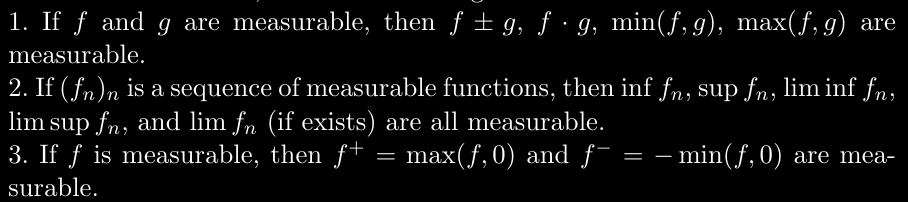
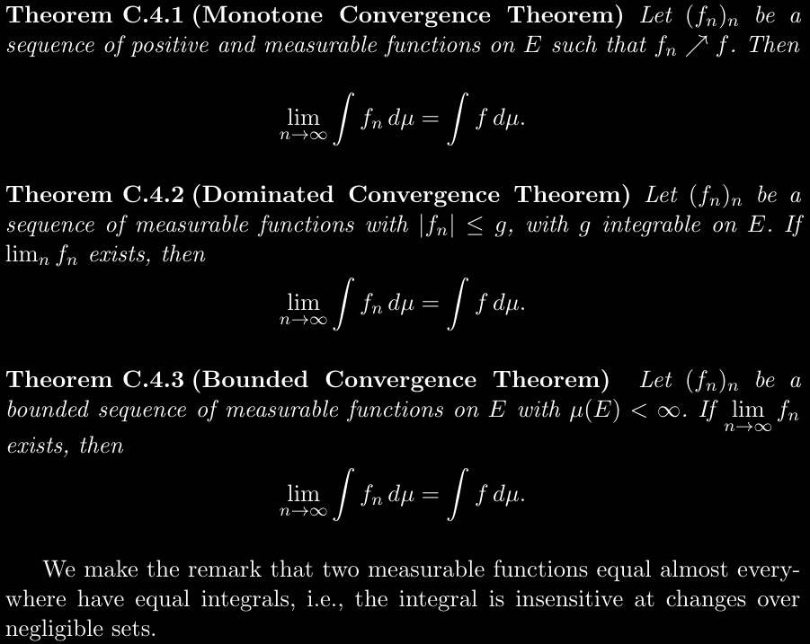
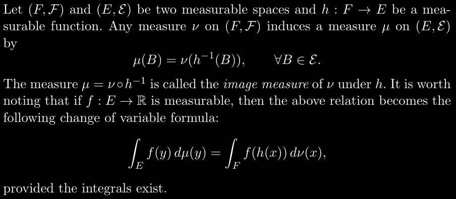

# Maßtheorie
Angelegt Donnerstag 17 November 2022

σ-Algebra
---------

* [id: deep-learnin-buch]Weitere Eigenschaften auf S698 in [Deep Learning Architectures: A Mathematical Approach-Springer − Ovidiu Calin (Kommentare).pdf (Link)](./Deep_Learning/Deep Learning Architectures: A Mathematical Approach-Springer − Ovidiu Calin (Kommentare).pdf)
* σ(C), C⊆A, beschreibt die kleinste σ-Algebra auf einer Grundemenge A, die C enthält und ist gegeben durch σ(C) := ⋂~α ~σ~α~.
	* Borel-σ-Algebra: Die σ-Algebra, die von von einer Topologie erzeugt wird, dh. σ(<Alle offenen Mengen>) (Konstruktion wie oben durch Schnitte)

Messbare Funktion
-----------------

* f: (A, σ) → ℝ messbar, wenn f^-1^[ (a,b) ]∈σ, dh. wenn Urbilder messbar sind.
* *einfache Funktion*: Linearkombination aus Indikatorfunktionen:

f: (A, σ) → B
f(x) := ∑~i=1~^n^ a~i ~· 1~A_i~ (x) mit A~i~∈σ

* Jede Funktion ist Grenzwert von Folge messbarer Funktionen

Maße und Maßräume
-----------------

* μ: (A, σ) → [0, ∞) mit 
	* μ(∅) = 0 (oder μ(A) = 1)
	* *σ-Additivität*: μ(⋃~n≥1~ A~n~) = ∑~n≥1~ μ(A~n~)
* (A, σ, μ) wird *Maßraum* genannt

### Eigenschaften von Maßen

* A ⋂ B = ∅ ⇒ μ(A ⋃ B) = μ(A) + μ(B) (*endlich additiv*)
* A⊆B ⇒ μ(A) ≤ μ(B) (*Monotonie*)
* A~n~ → A ⇒ μ(A~n~) → μ(A) für n→∞ (A~n~ → A „von innen“)
* μ(⋃~n~ A~n~) ≤ ∑~n~ μ(A~n~)
* weitere auf S701in [#deep-learnin-buch](#Mathematik:Maßtheorie)

Integration
-----------

* (A, σ, μ) Maßraum, f: (A, σ, μ) → ℝ messbar
* *Integral von f bzgl. μ*:

μ(f) := ∫~A~ f dμ := ∫~A~ f(x) μ(dx),
bzw. für ein B∈σ:
∫~B~ f dμ := ∫~A~ f · 1~A~ dμ = μ(f · 1~A~)
und im Allgemeinen gilt:
∫~B~ dμ = ∫~A~ 1~B~ dμ = μ(1~A~) = μ(A).

* μ(dx) hat im Vergleich zum Riemann-Integral keine so schöne Bedeutung mehr aber ist dennoch daran angelehnt. Man möchte damit suggieren, dass die infinitimalen Breiten/Grundflächen der Rechtecke/Quader nun mit μ gemessen und dann mit ihrer Höhe f(x) multipliziert werden.

### Wichtige Sätze zur Vertauschung von Integral und Limes

### Maßtheoretischer Transformationssatz

* Mithilfe von Bild-Maßen kann man den [:Mathematik#**Transformationssatz**](../Mathematik.md) auch maßtheoretisch formulieren:

∫~F~ f(h(x)) dν(x) = ∫~F~ f(h(x)) dμ∘h(x) = ∫~F~ f(h(x)) · |det( h'(x) )| dμ(x),
indem man dμ∘h(x) „differenziert“, also „innere Ableitung mal äußere Ableitung“, was h'(x) · dμ(x) ergibt.
h'(x) packt man aus Konsistenzgründen in |det(·)|, s. dazu [:Mathematik#**Transformationssatz**](../Mathematik.md).

