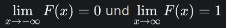

# Wahrscheinlichkeitstheorie
Angelegt Dienstag 17 Mai 2022

Wahrscheinlichkeitsverteilung
-----------------------------

* [Wahrscheinlichkeitsmaß/Wahrscheinlichkeitsverteilung − Wikipedia](https://de.wikipedia.org/wiki/Wahrscheinlichkeitsma%C3%9F)
* Wird auch *Wahrscheinlichkeitsmaß* genannt
* Tritt entweder als W-Maß, s. [Mathematik:Maßtheorie#maße-und-maßräume](./Maßtheorie.md), gegeben oder per [#dichte](#Mathematik:Wahrscheinlichkeitstheorie)
* [Informatik:Lexikon#**crossentropy**]() berechnet Abstand zwischen zwei Wahrscheinlichkeitsverteilungen in Form ihrer Dichten

Verteilungsfunktion
-------------------

* F(x) := μ((-∞, x)) wird [Verteilungsfunktion − Wikipedia](https://de.wikipedia.org/wiki/Verteilungsfunktion) genannt.
* Jeder *Verteilungsfunktion* (s. [Maßtheorie#verteilungsfunktion-definition](./Maßtheorie.md)) kann eine [Wahrscheinlichkeitsmaß/Wahrscheinlichkeitsverteilung − Wikipedia](https://de.wikipedia.org/wiki/Wahrscheinlichkeitsma%C3%9F) zugeordnet werden und umgekehrt auch.

⇒ [Korrespondenzsatz (Stochastik) − Wikipedia](https://de.wikipedia.org/wiki/Korrespondenzsatz_(Stochastik)).

* Mit ihm kann man praktisch folgern, dass eine *Wahrscheinlichkeitsverteilung*/*Wahrscheinlichkeitsmaß* ein reellwertiges Analogon hat und mit diesem weiterarbeiten (ohne dass man ggf. weiß, wie es genau aussieht).
* Mit Hilfe des *Korrespondenzsatzes* kann man *Wahrscheinlichkeitsverteilungen*/*Wahrscheinlichkeitsmaße* leichter untersuchen, da man diese in die Welt der reellwertigen Funktionen übersetzen kann. Man kann also auf Methoden der Maßtheorie verzichten und die der reellen Analysis anwenden.
* Man kann mit ihm durch Vorgabe einer komplexen *Verteilungsfunktion* wiederum komplexe *Wahrscheinlichkeitsverteilungen*/*Wahrscheinlichkeitsmaße* konstruieren.

* [id: verteilungsfunktion-definition]*Verteilungsfunktionen* erfüllen im Allgemeinen folgende Eigenschaft:
	* monoton wachsend
	* rechtsstetig
	* 

dh. Funktionen, die diese Eigenschaften haben, sind im allgemeinen *Verteilungsfunktionen*. Per F(x) := μ((−∞, x)) wird erstmal einfach eine Funktion definiert, die, wenn man es nachrechnet, die obigen Eigenschaften hat und dann die *Verteilungsfunktion von μ* darstellt.

* *Verteilungsfunktionen* erfüllen auch den Sinn, dass mit ihnen leichter rechnen kann. Für eine Wahrscheinlichkeit muss man dann kein Integral für P(a≤X≤b) bestimmen, sondern nur F(a)-F(b) berechnen.

Dichte
------
Eine Dichte ist eine Funktion, die ein Maß μ im Kontext eines anderen Maßes ν beschreibt. Sie übersetzt sozusagen das eine Maß in das andere. Über Dichten können auch Maße definiert werden. Eine Dichte wird also immer im Kontext eines Maßes μ bzgl des zweiten Maßes ν angegeben (wobei μ aber noch öfter ν unterdrückt werden).
Bsp: Die Körpergröße folgt der Normalverteilung. Ein Maß, bzw. Maßraum, der das beschreibt wäre relativ abstrakt. Um dies zu beheben gibt es die Glockkurve, die die Dichte der Normalverteilung bzgl. des Lebesgue-Maßes darstellt. Mit dieser Funktion kann man besser arbeiten, da sie auf ℝ definiert ist

Zentraler Grenzwertsatz
-----------------------

* Vereinfacht: Die Summe S~n~ von unabhängigen und identisch verteilten Zufallsvariablen mit EW μ und Standardabweichung σ konvergiert gegen die Normalverteilung N(nμ, nσ²), bzw. konvergiert

( S~n~ - nμ ) / ( σ √n ) → N(0, 1)
S~n~ := ∑~i=1~^n^ X~i~

* Ich glaube, der Zentrale Grenzwertsatz kann auch für ZVen mit verschiedenen Verteilungen definiert werden

### Interpretationen

* Wenn viele Faktoren additiv einwirken (bspw. auf Toleranzen in der Fertigung), man aber keine Ahnung hat, **wie genau** sie verteilt sind, kann man dennoch Schlüsse über das Resultat ziehen, da sich die Summe der Faktoren annährend normalverteilt verhält.

### Grenzwertsatz von Moivre-Laplace

* Spezialfall vom [#zentraler-grenzwertsatz](#Mathematik:Wahrscheinlichkeitstheorie) für binomialverteilte ZV.
* Mit diesem kann man Binomialverteilungen B(n, p) mithilfe der Normalverteilung N(np, √(np(1-p))) berechnen, da B(n, p) → N(np, √(np(1-p))) für n→∞

