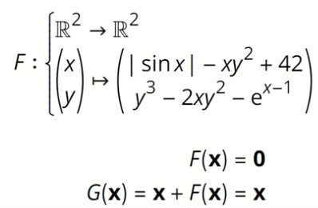

# Weitz
Angelegt Samstag 26 März 2022

[Was sind Distributionen?](https://www.youtube.com/watch?v=J8Gfq11eBlY) ← Dieses Video ist sehr interessant!

* Integralnotation bei Testfunktionen ist nur Notationsmissbrauch! Wird in Video genauer erklärt! Die Dirac-Distribution liefert einfach den Funktionswert an der Stelle 0, Integral hin- oder her.
* Wenn man Funktionen verallgemeinert, möchte man so viele Eigenschaften wie möglich retten. Im Zuge dessen die Eigenschaft Zahlen auf Zahlen abzubilden, scheitert man aber.
	* Beispiel: Raum der quadratintegrierbaren Funktionen L². Dessen Elemente sind Äquivalenzklassen von Funktionen, und eine Äquivalenzklasse kann keine Zahlen abbilden. Hier ist diese Eigenschaft also schon verlorengegangen (Beim Integrieren behandelt man sie aber weiterhin wie Funktionen).

[Integrale sind kontinuierliche Summen](https://www.youtube.com/watch?v=_GTbrbv4-qk)
[Lebesgue-Integral versus Riemann-Integral](https://www.youtube.com/watch?v=uUkDdz48myo)
[Integration durch Substitution](https://www.youtube.com/watch?v=geJ-36mnZ1I)

Warum Fixpunkte interessant sind
--------------------------------
Gleichungssysteme (vor allem mit {gewöhnlichen, partiellen} Differentialgleichungen sind oft mit dem Finden von Nullstellen zu lösen.

Wie man oben sieht, kann man durch Addition von x eine neue Funktion G(x) definieren und kann, wenn man über die Existenz von Fixpunkten bescheid weiß, auch Aussagen über die Nullstellen treffen.
Das Finden einer NST von F ist damit äquivalent zum Finden eines Fixpunktes von G.

