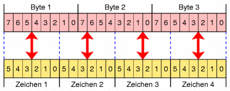
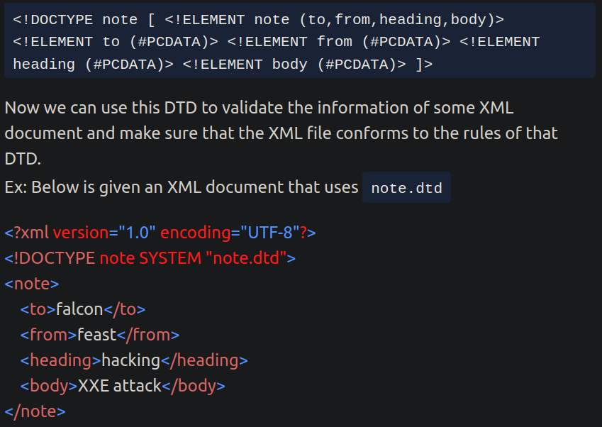
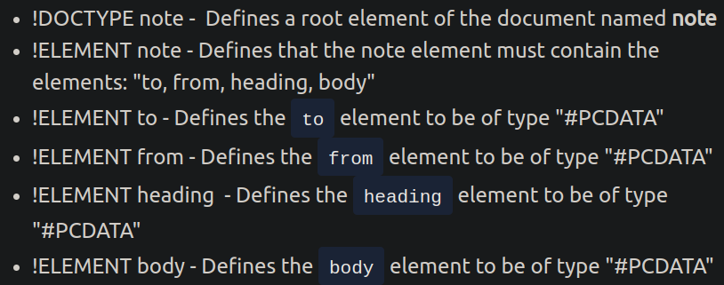
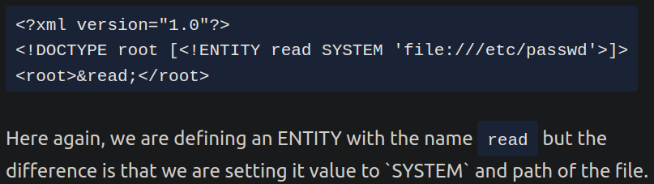

# Programmieren
Angelegt Samstag 23 Juli 2022

LISP
----
Listen sind eigentlich cons-Zellen:
	(list 3 4) == (cons 3 (cons 4 nil))

<https://www.youtube.com/watch?v=EyhL1DNrSME>
<https://github.com/norvig/paip-lisp>

Big und Little Endian
---------------------

* Geben an, ob das niederwertigste Byte am Anfang oder am Ende stehen
* **Ende = Links**, da die Zahl von rechts nach links verarbeitet/gelesen wird!
* Im Beispiel wird die Ganzzahl ``16.909.060`` als 32-Bit-Integer-Wert gespeichert (hexadezimal: ``01020304``~``h``~)
* *Litte Endian* wird heutzutage hauptsächlich im ``x86``-Kontext verwendet

### Little Endian

* Das niederwertigste Byte steht am „Ende“ (s. oben)
* ``16.909.060`` = ``0x 04 03 02 01`` = ``01``~``h``~``02``~``h``~``03``~``h``~``04``~``h``~
* Bezeichnet das Ende der Zahldarstellung, das als erstes genannt wird (das „Kleine“)
* entspricht dem umgedrehten alltäglichen Zahlenaufbau, bzw. Tag:Monat:Jahr
* bessere Bennenung: „Little Startian“, weil die Zahl mit dem niederwertigen Byte startet
* Gut für Addition, Subtraktion & Multiplikation, da diese Operationen „hinten“, dh. an der kleinsten Stelle einer Zahl, starten und die Zahl also in der kanonischen Verarbeitungsrichtung gespeichert wird
* Division, Vergleich dagegen langsamer, diese starten vorne

### Big Endian

* Das höchstwertige Byte steht am „Ende“ (s. oben); entspricht dem natürlichen Zahlenaufbau
* ``16.909.060`` = ``0x 01 02 03 04`` = ``01``~``h``~``02``~``h``~``03``~``h``~``04``~``h``~
* Bezeichnet das Ende der Zahldarstellung, das als erstes genannt wird (das „Große“)
* entspricht dem alltäglichen Zahlenaufbau, bzw. Stunde:Minute:Sekunde
* bessere Bennenung: „Big Startian“, weil die Zahl mit dem höchstwertigen Byte startet
* Addition, Subtraktion & Multiplikation langsamer, da diese Operation an der kleinsten Zelle einer Zahl starten. Die Position zum Lesen der Zahl muss also davor (um ``#Bytes−1``) verschoben werden
* Division, Vergleich schneller, da diese mit dem höchstwertigen Byte starten
* leichter zu lesen, da Zahl in natürlicher Leserichtung gespeichert wird

# bash
Angelegt Freitag 28 Oktober 2022

``for``-Schleife
----------------

* Java-Syntax für for-Schleifen  (müsste auch bei if & while funktionieren)

	for ((i=0; i<10; i++)); do COMMAND; done

	for i in {0..10}; do COMMAND; done

* ``for``-Schleife für Verzeichnisse oder bestimmte Dateien

	for file in *; do COMMAND; done
			#führt COMMAND für alle Dateien im aktuellen Verzeichnis aus
	for file in "*".pdf; do COMMAND; done
		# führt COMMAND für alle Dateien, die auf ".pdf" enden, aus
		#(Formatierung ggfl wie für >find<)
	
			

# Encoding
Angelegt Montag 31 Oktober 2022

* Auch wenn verschiedene Kodierungen auf den ersten Blick „gleich“ aussehen, dh. sie wandeln irgendetwas in Zahlen/Text, sind sie es **nicht**. Jede Kodierung wurde für ein bestimmtes Anwendungsszenario und verschiede Voraussetzungen konzipiert, s. auch: [why-do-we-use-base64 − stackoverflow](https://stackoverflow.com/questions/3538021/why-do-we-use-base64) für *ASCII* und *Base64*. Am besten wäre es natülich, man einige sich auf eine/ein paar wenige Kodierung und alles ist klar aber so funktioniert die Welt nicht.
	* *ASCII* (7 Bits pro Character): Man startet mit Text und wandelt ihn in Zahlen
	* *Base64*: Man startet mit Folge von Bytes und wandelt sie in eine Folge von Bytes, die nur *ASCII*-Zeichen verwendet, um

Base64
------

* Enthält nur alphanumerische Zeichen, dh. [id: base64-zeichen]``[A-Za-z0-9+/]*`` und ``=`` (am Ende als Padding, falls nicht sauber durch 3 dividiert werden kann, s. [unten](#Programmieren:Encoding)), weil diese Zeichen in keinem System „falsch“ interpretiert werden können, wie bspw ``\n`` oder „file endings“.

⇒ *Base64* eignet sich gut für den Datenaustausch

* [id: base64-rechnung]3 Byte = 24 Bit werden dabei in vier 6 Bit-Blöche aufgeteilt und dann in eines der [obigen Zeichen](#Programmieren:Encoding) transferiert (s. [Base64-Zeichensatz − Wikipedia](https://de.wikipedia.org/wiki/Base64#Base64-Zeichensatz))

* *Base64*-Encoding per Konsole:

	echo 'Hallo' | base64 # SGFsbG8K
	echo 'SGFsbG8K' | base64 -d # Hallo

# Markdown
Angelegt Sonntag 27 Februar 2022

[./Markdown.pdf](./Programmieren_files/Programmieren/Markdown/Markdown.pdf)

# regex
Angelegt Montag 06 Juni 2022

* Sehr ausführliche Dokumentation: <https://www.regular-expressions.info/tutorial.html>
* [Regex üben − regexr.com](https://regexr.com/)
* [Regular Expression – Wikipedia](https://en.wikipedia.org/wiki/Regular_expression)
* [what-is-a-non-capturing-group-in-regular-expressions − stackoverflow](https://stackoverflow.com/questions/3512471/what-is-a-non-capturing-group-in-regular-expressions)

Aus: [Regular Expression HOWTO – Python-Doku](https://docs.python.org/3/howto/regex.html)

* ``\w  ``Alphanumerische Zeichen, ``\w == [a-zA-Z0-9_]``
	* Alle Wörter: ``\w*``
* ``\W  ``Invertiert ``\w``, dh. alles **ohne** alphanumerische Zeichen, dh. Sonderzeichen wie ``=``, ``\``, ``.``, ``{``, etc., ``\W == [^a-zA-Z0-9_]``
* ``\d  ``Zahl, ``\d == [0-9]``
* ``\D  ``invertiert ``\d``, dh. alles ohne Zahlen, ``\d == [^0-9]``
* ``\s  ``Leerzeichen, Tabulatoren („White spaces“, also „weißem Raum“, dh Feldern in Monospace-Schriftarten, die „leer“ sind und deswegen „weiß“ erscheinen, weil auf weißem Grund geschrieben wird), ``\s == [ \t\n\r\f\v]``
* ``\S  ``Invertiert ``\s``, dh keine Leerzeichen, Tabulatoren bzw. „Weißraum“, also einfach alle Zeichen, sozusagen „``\w`` + Sonderzeichen“, ``\S == [^ \t\n\r\f\v]``
* ``.  ``Alle möglichen Zeichen
* ``^  ``invertiert Nachfolgendes innerhalb ``[...]``, wenn an **erster** Stelle, bspw. ``[^0-9]`` ist alles **außer** eine Zahl
	* Steht es nicht an der ersten, dann wird es als normales Zeichen behandelt

Look Arounds
------------
[Look Arounds – regular-expressions](https://www.regular-expressions.info/lookaround.html)
**Look Arounds** sind dazu da ein Muster unter Randbedingungen zu finden. Möchte man bspw. in einem „Suchen und Ersetzen“-Szenario alle „``\\onehot{} vector(?=(\.| ))``“ („vector“ gefolgt von „.“ oder „Leerzeichen“) durch „``\\onehot``“ ersetzen, würde man mit einer Suche, die „``.``“ oder „Leerzeichen“ inkludiert auch dieses Zeichen ersetzen und bräuchte zwei Schritte (einmal für „``.``“, einmal für „Leerzeichen“). Mit Look Arounds geht's in einem, weil der Teil innerhalb von ``(?=...)`` nicht bei der Suche markiert wird.
Allgemeine Syntax:
``MUSTER(?...)`` (Runde Klammern mit Fragezeichen

### Look Ahead
Syntax:
``MUSTER(?(=|!)MUSTER)`` (Runde Klammern mit ``?`` gefolgt von ``=`` od. ``!``)

* **negativ** „``q`` nicht gefolgt von ``u``“: ``q(?!u)``

Eselsbrücke: Ist das, was dem ``q`` folgt „nicht u (``!u``)“? Das ``!`` negiert of Ausdrücke, bspw. ``!true == false``, so auch hier: ``q`` nicht gefolgt von ``u``

* **positiv** „``q`` gefolgt von ``u``“: ``q(?=u)``

Eselsbrücke: Ist das, was dem ``q`` folgt „gleich ``u`` (``=u``)“?

### Look behind
Syntax:
``MUSTER(?<(=|!)MUSTER)`` (Runde Klammern mit ``?<`` gefolgt von ``=`` od. ``!``)
Rest wie bei „Look Ahead“

### Beispiele

* ``ADP(?=.*\n\d*\s*\w*\s*\w*\s*VERB)  ``markiert alle ``ADP`` in einer ``coNLL-U``-Datei, wenn das Wort danach vom Typ ``VERB`` ist („danach“ ist im Sinne einer ``coNLL-U``-Datei zu verstehen, die Tabellen-artig aufgebaut ist.

Etwas allgemeiner: ``NOUN(?=.*\n\d*\s*.*\s*.*\s*ADP)``, da auch „``_``“ als Tabelleneintrag zugelassen ist.

# z Diverses
Angelegt Freitag 28 Oktober 2022

XML
---

* Man kann die zu verwendeten Tags in einer ``xml``-Datei in einer dazugehörigen ``dtd``-Datei (``dtd`` = Document Type Definition) definieren und ihre Abhängigkeiten darstellen

* Man kann per ``XML`` Dateien auslesen: ``ENTITY`` definieren (hier ``read``), ihren Wert auf ``SYSTEM`` & ``DATEIPFAD`` setzen

