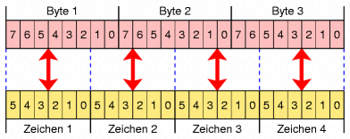

# Encoding
Angelegt Montag 31 Oktober 2022

* Auch wenn verschiedene Kodierungen auf den ersten Blick „gleich“ aussehen, dh. sie wandeln irgendetwas in Zahlen/Text, sind sie es **nicht**. Jede Kodierung wurde für ein bestimmtes Anwendungsszenario und verschiede Voraussetzungen konzipiert, s. auch: [why-do-we-use-base64 − stackoverflow](https://stackoverflow.com/questions/3538021/why-do-we-use-base64) für *ASCII* und *Base64*. Am besten wäre es natülich, man einige sich auf eine/ein paar wenige Kodierung und alles ist klar aber so funktioniert die Welt nicht.
	* *ASCII* (7 Bits pro Character): Man startet mit Text und wandelt ihn in Zahlen
	* *Base64*: Man startet mit Folge von Bytes und wandelt sie in eine Folge von Bytes, die nur *ASCII*-Zeichen verwendet, um

Base64
------

* Enthält nur alphanumerische Zeichen, dh. [id: base64-zeichen]``[A-Za-z0-9+/]*`` und ``=`` (am Ende als Padding, falls nicht sauber durch 3 dividiert werden kann, s. [unten](#Programmieren:Encoding)), weil diese Zeichen in keinem System „falsch“ interpretiert werden können, wie bspw ``\n`` oder „file endings“.

⇒ *Base64* eignet sich gut für den Datenaustausch

* [id: base64-rechnung]3 Byte = 24 Bit werden dabei in vier 6 Bit-Blöche aufgeteilt und dann in eines der [obigen Zeichen](#Programmieren:Encoding) transferiert (s. [Base64-Zeichensatz − Wikipedia](https://de.wikipedia.org/wiki/Base64#Base64-Zeichensatz))

* *Base64*-Encoding per Konsole:

	echo 'Hallo' | base64 # SGFsbG8K
	echo 'SGFsbG8K' | base64 -d # Hallo

