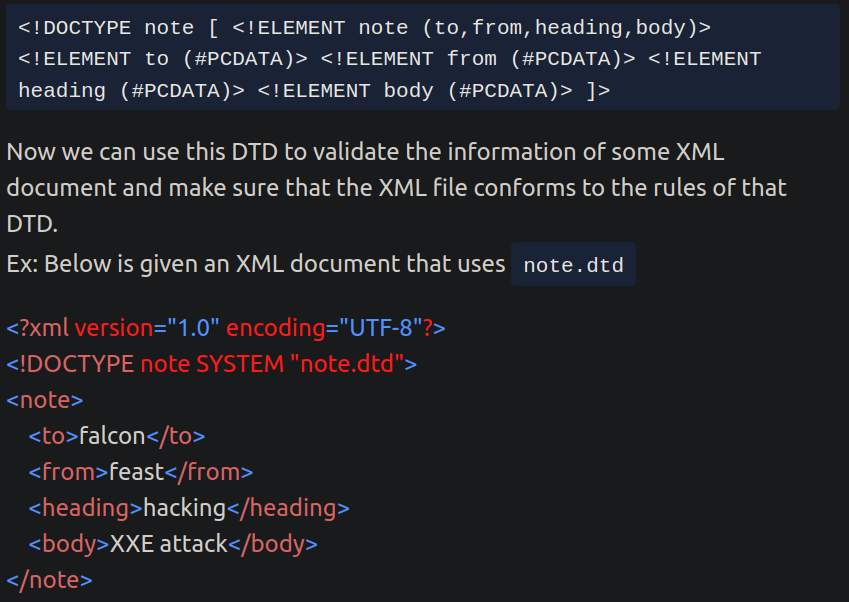
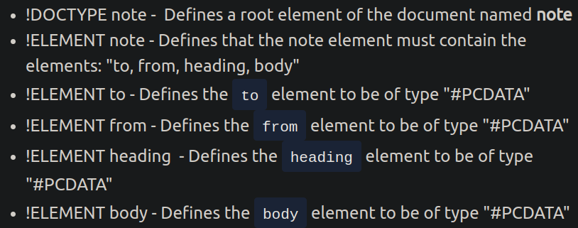
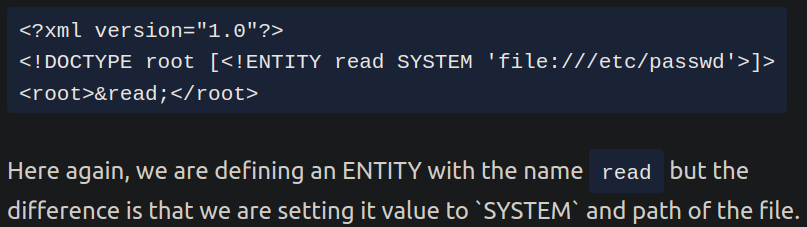

# z Diverses
Angelegt Freitag 28 Oktober 2022

XML
---

* Man kann die zu verwendeten Tags in einer ``xml``-Datei in einer dazugehörigen ``dtd``-Datei (``dtd`` = Document Type Definition) definieren und ihre Abhängigkeiten darstellen

* Man kann per ``XML`` Dateien auslesen: ``ENTITY`` definieren (hier ``read``), ihren Wert auf ``SYSTEM`` & ``DATEIPFAD`` setzen

