# Python
Angelegt Freitag 14 Januar 2022

* [Python-Tutorial – python-Doku](https://docs.python.org/3/tutorial/)
* [Match-Statement (Pattern Matching, switch-case) – python-Doku](https://docs.python.org/3/tutorial/controlflow.html#match-statements)
	* [PEP 636: Match-Statement – python-Doku](https://peps.python.org/pep-0636/)

Interessant
-----------

* <https://automatetheboringstuff.com/#toc>
	* <https://automatetheboringstuff.com/2e/chapter12/>
	* Es gibt auch andere Bücher („Hack secret ciphers with python“ oder so ähnlich)
* [Python Popular Recepies – code.activestate.com](https://code.activestate.com/recipes/langs/python/)

Optionen
--------
``-c "<SKRIPT>"  ``Führt ``<SKRIPT>``, bspw. ``"a = 5 + 7; print(a)"`` aus
``-m  ``Startet Skript als Modul (TODO Was genau ein Modul ist, weiß ich nicht)
[id: python-http-server]Starte einfachen ``HTTP``-Server in/auf einem Verzeichnis.
	cd DIR
	sudo python3 -m http.server 80
	
Man kann nun per [:Linux:**wget**](#Linux:wget) oder [:Linux:**curl**](#Linux:curl) ``HTTP``-Anfragen stellen, bspw. Dateien aus diesem Verzeichnis herunterladen. Hilfreich, wenn man eine Datei auf Zielrechner hochladen möchte, wie bei [Linux:TryHackMe:**Reverse & Bind Shells#socat**](#Linux:TryHackMe:Reverse & Bind Shells).
@itsicherheit

pip
---
@pip @python @virtualenv

* **Im Folgenden wird angenommen, dass alle Befehle innerhalb einer (aktiven) „Virtual Enviornment“ aufgerufen werden**
* auch „Virtual Enviornment“
* Ist eine **virtualenv** aktiv, werden die per ``pip`` installierten Module in den Ordner der **virtualenv** installiert bzw. dort gespeichert

### Installation
``sudo apt-get install python3-pip``
Wird, glaube ich, automatisch mit
``sudo apt-get install python3-venv``
(s. „Virutal Enviornment“) installiert.

### Verwendung

* Modul installieren: ``pip3 install [MODUL ...]``
* Modul deinstallieren: ``pip3 uninstall [MODUL ...]``
* Alle installiereten Module auflisten: ``pip3 list``
* Infos über ein Modul anzeigen: ``pip3 show MODUL``
* ``pip freeze > requirements.txt``
	* ``pip freeze | grep MODUL >> requirements.txt``
* ``pip install -r DATEI`` installiert alle in ``DATEI`` gelisteten Module

#### Weitere Verwendungen

* Modul direkt aus **gitlab** oder **github** installieren: ``pip3 install --user https://github.com/pallets/jinja/archive/master.zip``

### Quellen

* [UbuntuUsers/pip](https://wiki.ubuntuusers.de/pip/)

Module
------

* [tqdm](https://pypi.org/project/tqdm/): Printet Fortschrittsanzeige für Schleifen

Virtual Enviornment
-------------------
@virtualenv @python @pip

* [venv – UbuntuUser](https://wiki.ubuntuusers.de/venv/)
* Um Module Projekt-abhängig zu installieren und zu verwalten, bieten sich **virtual enviornments** an. Diese können auch direkt in PyCharm verwendet werden. Alle virtualenvs sollten im Ordner [~/.virtualenvs/](file:///home/philipp/.virtualenvs) gespeichert werden

### Installation
``sudo apt-get install python3-venv``

### Verwendung

* Anlegen: ``python3 -m venv ~/.virtualenvs/<VIRTUAL_ENV>``
* Aktivieren: ``source ~/.virtualenvs/<VIRTUAL_ENV>/bin/activate``
* Deaktivieren: ``deactivate`` (egal wo, geht immer) oder Terminal mit ``exit`` beenden
* Löschen: ``[sudo] rm -r ~/.virtualenvs/<VIRTUAL_ENV>/``

# Collections
Angelegt Freitag 03 Juni 2022

<https://docs.python.org/3/library/collections.html>

# Counter
Angelegt Freitag 03 Juni 2022

<https://docs.python.org/3/library/collections.html#collections.Counter>

# Diverses
Angelegt Dienstag 01 März 2022

Immer wieder einen Blick wert: <https://www.youtube.com/watch?v=qUeud6DvOWI>
Hier steht irgendetwas zum Überladen: [./python.txt](./Python_files/Python/Diverses/python.txt)

Unterseiten
-----------

* [Bytes](#Python:Diverses:Bytes)
* [CSV](#Python:Diverses:CSV)
* [regex](#Python:Diverses:regex)

Diverses
--------

* Shell-Befehle in Python: gute [Stackoverflow-Antwort](https://stackoverflow.com/questions/4760215/running-shell-command-and-capturing-the-output)

	import subprocess
	subprocess.run(["ls", "-l"])

* Mehr Details auch in Bezug auf ``stdout`` in der Antwort oben.
* Soweit wie möglich **nicht**

	subprocess.Popen("ls -l", shell=True)

verwenden, da dann der Befehl in der Shell ausgeführt wird, was vor allem im Zusammenspiel mit Nutzereingaben ein Sicherheitsrisiko darstellt @sicherheit @itsicherheit

* In ``REPL``-Umgebung kann man per ``_`` auf die letzte „Ausgabe“ zurückgegriffen werden:

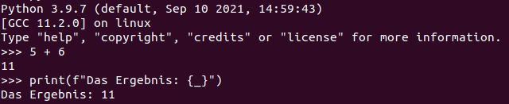

* [numpy – MeinWiki](#Python:Module:numpy)-Arrays werden bei Funktionsaufrufen mit **Call by Reference** behandelt.
* Man kann Klassen „umbennen“:

	MoreWords = FirstModel
	x = MoreWords()  # type(x) == FirstModel

* Über Dateien in Verzeichnis iterieren ([how can i iterate over files in a given directory – StackOverflow](https://stackoverflow.com/questions/10377998/how-can-i-iterate-over-files-in-a-given-directory)):

	import os
	directory = os.fsencode(directory_in_str)
	for file in os.listdir(directory):
		filename = os.fsdecode(file)
		...

* ``shebang`` für ``python3``:

``#!/usr/bin/env python3``

Objekte speichern
-----------------
Das geschieht per [pickle – Python-Doku](https://docs.python.org/3/library/pickle.html) (muss nicht extra importiert werden). Dieses Protokoll/Modul händelt den Austausch von Python-Objekten zwischen Prozessen. Dadurch können Objekte auf der Festplatte gespeichert oder beim Verteilten Rechnen ausgetauscht werden.
Wenn man ein Objekt „unpicklet“ führt man den Code, den es enhält aus, ähnlich der ``eval()``-Funktion auf String-Instanzen. Das kann Sicherheitslücke darstellen.

* ``pickle.dump(<OBJEKT>)`` Serialisierung
* ``pickle.load(<BINÄRDATEN>)`` Deserialisierung, ``<BINÄRDATEN>`` ist bspw. eine per '``b``' geöffnete Datei oder ein ``b``-String wie ``b'…``'
* ``pickle`` ist eine Stack-Sprache, dh. man kann mit bestimmten Befehlen einen Stack auf-, abbauen und die in ihm enthaltenen Informationen ausführen. Genaueres unter [./Sour Pickles − Marco Slaviero.pdf,](./Python_files/Python/Diverses/Sour Pickles − Marco Slaviero.pdf,) s. S. 14 für die Befehle. @itsicherheit
* Für das Ausnutzen als Sicherheitslücke, s. [:Linux:IT-Sicherheit:**pickle (python)**](#Linux:IT-Sicherheit:pickle (python)) 

### Beispiel
Das Beispiel habe ich in abgewandelter Form in der ``main.py`` meiner Masterarbeit verwendet (10.06.2022: Inzwischen gelöscht).
	picklefile_name = "object.pkl"
	obj = MyObject()
	if os.path.isfile(picklefile_name):
	    print("Lade Objekt...")
	    # LADEN; byte-Modus ist wichtig
	    with open(picklefile_name, "rb") as picklefile:
	        obj = pickle.load(picklefile)
	else:
		# Speichern; byte-Modus ist wichtig
	    with open(picklefile_name, "wb") as picklefile:
	        pickle.dump(obj, picklefile)

Getter und Setter (property)
----------------------------
	class A:
		self._a = 1
		
		@property  # Getter
		def a(self):
			return self._a
		
		@a.setter  # Setter
		def a(self, value):
			self._a = value

Mengen in python
----------------
[set – Python-Doku](https://docs.python.org/3/library/stdtypes.html#set)
Vereinigung
	s = {1, 2, 3}
	s = s | {4}  # s = {1, 2, 3, 4}
	s.add(5)  # s = {1, 2, 3, 4, 5}

* Scipy evtl Scikit parallele Programmierung: <https://scipy-cookbook.readthedocs.io/items/ParallelProgramming.html>

Generatoren
-----------

* Wenn Generator erschöpft ist, wird eine Exception geworfen, deswegen ``try-except``-Konstruktion beim „iterieren“ verwenden
* Schlüsselwort: ``yield`` (statt ``return`` im Vergleich zu Funktionen)
* Generator-Comprehension:

	gen = (i for i in range(10))
	

print-Funktion
--------------
Einige Beispiele zum Umgang mit der ``print``-Funktion

### Listen
Listen kann man per
	print(*my_list, sep="\n")

schön printen, da jedes Element in neue Zeile gesetzt wird.

### f-Strings
<https://www.youtube.com/watch?v=BxUxX1Ku1EQ>
		variable=4
		print(f"variable={variable}") # variable=4
		print(f"{variable=}")  # variable=4
		# Leerzeichen werden erhalten
		print(f"{variable = }")  # variable = 4

#### Formatierung
Ein ``:`` formatiert abhängig vom Datentyp, geht bspw. auch mit Datums- & Zeitangaben.
		val = 3.1415926
		print(f"{val:.4f}")  # 3.1416; mit Runden

Man kann eigene Formatierungen für eine Klasse festlegen: Dazu muss man die Methode ``__format__(self, format_spec)`` überschreiben. Ruft man dann ``f"{myInstance:<format>}"`` auf, wird ``<format>`` in format_spec gespeichert

#### !a, !r & !s
		print(f"{variable!r}")  # !r ruft repr() auf, bei Strings werden diese mit ' geprintet format 
		print(f"{variable!a}")  # !a printet alles in ASCII-Zeichen

* ``!s`` kann irgendwie mit eigener Formatierung verwendet werden

name
----
Name des Moduls?
Führt man Skript aus, dann
	print(__name__)  # __main__

Importiert man Skript, dann
	import myScript
	print(__name__)  # myScript

OCR (Schrifterkennung in Bildern)
---------------------------------
Bild zu Text
<https://www.youtube.com/watch?v=HkG3oBhi0zc>
<https://pypi.org/project/pytesseract/>

# Bytes
Angelegt Mittwoch 23 Februar 2022

* Byte-Strings sind ``immutable``, man kann sie also nicht in situ verändern. Eine modifizierbare Variante bietet [bytearray – Python-Dokumentation](https://docs.python.org/3/library/stdtypes.html#bytearray-objects).

Byte/Hex zu int
---------------

* Iteriert man über ein ``b"…"``-Objekt erhält man ein Integer, bzw. speichert man sich ein einzelnes Element ab (s. unten), ist es ein Integer

	padded_string: bytes = b"ICE ICE BABY\x04\x04\x04\x04"
	last: int = padded_string[-1]  # last = 4

Möchte man dagegen das ``Byte``–Objekt, kann man mit ``Slices`` arbeiten, dh.
	last_as_byte = padded_string[i:i+1]
.

# CSV
Angelegt Freitag 04 März 2022

Internet: [CSV – python-Dokumentation](https://docs.python.org/3/library/csv.html)
Datei: [./csv — CSV File Reading and Writing — Python 3.10.2 documentation.html](./Python_files/Python/Diverses/CSV/csv — CSV File Reading and Writing — Python 3.10.2 documentation.html)

* Man kann Reihen einzeln schreiben ``writerow`` oder als ``Iterable`` per ``writerows``

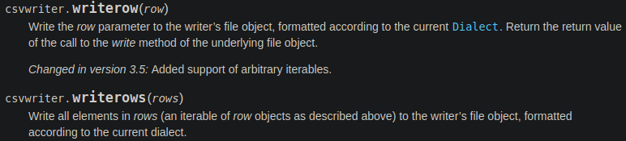
Für ``writerows`` bieten sich ``Generatoren`` an.

# Cython
Angelegt Freitag 27 Mai 2022

<https://cython.readthedocs.io/en/latest/index.html>

# regex
Angelegt Freitag 04 März 2022
@regex

19. auch [grep – MeinWiki_Linux](#Linux:grep)

Internet: [regex – python-Dokumentation](https://docs.python.org/3/howto/regex.html)
Datei: [./Regular Expression HOWTO — Python 3.10.2 documentation.html](./Python_files/Python/Diverses/regex/Regular Expression HOWTO — Python 3.10.2 documentation.html)

Verwendung
----------
	import re
	
	regex = re.compile('[a-z]+')
	match = regex.search('tempo')  # <re.Match object; span=(0, 5), match='tempo'>
	print(match.group())  # tempo

Um „Befehle“ wie ``\w``, ``\d``, ``\s``, etc. zu nutzen muss man einen ``r``-String verwenden, da sonst ``\n`` als ``newline`` interpretiert werden würde.

### Weitere Befehle mit denen nach einem Muster gesucht werden kann
| Befehl         | Erklärung                                                                                              |
|:---------------|:-------------------------------------------------------------------------------------------------------|
| ``search()``   | Scan through a string, looking for any location where this RE matches.                                 |
| ``match()``    | Determine if the RE matches at the beginning of the string.                                            |
| ``findall()``  | Find all substrings where the RE matches, and returns them as a list (s. screenshot at the end).       |
| ``finditer()`` | Find all substrings where the RE matches, and returns them as an iterator (s. screenshot at the end).. |

### Gefundenes Muster auswerten
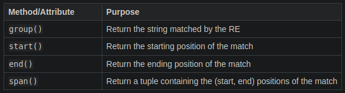
Wurde **kein** Treffer gefunden ist das „``match``“-Objekt ``None``

Screenshot
----------

### findall() & finditer()
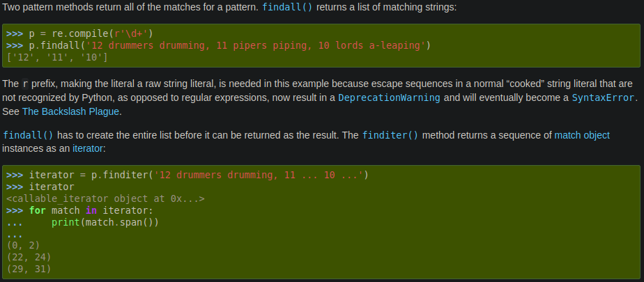

# Klassen
Angelegt Dienstag 15 März 2022

* Mit ``__getattribute__(self, name: str)`` kann per String auf Attribute zugegriffen werden

	class A:
	    def __init__(self, nmb: int):
	        self.attr = nmb
	
	a = A(4)
	a_nmb = a.__getattribute__("attr")
	print(a_nmb)  # 4
	
	
Das Gegenstück heißt ``__setattr__(self, name, value)``. Mit dieser Methode kann man einer Instanz neue Attribute hinzufügen und einen Wert festlegen.

# Logging
Angelegt Sonntag 10 Juli 2022

Literatur
---------

* [Logging – python-Doku](https://docs.python.org/3/howto/logging.html)
* [Logging Cookbook – python-Doku](https://docs.python.org/3/howto/logging-cookbook.html#logging-cookbook) (sehr umfangreich mit Code, der sich in der Vergangenheit als sinnvoll herausgestellt hat)
	* Logging mit mehreren Threads
	* Logging mit mehreren Modulen
	* ...

Praxis
------

* Am Anfang ``logging.basicConfig(...)`` aufrufen, um bspw. [Log-Level – python-Doku](https://docs.python.org/3/library/logging.html#levels) zu konfigurieren (alle Argumente optional)
	* ``filename=<FILENAME.Log>`` Datei, in die der Log geschrieben werden soll
	* ``filemode="w"`` Log-Datei wird jedes Mal überschrieben und es wird nicht angehängt, was der Standard ist (wasl. ist auch ``filename="a"`` möglich aber überflüssig)
	* ``encoding=utf-8``
	* ``level=<LOGLEVEL>`` Welches [Log-Level – python-Doku](https://docs.python.org/3/library/logging.html#levels) verwendet werden soll (Standard ist ``logging.WARNING``), alles über dem angegebenen [Log-Level – python-Doku](https://docs.python.org/3/library/logging.html#levels) wird geloggt 
* Standard-[Log-Level – python-Doku](https://docs.python.org/3/library/logging.html#levels) ist ``WARNING``, dh.

	import logging
	logging.warning('Watch out!')  # will print a message to the console
	logging.info('I told you so')  # will not print anything

wird lediglich
	WARNING:root:Watch out!

printen. Alles **ab** dem spezifizierten [Log-Level – python-Doku](https://docs.python.org/3/library/logging.html#levels) wird geloggt.

* Level ändern:

	logging.basicConfig(level=logging.<LOGLEVEL>)

* Log-Level per Kommandozeile: ``--log=<LOGLEVEL>``, bspw. ``--log=INFO``. Im Code dann

	numeric_level = getattr(logging, loglevel.upper(), None)  # upper(), damit man „INFO“ und „info“ verwenden kann
	# Prüfen, ob Loglevel valide ist
	if not isinstance(numeric_level, int):
	    raise ValueError('Invalid log level: %s' % loglevel)
	logging.basicConfig(level=numeric_level, ...)
	

* [Logging to a file – python-Doku](https://docs.python.org/3/howto/logging.html#logging-to-a-file)

	import logging
	logging.basicConfig(filename='example.log', encoding='utf-8', filemode='w', level=logging.DEBUG)  # logging.DEBUG ist niedrigstes Log-Level, dh. alles wird angezeigt
	logging.debug('This message should go to the log file')
	logging.info('So should this')
	logging.warning('And this, too')
	logging.error('And non-ASCII stuff, too, like Øresund and Malmö')

* [Logging from multiple modules – python-Doku](https://docs.python.org/3/howto/logging.html#logging-from-multiple-modules)
* [Eigenes Log-Format – python-Doku](https://docs.python.org/3/howto/logging.html#changing-the-format-of-displayed-messages)
	* [Zeit und Datum in Log-Nachricht – python-Doku](https://docs.python.org/3/howto/logging.html#displaying-the-date-time-in-messages)

# Module
Angelegt Sonntag 10 Juli 2022

# Flask
Angelegt Samstag 09 Juli 2022

* [Flask-Doku](https://flask.palletsprojects.com/en/2.1.x/)
	* [Quickstart – Flask-Doku](https://flask.palletsprojects.com/en/2.1.x/quickstart/) (von dieser Seite stammt der meiste Inhalt)
	* [Tutorial – Flask-Doku](https://flask.palletsprojects.com/en/2.1.x/tutorial/) (ausführlicher als „Quickstart“, eine ganze Anwendung mit Datenbank wird aufgebaut und erklärt)

Sicherheit
----------
Falls Parameter per URL übergeben werden können, bspw.
	from markupsafe import escape
	
	@app.route("/<name>")
	def hello(name):
	    return f"Hello, {escape(name)}!"

sollte **IMMER** escapet werden, damit nicht durch fünf Ecken und Kanten doch eine Injection-Attacke stattfinden kann! Auch wenn es auf Anhieb nicht möglich ist ein Skript wie
	

per
``localhost:5000/``
zu übergeben (wegen des schließenden ``/``, der Ende des „Pfads“ markiert), sollte man sich nicht in falscher Sicherheit wiegen – Jede Eingabe von Außen ist böse.
@sicherheit @itsicherheit

Beispiel
--------
Das Programm ``flask_example.py``
	from flask import Flask
	app = Flask(__name__)  # Mit dem Objekt „app“, werden die Dekoratoren definiert; TODO herausfinden wofür genau
	
	@app.route('/')  # oder: app.route('/hello') für „localhost:5000/hello“
	def hello_world():
	    return 'Hello World!'

wird per
	export FLASK_APP=flask_example
	python -m flask run # oder „flask run“

gestartet. Wird die Datei als ``app.py`` gespeichert ist die Umgebungsvariable ``FLASK_APP`` nicht notwendig.
Greif man auf ``localhost:5000`` oder ``localhost:5000/`` (``5000`` ist der Standardport von ``Flask``; bspw. per Browser oder ``GET``-Request) zu, wird ``hello_world()`` ausgeführt, dh man erhält den String ``Hello World!`` zurück. Ändert man in ``@app.route('/')`` den Pfad von ``/`` zu ``/hello``, dann muss man auf ``localhost:5000/hello`` zugreifen, um die Methode auszufühen, unter ``localhost:5000`` findet man dan Nichts mehr (``404 HTTP Statuscode``).

### Weitere Beispiele

* Standardmäßig reagiert ``Flask`` nur auf ``GET``-Requests, weitere HTTP-Methoden sind möglich ([http-methods – Flask-Doku](https://flask.palletsprojects.com/en/2.1.x/quickstart/#http-methods)):

	from flask import request
	from flask import Flask
	app = Flask(__name__)
	
	@app.route('/login', methods=["GET", "POST"])
	def login():
		if request.method == "POST":
			return do_login()
		else: # GET-Request
	    	return show_login_form()
	
	# ODER
	
	@app.get("/login")
	def login_get():
		return show_login_form()
	
	@app.post("/login")
	def login_post():
		return do_login()

Routing/Pfadparameter
---------------------

* [variable-rules – Flask-Doku](https://flask.palletsprojects.com/en/2.1.x/quickstart/#variable-rules)
* Man kann die Pfade durch Pfadparameter (Gegenstück: „Query-Parameter“) variabel gestalten. bspw. per ``<variable_name>`` oder ``<converter:variable_name>``
* Die Funktionen benötigen den Namen des Pfadparameters als Argument

	from markupsafe import escape
	
	@app.route("/user/<username>")
	def get_user_profile(username):
		print(f"User {escape(username)}")
	
	@app.route("/user/<int:user_id>")
	def get_user_by_id(user_id):
		print(f"User-ID: {user_id}")

Verfügbare ``converter``:
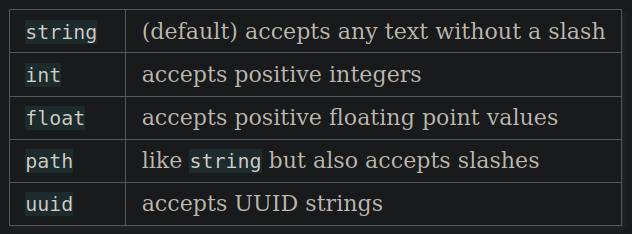.

* Query-Parameter: Haben bspw. die Form ``/profile?user=JohnDoe``

@sicherheit @itsicherheit

Diverses
--------

### Angehängte ``/``

* [unique urls redirection behavior – Flask-Doku](https://flask.palletsprojects.com/en/2.1.x/quickstart/#unique-urls-redirection-behavior)
* Es macht einen Unterschied, ob man am Pfad ein ``/`` anhängt oder nicht.
	* Mit (bspw. ``@app.route("/projects/")``: Eher als Ordner zu verstehen; Wird URL ohne angehängtem ``/`` aufgerufen, wird man trotzdem zu ``/projects/`` geleitet
	* Ohne (bspw. ``@app.route("/about")``: Eher als Datei zu verstehen. Wird URL mit angehängtem ``/`` gibt es einen ``404``-Statusfehler

### Templates
Man kann auch „vollwertige“ Internetseiten zurück geben, dafür benötigt man einen ``static``- und einen ``template``-Ordner. Ersterer enthält ``css``- oder ``JavaScript``-Skripte. Zweiterer den HTML-Code. Wird in ``Flask`` per ``render_template`` realisiert.
Für mehr Informationen: [Rendering Templates – Flask-Doku](https://flask.palletsprojects.com/en/2.1.x/quickstart/#rendering-templates)

### Unit-Test/Context Locals
Falls ich mal Tests für eine ``Flask``-Anwendung schreiben möchte, [Context Locals – Flask-Doku](https://flask.palletsprojects.com/en/2.1.x/quickstart/#context-locals) lesen

Argumente für ``flask run`` oder ``python -m flask run``
--------------------------------------------------------

* ``--host=0.0.0.0`` „Anwendung wird von außen sichtbar“; bspw. bei [docker](#FAUST:docker)-Container notwendig, um mit Anwendung interagieren zu können.

# Jupyter Notebook
Angelegt Montag 07 März 2022
@python @deeplearnin @tensorflow @keras

<https://jupyter.org/>
Doku: <https://jupyter-notebook.readthedocs.io/en/latest/>

Mit Jupyter Notebooks kann interaktiv ein Python-Programm entwickelt werden, da man Code problemlos abschnittsweise ausführen kann.

In Text-Fenstern kann [Markdown – Notizen](#Programmieren:Markdown) verwendet werden.

Shell-Befehle beginnen mit ``!``, bspw.
``!pip install <PACKAGE>``.

Verwendung
----------

* Notebook starten per

``jupyter notebook NOTEBOOK.ipynb``

### Tastenkürzel
Durch die Tastenkürzel wird die Verwendung erst effizient

#### Befehlsmodus
``ESC`` aktiviert Befehlsmodus (ggfl. Standard-mäßig aktiviert)

* ``ENTER`` Bearbeitungsmodus aktivieren
* ``STRG + ENTER`` Zelle ausführen
* ``SHIFT + ENTER`` Zelle ausführen und Untere auswählen (wird ggfl. hinzugefügt)

* ``F`` Suche & Ersetze
* ``A`` Zelle oberhalb einfügen
* ``B`` Zelle unterhalb einfügen
* ``X`` Zelle ausschneiden
* ``C`` Zelle kopieren
* ``V`` (Kopierte) Zelle unterhalb einfügen
* ``SHIFT + V`` (Kopierte) Zelle oberhalb einfügen
* ``Z`` Zelllöschung rückgängig machen
* ``D, D`` Zelle löschen
* ``L`` Zeilennummerierung ein- & ausschalten
	* ``SHIFT + L`` Zeilennummerierung in allen Zellen ein- & ausschalten

 

* ``M`` Markdown-Zelle
* ``1-6`` Zelle wird jeweilige Überschrift
* ``Y`` Code-Zelle
* ``R`` „Raw“-Zelle (Rahmen und Text bleiben, wie sie sind)

#### Bearbeitungsmodus

* ``STRG + M`` Befehlsmodus aktivieren
	* ``ESC`` Befehlsmodus aktivieren
* ``SHIFT + ENTER`` Zelle ausführen und Untere auswählen (wird ggfl. hinzugefügt)
* ``ALT + ENTER`` Zelle ausführen und unterhalb Neue einfügen
* ``STRG + SHIFT + -`` Teile Zelle beim Cursor auf
* ``STRG + /`` Kommentar
* ``STRG + D`` Löscht Zeile
* ``STRG + ↑`` Gehe zu Zellanfang
* ``STRG + ↓`` Gehe zu Zellende

Config
------

* In [~/.jupyter/jupyter_notebook_config.py](file:///home/philipp/.jupyter/jupyter_notebook_config.py) habe ich

``# c.NotebookApp.use_redirect_file = True``
zu
``c.NotebookApp.use_redirect_file = False``
geändert, da Firefox irgendwie nicht auf das gestartet Jupyter Notebook zugreifen konnte (<https://stackoverflow.com/questions/70753768/jupyter-notebook-access-to-the-file-was-denied>)

Collaboratory
-------------

* [Colaboratory](https://colab.research.google.com) ist eine Internetseite von Google, auf der man direkt in Jupyter Notebooks programmieren kann. Es läuft vollständig in der Cloud ist nach [Deep Learning with Python](#Informatik:Deep Learning with Python) gut geeignet, um mit [Keras – MeinWiki.Python](#Python:Module:keras) und [TensorFlow – MeinWiki.Python](#Python:Module:TensorFlow) zu programmieren.
* Man muss GPU-Ausführung explizit erwähnen.

# keras
Angelegt Freitag 25 Februar 2022
@deeplearning @keras @tensorflow @python

[Keras – Startseite](https://keras.io/)

19. auch
	* [Deep Learning with python – MeinWiki](#Informatik:Deep Learning with Python)
	* [Lexikon – MeinWiki](#Informatik:Lexikon)

* [Hier](https://keras.io/api/models/model_training_apis/) findet sich die Dokumentation zu folgenden keras-Funktionen:

``Model.compile   ``Konfiguriert Model für's Training
``Model.fit       ``Trainiert das Model
``Model.predict   ``Stellt Vorhersagen auf
``Model.evaluate  ``-

* Die ``Sequential``-Klasse ist dafür da, Schichten sequentiell zusammenzuhängen, um diese später ausführen zu können.
* **Kapitel 2.5** aus [Deep Learning with Python](#Informatik:Deep Learning with Python) ist für's Nachvollziehen sehr **interessant**!
* Um mithilfe von Daten zu lernen, muss man Annahmen über diese treffen. Diese definieren, was gelernt werden kann – diese spiegeln sich in der Netzwerktopologie wider und ist deswegen sehr wichtig.

Eine gute Architektur zu wählen, muss man üben.
Bsp: 2-Klassen-Klassifikationsproblem, Model beinhaltet eine ``Dense``-Schicht und keine Aktivierungsfunktion. Dann nimmt man automatisch an, dass sich die Klassen linear trennen lassen. @topologie

Kapitel 3.2 aus [Deep Learning with Python](#Informatik:Deep Learning with Python) – What is Keras?
---------------------------------------------------------------------------------------------------

* Deep Learning API mit [Tensorflow – Python](#Python:Module:TensorFlow) als Grundlage
* Läuft auf verschiedener Hardware und kann verteilt werden (wie bei [TensorFlow – Python](#Python:Module:TensorFlow)

Aufbau eines Modells
--------------------

19. [Aufbau eines Modells – Python.Keras.Code-Beispiele](#Python:Module:keras:Code-Beispiele)

Convolutional Layer
-------------------
Internet: [tf.keras.layers.Conv2D – Keras-Doku](https://www.tensorflow.org/api_docs/python/tf/keras/layers/Conv2D)
Datei: [ TensorFlow Core v2.8.0.html|TensorFlow Core v2.8.0.html](./Python_files/Python/Module/keras/tf.keras.layers.Conv2D )
	tf.keras.layers.Conv2D(
	    filters, kernel_size, strides=(1, 1), padding='valid',
	    data_format=None, dilation_rate=(1, 1), groups=1, activation=None,
	    use_bias=True, kernel_initializer='glorot_uniform',
	    bias_initializer='zeros', kernel_regularizer=None,
	    bias_regularizer=None, activity_regularizer=None, kernel_constraint=None,
	    bias_constraint=None, **kwargs
	)

* ``padding="same"`` & ``strides=1`` (oder ``(1,1)``) ⇒  Ausgabe selbe Dimension wie Eingabe

Modell speichern und laden
--------------------------

### Speichern
Ähnlich zu Checkpoints kann man ein Modell nach dem Training speichern:
``model.save(PFAD.h5)``

### Laden
Modell laden (egal, ob es ein Checkpoint ist oder Training abgeschlossen wurde):
``model = keras.models.load_model(PFAD)``

### Training fortsetzen (resume training)
	model = keras.models.load_model(PFAD)
	model.compile(...)  # Entweder neue Parameter oder die alten, bspw. wenn man einen Checkpoint lädt (aber auch dann kann man natürlich Neue übergeben)
	initial_epoch = 30000
	model.fit(train_x, train_y, initial_epoch=initial_epoch, ...)  # Neuer & wichtiger Parameter: „initial_epoch“, Rest kann frei gewählt werden oder analog zum Checkpoint

Callbacks
---------

* [Callback – keras-Doku](https://keras.io/api/callbacks/)

### Modell während des Trainings speichern (Checkpoint)
⇒ s. auch (unter [keras – Python](#Python:Module:keras), Name evtl. verschieden) „Modell laden“, um mit einem gespeicherten Modell weiterzutrainieren.

* <https://keras.io/guides/training_with_built_in_methods/#checkpointing-models>
* [ModelCheckpoint – keras-Doku](https://keras.io/api/callbacks/model_checkpoint/)
* [Serialization and saving – keras-Doku](https://keras.io/guides/serialization_and_saving/)
* Modell nach eigenen Vorgagebn, bspw. alle 4 Epochen speichern (von [Save keras model at specific epochs – Stackoverflow](https://stackoverflow.com/questions/54323960/save-keras-model-at-specific-epochs)):

	checkpoint = keras.callbacks.ModelCheckpoint("PATH/model.h5", period=4)
	model.fit(callbacks=checkpoint)  # <callbacks> nimmt auch Listen

oder (bietet unter'm Strich mehr Möglichkeiten aber hier in demselben Kontext):
	class CustomSaver(keras.callbacks.Callback):
	    def on_epoch_end(self, epoch, logs=None):
	        if epoch % 4 == 0:
	            self.model.save("PFAD.h5d")
	saver = CustomSaver()
	model.fit(callbacks=[saver])  # <callbacks> nimmt auch Listen

### TensorBoard
@TensorBoard
Damit kann man das Training überwachen:
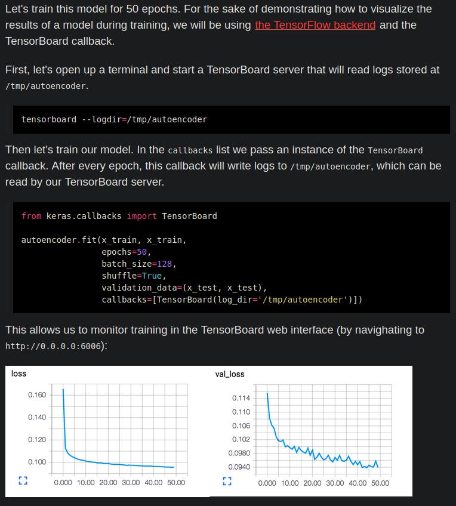

# Autoencoder
Angelegt Samstag 26 Februar 2022

Internet: [Buildung Autoencoders in Keras – Keras-Blog](https://blog.keras.io/building-autoencoders-in-keras.html)
Datei: [./Building Autoencoders in Keras.html](./Python_files/Python/Module/keras/Autoencoder/Building Autoencoders in Keras.html)

Abstrakt
--------

* Mit AE soll dass Netzwerk so trainiert werden, dass es die Eingabedaten auf ihre wesentlichen Elemente reduziert.
* Training: 

**Encode**: X wird in seiner Dimension auf z reduziert
**Decode**: aus z wird probiert X zu rekonstruieren
Loss: || X - X' ||², also der Abstand zwischen Original und Rekonstruktion oder irgendein anderer
⇒ Deswegen gut für **Unsupervised Learning** bzw. **Self-supervised Learning**

* In der Anwendung wird dann nur der Encoder benutzt
* Sehr gut geeignet für verrauschte Daten:

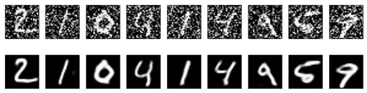

Zusammenfassung
---------------

* AE sind
	* **Daten-spezifisch** (wenn sie mit Gesichtern trainiert wurden, schneiden sie bei Bäumen schlecht ab)
	* **verlustbehaftet** (Rekonstruktion wird Qualität des Originals nie erreichen)
	* **vielseitig einsetzbar** (eine Architektur kann für viele Eingabetypen wie Autos, Bäume, Schrift, etc. verwendet werden ohne sie ändern zu müssen)
* Wegen Daten-Spezifizität schlecht für Kompression
* Geeignete Anwednungsgebiete:
	* Data Denoising
	* Dimensionality reduction for data visualization
		* Strategie für hochdimensionale Daten: Mit Autoencoder auf (relativ) geringe Dimension, zB 32, redzuieren und dann [t-SNE – Wikipedia](https://en.wikipedia.org/wiki/T-distributed_stochastic_neighbor_embedding) verwenden (ist gegenwärtig [26.02.2022] der beste Algorithmus für 2D-Visualisierungen, braucht aber relativ niedrigdimensionale Daten)
* Kann man gut mit Filtern kombinieren, va. wenn man viele Schichten verwendent @filter @convolutional_layer

Autoencoder in Keras
--------------------
In [keras – ZimWiki](#Python:Module:keras) besteht ein Autoencoder aus mehrere Modellen, einem **Encoder**-Modell und einem **Decoder**-Modell, die wiederum aus mehreren Modellen/Schichten aufgebaut sind, die dann zusammengesteckt werden (Genau so, ist auch die Theorie beschrieben). Man kann sich dann mit dem Encoder-Modell auch die Reduktion einer Angabe anschauen.

### Aufbau eines AE
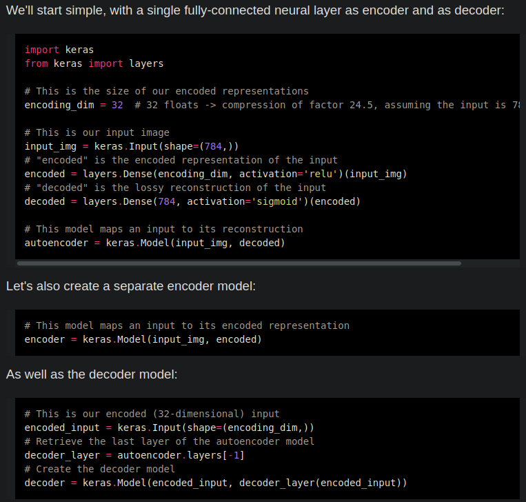

### Darstellung der Ausgabe des Encoders
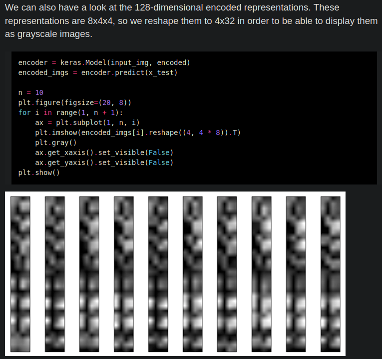

Schematischer Aufbau eines Autoencoders
---------------------------------------
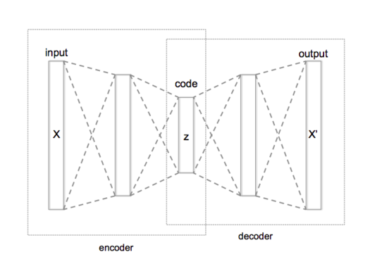
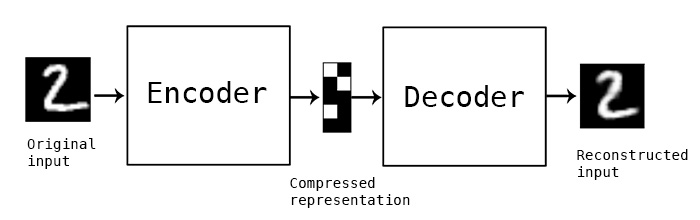

# Code-Beispiele
Angelegt Dienstag 01 März 2022

Diverses
--------

* Mittleren 14x14-Pixelausschnitt wählen

	my_slice = train_images[:, 7:-7, 7:-7]

Einfaches neuronales Netz
-------------------------

### 1. Schritt: Model-Definition
	from tensorflow import keras
	from tensorflow.keras import layers
	model = keras.Sequential([
		layers.Dense(512, activation="relu"),
		layers.Dense(10, activation="softmax")
	])

### 2. Schritt: Model kompilieren (zusammensetzen)
	model.compile(
		optimizer="rmsprop",
		loss="sparse_categorical_crossentropy",
		metrics=["accuracy"])

### 3. Schritt: Model trainineren („fit to its training data“)
	model.fit(
		train_images,
		train_labels,
		epochs=5,
		batch_size=128)

### 4. Schritt: Model auf Testdaten anwenden
	model.predict(test_data)

### 5. Schritt: Model evaluieren
Durchschnittliche Genauigkeit „accuracy“ (s. [Lexikon: Metrics – MeinWiki](#Informatik:Lexikon)) auf den Testdaten berechnen
	test_loss, test_acc = model.evaluate(test_images, test_labels)

# Das Modell
Angelegt Dienstag 08 März 2022

Ziel ist es, kein Modell zu schaffen, das gut auf Trainingsdaten abschneidet, sondern auf gänzlich unbekannten Eingaben. Nur weil im Training gut abschneidet, bedeutet es nicht, dass es das auch auf neuen Daten tut (bspw. kann es sich auf blaue Himmel konzentrieren, weil zufällig alle Katzenbilder einen Wolkenlosen zeigen). Lösung: **Validation data**.

compile()-Funktion
------------------
Konfiguriert das Netzwerk abschließend
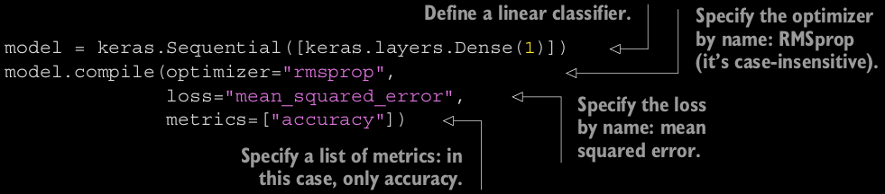

### Optimizer
@optimizer, s. auch [Optimizer – Masterarbeit > Lexikon](#Informatik:Lexikon)
Können als String angegeben werden, case-insensitive.
Verwendet man den Konstruktor, können die Parameter wie die @learningrate bearbeitet werden

* ``keras.optimizers.RMSprop() == "rmsprop"``
* ``SGD``
* ``Adam``
* ``Adagrad``

etc.

### Loss
@loss, s. auch [Loss – Masterarbeit > Lexikon](#Informatik:Lexikon)

* Können als String angegeben werden, case-insensitive
* Müssen der Andwendung angepasst werden: Wenn ich bspw. mit Wortvektoren arbeite, bietet sich ``CategoricalCrossentropy`` nicht an, dafür ``MeanSquaredError``. Durch die falsche Verlust-Funktion explodierte der Loss (ins Negative) bis er schließlich ``NaN`` erreichte und das Natzwerk nicht lernte.

### Beispiele

* ``keras.losses.MeanSquaredError() == "mean_squared_error"``
* ``CategoricalCrossentropy``

Für Multiklassen-Klassifikation

* ``SparseCategoricalCrossentropy``
* ``BinaryCrossentropy``

Für 2-Klassen-Klassifikation

* ``KLDivergence``
* ``CosineSimilarity``

etc.

### Metrics

* ``keras.metrics.BinaryAccuracy() == accuracy``
* CategoricalAccuracy
* ``SparseCategoricalAccuracy``
* ``BinaryAccuracy``
* ``AUC``
* ``Precision``
* ``Recall``

etc.

fit()-Funktion
--------------
Die ``fit()``-Methode führt das Training durch
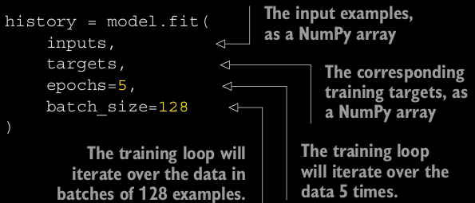
Argumente:		

* ``input data  numpy``-Array oder TensorFlow-``Dataset``-Objekt	
* ``labels``/``targets  numpy``-Array oder TensorFlow-``Dataset``-Objekt
* ``number of epochs  ``Gibt an, wie oft über die Daten pro Trainingsdurchlauf iteriert werden soll.
* ``batch_size  ``Klar
* ``validation_data  ``Teilmenge der Traingsdaten, um Loss und Metrics-Wert zu berechnen; ``numpy-Array`` oder ``TensorFlow-Dataset``-Objekt. Sollte ggfl. randomisiert aus der Testmenge entnommen werden, vor allem, wenn diese sortiert vorliegt:

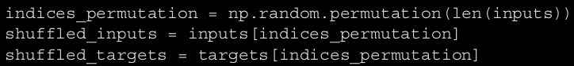

### Validation data
Um stets ein Auge darauf zu haben, wie Modell bei neuen Daten abschneidet, kann man sich Teilmenge der Trainingsdaten, die **validation data**, reservieren. Es ist sehr wichtig Trainingsdaten und Validation data zu trennen, um unverzerrtes Ergebnis zu erhalten.

Rückgabe: ``History``-Objekt, das ``history``-Attribut aufweist, dass @loss und @metrics für jede Epoche enthält.
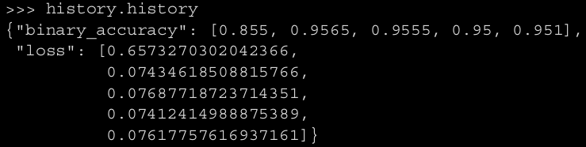

evaluate()-Funktion
-------------------
Berechnen von ``validation loss`` und ``metrics`` nach dem Trainings:
	loss_and_metrics = model.evaluate(val_inputs, val_targets, batch_size=128)

Iteriert in Batches über die Daten.

call()- und predict-Methode
---------------------------
Für Vorhersagen nutzt man die ``__call__()``- oder ``predict``-Methode:
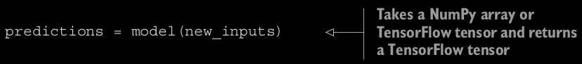
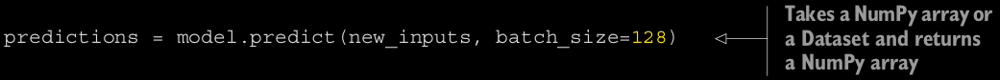
**Vorteil** von ``predict``:

* Iterier in Batches, dh. nicht so Speicher-intensiv
* kann auch ``TensorFlow-Dataset``-Objekte produzieren

# Layer-Klasse
Angelegt Dienstag 08 März 2022

* Alles in Keras ist entweder vom Typ ``keras.layers.Layer`` oder interagiert stark mit diesem; Alle Schichten erben von diesem Typ
* Beinhaltet **Zustand**/**Gewichte** und **Berechnungstechnik**/**Forward pass**
	* Gewichte werden in ``build()``-Methode oder ``__init__()`` definiert
		* ``self.add_weights(<SHAPE>, <INITIALIZER>)`` ist Hilfsmethode, um Gewichte zu generieren @gewichte @weights
	* ``❗️``Berechnungsmechanik findet sich in ``call()`` **nicht in** ``__call__()``

⇒ **Dadurch wird es möglich, dass man im Konstruktor nur die Ausgabeneuronen angibt und Keras die Eingabeneuronenanzahl selbst ableiten kann**. Die ``build()``-Methode wird beim ersten Aufruf der Schicht vie ``__call__()`` ausgeführt. Diese sieht schematisch wir folgt aus:
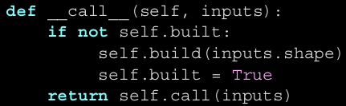.

* **Man gibt bei Schichten oft nur die Ausgabedimension bzw. die Anzahl der Ausgabeneuronen an**. Keras konfiguriert diese dann so, dass sie passende Anzahl an Eingaben erhalten, abhängig von der Vorgängerschicht.

Ausgabe Schicht~i~ = Eingabe Schicht~i+1~

* So ist es einfacher, da man keine Doppelungen hat

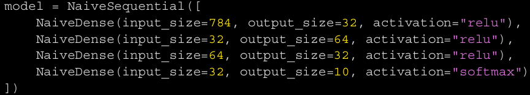
und wenn die Ausgabegröße komplex ist, bspw. ``input_size * 2 if input_size % 2 == 0 else input_size * 3``, muss man sich auch keine Gedanken machen.

* Neben der @topologie muss man noch Folgendes wählen:
	* [Loss function – Masterarbeit.Lexikon](#Informatik:Lexikon) @loss
	* [Optimizer – Masterarbeit.Lexikon](#Informatik:Lexikon) @optimizer
	* [Metrics – Masterarbeit.Lexikon](#Informatik:Lexikon) @metrics

⇒ Sind ``Keyword``-Argumente für die ``compile()``-Funktion (s. unten)

Aktivierungsfunktionen
----------------------
Sind dazu da, Nichtlinearitäten ins Netzwerk einzubinden. Kann (teilweise) auch als String (``"relu"``) angegeben werden.

* ``tf.nn.relu``

# Matplotlib
Angelegt Freitag 14 Januar 2022

Farben
------
Vordefinierte Farben findet man [hier.](https://matplotlib.org/stable/gallery/color/named_colors.html)

Bilder anzeigen oder speichern
------------------------------

* Anzeigen: Bilder in eigenem Fenster anzeigen: ``Settings – Tools – Python Scientific – Show plots in tool window`` [[StackOverflow](https://stackoverflow.com/questions/48334853/using-pycharm-i-want-to-show-plot-extra-figure-windows)] @pycharm
* Anzeigen: Um Fehlermeldung ``Matplotlib is currently using agg, which is a non-GUI backend, so cannot show the figure.``, die auftritt, wenn man`` matplotlib`` per ``pip`` in einer virtualenv installiert, zu beheben muss man ein Modul installieren, damit ``matplotlib`` zugriff auf das GUI hat [[StackOverflow](https://stackoverflow.com/questions/56656777/userwarning-matplotlib-is-currently-using-agg-which-is-a-non-gui-backend-so)]:

``sudo apt-get install python3-tk``

* Speichern:

``fig.savefig(PATH)``

Punkte annotieren / mit Text versehen
-------------------------------------
	ax.text(x * (1 + 0.01), y * (1 + 0.01), text[i], fontsize=12, color="red")

@Labels @Scatterplot @Beschriftung

	axs.plot(x, y, "o", c=colors[idx], label=list_wordclasses[idx])

* ``"o" ``(hier: Punkt; auch möglich: +, *, ...)
* ``c ``Farbe für Punkt
* ``label ``Label für das „Objekt“ (hier ein einzelner Punkt, kann aber auch Linie oder ähnliches sein)
	* Die ``label``s werden in der [Legende](https://matplotlib.org/stable/api/_as_gen/matplotlib.pyplot.legend.html) verwendet

Achsenbeschriftungsfarben ändern
--------------------------------
<https://stackoverflow.com/questions/21936014/set-color-for-xticklabels-individually-in-matplotlib>
@Labels

Legende
-------

* [Legend Guide – matplotlib-Doku](https://matplotlib.org/stable/tutorials/intermediate/legend_guide.html)
* Es gibt verschiedene Möglichkeiten eine [Legende](https://matplotlib.org/stable/api/_as_gen/matplotlib.pyplot.legend.html) zu bearbeiten.
* [How to put the legend outside the plot – Stackoverflow](https://stackoverflow.com/questions/4700614/how-to-put-the-legend-outside-the-plot)

# numpy
Angelegt Freitag 25 Februar 2022
@numpy

* In [numpy-Anleitung.ipynb](file:///home/philipp/Programmieren/jupyter-notebooks/numpy-Anleitung.ipynb) oder [numpy-Anleitung.py](file:///home/philipp/Programmieren/jupyter-notebooks/numpy-Anleitung.py) finden sich viele Beispiele.

### numba
[numba – Doku](https://numba.pydata.org/) ist gut dazu geeignet numerische Berechnungen vor allem mit [numpy – MeinWiki](#Python:Module:numpy) oder ``scipy`` durchzuführen. Es bietet sich an, wenn man diese Module viel nutzt oder häufig Schleifen verwendet. (Für „klassische“ Arbeiter-Thread-Aufgaben, wie das berechnen eines Wortvektors von [spaCy – MeinWiki](#z Archiv:Masterarbeit:Zusätzliche Python-Pakete:spaCy), ist es dagegen nicht geeignet, weil es [spaCy – MeinWiki](#z Archiv:Masterarbeit:Zusätzliche Python-Pakete:spaCy) nicht kennt.)

Limits für floats
-----------------
[numpy.finfo – numpy-Doku](https://numpy.org/doc/stable/reference/generated/numpy.finfo.html)
Größte, kleinste Zahl, kleinste betragsmäßige Zahl, etc,
``np.finfo(float).``
``eps  ``Kleinste darstellbare Zahl (Differenz zwischen ``1.0`` und der nächsten darstellbaren Zahl größer als ``1.0``)
``max  ``Größter float
... und vieles mehr.

axis-Attribut
-------------
Ein ``1d``-Array hat ``1`` ``axis``, ein ``2d``-Array hat ``2`` ``axes`` (Plural), ein ``3d``-Array hat ``3`` ``axes``, usw. Per ``axis`` wird sozusagen die grundlegende Dimension des Arrays wiedergegeben. Auf jeder ``axis`` findet sich dann die Länge. Das ist analog zu Tensoren und Vektoren zu verstehen: Ein Tensor 1. Stufe (ein Vektor) hat 1 „Achse“ aber kann beliebig viele Einträge haben, die Dimension des Vektors ist dadurch nicht festgelegt. Ein Tensor 2. Stufe (eine Matrix) hat 2 „Achsen“, an denen Elemente gelistet werden aber die Dimension der Matrix ist dabei nicht weiter spezifiziert.
⇒ Genau so sind ``numpy``-Array zu verstehen. Es sind im Prinzip Tensoren.

Das ``axis``-Attribut kann bspw. in ``np.count_nonzero()``, ``np.concatenate()`` oder ``np.sum()`` verwendet werden.

### Beispiel
Der ``axis``-Parameter gibt an, mit welcher „Parallelität“ die Operation durchgeführt werden soll, vorab Beispiele:

* ``np.count_nonzero(a, axis=0)`` bedeutet daher, dass man parallel zu ersten Achste vorgeht. Das entspricht in diesem Fall den Spalten.

In diesem Fall kann man sich zwei verschachtelte Schleifen vorstellen:
	results = []
	for spalte in range(len(a[0])):
		res = 0
		for zeile in range(len(a)):
			res += f(a[zeile][spalte])
		results.append(res)

* ``np.count_nonzero(a, axis=1)`` bedeutet daher, dass man parallel zu zweiten Achste vorgeht. Das entspricht in diesem Fall den Zeilen, denn diese breiten sich orthogonal zur ersten Achse aus.

In diesem Fall kann man sich zwei verschachtelte Schleifen vorstellen:
		results = []
		for zeile in range(len(a)):
			res = 0
			for spalte in range(len(a[0])):
				res += f(a[zeile][spalte])
			results.append(res)

* Allgemein gilt: Wenn man die höchste Achse angibt, dann werden die Achsen in ihrer kanonischen Reihenfolge durchschritten.

* Weitere Vorstellung:
	* ``axis=0  ``Es wird eine weiteres Element, ein Vektor, an die erste Achse (Index ``0``) gehängt, dass das „kommulative Resultat der Operation entlang der logischen Richtung“ beinhaltet (im ``2d``–Fall lautet diese „logische Richtung“: von oben nach unten)
	* ``axis=1  ``Es wird eine weiteres Element, ein Vektor, an die zweite Achse (Index ``1``) gehängt, dass das „kommulative Resultat der Operation entlang der logischen Richtung“ beinhaltet (im`` 2d``–Fall lautet diese „logische Richtung“: von links nach rechts)
	* ``axis=2``  Es wird eine weiteres Element, eine Ebene, an die dritte Achse (Index ``2``) gehängt, dass das „kommulative Resultat der Operation entlang der logischen Richtung“ beinhaltet (im ``3d``–Fall lautet diese „logische Richtung“: von oben nach unten **auf der z-Achse**)

Printe np-Arrays
----------------

* Printe ``numpy``-Array ohne Auslassungen („``...``“):

	import numpy as np
	np.set_printoptions(threshold=np.inf)

* Printe ``numpy``-Array ohne Umbrüche:

	m = numpy_array.tolist()
	print(*m, sep="\n")

numpy-Array speichern
---------------------
	a = np.arange(6)
	np.save("./numpyarray.npy", a)  # Ich glaube, .npy-Endung ist wichtig, da sie in der load-Funktion als Bedingung auftaucht
	b = np.load("./numpyarray.npy")

Mehrfachzugriff auf np-Arrays
-----------------------------
Andere ``np``-Arrays können als Argument in ``[]`` verwendet werden, um bspw. auf mehrere Elemente gleichzeitig zugreifen zu können:
	a = np.arange(5) * 2
	indices = np.array([2, 0, 3])  # Darf keine Zahlen größer als der höchste Index enthalten
	print(f"{a[indices] = }")  # array([4, 0, 6])

Shape von numpy-Arrays
----------------------
	np.zeros((5,)) == np.zeros((5)) == np.zeros(5)

``np.ndim  ``Dimension von ``numpy``-Arrays; **Länge** von ``shape``-Attribut (``len(x.shape))``)

Broadcasting
------------
Wenn man zwei Tensoren/Numpy-Arrays addiert, sollten sie dieselbe Größe haben. Falls dem nicht so ist, wird der kleinere Tensor in zwei Schritten in die Form des Größeren gebracht:

1. **Axes** (s. [Lexikon: Axes – MeinWiki](#Informatik:Lexikon)) werden hinzuaddiert, sodass sich das ``ndim``-Attribut gleicht
2. Der kleinere Tensor wird entlang der neuen Achsen dupliziert

### Matrix zeilenweise Normieren
Beim zeilenweisen Normieren kann Broadcasting verwendet werden (s. auch [Alles mögliche – numpy](#Python:Module:numpy:Alles mögliche):
	a = np.arange(9).reshape((3, 3))
	row_sums = a.sum(axis=1)
	new_matrix = a / row_sums[:, np.newaxis]

np.concatenate
--------------
[./numpy_concatenate.py](./Python_files/Python/Module/numpy/numpy_concatenate.py)
	import numpy as np
	
	x = np.arange(12).reshape((3, 4))
	a = np.concatenate([x] * 2, axis=0)  # (6, 5)
	b = np.concatenate([x] * 2, axis=1)  # (4, 8)
	
	q = np.arange(8).reshape((2, 2, 2))
	w = np.arange(8).reshape((2, 2, 2)) * 2
	e = np.concatenate([q, w], axis=1)  # (2, 2, 4)
	print(e)
	
	X = np.random.random((32, 10))
	y = np.random.random((10,))
	y = np.expand_dims(y, axis=0)  # (1, 10)
	Y = np.concatenate([y] * 32, axis=0)  # 32x (1, 10) |-> (32, 10)
	Y = np.concatenate([y] * 32, axis=1)  # 32x (1, 10) |-> (1, 320)
	# Jetzt könnte man X & y addieren, da sie dieselbe Form haben
	
	y = np.arange(15).reshape((3, 5))
	# Funktioniert nicht, weil sich x, y auf axis=0 nicht gleichen
	# c = np.concatenate([x, y], axis=0)
	
	"""
	    axis = 0:
	        Schreibe alles, was sich auf der ersten Achse (diese kann jede beliebige Dimension haben) befindet, hintereinander
	            Erste Achse, alles, was man mit einer [] erreichen kann
	        Aber: Alles muss dieselbe Länge auf den Folgeachsen haben, dh. (3,4) & (3,5) kann NICHT konkateniert werden
	    axis = 1:
	        Schreibe alles, was sich auf der zweiten Achse findet, hintereinander
	            zweite Achse: Alles, was man mit [i][] erreichen kann für festes i
	        Aber: Alles muss auf axis=0 dieselbe Dimension haben, dh. (3,4) & (4,6) kann NICHT konkateniert werden.
	"""

Wenn man zwei Arrays A & B der Form (x~1~, x~2~, ..., x~n~) per axis=k, 0<=k<=n-1, konkateniert, muss sich die Form bis
Achse k-1, dh von x~1~ bis x~k-1~, gleichen. Ruft man im neuen Array dann [i~1~, ..., i~k-1~] auf, finden sich „hinter
dieser Türe“ alle Elemente (entweder Zahlen oder Arrays), die sich bei A & B hinter diesen Koordinaten befinden.

Gleichheit von Arrays
---------------------
<https://numpy.org/doc/stable/reference/generated/numpy.array_equal.html>
	np.array_equals(a1, a2)

oder
	tmp = a1 == a2
	tmp.all()
	# Kurzform: (a1 == a2).all()

Padding
-------
<https://numpy.org/doc/stable/reference/generated/numpy.pad.html>
**Rudimentäre** Signatur:
	numpy.pad(array, pad_width, mode='constant', **kwargs)

``pad_width  ``Folge von 2er-Tupeln für jede ``axis`` gemäß ``(<Anz. Werte davor>, <Anz. Werte danach>)``. Das erste Tupel, bspw ``(1, 2)`` würde bedeuten, dass man eine Reihe „davor“ und zwei Reihen „danach“ hinzufügt.
``constant_values  ``verhält sich ``pad_width``. Hier Gibt man die Werte, mit denen gepadded werden soll, an. ``(-1, 1)`` bedeutet dabei, dass die Indizes „davor“ mit ``-1``, die „danach“ mit ``1`` befüllt werden sollen.

Es gibt viele Möglichkeiten zu padden ⇒ in obige Doku schauen!

### Beispielhafte Verwendung
	import numpy as np
	x = np.zeros((2,3))
	# array([[0., 0., 0.],
	#        [0., 0., 0.]])
	
	# „negativ“ soll „davor“ &
	# „positiv“ soll „danach“ implizieren
	y = np.pad(x, [(1, 2), (0, 0)], constant_values=[(-1, 1)])
	# array([[-1., -1., -1.],
	#        [ 0.,  0.,  0.],
	#        [ 0.,  0.,  0.],
	#        [ 1.,  1.,  1.],
	#        [ 1.,  1.,  1.]])
	
	# Gibt man nur „(1,2)“ an, so wird auch für axis=1 gepaddet, bzw. für alle folgenden <axis>
	y = np.pad(x, [(1, 2)], constant_values=[(-1, 1), (-2, 2)])
	# array([[-2., -1., -1., -1.,  2.,  2.],
	#        [-2.,  0.,  0.,  0.,  2.,  2.],
	#        [-2.,  0.,  0.,  0.,  2.,  2.],
	#        [-2.,  1.,  1.,  1.,  2.,  2.],
	#        [-2.,  1.,  1.,  1.,  2.,  2.]])

Algebraische Operationen
------------------------
für ``np.dot(A, B)`` muss die letzte Dimension von ``A`` der ersten von ``B`` entsprechen.

* Skalarprodukt: ``np.dot(v, w)``
* Matrixmultiplikation: ``np.dot(A, B)``
	* allgemein (hier wird nur auf die Form Bezug genommen):

(a, b, c, d) • (d,) → (a, b, c)
(a, b, c, d) • (d, e) → (a, b, c, e)

* Transponieren: ``np.transpose(<matrix>)``

# Alles mögliche
Angelegt Dienstag 22 März 2022

Matrix zeilenweise Normieren
----------------------------
	for row_idx in range(matrix.shape[0]):
		matrix[row_idx, :] /= np.sum(matrix[row_idx, :])

### Mit Broadcasting
Beim zeilenweisen Normieren wird Broadcasting verwendet (s. auch :
	a = np.arange(9).reshape((3, 3))
	row_sums = a.sum(axis=1)
	new_matrix = a / row_sums[:, np.newaxis]

Arrays konktenieren
-------------------

* ``np.vstack()``
* ``np.hstack()``
* ``np.concatenate()``
* ``np.tile()``

### np.tile()
Ähnlich zu ``np.concatenate()`` aber man ein Array mehrfach konkatenieren
	a = np.arange(0, 6).reshape(2, 3)
		# array([[0, 1, 2],
	    #	     [3, 4, 5]])
	b = np.tile(a, 3)
		# array([[0, 1, 2, 0, 1, 2, 0, 1, 2],
	    #   	 [3, 4, 5, 3, 4, 5, 3, 4, 5]])

### np.vstack()
Konkateniert ein (oder vllt mehrere verschiedene Arrays) vertikal, also entlang ``æxis=1``. Entspricht sozusagen ``np.tile(a, 3, axis=1)`` aber ``np.tile()`` kennt kein Argument ``axis``.
	a = np.arange(0, 6).reshape(2, 3)
		# array([[0, 1, 2],
	    #	     [3, 4, 5]])
	np.vstack([a] * 3)
		# array([[0, 1, 2],
	    #	     [3, 4, 5],
	    #	     [0, 1, 2],
	    #	     [3, 4, 5],
	    #	     [0, 1, 2],
	    #	     [3, 4, 5]])

Array partitionieren
--------------------
Mit [np.argpartition – numpy-Doku](https://numpy.org/doc/stable/reference/generated/numpy.argpartition.html) kann man ein Array so partitionieren, dass man ein einen Index ``k`` angibt, an dem partitioniert werden soll. "Partitioniert" heißt: Nach der Partitionieren ist das Element an Stelle ``k`` richtig sortiert, dh. alle kleineren (kleiner gleich) stehen vor ihm, alle größeren (größergleich) nach ihm. Die dortige **Reihenfolge** ist aber **zufällig **(dh. sie kann nur bedingt zum sortieren verwendet werden).
``np.argpartition(<ARRAY>, <INDEX DES ELEMENTS AN DEM PARTITIONIERT WERDEN SOLL>, ...)``
	x = array([9, 4, 4, 3, 3, 9, 0, 4, 6, 0])
	ind = [np.argpartition(a, 4)]  # [6, 9, 4, 3, 7, 2, 1, 5, 8, 0]
	x[ind]  # [0, 0, 3, 3, 4, 4, 4, 9, 6, 9]; 9, 6, 9 nicht in richtiger Reihenfolge

Bspw. kann man diese Funktion dazu verwenden die Indizes der ``k`` größten Elemente zu extrahieren ohne das ganze Array zuvor sortieren zu müssen (Laufzeit bestenfalls: ``O(n + log(n))``). Dazu ruft man auf:
	tmp = np.argpartition(x, -k)
	indices = tmp[-k:]  # Die Indizes der k größten Elemente abtrennen
	x[indices] 

Dadurch wird das ``k``-te größte Element an die ``k``-te Stelle gesetzt, davor sind alle kleiner, danach alle größer.

Laufzeit: ``O(n)`` bei ``n`` Elementen im Array 

# requests
Angelegt Montag 11 Juli 2022

* [request-Doku](https://requests.readthedocs.io/)
* [Quickstart – request-Doku](https://requests.readthedocs.io/en/latest/user/quickstart/)

Jupyter Notebook
----------------
[~/programmieren/jupyter-notebooks/requests_module_Anleitung.ipynb](file:///home/philipp/programmieren/jupyter-notebooks/requests_module_Anleitung.ipynb)

# Selenium
Angelegt Dienstag 04 Oktober 2022

* Tutorial: <https://www.youtube.com/watch?v=Xjv1sY630Uc>
* Gute Dokumentation: <https://selenium-python.readthedocs.io/>
* [Erste Schritte mit Selenium − Selenium-Doku](https://www.selenium.dev/documentation/webdriver/getting_started/first_script/)
* Google Chrome-Treiber: <https://sites.google.com/chromium.org/driver/downloads> (muss passend zur Google Chrome/Chromium-Version heruntergeladen werden, diese findet man unter „Menü > Über Google Chrome/Chromium“

ungoogled chromium, chromedriver
--------------------------------

* Mit [ungoogled-chromium − GitHub](https://github.com/ungoogled-software/ungoogled-chromium), bzw. [com.github.Eloston.UngoogledChromium − flathub](https://flathub.org/apps/details/com.github.Eloston.UngoogledChromium) funktioniert Selenium bzw. *undetected chromedriver* nicht. Ich habe auf verschiedenste Arten probiert den Binary-Pfad zu setzen, hat alles nicht funktioniert. Deswegen habe ich zusätzlich auch das klassische Chromium installiert.
* in [~/programmieren/python/chromedriver-udu_dog](file:///home/philipp/programmieren/python/chromedriver-udu_dog) habe ich per [:Linux:**vim**](#Linux:vim) die Variable ``udu_`` durch ``dog_`` ersetzt, da dass *Selenium* verschleiern soll, ob's etwas bringt, weiß ich nicht. Gelesen habe ich das bei *StackOverflow*.

Weiterführende Links
--------------------

* [how-can-i-check-if-webelement-exists-in-selenium – StackOverflow](https://stackoverflow.com/questions/56565642/how-can-i-check-if-webelement-exists-in-selenium)

Detektion verhindern
--------------------

* <https://stackoverflow.com/questions/53039551/selenium-webdriver-modifying-navigator-webdriver-flag-to-prevent-selenium-detec/53040904#53040904>
* [way-to-change-google-chrome-user-agent-in-selenium − stackoverflow](https://stackoverflow.com/questions/49565042/way-to-change-google-chrome-user-agent-in-selenium/49565254#49565254)
* <https://pypi.org/project/selenium-stealth/>
* [undetected-chromedriver − pypi](https://pypi.org/project/undetected-chromedriver/)

Warten
------

* [python-selenium-wait-until-element-is-fully-loaded – StackOverflow](https://stackoverflow.com/questions/50468629/python-selenium-wait-until-element-is-fully-loaded)
* [Waits in Selenium − readthedocs](https://selenium-python.readthedocs.io/waits.html)

Elemente finden
---------------

* Mit [locators − Selenium-Doku](https://www.selenium.dev/documentation/webdriver/elements/locators) kann man Elemente auch finden, falls ``ID`` fehlt oder sonst etwas nicht funktioniert. Dabei sind vor allem die relativen Lokatoren interessant.
	* Das Objekt muss, wie es ist in ``find_element(…)`` eingesetzt werden.

Screenshots
-----------

* per ``driver.find_element(…).screenshot_as_png`` kann man Screenshots von Elementen, bspw. einem Bild oder einem *Canvas* machen und speichern (in ``with``-Statement per ``"b"`` schreiben)

# TensorFlow
Angelegt Freitag 04 März 2022
@deeplearning @keras @tensorflow @python @tensor

[TensorFlow – Startseite](https://www.youtube.com/watch?v=MvfyehKrkig)

Einführung
----------

### Tensoren initialisieren
	tf.ones(shape=(2,1))  # == np.ones(shape(2,1))
	tf.zeros(shape=(2,1))  # == np.zeros(shape(2,1))
	tf.random.normal(shape=(3, 1), mean=0., stddev=1.)
	tf.random.uniform(shape=(3, 1), minval=0., maxval=1.)

Syntax sehr ähnlich zu [numpy – MeinWiki.Python](#Python:Module:numpy).

* Tensoren sind im Vergleich zu ``numpy`` konstant. Der Code

	x = tf.ones(shape=(2, 2))
	x[0, 0] = 0

wird mit
``EagerTensor object``
``does not support item assignment.``
fehlschlagen (bei ``numpy`` wäre das problemlos möglich)

### tf.Variables

* Die Klasse ``tf.Variables`` ist dafür da modifizierbare Zustände in ``TensorFlow`` zu verwalten.
* Für Initialisierung ist Tensor notwendig:

	v = tf.Variable(initial_value=tf.random.normal(shape=(3, 1)))

* Können per ``assign``-Methode verändert werden:

	v.assign(tf.ones((3, 1)))
	v[0, 0].assign(3.)

* ``+=`` wird zu ``assign_add()``
* ``-=`` wird zu ``assign_sub()``

### Tensor-Operationen

Alle Berechnungen werden direkt ausgeführt (sodass man sich jederzeit das Resultat printen kann). Dieses Prinzip wird „**eager execution**“ genannt.

Kapitel 3.1 aus [Deep Learning with Python](#Informatik:Deep Learning with Python) – What is TensorFlow?
--------------------------------------------------------------------------------------------------------
TF bietet eine Vielzahl an mathematischen Operationen für mehrdim. Arrays ([Tesoren – Lexikon](#Informatik:Lexikon)) an aber kann im Vergleich zu [numpy – Python](#Python:Module:numpy) mehr:

* TF kann automatisch Ableitungen berechnen
* Läuft auf CPU, GPU, TPU
* Berechnungen können leicht verteilt werden
* TF-Operationen können für C++ oder JavaScript exportiert werden
* Ist eine Platform für viele Zwecke und keine „blanke“ Library

Diverses
--------

* ``w.assign_sub(g * learning_rate)  assign_sub`` is the equivalent of ``-=`` for TensorFlow variables.
* ``numpy()  ``Calling ``numpy()`` on a TensorFlow tensor converts it to a NumPy tensor.
* ``tf.reduce_mean(<TENSOR>)  ``Berechnet Durchschnitt   

GradientTape
------------
TensorFlow verfügt über die Technik der **automatic differentiation**, dh. TensorFlow kann die Ableitung anhand des Vorwärtsschrittes (@forwardpass) selbst berechnen. Dies geschieht mit **``GradientTape``**. Man kann es sich so vorstellen, dass innerhalb eines ``GradientTape``-Scopes alle Operation aufgezeichnet und dann die Ableitungen berechnet werden. In einem ``GradientTape`` arbeitet man mit der ``tf.Variable``-Klasse.

* Nur **trainable variables** (``tf.Variables``) werden in einem ``GradientTape`` a priori für Gradientenberechnung in Betracht gezogen
	* Möchte man blanken Tensor ``t``, der normalerweise konstant ist, s. „Einführung – Tensoren initialisieren“, verwenden, muss ``tape.watch(t)`` aufgerufen werden.

Das ist notwendig, weil es sonst zu aufwendig wäre, alles für alles möglichen Ableitungen zu speichern.

### Beispiele

	
Man kann einen Ausdruck auch direkt nach mehrere Variablen (bspw. Eingabe und Gewichte) ableiten.

	
Ableitung 2. Grades

# Standarddatentypen
Angelegt Freitag 10 Juni 2022

Dictionaries
------------

* Schleifen, for, iterieren

	for key in dictionary:
		[...]
	for key, value in dictionary.items()

* Schlüssel/Key in Dictionary:

	key in dictionary

* Dictionary als Liste (von KV-Paaren)

``dictionary.items()``
@dict @dictionary

Listen
------

* ``myList.sort(key=KEY, ...)`` sortiert** in situ**!
* ``sortedList = sorted(myList, key=KEY, ...)`` sortiert **nicht in situ**! 

Strings
-------

### b-Strings
[what does the b character do in front of a string literal – StackOverflow](https://stackoverflow.com/questions/6269765/what-does-the-b-character-do-in-front-of-a-string-literal)

### f-Strings

* ``{`` in ``f-Strings`` (geschweifte Klammer, Bracket)

@fstring

# Threads & Parallele Programmierung
Angelegt Montag 28 März 2022

[multiprocessing – Python-Doku](https://docs.python.org/3/library/multiprocessing.html)
[threading – Python-Doku](https://docs.python.org/3/library/threading.html#module-threading)
[Queue – Python-Doku.multiprocessing](https://docs.python.org/3/library/multiprocessing.html#multiprocessing.Queue)

* Für irgendetwas spielt das [Global Interpreter Lock – Python-Doku](https://docs.python.org/3/glossary.html#term-global-interpreter-lock) eine Rolle aber das habe ich (noch) nicht verstanden

Verwendung
----------

### Beispielhaft
 	

* ``Pool(5)``/``Pool(processes=5)`` generiert ``5`` Arbeiterthreads ([Pool – Python-Doku.multiprocessing](https://docs.python.org/3/library/multiprocessing.html#multiprocessing.pool.Pool)
	* ``Pool(None)==Pool(processes=None)`` erstellt ``os.cpu_count()`` (bei mir 8) Threads, von denen jedoch **einer** die Rolle des Main-Threads einnimmut und ``os.cpu_count()-1`` die Aufgaben ausführen.
* ``p.map(func, iterable)`` beschreibt dir Aufgabe: Für jedes Element in ``iterable`` soll Funktion ``func`` angewendet werden. Genau diese Anwendung wird auf den Thread-Pool verteilt, dh. jeder Arbeiter führt genau eine aus bis das ``iterable`` aufgebraucht ist.
* **Mehrere Argumente**: [starmap – Python-Doku.multiprocessing](https://docs.python.org/dev/library/multiprocessing.html#multiprocessing.pool.Pool.starmap) (``Pool.map`` kann keine Funktionen mit mehreren Argument aufrufen, sondern verlangt ein-parametrige Funktionen) 

### Spezifisch

1. Es wird ein [Process – Python-Doku](https://docs.python.org/3/library/multiprocessing.html#multiprocessing.Process)-Objekt ``p`` instanziiert
2. An ``p`` wird [``Process.start()`` – Python-Doku](https://docs.python.org/3/library/multiprocessing.html#multiprocessing.Process.start) aufgerufen

``Process`` folgt der API von [threading.Thread – Python-Doku](https://docs.python.org/3/library/threading.html#threading.Thread)

### Speicher/Shared Memory
Um „atomic“-Variablen/Datenstrukturen anzulegen, kann man folgende Klassen verwenden:

* [Value – Python-Doku.multiprocessing](https://docs.python.org/3/library/multiprocessing.html#multiprocessing.Value)
* [Array – Python-Doku.multiprocessing](https://docs.python.org/3/library/multiprocessing.html#multiprocessing.Array)

Allgemeiner:

* [sharedctypes – Python-Doku.multiprocessing](https://docs.python.org/3/library/multiprocessing.html#module-multiprocessing.sharedctypes)
* [Shared Memory – Python.Doku](https://docs.python.org/3/library/multiprocessing.shared_memory.html)

#### Verwendung

* '``d``' und '``i``' stehen für „double precision“ und „signed integer“. Werden auch vom [array – Python-Doku](https://docs.python.org/3/library/array.html#module-array) verwendet.

### Queues/Warteschlangen
[Queue – Python-Doku.multiprocessing](https://docs.python.org/3/library/multiprocessing.html#multiprocessing.Queue)

Nur schematische Beschreibung; unsicher ob sie überhaupt richtig ist:

* Instanziieren einer ``Queue q``
* Generieren von ``n`` Arbeiter-Threads (manuell über ``Process``-Klasse oder ``Pool`` möglich)
	* Starten, je nachdem, welche Klasse verwendet wurde; Bei ``Process`` bietet sich vllt. Liste an
* Die Arbeiter-Threads benötigen ``q`` als Argument/Zugriff auf ``q``, um per ``q.get()`` auf die Aufgaben zugreifen zu können.
* Ein anderer Thread (oder beliebig viele andere) legen per ``q.put(...)`` Aufgaben in der Warteschlange ab.
* Arbeiter-Threads entnehmen sie solange, bis ``q`` leer ist

### Diverses

#### Prozess IDs (pid)
In der Funktion, die von Prozess/Thread (TODO Unterschied unklar) aufgerufen wird erhält man per

* ``os.getpid()`` die Prozess-ID
* ``os.getppid()`` die Elternprozess-ID

,	

#### Locks

# Zu lesen
Angelegt Sonntag 15 Mai 2022

Python
------

* [Klassen & Vererbung – Python-Doku](https://docs.python.org/3/tutorial/classes.html#inheritance)
* [Python-Tutorial – python-Doku](https://docs.python.org/3/tutorial/)
* [Match-Statement (Pattern Matching, switch-case) – python-Doku](https://docs.python.org/3/tutorial/controlflow.html#match-statements)
	* [PEP 636: Match-Statement – python-Doku](https://peps.python.org/pep-0636/)

Flask
-----

* [Tutorial – Flask-Doku](https://flask.palletsprojects.com/en/2.1.x/tutorial/) (ausführlicher als „Quickstart“, eine ganze Anwendung mit Datenbank wird aufgebaut und erklärt)

numpy
-----

* [Broadcasting – numpy-Doku](https://numpy.org/doc/stable/user/basics.broadcasting.html?highlight=broadcasting#numpy.doc.broadcasting)
* [Universelle Funktionen – Python-Doku](https://numpy.org/doc/stable/reference/ufuncs.html#broadcasting)

