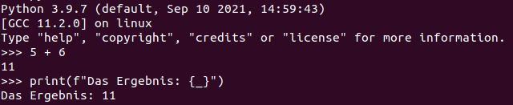

# Diverses
Angelegt Dienstag 01 März 2022

Immer wieder einen Blick wert: <https://www.youtube.com/watch?v=qUeud6DvOWI>
Hier steht irgendetwas zum Überladen: [./python.txt](./Diverses/python.txt)

Unterseiten
-----------

* [Bytes](./Diverses/Bytes.md)
* [CSV](./Diverses/CSV.md)
* [regex](./Diverses/regex.md)

Diverses
--------

* Shell-Befehle in Python: gute [Stackoverflow-Antwort](https://stackoverflow.com/questions/4760215/running-shell-command-and-capturing-the-output)

	import subprocess
	subprocess.run(["ls", "-l"])

* Mehr Details auch in Bezug auf ``stdout`` in der Antwort oben.
* Soweit wie möglich **nicht**

	subprocess.Popen("ls -l", shell=True)

verwenden, da dann der Befehl in der Shell ausgeführt wird, was vor allem im Zusammenspiel mit Nutzereingaben ein Sicherheitsrisiko darstellt @sicherheit @itsicherheit

* In ``REPL``-Umgebung kann man per ``_`` auf die letzte „Ausgabe“ zurückgegriffen werden:

* [numpy – MeinWiki](./Module/numpy.md)-Arrays werden bei Funktionsaufrufen mit **Call by Reference** behandelt.
* Man kann Klassen „umbennen“:

	MoreWords = FirstModel
	x = MoreWords()  # type(x) == FirstModel

* Über Dateien in Verzeichnis iterieren ([how can i iterate over files in a given directory – StackOverflow](https://stackoverflow.com/questions/10377998/how-can-i-iterate-over-files-in-a-given-directory)):

	import os
	directory = os.fsencode(directory_in_str)
	for file in os.listdir(directory):
		filename = os.fsdecode(file)
		...

* ``shebang`` für ``python3``:

``#!/usr/bin/env python3``

Objekte speichern
-----------------
Das geschieht per [pickle – Python-Doku](https://docs.python.org/3/library/pickle.html) (muss nicht extra importiert werden). Dieses Protokoll/Modul händelt den Austausch von Python-Objekten zwischen Prozessen. Dadurch können Objekte auf der Festplatte gespeichert oder beim Verteilten Rechnen ausgetauscht werden.
Wenn man ein Objekt „unpicklet“ führt man den Code, den es enhält aus, ähnlich der ``eval()``-Funktion auf String-Instanzen. Das kann Sicherheitslücke darstellen.

* ``pickle.dump(<OBJEKT>)`` Serialisierung
* ``pickle.load(<BINÄRDATEN>)`` Deserialisierung, ``<BINÄRDATEN>`` ist bspw. eine per '``b``' geöffnete Datei oder ein ``b``-String wie ``b'…``'
* ``pickle`` ist eine Stack-Sprache, dh. man kann mit bestimmten Befehlen einen Stack auf-, abbauen und die in ihm enthaltenen Informationen ausführen. Genaueres unter [./Sour Pickles − Marco Slaviero.pdf,](./Diverses/Sour Pickles − Marco Slaviero.pdf,) s. S. 14 für die Befehle. @itsicherheit
* Für das Ausnutzen als Sicherheitslücke, s. [:Linux:IT-Sicherheit:**pickle (python)**]() 

### Beispiel
Das Beispiel habe ich in abgewandelter Form in der ``main.py`` meiner Masterarbeit verwendet (10.06.2022: Inzwischen gelöscht).
	picklefile_name = "object.pkl"
	obj = MyObject()
	if os.path.isfile(picklefile_name):
	    print("Lade Objekt...")
	    # LADEN; byte-Modus ist wichtig
	    with open(picklefile_name, "rb") as picklefile:
	        obj = pickle.load(picklefile)
	else:
		# Speichern; byte-Modus ist wichtig
	    with open(picklefile_name, "wb") as picklefile:
	        pickle.dump(obj, picklefile)

Getter und Setter (property)
----------------------------
	class A:
		self._a = 1
		
		@property  # Getter
		def a(self):
			return self._a
		
		@a.setter  # Setter
		def a(self, value):
			self._a = value

Mengen in python
----------------
[set – Python-Doku](https://docs.python.org/3/library/stdtypes.html#set)
Vereinigung
	s = {1, 2, 3}
	s = s | {4}  # s = {1, 2, 3, 4}
	s.add(5)  # s = {1, 2, 3, 4, 5}

* Scipy evtl Scikit parallele Programmierung: <https://scipy-cookbook.readthedocs.io/items/ParallelProgramming.html>

Generatoren
-----------

* Wenn Generator erschöpft ist, wird eine Exception geworfen, deswegen ``try-except``-Konstruktion beim „iterieren“ verwenden
* Schlüsselwort: ``yield`` (statt ``return`` im Vergleich zu Funktionen)
* Generator-Comprehension:

	gen = (i for i in range(10))
	

print-Funktion
--------------
Einige Beispiele zum Umgang mit der ``print``-Funktion

### Listen
Listen kann man per
	print(*my_list, sep="\n")

schön printen, da jedes Element in neue Zeile gesetzt wird.

### f-Strings
<https://www.youtube.com/watch?v=BxUxX1Ku1EQ>
		variable=4
		print(f"variable={variable}") # variable=4
		print(f"{variable=}")  # variable=4
		# Leerzeichen werden erhalten
		print(f"{variable = }")  # variable = 4

#### Formatierung
Ein ``:`` formatiert abhängig vom Datentyp, geht bspw. auch mit Datums- & Zeitangaben.
		val = 3.1415926
		print(f"{val:.4f}")  # 3.1416; mit Runden

Man kann eigene Formatierungen für eine Klasse festlegen: Dazu muss man die Methode ``__format__(self, format_spec)`` überschreiben. Ruft man dann ``f"{myInstance:<format>}"`` auf, wird ``<format>`` in format_spec gespeichert

#### !a, !r & !s
		print(f"{variable!r}")  # !r ruft repr() auf, bei Strings werden diese mit ' geprintet format 
		print(f"{variable!a}")  # !a printet alles in ASCII-Zeichen

* ``!s`` kann irgendwie mit eigener Formatierung verwendet werden

name
----
Name des Moduls?
Führt man Skript aus, dann
	print(__name__)  # __main__

Importiert man Skript, dann
	import myScript
	print(__name__)  # myScript

OCR (Schrifterkennung in Bildern)
---------------------------------
Bild zu Text
<https://www.youtube.com/watch?v=HkG3oBhi0zc>
<https://pypi.org/project/pytesseract/>

