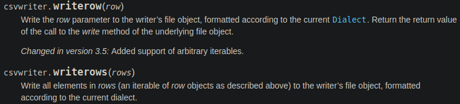

# CSV
Angelegt Freitag 04 März 2022

Internet: [CSV – python-Dokumentation](https://docs.python.org/3/library/csv.html)
Datei: [./csv — CSV File Reading and Writing — Python 3.10.2 documentation.html](./CSV/csv — CSV File Reading and Writing — Python 3.10.2 documentation.html)

* Man kann Reihen einzeln schreiben ``writerow`` oder als ``Iterable`` per ``writerows``

Für ``writerows`` bieten sich ``Generatoren`` an.

