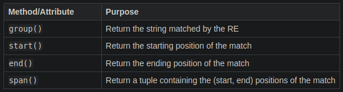
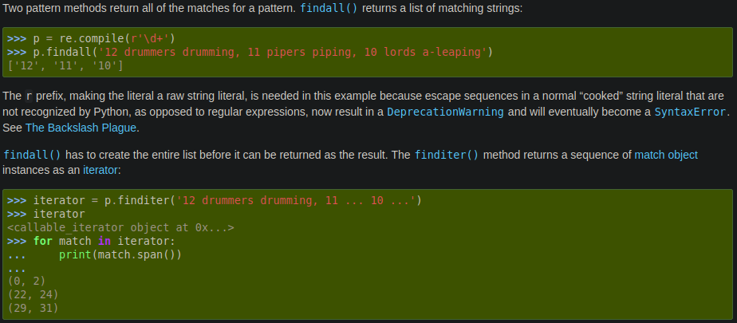

# regex
Angelegt Freitag 04 März 2022
@regex

19. auch [grep – MeinWiki_Linux]()

Internet: [regex – python-Dokumentation](https://docs.python.org/3/howto/regex.html)
Datei: [./Regular Expression HOWTO — Python 3.10.2 documentation.html](./regex/Regular Expression HOWTO — Python 3.10.2 documentation.html)

Verwendung
----------
	import re
	
	regex = re.compile('[a-z]+')
	match = regex.search('tempo')  # <re.Match object; span=(0, 5), match='tempo'>
	print(match.group())  # tempo

Um „Befehle“ wie ``\w``, ``\d``, ``\s``, etc. zu nutzen muss man einen ``r``-String verwenden, da sonst ``\n`` als ``newline`` interpretiert werden würde.

### Weitere Befehle mit denen nach einem Muster gesucht werden kann
| Befehl         | Erklärung                                                                                              |
|:---------------|:-------------------------------------------------------------------------------------------------------|
| ``search()``   | Scan through a string, looking for any location where this RE matches.                                 |
| ``match()``    | Determine if the RE matches at the beginning of the string.                                            |
| ``findall()``  | Find all substrings where the RE matches, and returns them as a list (s. screenshot at the end).       |
| ``finditer()`` | Find all substrings where the RE matches, and returns them as an iterator (s. screenshot at the end).. |

### Gefundenes Muster auswerten

Wurde **kein** Treffer gefunden ist das „``match``“-Objekt ``None``

Screenshot
----------

### findall() & finditer()

