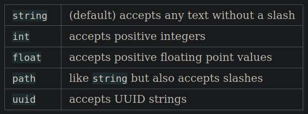

# Flask
Angelegt Samstag 09 Juli 2022

* [Flask-Doku](https://flask.palletsprojects.com/en/2.1.x/)
	* [Quickstart – Flask-Doku](https://flask.palletsprojects.com/en/2.1.x/quickstart/) (von dieser Seite stammt der meiste Inhalt)
	* [Tutorial – Flask-Doku](https://flask.palletsprojects.com/en/2.1.x/tutorial/) (ausführlicher als „Quickstart“, eine ganze Anwendung mit Datenbank wird aufgebaut und erklärt)

Sicherheit
----------
Falls Parameter per URL übergeben werden können, bspw.
	from markupsafe import escape
	
	@app.route("/<name>")
	def hello(name):
	    return f"Hello, {escape(name)}!"

sollte **IMMER** escapet werden, damit nicht durch fünf Ecken und Kanten doch eine Injection-Attacke stattfinden kann! Auch wenn es auf Anhieb nicht möglich ist ein Skript wie
	

per
``localhost:5000/``
zu übergeben (wegen des schließenden ``/``, der Ende des „Pfads“ markiert), sollte man sich nicht in falscher Sicherheit wiegen – Jede Eingabe von Außen ist böse.
@sicherheit @itsicherheit

Beispiel
--------
Das Programm ``flask_example.py``
	from flask import Flask
	app = Flask(__name__)  # Mit dem Objekt „app“, werden die Dekoratoren definiert; TODO herausfinden wofür genau
	
	@app.route('/')  # oder: app.route('/hello') für „localhost:5000/hello“
	def hello_world():
	    return 'Hello World!'

wird per
	export FLASK_APP=flask_example
	python -m flask run # oder „flask run“

gestartet. Wird die Datei als ``app.py`` gespeichert ist die Umgebungsvariable ``FLASK_APP`` nicht notwendig.
Greif man auf ``localhost:5000`` oder ``localhost:5000/`` (``5000`` ist der Standardport von ``Flask``; bspw. per Browser oder ``GET``-Request) zu, wird ``hello_world()`` ausgeführt, dh man erhält den String ``Hello World!`` zurück. Ändert man in ``@app.route('/')`` den Pfad von ``/`` zu ``/hello``, dann muss man auf ``localhost:5000/hello`` zugreifen, um die Methode auszufühen, unter ``localhost:5000`` findet man dan Nichts mehr (``404 HTTP Statuscode``).

### Weitere Beispiele

* Standardmäßig reagiert ``Flask`` nur auf ``GET``-Requests, weitere HTTP-Methoden sind möglich ([http-methods – Flask-Doku](https://flask.palletsprojects.com/en/2.1.x/quickstart/#http-methods)):

	from flask import request
	from flask import Flask
	app = Flask(__name__)
	
	@app.route('/login', methods=["GET", "POST"])
	def login():
		if request.method == "POST":
			return do_login()
		else: # GET-Request
	    	return show_login_form()
	
	# ODER
	
	@app.get("/login")
	def login_get():
		return show_login_form()
	
	@app.post("/login")
	def login_post():
		return do_login()

Routing/Pfadparameter
---------------------

* [variable-rules – Flask-Doku](https://flask.palletsprojects.com/en/2.1.x/quickstart/#variable-rules)
* Man kann die Pfade durch Pfadparameter (Gegenstück: „Query-Parameter“) variabel gestalten. bspw. per ``<variable_name>`` oder ``<converter:variable_name>``
* Die Funktionen benötigen den Namen des Pfadparameters als Argument

	from markupsafe import escape
	
	@app.route("/user/<username>")
	def get_user_profile(username):
		print(f"User {escape(username)}")
	
	@app.route("/user/<int:user_id>")
	def get_user_by_id(user_id):
		print(f"User-ID: {user_id}")

Verfügbare ``converter``:
.

* Query-Parameter: Haben bspw. die Form ``/profile?user=JohnDoe``

@sicherheit @itsicherheit

Diverses
--------

### Angehängte ``/``

* [unique urls redirection behavior – Flask-Doku](https://flask.palletsprojects.com/en/2.1.x/quickstart/#unique-urls-redirection-behavior)
* Es macht einen Unterschied, ob man am Pfad ein ``/`` anhängt oder nicht.
	* Mit (bspw. ``@app.route("/projects/")``: Eher als Ordner zu verstehen; Wird URL ohne angehängtem ``/`` aufgerufen, wird man trotzdem zu ``/projects/`` geleitet
	* Ohne (bspw. ``@app.route("/about")``: Eher als Datei zu verstehen. Wird URL mit angehängtem ``/`` gibt es einen ``404``-Statusfehler

### Templates
Man kann auch „vollwertige“ Internetseiten zurück geben, dafür benötigt man einen ``static``- und einen ``template``-Ordner. Ersterer enthält ``css``- oder ``JavaScript``-Skripte. Zweiterer den HTML-Code. Wird in ``Flask`` per ``render_template`` realisiert.
Für mehr Informationen: [Rendering Templates – Flask-Doku](https://flask.palletsprojects.com/en/2.1.x/quickstart/#rendering-templates)

### Unit-Test/Context Locals
Falls ich mal Tests für eine ``Flask``-Anwendung schreiben möchte, [Context Locals – Flask-Doku](https://flask.palletsprojects.com/en/2.1.x/quickstart/#context-locals) lesen

Argumente für ``flask run`` oder ``python -m flask run``
--------------------------------------------------------

* ``--host=0.0.0.0`` „Anwendung wird von außen sichtbar“; bspw. bei [docker]()-Container notwendig, um mit Anwendung interagieren zu können.

