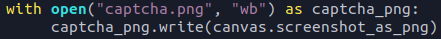

# Selenium
Angelegt Dienstag 04 Oktober 2022

* Tutorial: <https://www.youtube.com/watch?v=Xjv1sY630Uc>
* Gute Dokumentation: <https://selenium-python.readthedocs.io/>
* [Erste Schritte mit Selenium − Selenium-Doku](https://www.selenium.dev/documentation/webdriver/getting_started/first_script/)
* *chromedriver*: <https://sites.google.com/chromium.org/driver/downloads> (muss passend zur Google Chrome/Chromium-Version heruntergeladen werden, diese findet man unter „Menü > Über Google Chrome/Chromium“

ungoogled chromium, chromedriver
--------------------------------

* Mit [ungoogled-chromium − GitHub](https://github.com/ungoogled-software/ungoogled-chromium), bzw. [com.github.Eloston.UngoogledChromium − flathub](https://flathub.org/apps/details/com.github.Eloston.UngoogledChromium) funktioniert Selenium bzw. *undetected chromedriver* nicht. Ich habe auf verschiedenste Arten probiert den Binary-Pfad zu setzen, hat alles nicht funktioniert. Deswegen habe ich zusätzlich auch das klassische Chromium installiert.
* in [~/programmieren/python/chromedriver-udu_dog](file:///home/philipp/programmieren/python/chromedriver-udu_dog) habe ich per [:Linux:**vim**]() die Variable ``udu_`` durch ``dog_`` ersetzt, da dass *Selenium* verschleiern soll, ob's etwas bringt, weiß ich nicht. Gelesen habe ich das bei *StackOverflow*.

Weiterführende Links
--------------------

* [how-can-i-check-if-webelement-exists-in-selenium – StackOverflow](https://stackoverflow.com/questions/56565642/how-can-i-check-if-webelement-exists-in-selenium)

Detektion verhindern
--------------------

* <https://stackoverflow.com/questions/53039551/selenium-webdriver-modifying-navigator-webdriver-flag-to-prevent-selenium-detec/53040904#53040904>
* [way-to-change-google-chrome-user-agent-in-selenium − stackoverflow](https://stackoverflow.com/questions/49565042/way-to-change-google-chrome-user-agent-in-selenium/49565254#49565254)
* <https://pypi.org/project/selenium-stealth/>
* [undetected-chromedriver − pypi](https://pypi.org/project/undetected-chromedriver/)

Warten
------

* [python-selenium-wait-until-element-is-fully-loaded – StackOverflow](https://stackoverflow.com/questions/50468629/python-selenium-wait-until-element-is-fully-loaded)
* [Waits in Selenium − readthedocs](https://selenium-python.readthedocs.io/waits.html)

Elemente finden
---------------

* Mit [locators − Selenium-Doku](https://www.selenium.dev/documentation/webdriver/elements/locators) kann man Elemente auch finden, falls ``ID`` fehlt oder sonst etwas nicht funktioniert. Dabei sind vor allem die relativen Lokatoren interessant.
	* Das Objekt muss, wie es ist in ``find_element(…)`` eingesetzt werden.

Screenshots
-----------

* per ``driver.find_element(…).screenshot_as_png`` kann man Screenshots von Elementen, bspw. einem Bild oder einem *Canvas* machen und speichern (in ``with``-Statement per ``"b"`` schreiben)

