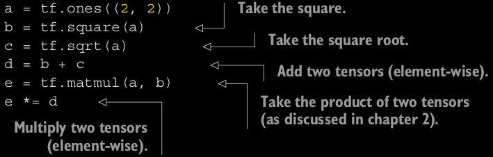
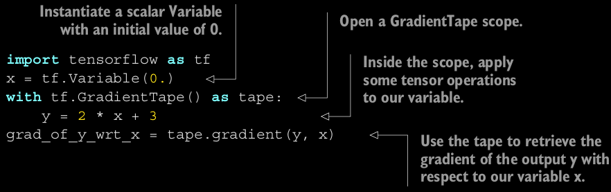
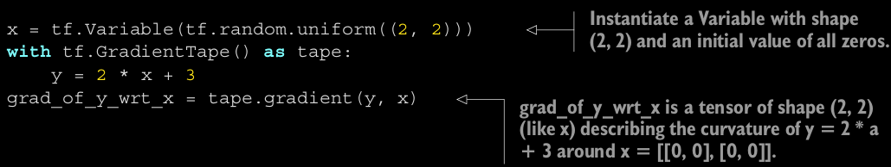
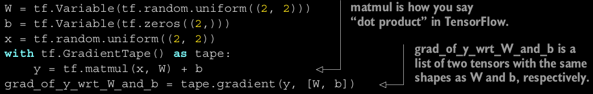
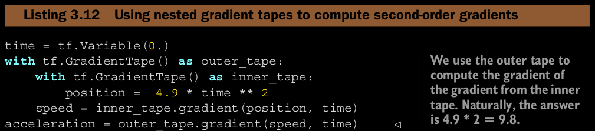

# TensorFlow
Angelegt Freitag 04 März 2022
@deeplearning @keras @tensorflow @python @tensor

[TensorFlow – Startseite](https://www.youtube.com/watch?v=MvfyehKrkig)

Einführung
----------

### Tensoren initialisieren
	tf.ones(shape=(2,1))  # == np.ones(shape(2,1))
	tf.zeros(shape=(2,1))  # == np.zeros(shape(2,1))
	tf.random.normal(shape=(3, 1), mean=0., stddev=1.)
	tf.random.uniform(shape=(3, 1), minval=0., maxval=1.)

Syntax sehr ähnlich zu [numpy – MeinWiki.Python](./numpy.md).

* Tensoren sind im Vergleich zu ``numpy`` konstant. Der Code

	x = tf.ones(shape=(2, 2))
	x[0, 0] = 0

wird mit
``EagerTensor object``
``does not support item assignment.``
fehlschlagen (bei ``numpy`` wäre das problemlos möglich)

### tf.Variables

* Die Klasse ``tf.Variables`` ist dafür da modifizierbare Zustände in ``TensorFlow`` zu verwalten.
* Für Initialisierung ist Tensor notwendig:

	v = tf.Variable(initial_value=tf.random.normal(shape=(3, 1)))

* Können per ``assign``-Methode verändert werden:

	v.assign(tf.ones((3, 1)))
	v[0, 0].assign(3.)

* ``+=`` wird zu ``assign_add()``
* ``-=`` wird zu ``assign_sub()``

### Tensor-Operationen

Alle Berechnungen werden direkt ausgeführt (sodass man sich jederzeit das Resultat printen kann). Dieses Prinzip wird „**eager execution**“ genannt.

Kapitel 3.1 aus [Deep Learning with Python]() – What is TensorFlow?
-------------------------------------------------------------------
TF bietet eine Vielzahl an mathematischen Operationen für mehrdim. Arrays ([Tesoren – Lexikon]()) an aber kann im Vergleich zu [numpy – Python](./numpy.md) mehr:

* TF kann automatisch Ableitungen berechnen
* Läuft auf CPU, GPU, TPU
* Berechnungen können leicht verteilt werden
* TF-Operationen können für C++ oder JavaScript exportiert werden
* Ist eine Platform für viele Zwecke und keine „blanke“ Library

Diverses
--------

* ``w.assign_sub(g * learning_rate)  assign_sub`` is the equivalent of ``-=`` for TensorFlow variables.
* ``numpy()  ``Calling ``numpy()`` on a TensorFlow tensor converts it to a NumPy tensor.
* ``tf.reduce_mean(<TENSOR>)  ``Berechnet Durchschnitt   

GradientTape
------------
TensorFlow verfügt über die Technik der **automatic differentiation**, dh. TensorFlow kann die Ableitung anhand des Vorwärtsschrittes (@forwardpass) selbst berechnen. Dies geschieht mit **``GradientTape``**. Man kann es sich so vorstellen, dass innerhalb eines ``GradientTape``-Scopes alle Operation aufgezeichnet und dann die Ableitungen berechnet werden. In einem ``GradientTape`` arbeitet man mit der ``tf.Variable``-Klasse.

* Nur **trainable variables** (``tf.Variables``) werden in einem ``GradientTape`` a priori für Gradientenberechnung in Betracht gezogen
	* Möchte man blanken Tensor ``t``, der normalerweise konstant ist, s. „Einführung – Tensoren initialisieren“, verwenden, muss ``tape.watch(t)`` aufgerufen werden.

Das ist notwendig, weil es sonst zu aufwendig wäre, alles für alles möglichen Ableitungen zu speichern.

### Beispiele

	
Man kann einen Ausdruck auch direkt nach mehrere Variablen (bspw. Eingabe und Gewichte) ableiten.

	
Ableitung 2. Grades

