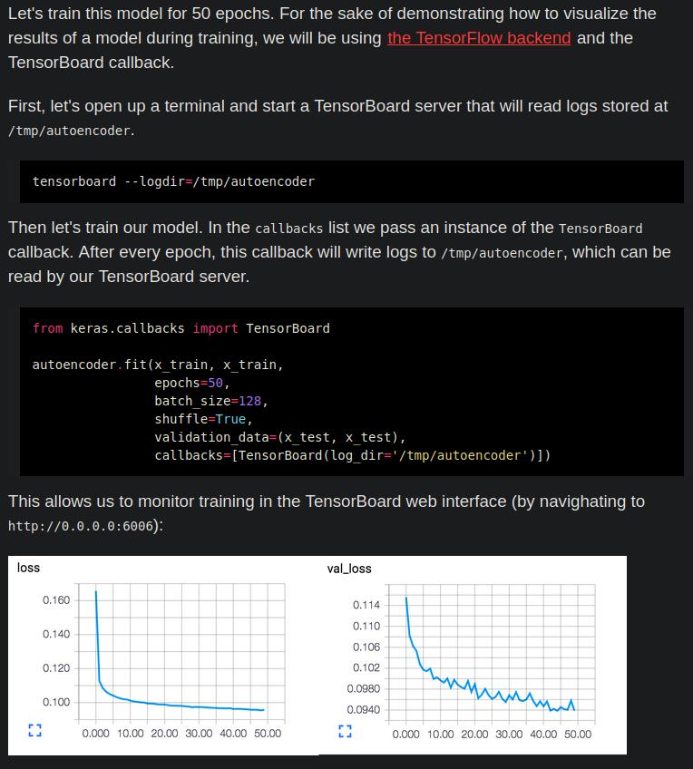

# keras
Angelegt Freitag 25 Februar 2022
@deeplearning @keras @tensorflow @python

[Keras – Startseite](https://keras.io/)

19. auch
	* [Deep Learning with python – MeinWiki]()
	* [Lexikon – MeinWiki]()

* [Hier](https://keras.io/api/models/model_training_apis/) findet sich die Dokumentation zu folgenden keras-Funktionen:

``Model.compile   ``Konfiguriert Model für's Training
``Model.fit       ``Trainiert das Model
``Model.predict   ``Stellt Vorhersagen auf
``Model.evaluate  ``-

* Die ``Sequential``-Klasse ist dafür da, Schichten sequentiell zusammenzuhängen, um diese später ausführen zu können.
* **Kapitel 2.5** aus [Deep Learning with Python]() ist für's Nachvollziehen sehr **interessant**!
* Um mithilfe von Daten zu lernen, muss man Annahmen über diese treffen. Diese definieren, was gelernt werden kann – diese spiegeln sich in der Netzwerktopologie wider und ist deswegen sehr wichtig.

Eine gute Architektur zu wählen, muss man üben.
Bsp: 2-Klassen-Klassifikationsproblem, Model beinhaltet eine ``Dense``-Schicht und keine Aktivierungsfunktion. Dann nimmt man automatisch an, dass sich die Klassen linear trennen lassen. @topologie

Kapitel 3.2 aus [Deep Learning with Python]() – What is Keras?
--------------------------------------------------------------

* Deep Learning API mit [Tensorflow – Python](./TensorFlow.md) als Grundlage
* Läuft auf verschiedener Hardware und kann verteilt werden (wie bei [TensorFlow – Python](./TensorFlow.md)

Aufbau eines Modells
--------------------

19. [Aufbau eines Modells – Python.Keras.Code-Beispiele](./keras/Code-Beispiele.md)

Convolutional Layer
-------------------
Internet: [tf.keras.layers.Conv2D – Keras-Doku](https://www.tensorflow.org/api_docs/python/tf/keras/layers/Conv2D)
Datei: [ TensorFlow Core v2.8.0.html|TensorFlow Core v2.8.0.html](./keras/tf.keras.layers.Conv2D )
	tf.keras.layers.Conv2D(
	    filters, kernel_size, strides=(1, 1), padding='valid',
	    data_format=None, dilation_rate=(1, 1), groups=1, activation=None,
	    use_bias=True, kernel_initializer='glorot_uniform',
	    bias_initializer='zeros', kernel_regularizer=None,
	    bias_regularizer=None, activity_regularizer=None, kernel_constraint=None,
	    bias_constraint=None, **kwargs
	)

* ``padding="same"`` & ``strides=1`` (oder ``(1,1)``) ⇒  Ausgabe selbe Dimension wie Eingabe

Modell speichern und laden
--------------------------

### Speichern
Ähnlich zu Checkpoints kann man ein Modell nach dem Training speichern:
``model.save(PFAD.h5)``

### Laden
Modell laden (egal, ob es ein Checkpoint ist oder Training abgeschlossen wurde):
``model = keras.models.load_model(PFAD)``

### Training fortsetzen (resume training)
	model = keras.models.load_model(PFAD)
	model.compile(...)  # Entweder neue Parameter oder die alten, bspw. wenn man einen Checkpoint lädt (aber auch dann kann man natürlich Neue übergeben)
	initial_epoch = 30000
	model.fit(train_x, train_y, initial_epoch=initial_epoch, ...)  # Neuer & wichtiger Parameter: „initial_epoch“, Rest kann frei gewählt werden oder analog zum Checkpoint

Callbacks
---------

* [Callback – keras-Doku](https://keras.io/api/callbacks/)

### Modell während des Trainings speichern (Checkpoint)
⇒ s. auch (unter [keras – Python](#Python:Module:keras), Name evtl. verschieden) „Modell laden“, um mit einem gespeicherten Modell weiterzutrainieren.

* <https://keras.io/guides/training_with_built_in_methods/#checkpointing-models>
* [ModelCheckpoint – keras-Doku](https://keras.io/api/callbacks/model_checkpoint/)
* [Serialization and saving – keras-Doku](https://keras.io/guides/serialization_and_saving/)
* Modell nach eigenen Vorgagebn, bspw. alle 4 Epochen speichern (von [Save keras model at specific epochs – Stackoverflow](https://stackoverflow.com/questions/54323960/save-keras-model-at-specific-epochs)):

	checkpoint = keras.callbacks.ModelCheckpoint("PATH/model.h5", period=4)
	model.fit(callbacks=checkpoint)  # <callbacks> nimmt auch Listen

oder (bietet unter'm Strich mehr Möglichkeiten aber hier in demselben Kontext):
	class CustomSaver(keras.callbacks.Callback):
	    def on_epoch_end(self, epoch, logs=None):
	        if epoch % 4 == 0:
	            self.model.save("PFAD.h5d")
	saver = CustomSaver()
	model.fit(callbacks=[saver])  # <callbacks> nimmt auch Listen

### TensorBoard
@TensorBoard
Damit kann man das Training überwachen:

