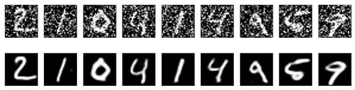
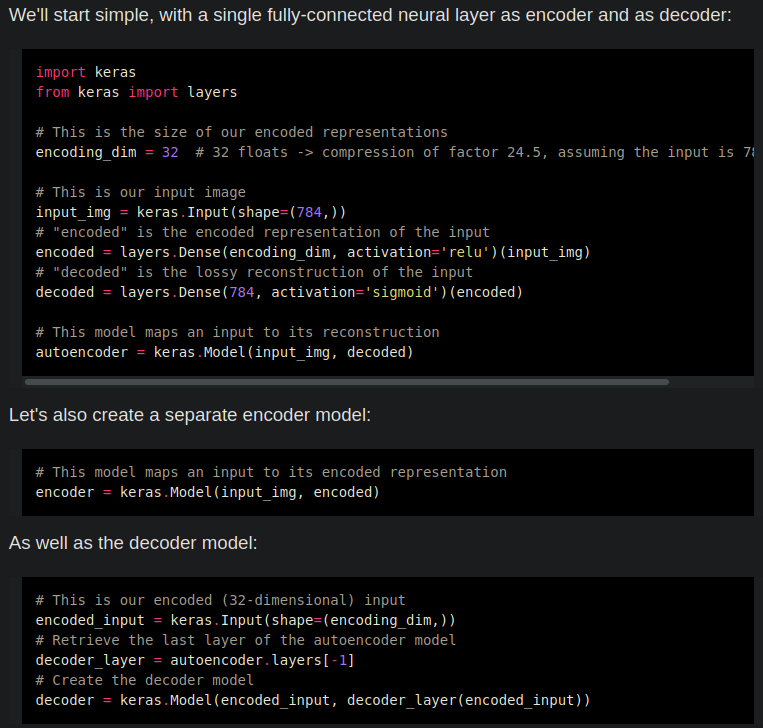
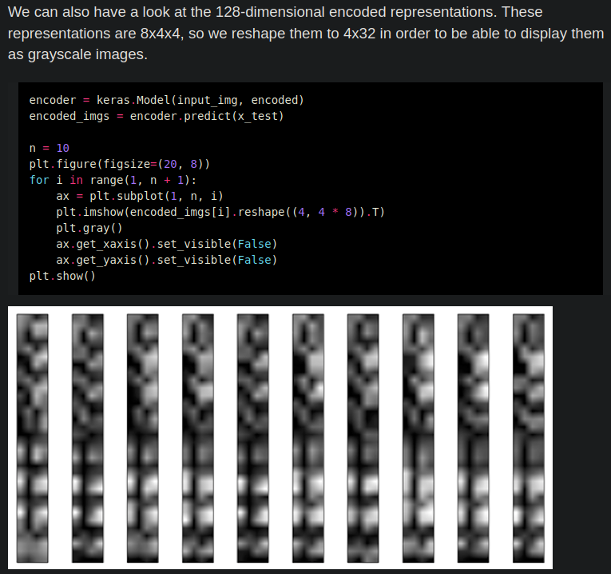
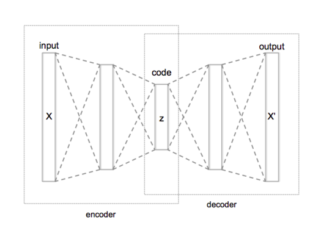
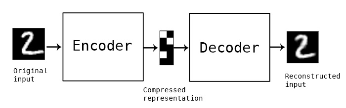

# Autoencoder
Angelegt Samstag 26 Februar 2022

Internet: [Buildung Autoencoders in Keras – Keras-Blog](https://blog.keras.io/building-autoencoders-in-keras.html)
Datei: [./Building Autoencoders in Keras.html](./Autoencoder/Building Autoencoders in Keras.html)

Abstrakt
--------

* Mit AE soll dass Netzwerk so trainiert werden, dass es die Eingabedaten auf ihre wesentlichen Elemente reduziert.
* Training: 

**Encode**: X wird in seiner Dimension auf z reduziert
**Decode**: aus z wird probiert X zu rekonstruieren
Loss: || X - X' ||², also der Abstand zwischen Original und Rekonstruktion oder irgendein anderer
⇒ Deswegen gut für **Unsupervised Learning** bzw. **Self-supervised Learning**

* In der Anwendung wird dann nur der Encoder benutzt
* Sehr gut geeignet für verrauschte Daten:

Zusammenfassung
---------------

* AE sind
	* **Daten-spezifisch** (wenn sie mit Gesichtern trainiert wurden, schneiden sie bei Bäumen schlecht ab)
	* **verlustbehaftet** (Rekonstruktion wird Qualität des Originals nie erreichen)
	* **vielseitig einsetzbar** (eine Architektur kann für viele Eingabetypen wie Autos, Bäume, Schrift, etc. verwendet werden ohne sie ändern zu müssen)
* Wegen Daten-Spezifizität schlecht für Kompression
* Geeignete Anwednungsgebiete:
	* Data Denoising
	* Dimensionality reduction for data visualization
		* Strategie für hochdimensionale Daten: Mit Autoencoder auf (relativ) geringe Dimension, zB 32, redzuieren und dann [t-SNE – Wikipedia](https://en.wikipedia.org/wiki/T-distributed_stochastic_neighbor_embedding) verwenden (ist gegenwärtig [26.02.2022] der beste Algorithmus für 2D-Visualisierungen, braucht aber relativ niedrigdimensionale Daten)
* Kann man gut mit Filtern kombinieren, va. wenn man viele Schichten verwendent @filter @convolutional_layer

Autoencoder in Keras
--------------------
In [keras – ZimWiki](../keras.md) besteht ein Autoencoder aus mehrere Modellen, einem **Encoder**-Modell und einem **Decoder**-Modell, die wiederum aus mehreren Modellen/Schichten aufgebaut sind, die dann zusammengesteckt werden (Genau so, ist auch die Theorie beschrieben). Man kann sich dann mit dem Encoder-Modell auch die Reduktion einer Angabe anschauen.

### Aufbau eines AE

### Darstellung der Ausgabe des Encoders

Schematischer Aufbau eines Autoencoders
---------------------------------------

