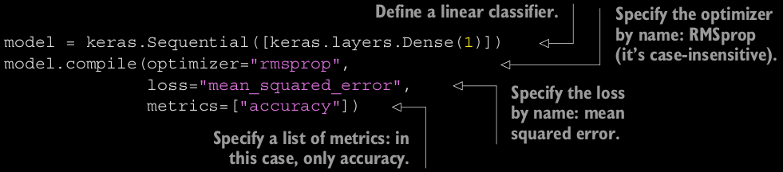
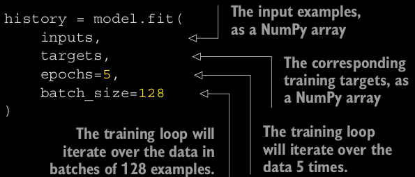
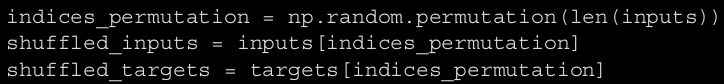
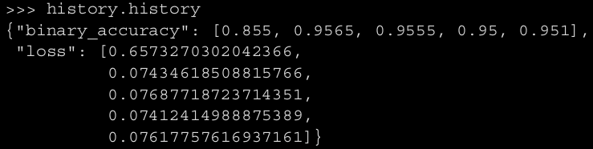
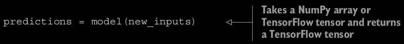
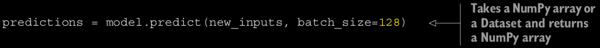

# Das Modell
Angelegt Dienstag 08 März 2022

Ziel ist es, kein Modell zu schaffen, das gut auf Trainingsdaten abschneidet, sondern auf gänzlich unbekannten Eingaben. Nur weil im Training gut abschneidet, bedeutet es nicht, dass es das auch auf neuen Daten tut (bspw. kann es sich auf blaue Himmel konzentrieren, weil zufällig alle Katzenbilder einen Wolkenlosen zeigen). Lösung: **Validation data**.

compile()-Funktion
------------------
Konfiguriert das Netzwerk abschließend

### Optimizer
@optimizer, s. auch [Optimizer – Masterarbeit > Lexikon]()
Können als String angegeben werden, case-insensitive.
Verwendet man den Konstruktor, können die Parameter wie die @learningrate bearbeitet werden

* ``keras.optimizers.RMSprop() == "rmsprop"``
* ``SGD``
* ``Adam``
* ``Adagrad``

etc.

### Loss
@loss, s. auch [Loss – Masterarbeit > Lexikon]()

* Können als String angegeben werden, case-insensitive
* Müssen der Andwendung angepasst werden: Wenn ich bspw. mit Wortvektoren arbeite, bietet sich ``CategoricalCrossentropy`` nicht an, dafür ``MeanSquaredError``. Durch die falsche Verlust-Funktion explodierte der Loss (ins Negative) bis er schließlich ``NaN`` erreichte und das Natzwerk nicht lernte.

### Beispiele

* ``keras.losses.MeanSquaredError() == "mean_squared_error"``
* ``CategoricalCrossentropy``

Für Multiklassen-Klassifikation

* ``SparseCategoricalCrossentropy``
* ``BinaryCrossentropy``

Für 2-Klassen-Klassifikation

* ``KLDivergence``
* ``CosineSimilarity``

etc.

### Metrics

* ``keras.metrics.BinaryAccuracy() == accuracy``
* CategoricalAccuracy
* ``SparseCategoricalAccuracy``
* ``BinaryAccuracy``
* ``AUC``
* ``Precision``
* ``Recall``

etc.

fit()-Funktion
--------------
Die ``fit()``-Methode führt das Training durch

Argumente:		

* ``input data  numpy``-Array oder TensorFlow-``Dataset``-Objekt	
* ``labels``/``targets  numpy``-Array oder TensorFlow-``Dataset``-Objekt
* ``number of epochs  ``Gibt an, wie oft über die Daten pro Trainingsdurchlauf iteriert werden soll.
* ``batch_size  ``Klar
* ``validation_data  ``Teilmenge der Traingsdaten, um Loss und Metrics-Wert zu berechnen; ``numpy-Array`` oder ``TensorFlow-Dataset``-Objekt. Sollte ggfl. randomisiert aus der Testmenge entnommen werden, vor allem, wenn diese sortiert vorliegt:

### Validation data
Um stets ein Auge darauf zu haben, wie Modell bei neuen Daten abschneidet, kann man sich Teilmenge der Trainingsdaten, die **validation data**, reservieren. Es ist sehr wichtig Trainingsdaten und Validation data zu trennen, um unverzerrtes Ergebnis zu erhalten.

Rückgabe: ``History``-Objekt, das ``history``-Attribut aufweist, dass @loss und @metrics für jede Epoche enthält.

evaluate()-Funktion
-------------------
Berechnen von ``validation loss`` und ``metrics`` nach dem Trainings:
	loss_and_metrics = model.evaluate(val_inputs, val_targets, batch_size=128)

Iteriert in Batches über die Daten.

call()- und predict-Methode
---------------------------
Für Vorhersagen nutzt man die ``__call__()``- oder ``predict``-Methode:

**Vorteil** von ``predict``:

* Iterier in Batches, dh. nicht so Speicher-intensiv
* kann auch ``TensorFlow-Dataset``-Objekte produzieren

