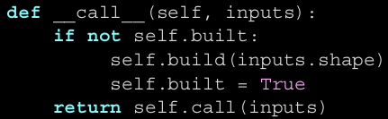
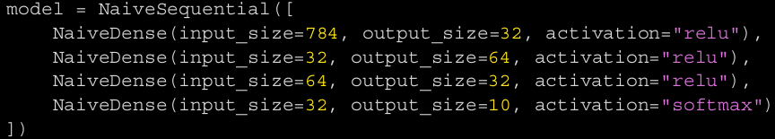

# Layer-Klasse
Angelegt Dienstag 08 März 2022

* Alles in Keras ist entweder vom Typ ``keras.layers.Layer`` oder interagiert stark mit diesem; Alle Schichten erben von diesem Typ
* Beinhaltet **Zustand**/**Gewichte** und **Berechnungstechnik**/**Forward pass**
	* Gewichte werden in ``build()``-Methode oder ``__init__()`` definiert
		* ``self.add_weights(<SHAPE>, <INITIALIZER>)`` ist Hilfsmethode, um Gewichte zu generieren @gewichte @weights
	* ``❗️``Berechnungsmechanik findet sich in ``call()`` **nicht in** ``__call__()``

⇒ **Dadurch wird es möglich, dass man im Konstruktor nur die Ausgabeneuronen angibt und Keras die Eingabeneuronenanzahl selbst ableiten kann**. Die ``build()``-Methode wird beim ersten Aufruf der Schicht vie ``__call__()`` ausgeführt. Diese sieht schematisch wir folgt aus:
.

* **Man gibt bei Schichten oft nur die Ausgabedimension bzw. die Anzahl der Ausgabeneuronen an**. Keras konfiguriert diese dann so, dass sie passende Anzahl an Eingaben erhalten, abhängig von der Vorgängerschicht.

Ausgabe Schicht~i~ = Eingabe Schicht~i+1~

* So ist es einfacher, da man keine Doppelungen hat

und wenn die Ausgabegröße komplex ist, bspw. ``input_size * 2 if input_size % 2 == 0 else input_size * 3``, muss man sich auch keine Gedanken machen.

* Neben der @topologie muss man noch Folgendes wählen:
	* [Loss function – Masterarbeit.Lexikon]() @loss
	* [Optimizer – Masterarbeit.Lexikon]() @optimizer
	* [Metrics – Masterarbeit.Lexikon]() @metrics

⇒ Sind ``Keyword``-Argumente für die ``compile()``-Funktion (s. unten)

Aktivierungsfunktionen
----------------------
Sind dazu da, Nichtlinearitäten ins Netzwerk einzubinden. Kann (teilweise) auch als String (``"relu"``) angegeben werden.

* ``tf.nn.relu``

