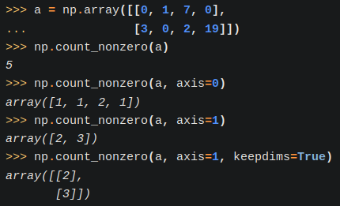
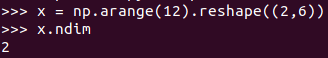
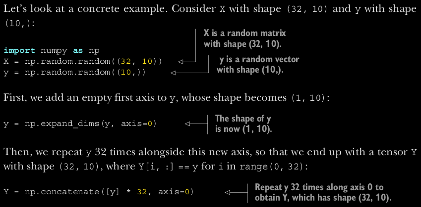

# numpy
Angelegt Freitag 25 Februar 2022
@numpy

* In [numpy-Anleitung.ipynb](file:///home/philipp/Programmieren/jupyter-notebooks/numpy-Anleitung.ipynb) oder [numpy-Anleitung.py](file:///home/philipp/Programmieren/jupyter-notebooks/numpy-Anleitung.py) finden sich viele Beispiele.

### numba
[numba – Doku](https://numba.pydata.org/) ist gut dazu geeignet numerische Berechnungen vor allem mit [numpy – MeinWiki](#Python:Module:numpy) oder ``scipy`` durchzuführen. Es bietet sich an, wenn man diese Module viel nutzt oder häufig Schleifen verwendet. (Für „klassische“ Arbeiter-Thread-Aufgaben, wie das berechnen eines Wortvektors von [spaCy – MeinWiki](), ist es dagegen nicht geeignet, weil es [spaCy – MeinWiki]() nicht kennt.)

Limits für floats
-----------------
[numpy.finfo – numpy-Doku](https://numpy.org/doc/stable/reference/generated/numpy.finfo.html)
Größte, kleinste Zahl, kleinste betragsmäßige Zahl, etc,
``np.finfo(float).``
``eps  ``Kleinste darstellbare Zahl (Differenz zwischen ``1.0`` und der nächsten darstellbaren Zahl größer als ``1.0``)
``max  ``Größter float
... und vieles mehr.

axis-Attribut
-------------
Ein ``1d``-Array hat ``1`` ``axis``, ein ``2d``-Array hat ``2`` ``axes`` (Plural), ein ``3d``-Array hat ``3`` ``axes``, usw. Per ``axis`` wird sozusagen die grundlegende Dimension des Arrays wiedergegeben. Auf jeder ``axis`` findet sich dann die Länge. Das ist analog zu Tensoren und Vektoren zu verstehen: Ein Tensor 1. Stufe (ein Vektor) hat 1 „Achse“ aber kann beliebig viele Einträge haben, die Dimension des Vektors ist dadurch nicht festgelegt. Ein Tensor 2. Stufe (eine Matrix) hat 2 „Achsen“, an denen Elemente gelistet werden aber die Dimension der Matrix ist dabei nicht weiter spezifiziert.
⇒ Genau so sind ``numpy``-Array zu verstehen. Es sind im Prinzip Tensoren.

Das ``axis``-Attribut kann bspw. in ``np.count_nonzero()``, ``np.concatenate()`` oder ``np.sum()`` verwendet werden.

### Beispiel
Der ``axis``-Parameter gibt an, mit welcher „Parallelität“ die Operation durchgeführt werden soll, vorab Beispiele:

* ``np.count_nonzero(a, axis=0)`` bedeutet daher, dass man parallel zu ersten Achste vorgeht. Das entspricht in diesem Fall den Spalten.

In diesem Fall kann man sich zwei verschachtelte Schleifen vorstellen:
	results = []
	for spalte in range(len(a[0])):
		res = 0
		for zeile in range(len(a)):
			res += f(a[zeile][spalte])
		results.append(res)

* ``np.count_nonzero(a, axis=1)`` bedeutet daher, dass man parallel zu zweiten Achste vorgeht. Das entspricht in diesem Fall den Zeilen, denn diese breiten sich orthogonal zur ersten Achse aus.

In diesem Fall kann man sich zwei verschachtelte Schleifen vorstellen:
		results = []
		for zeile in range(len(a)):
			res = 0
			for spalte in range(len(a[0])):
				res += f(a[zeile][spalte])
			results.append(res)

* Allgemein gilt: Wenn man die höchste Achse angibt, dann werden die Achsen in ihrer kanonischen Reihenfolge durchschritten.

* Weitere Vorstellung:
	* ``axis=0  ``Es wird eine weiteres Element, ein Vektor, an die erste Achse (Index ``0``) gehängt, dass das „kommulative Resultat der Operation entlang der logischen Richtung“ beinhaltet (im ``2d``–Fall lautet diese „logische Richtung“: von oben nach unten)
	* ``axis=1  ``Es wird eine weiteres Element, ein Vektor, an die zweite Achse (Index ``1``) gehängt, dass das „kommulative Resultat der Operation entlang der logischen Richtung“ beinhaltet (im`` 2d``–Fall lautet diese „logische Richtung“: von links nach rechts)
	* ``axis=2``  Es wird eine weiteres Element, eine Ebene, an die dritte Achse (Index ``2``) gehängt, dass das „kommulative Resultat der Operation entlang der logischen Richtung“ beinhaltet (im ``3d``–Fall lautet diese „logische Richtung“: von oben nach unten **auf der z-Achse**)

Printe np-Arrays
----------------

* Printe ``numpy``-Array ohne Auslassungen („``...``“):

	import numpy as np
	np.set_printoptions(threshold=np.inf)

* Printe ``numpy``-Array ohne Umbrüche:

	m = numpy_array.tolist()
	print(*m, sep="\n")

numpy-Array speichern
---------------------
	a = np.arange(6)
	np.save("./numpyarray.npy", a)  # Ich glaube, .npy-Endung ist wichtig, da sie in der load-Funktion als Bedingung auftaucht
	b = np.load("./numpyarray.npy")

Mehrfachzugriff auf np-Arrays
-----------------------------
Andere ``np``-Arrays können als Argument in ``[]`` verwendet werden, um bspw. auf mehrere Elemente gleichzeitig zugreifen zu können:
	a = np.arange(5) * 2
	indices = np.array([2, 0, 3])  # Darf keine Zahlen größer als der höchste Index enthalten
	print(f"{a[indices] = }")  # array([4, 0, 6])

Shape von numpy-Arrays
----------------------
	np.zeros((5,)) == np.zeros((5)) == np.zeros(5)

``np.ndim  ``Dimension von ``numpy``-Arrays; **Länge** von ``shape``-Attribut (``len(x.shape))``)

Broadcasting
------------
Wenn man zwei Tensoren/Numpy-Arrays addiert, sollten sie dieselbe Größe haben. Falls dem nicht so ist, wird der kleinere Tensor in zwei Schritten in die Form des Größeren gebracht:

1. **Axes** (s. [Lexikon: Axes – MeinWiki]()) werden hinzuaddiert, sodass sich das ``ndim``-Attribut gleicht
2. Der kleinere Tensor wird entlang der neuen Achsen dupliziert

### Matrix zeilenweise Normieren
Beim zeilenweisen Normieren kann Broadcasting verwendet werden (s. auch [Alles mögliche – numpy](./numpy/Alles_mögliche.md):
	a = np.arange(9).reshape((3, 3))
	row_sums = a.sum(axis=1)
	new_matrix = a / row_sums[:, np.newaxis]

np.concatenate
--------------
[./numpy_concatenate.py](./numpy/numpy_concatenate.py)
	import numpy as np
	
	x = np.arange(12).reshape((3, 4))
	a = np.concatenate([x] * 2, axis=0)  # (6, 5)
	b = np.concatenate([x] * 2, axis=1)  # (4, 8)
	
	q = np.arange(8).reshape((2, 2, 2))
	w = np.arange(8).reshape((2, 2, 2)) * 2
	e = np.concatenate([q, w], axis=1)  # (2, 2, 4)
	print(e)
	
	X = np.random.random((32, 10))
	y = np.random.random((10,))
	y = np.expand_dims(y, axis=0)  # (1, 10)
	Y = np.concatenate([y] * 32, axis=0)  # 32x (1, 10) |-> (32, 10)
	Y = np.concatenate([y] * 32, axis=1)  # 32x (1, 10) |-> (1, 320)
	# Jetzt könnte man X & y addieren, da sie dieselbe Form haben
	
	y = np.arange(15).reshape((3, 5))
	# Funktioniert nicht, weil sich x, y auf axis=0 nicht gleichen
	# c = np.concatenate([x, y], axis=0)
	
	"""
	    axis = 0:
	        Schreibe alles, was sich auf der ersten Achse (diese kann jede beliebige Dimension haben) befindet, hintereinander
	            Erste Achse, alles, was man mit einer [] erreichen kann
	        Aber: Alles muss dieselbe Länge auf den Folgeachsen haben, dh. (3,4) & (3,5) kann NICHT konkateniert werden
	    axis = 1:
	        Schreibe alles, was sich auf der zweiten Achse findet, hintereinander
	            zweite Achse: Alles, was man mit [i][] erreichen kann für festes i
	        Aber: Alles muss auf axis=0 dieselbe Dimension haben, dh. (3,4) & (4,6) kann NICHT konkateniert werden.
	"""

Wenn man zwei Arrays A & B der Form (x~1~, x~2~, ..., x~n~) per axis=k, 0<=k<=n-1, konkateniert, muss sich die Form bis
Achse k-1, dh von x~1~ bis x~k-1~, gleichen. Ruft man im neuen Array dann [i~1~, ..., i~k-1~] auf, finden sich „hinter
dieser Türe“ alle Elemente (entweder Zahlen oder Arrays), die sich bei A & B hinter diesen Koordinaten befinden.

Gleichheit von Arrays
---------------------
<https://numpy.org/doc/stable/reference/generated/numpy.array_equal.html>
	np.array_equals(a1, a2)

oder
	tmp = a1 == a2
	tmp.all()
	# Kurzform: (a1 == a2).all()

Padding
-------
<https://numpy.org/doc/stable/reference/generated/numpy.pad.html>
**Rudimentäre** Signatur:
	numpy.pad(array, pad_width, mode='constant', **kwargs)

``pad_width  ``Folge von 2er-Tupeln für jede ``axis`` gemäß ``(<Anz. Werte davor>, <Anz. Werte danach>)``. Das erste Tupel, bspw ``(1, 2)`` würde bedeuten, dass man eine Reihe „davor“ und zwei Reihen „danach“ hinzufügt.
``constant_values  ``verhält sich ``pad_width``. Hier Gibt man die Werte, mit denen gepadded werden soll, an. ``(-1, 1)`` bedeutet dabei, dass die Indizes „davor“ mit ``-1``, die „danach“ mit ``1`` befüllt werden sollen.

Es gibt viele Möglichkeiten zu padden ⇒ in obige Doku schauen!

### Beispielhafte Verwendung
	import numpy as np
	x = np.zeros((2,3))
	# array([[0., 0., 0.],
	#        [0., 0., 0.]])
	
	# „negativ“ soll „davor“ &
	# „positiv“ soll „danach“ implizieren
	y = np.pad(x, [(1, 2), (0, 0)], constant_values=[(-1, 1)])
	# array([[-1., -1., -1.],
	#        [ 0.,  0.,  0.],
	#        [ 0.,  0.,  0.],
	#        [ 1.,  1.,  1.],
	#        [ 1.,  1.,  1.]])
	
	# Gibt man nur „(1,2)“ an, so wird auch für axis=1 gepaddet, bzw. für alle folgenden <axis>
	y = np.pad(x, [(1, 2)], constant_values=[(-1, 1), (-2, 2)])
	# array([[-2., -1., -1., -1.,  2.,  2.],
	#        [-2.,  0.,  0.,  0.,  2.,  2.],
	#        [-2.,  0.,  0.,  0.,  2.,  2.],
	#        [-2.,  1.,  1.,  1.,  2.,  2.],
	#        [-2.,  1.,  1.,  1.,  2.,  2.]])

Algebraische Operationen
------------------------
für ``np.dot(A, B)`` muss die letzte Dimension von ``A`` der ersten von ``B`` entsprechen.

* Skalarprodukt: ``np.dot(v, w)``
* Matrixmultiplikation: ``np.dot(A, B)``
	* allgemein (hier wird nur auf die Form Bezug genommen):

(a, b, c, d) • (d,) → (a, b, c)
(a, b, c, d) • (d, e) → (a, b, c, e)

* Transponieren: ``np.transpose(<matrix>)``

