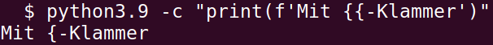

# Standarddatentypen
Angelegt Freitag 10 Juni 2022

Dictionaries
------------

* Schleifen, for, iterieren

	for key in dictionary:
		[...]
	for key, value in dictionary.items()

* Schlüssel/Key in Dictionary:

	key in dictionary

* Dictionary als Liste (von KV-Paaren)

``dictionary.items()``
@dict @dictionary

Listen
------

* ``myList.sort(key=KEY, ...)`` sortiert** in situ**!
* ``sortedList = sorted(myList, key=KEY, ...)`` sortiert **nicht in situ**! 

Strings
-------

### b-Strings
[what does the b character do in front of a string literal – StackOverflow](https://stackoverflow.com/questions/6269765/what-does-the-b-character-do-in-front-of-a-string-literal)

### f-Strings

* ``{`` in ``f-Strings`` (geschweifte Klammer, Bracket)

@fstring

