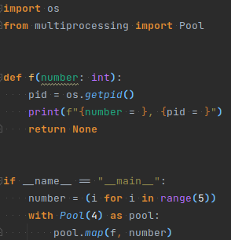
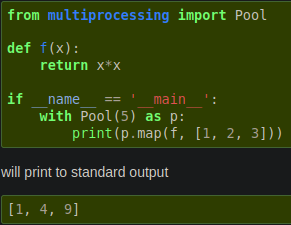
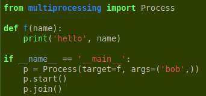
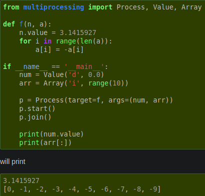
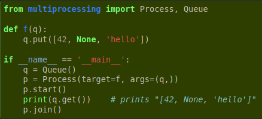
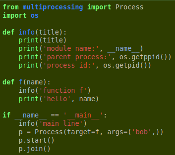
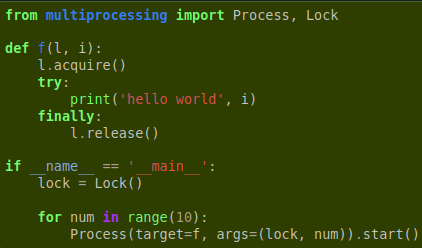

# Threads & Parallele Programmierung
Angelegt Montag 28 März 2022

[multiprocessing – Python-Doku](https://docs.python.org/3/library/multiprocessing.html)
[threading – Python-Doku](https://docs.python.org/3/library/threading.html#module-threading)
[Queue – Python-Doku.multiprocessing](https://docs.python.org/3/library/multiprocessing.html#multiprocessing.Queue)

* Für irgendetwas spielt das [Global Interpreter Lock – Python-Doku](https://docs.python.org/3/glossary.html#term-global-interpreter-lock) eine Rolle aber das habe ich (noch) nicht verstanden

Verwendung
----------

### Beispielhaft
 	

* ``Pool(5)``/``Pool(processes=5)`` generiert ``5`` Arbeiterthreads ([Pool – Python-Doku.multiprocessing](https://docs.python.org/3/library/multiprocessing.html#multiprocessing.pool.Pool)
	* ``Pool(None)==Pool(processes=None)`` erstellt ``os.cpu_count()`` (bei mir 8) Threads, von denen jedoch **einer** die Rolle des Main-Threads einnimmut und ``os.cpu_count()-1`` die Aufgaben ausführen.
* ``p.map(func, iterable)`` beschreibt dir Aufgabe: Für jedes Element in ``iterable`` soll Funktion ``func`` angewendet werden. Genau diese Anwendung wird auf den Thread-Pool verteilt, dh. jeder Arbeiter führt genau eine aus bis das ``iterable`` aufgebraucht ist.
* **Mehrere Argumente**: [starmap – Python-Doku.multiprocessing](https://docs.python.org/dev/library/multiprocessing.html#multiprocessing.pool.Pool.starmap) (``Pool.map`` kann keine Funktionen mit mehreren Argument aufrufen, sondern verlangt ein-parametrige Funktionen) 

### Spezifisch

1. Es wird ein [Process – Python-Doku](https://docs.python.org/3/library/multiprocessing.html#multiprocessing.Process)-Objekt ``p`` instanziiert
2. An ``p`` wird [``Process.start()`` – Python-Doku](https://docs.python.org/3/library/multiprocessing.html#multiprocessing.Process.start) aufgerufen

``Process`` folgt der API von [threading.Thread – Python-Doku](https://docs.python.org/3/library/threading.html#threading.Thread)

### Speicher/Shared Memory
Um „atomic“-Variablen/Datenstrukturen anzulegen, kann man folgende Klassen verwenden:

* [Value – Python-Doku.multiprocessing](https://docs.python.org/3/library/multiprocessing.html#multiprocessing.Value)
* [Array – Python-Doku.multiprocessing](https://docs.python.org/3/library/multiprocessing.html#multiprocessing.Array)

Allgemeiner:

* [sharedctypes – Python-Doku.multiprocessing](https://docs.python.org/3/library/multiprocessing.html#module-multiprocessing.sharedctypes)
* [Shared Memory – Python.Doku](https://docs.python.org/3/library/multiprocessing.shared_memory.html)

#### Verwendung

* '``d``' und '``i``' stehen für „double precision“ und „signed integer“. Werden auch vom [array – Python-Doku](https://docs.python.org/3/library/array.html#module-array) verwendet.

### Queues/Warteschlangen
[Queue – Python-Doku.multiprocessing](https://docs.python.org/3/library/multiprocessing.html#multiprocessing.Queue)

Nur schematische Beschreibung; unsicher ob sie überhaupt richtig ist:

* Instanziieren einer ``Queue q``
* Generieren von ``n`` Arbeiter-Threads (manuell über ``Process``-Klasse oder ``Pool`` möglich)
	* Starten, je nachdem, welche Klasse verwendet wurde; Bei ``Process`` bietet sich vllt. Liste an
* Die Arbeiter-Threads benötigen ``q`` als Argument/Zugriff auf ``q``, um per ``q.get()`` auf die Aufgaben zugreifen zu können.
* Ein anderer Thread (oder beliebig viele andere) legen per ``q.put(...)`` Aufgaben in der Warteschlange ab.
* Arbeiter-Threads entnehmen sie solange, bis ``q`` leer ist

### Diverses

#### Prozess IDs (pid)
In der Funktion, die von Prozess/Thread (TODO Unterschied unklar) aufgerufen wird erhält man per

* ``os.getpid()`` die Prozess-ID
* ``os.getppid()`` die Elternprozess-ID

,	

#### Locks

