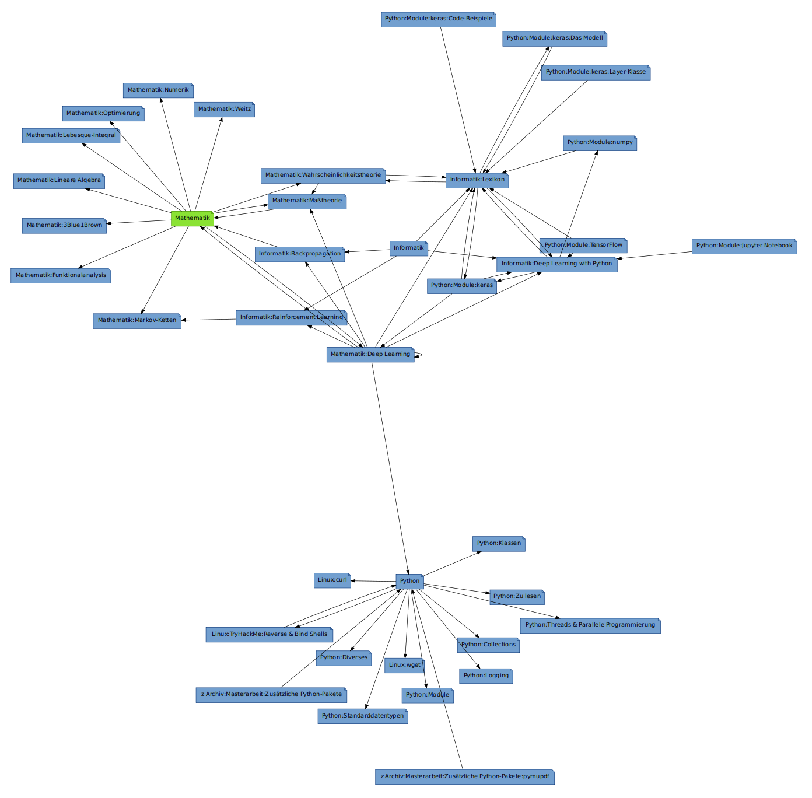
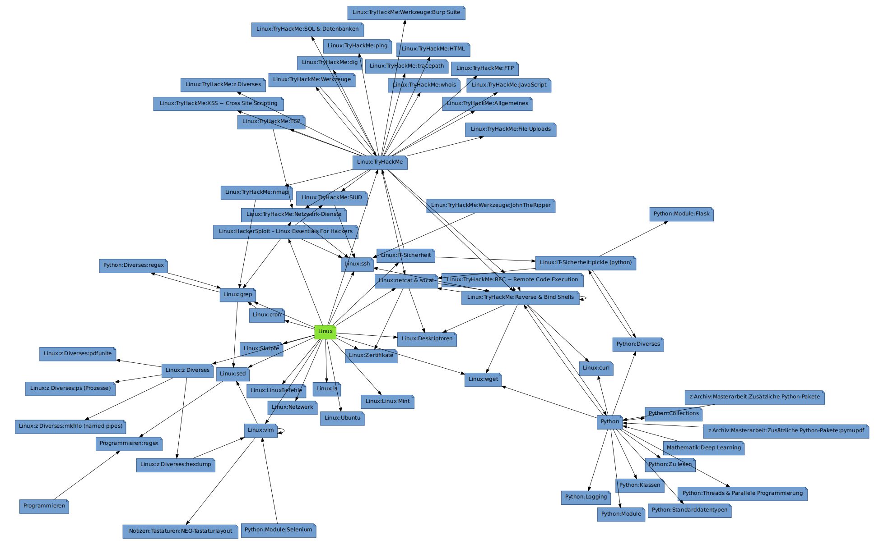
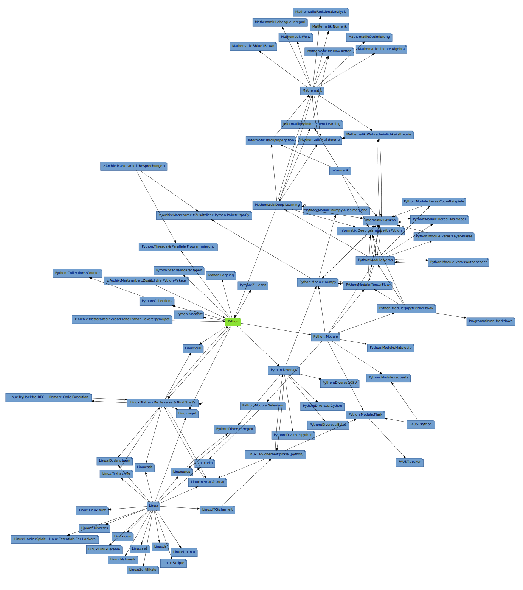

# Description
Here I want to present some extracts of my personal wiki to try to demontrate how I use https://zim-wiki.org/ to organize, preserve and link any information and reference I find interesting.

All examples are in German.

# Navigation
Some extracts, for instance that on [Linux](./Linux.md), consist of many subpages. To grasp the full extend you can always navigate into the corresponding folder (in this case [Linux_files](./Linux_files)).

# Disclaimer
Although marked as `md`-files, [zim-wiki](https://zim-wiki.org/) uses a distinct markdown-like scheme to achive formatting. Hence, the displayed files were exported and may look inconsistent or faulty in the context of markdown.

# Graphs
Zim Wiki offers a rudimentary graph visualization tool to display the inherent connections of the pages. Some are shown in the following. The green node is the root node, i. e. the choosen page for the respective visualization. Since tweaking the embedding of pictures in a `README.md` file is hard, it might be beneficial to inspect the graphs individually by opening the corresponding `png`-file in [./graphs](./graphs).

## Mathematics

## Linux

## Python 
This graph is the most extensive one. For an isolated view, open [./graphs/graph-python.png.](./graph-python.png.).

